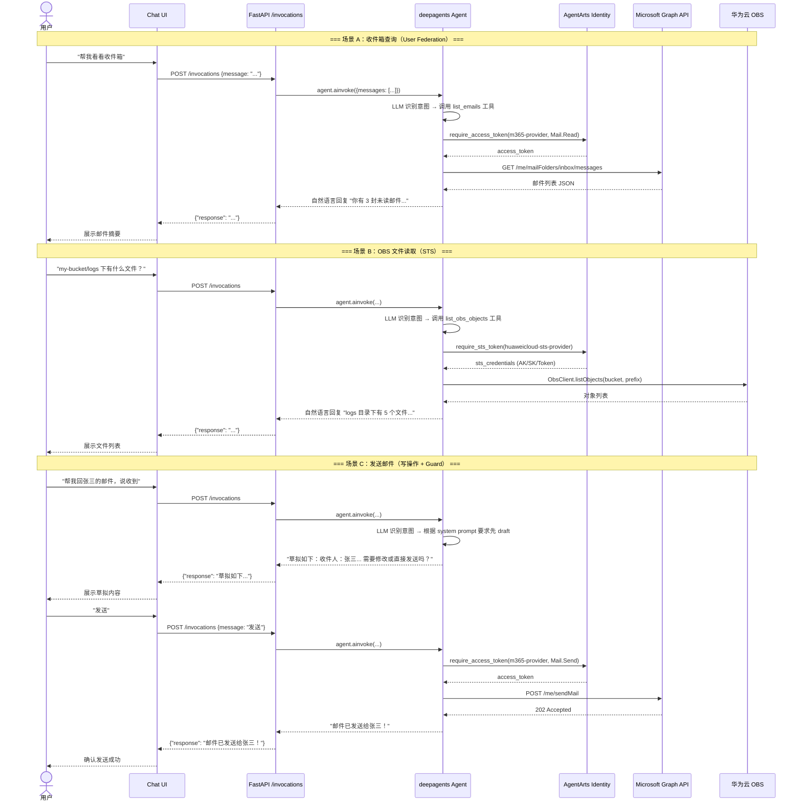
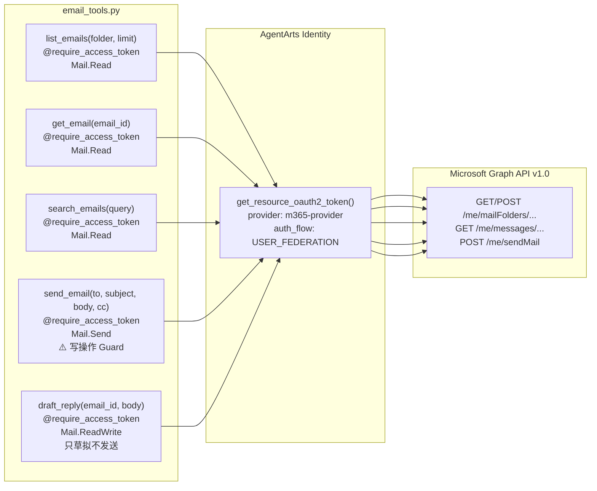
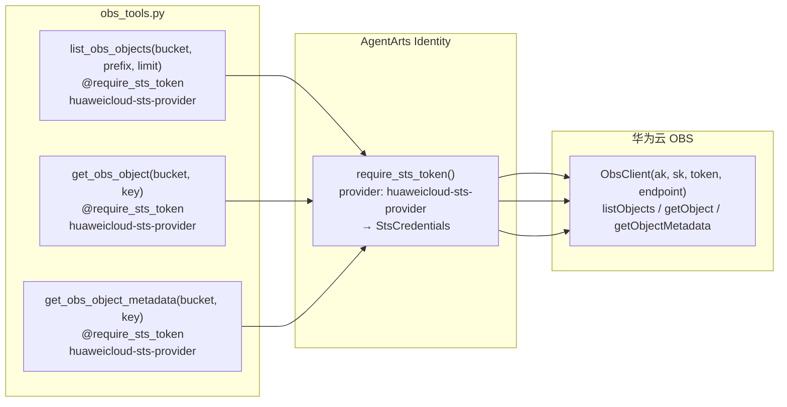
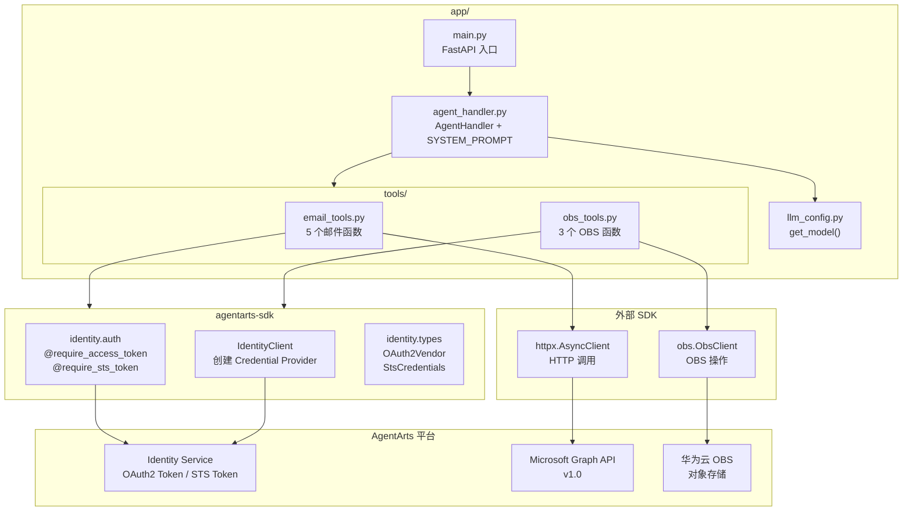
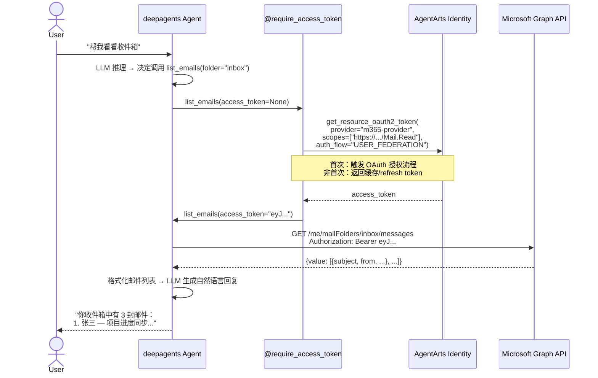
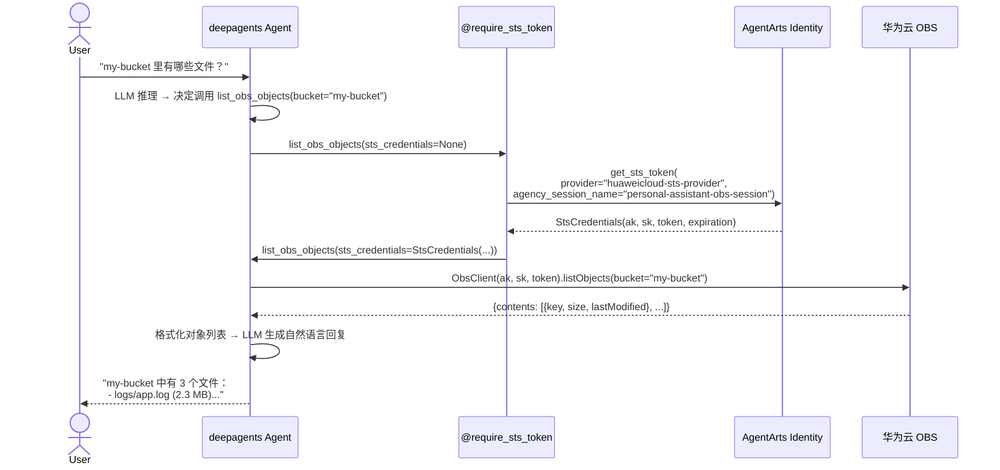
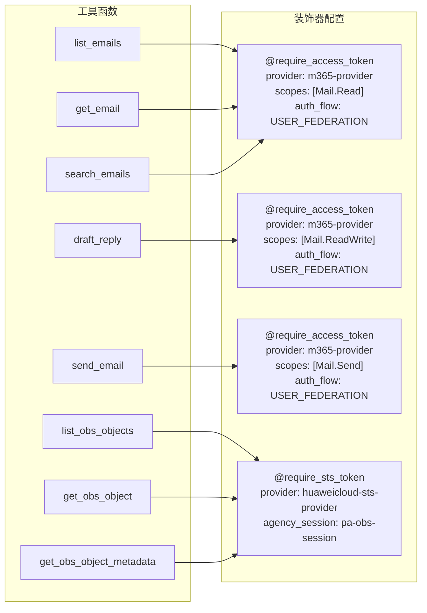

# Feature 10: Outbound Email + OBS — 实施计划

> 版本：v1.3 | 日期：2026-06-08 | 对应 Issue：`issue.md` | 修订：Chainlit 本地调试 + 移除 Feature 4 依赖

---

## 0. Issue Evaluation

| 维度 | 结果 | 说明 |
|------|------|------|
| Staleness | ✅ | 引用的 AgentArts SDK v0.1.3 与架构文档一致；Microsoft Graph API v1.0 稳定；华为云 OBS SDK 标准。当前日期 2026-06-08，无 staleness 风险。 |
| Feasibility | ✅ | 实现路径明确：`@require_access_token` (User Federation) + `@require_sts_token` (STS) 装饰器通过 AgentArts Python SDK 直接使用；工具注册到 `create_deep_agent(tools=[...])` 符合 ADR-009。两个 Credential Provider（`m365-provider`、`huaweicloud-sts-provider`）均在本 Feature 中独立创建，不依赖其他 Feature。 |
| Completeness | ✅ | 5 个邮件函数 + 3 个 OBS 函数，签名和参数定义清晰。Guard 机制自包含（使用 Microsoft Graph Drafts 文件夹作为跨调用状态存储，零外部依赖）。E2E 场景（§5）覆盖读/写/Guard/跨 Session。 |
| Impact Scope | ✅ | 仅 Service 侧：新增 `app/tools/email_tools.py`、`app/tools/obs_tools.py`，修改 `agent_handler.py`（system prompt + tools list），添加 `agentarts-sdk` 和 `esdk-obs-python` 依赖。Client 侧无变更——工具对前端透明。 |
| ADR Conflicts | ✅ | 无冲突。ADR-009（deepagents）：`tools=` 参数；ADR-007（Microsoft Entra ID）：与 Microsoft Graph API 对齐；ADR-012（PostgreSQL）：`tool_configs` 表可用。 |

> **自包含设计**：本 Feature 不依赖 Feature 2（Memory）、Feature 6（GitHub Tool）、Feature 8（STS Tool）或其他未实现的 Feature。Guard 机制利用 Microsoft Graph 的 Drafts 自动保存行为实现跨调用状态持久化，无需 Memory。`huaweicloud-sts-provider` 在本 Feature Step 1 中独立创建，不依赖 Feature 8。

**判定：ACCEPT** → 继续编写 Implementation Plan。

---

## 1. 概述

### 1.1 交付物

Feature 10 实现两个 Outbound 场景：**Microsoft 邮件处理**（User Federation 模式）和**华为云 OBS 文件查询**（STS 模式）。二者共享 AgentArts Identity SDK 的凭据管理基础设施，通过 `@require_access_token` / `@require_sts_token` 装饰器注入凭据。

### 1.2 范围

| 在范围 | 不在范围 |
|--------|----------|
| `app/tools/email_tools.py` — 5 个 Microsoft Graph API 邮件工具函数 | OfficeClaw / 飞书渠道适配（Agent 层复用） |
| `app/tools/obs_tools.py` — 3 个华为云 OBS 工具函数 | OBS 文件写入/删除（只读场景，最小权限） |
| `m365-provider` OAuth2 Credential Provider 创建（AgentArts Identity SDK） | 邮件附件上传/下载 |
| `huaweicloud-sts-provider` STS Credential Provider 创建（自包含——本 Feature 独立创建，不依赖 Feature 8） | Calendar 工具 |
| 工具注册到 deepagents Agent + system prompt 更新 | 前端 UI 变更（工具对前端透明） |
| `send_email` Guard 机制（system prompt + 敏感操作标记） | — |
| 单元测试（mock Graph API / OBS client） | — |

### 1.3 最终效果



---

## 2. 架构决策

### 2.1 相关 ADR

本阶段实现严格遵循以下已批准的 Architecture Decision Records：

| ADR | 决策 | 对本阶段的影响 |
|-----|------|---------------|
| **ADR-009** | deepagents 替代裸 LangGraph | 工具通过 `create_deep_agent(tools=[...])` 注册，无 `app/graph.py` |
| **ADR-007** | Microsoft Entra ID 作为 Inbound IdP | `m365-provider` 使用 `OAuth2Vendor.MICROSOFTOAUTH2`，tenant_id 必需 |
| **ADR-012** | PostgreSQL 16 | `tool_configs` 表可供存储 provider 配置（如需） |
| **ADR-010** | uv + ruff（Astral 生态） | 新增依赖通过 `uv add` 管理 |
| **ADR-004** | FastAPI 替代 AgentArtsRuntimeApp | 工具在现有 `/invocations` 路由内运行，无新端点 |

### 2.2 Issue 与当前架构的偏差说明

| Issue 原文 | 实施计划调整 | 原因 |
|-----------|-------------|------|
| 工具注册到 "LangGraph ToolNode" | 工具注册到 `create_deep_agent(tools=[...])` | ADR-009：deepagents 替代裸 LangGraph；工具直接传入 `create_deep_agent()` 的 `tools=` 参数，deepagents 内部自己管理 ToolNode |
| `app/tools/` 目录 | 需创建目录 + `__init__.py` | 当前代码库中 `app/tools/` 不存在（Feature 6/7/8 均为 backlog） |
| `send_email` Guard | system prompt 机制 | deepagents 内置 `write_todos` 但无显式 "Guard"；采用 system prompt 指令实现：草拟内容 → 用户确认 → 执行发送 |
| obs SDK 导入 `from obs import ObsClient` | 包名为 `esdk-obs-python` | PyPI 上的华为云 OBS Python SDK 包名，import 路径仍是 `from obs import ObsClient` |

### 2.3 Guard 机制设计（自包含，零外部依赖）

`send_email` 是敏感写操作，需要用户二次确认。本阶段采用 **Microsoft Graph Drafts 文件夹作为状态持久化层**的方式实现 Guard，不依赖 Feature 2 (Memory) 或任何其他外部状态存储。

核心原理：`draft_reply` 调用 `POST /me/messages/{id}/createReply` 时，Microsoft Graph API 会**自动**在用户的 Drafts 文件夹中保存一份草稿邮件。利用这个平台行为，Drafts 文件夹天然充当了跨 `/invocations` 调用的状态存储。

**流程**：

1. 用户请求发送邮件 → Agent 调用 `draft_reply` 创建草稿（Graph API 自动保存到 Drafts 文件夹）
2. Agent 在回复中展示完整草稿内容（收件人、主题、正文），并明确告知用户"确认发送请回复'发送'"
3. 用户回复"发送" → **新一轮 `/invocations` 调用，无对话历史**
4. Agent 调用 `list_emails(folder="drafts", limit=1)` 获取 Drafts 文件夹中最新的草稿
5. Agent 调用 `get_email(draft_id)` 读取草稿的完整内容（收件人、主题、正文）
6. Agent 调用 `send_email(to=..., subject=..., body=...)` 使用草稿内容发送邮件
7. Agent 回复"邮件已发送！"

```
调用 1: POST /invocations {message: "帮我回张三的邮件，说收到"}
  → Agent 调用 draft_reply(email_id, "收到")
  → Graph API 自动保存草稿到 Drafts 文件夹
  → Agent 响应 "草拟如下：收件人：张三，主题：Re: xxx，正文：收到。确认发送请回复'发送'"

调用 2: POST /invocations {message: "发送"}
  → Agent 无对话历史（无 Memory 依赖）
  → Agent 调用 list_emails(folder="drafts", limit=1)
  → 获取最新草稿 → get_email(draft_id) → 读取内容
  → Agent 调用 send_email(to="zhangsan@...", subject="Re: xxx", body="收到")
  → Agent 响应 "邮件已发送给张三！"
```

**为什么取"最新的草稿"就是正确的**：用户在对话中是顺序操作的——不会在两个 `/invocations` 调用之间去 Outlook 里手动创建其他草稿。`list_emails(folder="drafts", limit=1)` 返回的最近一条草稿（按 `receivedDateTime` 降序）必然是本轮对话中 `draft_reply` 创建的。

**修改草稿流程**：

```
调用 2': POST /invocations {message: "正文改成'收到，下周三前反馈'"}
  → Agent 调用 list_emails(folder="drafts", limit=1) → 获取当前草稿
  → Agent 从草稿中提取 original_email_id
  → Agent 重新调用 draft_reply(original_email_id, "收到，下周三前反馈")
  → 新草稿覆盖（实际是新建一条，但最新的就是正确的）
  → Agent 响应 "已修改：收件人：张三，主题：Re: xxx，正文：收到，下周三前反馈。确认发送请回复'发送'"
```

#### 2.3.1 边界条件

| 场景 | 处理方式 |
|------|---------|
| 用户说"发送"但 Drafts 为空 | Agent 回复"我没有找到待发送的草稿邮件。请重新告诉我你想发送什么内容" |
| 用户在 Drafts 中有多个草稿 | Agent 始终取 `list_emails(folder="drafts", limit=1)` 返回的最新一条 |
| 用户说"修改"而非"发送" | Agent 获取最新草稿 → 提取 `original_email_id` → 重新调用 `draft_reply` → 展示新版本并等待确认 |
| 用户直接说"发送"无前文（首次对话） | Agent 因 Drafts 中无相关草稿，回复"我没有找到之前草拟的邮件内容，请问你想发送什么？" |
| 用户要求发新邮件（非回复） | `draft_reply` 仅用于回复场景；新邮件由 Agent 在回复中直接构造内容展示，用户确认后调用 `send_email`（同流程） |

> **与 deepagents HITL 的关系**：deepagents 底层 LangGraph 支持 `interrupt()` 的 Human-in-the-Loop 原生确认流程。当前 MVP 使用 Drafts 文件夹方案因其零依赖且足够简单。若后续 Memory 功能就绪，可升级为 `interrupt()` 机制以支持更丰富的确认交互（如修改特定字段、带按钮的确认 UI）。

### 2.4 本地开发方案（Chainlit + 硬编码用户）

本 Feature 的开发调试通过 Chainlit 完成，不依赖 Feature 4（Inbound Identity）或 AgentArts Runtime 的完整部署。Chainlit 提供 Web Chat UI，支持单用户模式。

**架构**：

```
chainlit_app.py  ──→  AgentHandler(local_mode=True)
                          │
                          ├──→ create_deep_agent(model, system_prompt, tools=[...])
                          │         │
                          │         └──→ 工具函数（本地 auth fallback）
                          │
                          └──→ 硬编码用户：TEST_USER_ID = "dev-user@personal-assistant.local"
```

**双路径 Auth 策略**：

工具函数设计为接受可选的凭据参数（`access_token: str | None = None`）。凭据注入有两条路径：

| 路径 | 触发条件 | 凭据来源 | 使用场景 |
|------|---------|---------|---------|
| **Production** | 部署在 AgentArts Runtime 上 | `@require_access_token` / `@require_sts_token` 装饰器注入 | 生产环境 |
| **Local Dev** | `chainlit_app.py` 本地运行 | 工具函数内的 `if token is None` fallback 逻辑 | 本地调试 |

**Local Dev 凭据获取方式**：

- **Microsoft Graph API**：使用 `azure-identity` 的 `DeviceCodeCredential`（交互式设备码授权）。用户在浏览器中输入设备码完成一次授权，token 由 `azure-identity` 自动缓存和刷新。
- **华为云 OBS**：通过环境变量 `OBS_ACCESS_KEY_ID` / `OBS_SECRET_ACCESS_KEY` 直接使用 AK/SK（或本地配置的 STS endpoint）。

**chainlit_app.py 示例结构**：

```python
# chainlit_app.py — 本地调试入口
import chainlit as cl
from app.agent_handler import AgentHandler

TEST_USER_ID = "dev-user@personal-assistant.local"

@cl.on_chat_start
async def start():
    agent = AgentHandler(local_mode=True)
    cl.user_session.set("agent", agent)
    cl.user_session.set("user_id", TEST_USER_ID)

@cl.on_message
async def on_message(message: cl.Message):
    agent = cl.user_session.get("agent")
    response = await agent.handle(message.content)
    await cl.Message(content=response).send()
```

**工具函数的 Local Dev Fallback**（以 `list_emails` 为例）：

```python
async def list_emails(folder="inbox", limit=10, access_token: str | None = None):
    if access_token is None:
        # Local dev: 使用 DeviceCodeCredential 获取 token
        from azure.identity import DeviceCodeCredential
        credential = DeviceCodeCredential(
            tenant_id=os.environ["AZURE_TENANT_ID"],
            client_id=os.environ["AZURE_CLIENT_ID"],
        )
        token = credential.get_token("https://graph.microsoft.com/Mail.Read")
        access_token = token.token

    async with httpx.AsyncClient() as client:
        resp = await client.get(
            f"https://graph.microsoft.com/v1.0/me/mailFolders/{folder}/messages",
            headers={"Authorization": f"Bearer {access_token}"},
            params={"$top": limit, "$select": "subject,from,receivedDateTime,isRead"},
        )
        # ... 处理响应 ...
```

> **注意**：Production 路径下 `@require_access_token` 装饰器确保 `access_token` 一定不为 `None`，所以 fallback 分支只在本地调试时触发。这种设计让同一份工具代码可以同时用于本地开发和线上部署，无需条件编译或环境检测。

### 2.5 m365-provider 与 Inbound Identity 的关系（供参考）

本 Feature 不依赖 Feature 4（Inbound Identity）。`m365-provider` 是 Outbound 凭据（Agent 代表用户访问 Microsoft Graph API），由 AgentArts Identity SDK 管理，不经过 Personal Assistant 的 Inbound 认证流程。

若将来 Feature 4 已部署，二者的 Azure App Registration 可以共享（相同的 client_id/tenant），但凭据类型和用途不同。`m365-provider` 只需额外授予 `Mail.Read`、`Mail.ReadWrite`、`Mail.Send` 权限。

---

## 3. 文件清单

所有文件均在 `personal-assistant-service/` 目录下创建或修改：

```json
personal-assistant-service/
├── pyproject.toml                  # [MODIFY] 新增依赖：agentarts-sdk, esdk-obs-python；dev 依赖：chainlit, azure-identity
├── uv.lock                         # [AUTO] 由 uv sync 重新生成
├── config.yaml                     # [MODIFY] 添加 OBS 相关配置（endpoint、sts-provider-name）
├── chainlit_app.py                 # [NEW] Chainlit 本地调试入口（硬编码用户 + local auth）
├── app/
│   ├── __init__.py                 # [EXISTING]
│   ├── agent_handler.py            # [MODIFY] system prompt 扩展 + tools 列表更新
│   └── tools/                      # [NEW] 工具目录
│       ├── __init__.py             # [NEW] 包标记
│       ├── email_tools.py          # [NEW] 5 个 Microsoft Graph API 邮件工具函数
│       └── obs_tools.py            # [NEW] 3 个华为云 OBS 工具函数
└── tests/
    ├── test_email_tools.py         # [NEW] 邮件工具单元测试（mock Graph API）
    └── test_obs_tools.py           # [NEW] OBS 工具单元测试（mock ObsClient）

personal-assistant-meta/issues/features/feature-10-outbound-email-obs/
├── issue.md                        # [EXISTING] 原始 issue
└── plan.md                         # [NEW] 本文件
```

| 文件 | 目的 | 预估行数 |
|------|------|----------|
| `chainlit_app.py` | Chainlit 本地调试入口，硬编码用户 + local auth fallback | ~40 |
| `app/tools/__init__.py` | Python 包标记 | 空 |
| `app/tools/email_tools.py` | 5 个邮件工具函数（双路径 auth：production decorator / local fallback） | ~250 |
| `app/tools/obs_tools.py` | 3 个 OBS 工具函数（双路径 auth） | ~200 |
| `app/agent_handler.py` | system prompt 扩展（+邮件/OBS 能力描述 + Guard 规则）+ tools 列表 | ~30 (增量) |
| `pyproject.toml` | 新增 `agentarts-sdk>=0.1.3`、`esdk-obs-python>=3.22`；dev 依赖 `chainlit`、`azure-identity` | ~5 行 |
| `config.yaml` | 新增 `obs:` section（endpoint、sts_provider_name） | ~5 行 |
| `tests/test_email_tools.py` | mock Graph API 的单元测试 | ~100 |
| `tests/test_obs_tools.py` | mock ObsClient 的单元测试 | ~80 |

### 3.1 不创建/不修改的文件

| 文件 | 原因 |
|------|------|
| `app/graph.py` | ADR-009：deepagents 内置 ReAct loop，无需手写 StateGraph |
| `app/main.py` | 无新 API 端点——工具在现有 `/invocations` 内运行 |
| `app/oauth.py` | m365-provider 的 OAuth 授权由 AgentArts Identity Service 管理，非应用层 |
| `personal-assistant-client/**` | 工具对前端透明，无 Client 侧变更 |
| `agentarts_config.yaml` | `m365-provider` 通过 SDK 调用创建，非配置文件；Inbound identity 不涉及 |
| `docker-compose.yml` | 无新增基础设施 |

---

## 4. 实施步骤

### 任务映射（对应 Issue §10.1-10.5）

| 计划步骤 | Issue 任务 | 描述 |
|----------|-----------|------|
| Step 1 | 10.1 | `m365-provider` OAuth2 创建 + `huaweicloud-sts-provider` STS 创建（两个 Provider 均在本 Step 中通过 SDK 创建，不依赖 Feature 8） |
| Step 2 | 10.2 | `app/tools/email_tools.py` — 5 个邮件工具函数 |
| Step 3 | 10.3 | `app/tools/obs_tools.py` — 3 个 OBS 工具函数 |
| Step 4 | 10.4 | 工具注册 + system prompt 更新 + Guard |
| Step 5 | 10.5 | E2E 验证场景 |

---

### Step 1：`m365-provider` OAuth2 Credential Provider 创建

**目标**：在 AgentArts Identity Service 中创建 `m365-provider`，Agent 可以通过 `@require_access_token` 装饰器获取 Microsoft Graph API 的 access_token。

#### 1.1 Azure Portal 准备

1. Azure Portal → Microsoft Entra ID → 应用注册（或复用 Feature 4 的 App Registration）
2. 添加 Microsoft Graph API 权限（Delegated）：
   - `Mail.Read` — 读取邮件
   - `Mail.ReadWrite` — 读写邮件
   - `Mail.Send` — 发送邮件
3. 获取 `client_id` / `client_secret` / `tenant_id`
4. 配置 Redirect URI：`http://localhost:8000/auth/callback`（与 AgentArts Workload Identity 的 `allowed_resource_oauth2_return_urls` 一致）

#### 1.2 创建 Credential Provider

通过 AgentArts Python SDK 创建：

```python
from agentarts.sdk import IdentityClient
from agentarts.sdk.identity import OAuth2Vendor

client = IdentityClient(region="cn-southwest-2")

client.create_oauth2_credential_provider(
    name="m365-provider",
    vendor=OAuth2Vendor.MICROSOFTOAUTH2,
    client_id="<azure-app-client-id>",
    client_secret="<azure-app-client-secret>",
    tenant_id="<azure-tenant-id>",  # Microsoft OAuth2 必须提供 tenant_id
)
```

> **注意**：此步骤为一次性配置操作，通过 Python script 或 CLI 执行。`client_id` / `client_secret` / `tenant_id` 不应硬编码在应用代码中，通过环境变量或 secret manager 注入。

#### 1.3 验证 Provider

```python
# 验证 provider 已创建成功
providers = client.list_credential_providers()
assert any(p["name"] == "m365-provider" for p in providers)
```

#### 1.4 `huaweicloud-sts-provider` — IAM Agency 准备

OBS 工具依赖 STS 临时凭证访问华为云 OBS。本 Feature **自包含**创建此 Provider，不依赖 Feature 8。

1. 华为云 IAM 控制台 → 统一身份认证 → 委托（Agency）
2. 创建委托：
   - **委托名称**：`personal-assistant-obs-agency`
   - **委托类型**：云服务
   - **云服务**：Object Storage Service (OBS)
   - **权限策略**：`OBS ReadOnlyAccess`（最小权限，仅读取）
   - **持续时间**：推荐 1 小时（`ObsClient` 中 STS token 过期后自动续期）
3. 获取 **agency_urn**：格式为 `urn:agency:<account-id>:<agency-name>`

#### 1.5 创建 STS Credential Provider

```python
from agentarts.sdk import IdentityClient

client = IdentityClient(region="cn-southwest-2")

client.create_sts_credential_provider(
    name="huaweicloud-sts-provider",
    agency_urn="urn:agency:<your-account-id>:personal-assistant-obs-agency",
    tags=[
        {"key": "env", "value": "dev"},
        {"key": "service", "value": "personal-assistant"},
    ],
)

# 验证 provider 已创建成功
providers = client.list_credential_providers()
assert any(p["name"] == "huaweicloud-sts-provider" for p in providers)
```

> **注意**：`agency_urn` 需填入实际的华为云账号 ID。IAM Agency 的名称和 provider 名称不必一致（agency 使用描述性名称，provider 使用工具代码中引用的短名称）。

---

### Step 2：邮件工具实现 — `app/tools/email_tools.py`

**目标**：创建 5 个 Microsoft Graph API 邮件工具函数，使用 `@require_access_token` 装饰器管理凭据。

#### 2.1 设计原则

| 原则 | 说明 |
|------|------|
| **纯函数** | 所有函数接受 `access_token` 参数，由装饰器自动注入，函数本身不管理凭据 |
| **User Federation** | 所有邮件函数使用 `auth_flow="USER_FEDERATION"`，以用户委托身份调用 |
| **最小权限** | 读操作 scope=`Mail.Read`，写操作 scope=`Mail.ReadWrite` 或 `Mail.Send` |
| **结构化返回** | 返回格式化的 dict（`{from, subject, received, preview, ...}` 等），方便 Agent 理解 |
| **错误处理** | HTTP 错误返回 `{"error": "...", "status_code": 403}`，不抛异常以让 Agent 决策 |

> **`@require_access_token` / `@require_sts_token` 的 async 兼容性**：AgentArts SDK v0.1.3 的装饰器完整支持 `async def` 函数。`overall_architecture.md` §4.2.2 中所有示例均使用 `async def` 配合 `httpx.AsyncClient` 或 `ObsClient`。装饰器在 `async` 函数上透明工作——凭证获取和注入不阻塞 event loop。实现时所有工具函数使用 `async def` 以充分利用异步 I/O。

#### 2.2 函数清单



#### 2.3 函数签名与实现要点

| 函数 | Graph API 端点 | Scopes | 装饰器配置 | 返回格式 |
|------|---------------|--------|-----------|---------|
| `list_emails(folder, limit, access_token)` | `GET /me/mailFolders/{folder}/messages?$top={limit}&$select=subject,from,receivedDateTime,isRead` | `Mail.Read` | `@require_access_token(provider_name="m365-provider", scopes=[...], auth_flow="USER_FEDERATION")` | `{"emails": [{"id", "subject", "from", "received", "is_read", "preview"}, ...]}` |
| `get_email(email_id, access_token)` | `GET /me/messages/{email_id}` | `Mail.Read` | 同上 | `{"id", "subject", "from", "to", "cc", "body", "received", "attachments": [...]}` |
| `search_emails(query, access_token)` | `GET /me/messages?$search="{query}"` | `Mail.Read` | 同上 | 同 list_emails |
| `send_email(to, subject, body, cc, access_token)` | `POST /me/sendMail` | `Mail.Send` | `@require_access_token(provider_name="m365-provider", scopes=["https://graph.microsoft.com/Mail.Send"]...)` | `{"sent": true, "message_id": "..."}` 或 `{"error": "..."}` |
| `draft_reply(email_id, body, access_token)` | `POST /me/messages/{email_id}/createReply` | `Mail.ReadWrite` | `@require_access_token(provider_name="m365-provider", scopes=["https://graph.microsoft.com/Mail.ReadWrite"]...)` | `{"draft": {"to", "subject", "body", "original_email_id"}}` |

**`draft_reply` 仅草拟不发送**：返回草稿内容供用户确认，不调用 `sendMail`。实际发送由 `send_email` 在用户确认后执行。

`createReply` 端点返回一个完整的 `message` 资源（HTTP 201），关键字段解析如下：

| Graph API 字段 | 提取为 | 说明 |
|---------------|--------|------|
| `toRecipients[]` | `"to": [{"name": "张三", "email": "zhangsan@example.com"}, ...]` | 从 `emailAddress.name` + `emailAddress.address` 扁平化，提取显示名和邮箱地址 |
| `subject` | `"subject": "Re: 项目进度同步"` | 原主题前自动加 `Re:` |
| `body.content` | `"body": "收到，谢谢。"` | 若 `body.contentType == "HTML"` 保留原格式；纯文本直接透传 |
| `id` | `"original_email_id": "AAMkAG..."` | 原邮件 ID，用于关联 |
| `conversationId` | `"conversation_id": "AAQkAG..."` | 会话 ID，后续回复可追踪同一线程（可选） |
| — | `"cc": []` | 默认无抄送，可通过后续修改草稿添加（暂不实现） |

**注意**：`createReply` API 有**副作用**——创建回复时会在用户的 Drafts 文件夹中自动保存一份草稿邮件。这是 Graph API 的默认行为，无需额外处理。若实现需要"干净草拟"（不留 Drafts 副本），可改用 `POST /me/messages` 手动构造回复（但 MVP 阶段直接使用 `createReply` 的自动 Drafts 保存，用户可在 Outlook 中手动删除草稿）。

**返回值结构**：

```python
{
    "draft": {
        "to": [{"name": "张三", "email": "zhangsan@example.com"}],
        "subject": "Re: 项目进度同步",
        "body": "收到，谢谢。",
        "original_email_id": "AAMkAGI2YzE5ZjFiL...",
        "conversation_id": "AAQkAGI2YzE5ZjFiL...",
        "cc": [],
        "note": "草稿已保存到 Drafts 文件夹"
    }
}
```

#### 2.4 关键实现细节

1. **`access_token` 默认值**：使用 `Optional[str] = None` 作为默认值，装饰器会自动注入实际 token
2. **Graph API 错误处理**：HTTP 4xx/5xx 不抛异常，返回结构化错误信息以便 LLM 理解和决策
3. **邮件正文截断**：`preview` 字段截取前 150 字符，避免 token 浪费（完整正文仅在 `get_email` 中返回）
4. **$select 优化**：列表查询使用 `$select` 只取必要字段，减少响应体积
5. **分页支持**（MVP 阶段）：`limit` 参数控制返回数量，默认 10。暂不实现 `$skip` 翻页（后续可扩展）

6. **`send_email` 的 `attachments` 参数**：函数签名中预留 `attachments: list[dict] | None = None` 参数（类型为 `[{"name": str, "content_type": str, "content_bytes": str}]`），当前实现为 **no-op**——函数体内忽略此参数，Graph API 请求 body 中不包含 `attachments` 字段。函数 docstring 中标注 `.. note:: 附件功能尚未实现，attachments 参数当前被忽略。` 待后续 Feature 实现邮件附件上传后启用。

#### 2.5 unit tests 覆盖

- `test_list_emails_returns_formatted_list` — mock Graph API 返回邮件列表
- `test_list_emails_empty_inbox` — 空收件箱
- `test_get_email_returns_full_detail` — 单封邮件详情含附件列表
- `test_search_emails_with_query` — 关键词搜索
- `test_search_emails_no_results` — 无结果
- `test_send_email_success` — 发送成功返回 `{"sent": true}`
- `test_send_email_recipient_not_found` — Graph API 返回 400
- `test_draft_reply_creates_draft` — 草拟回复但验证未调用 sendMail
- `test_unauthorized_error_handling` — Graph API 返回 401 → 返回清晰错误信息

---

### Step 3：OBS 工具实现 — `app/tools/obs_tools.py`

**目标**：创建 3 个华为云 OBS 对象存储工具函数，使用 `@require_sts_token` 装饰器获取 STS 临时凭证，通过 `ObsClient` 操作 OBS。

#### 3.1 设计原则

| 原则 | 说明 |
|------|------|
| **复用 STS Provider** | 使用本 Feature Step 1 创建的 `huaweicloud-sts-provider`（自包含），工具代码通过 `@require_sts_token(provider_name="huaweicloud-sts-provider")` 引用 |
| **只读安全** | MVP 阶段仅提供读取操作（list/get/metadata），不涉及写入/删除 |
| **内容安全** | 读取对象内容时自动检测文件类型，仅返回可读格式（text/JSON/CSV），二进制文件返回摘要信息 |
| **大小限制** | 单文件读取默认上限 1MB，超大文件返回 `{"truncated": true, "preview": "...", "size": 1048576}` |

#### 3.2 函数清单



#### 3.3 函数签名与实现要点

| 函数 | OBS API | 装饰器配置 | 返回格式 |
|------|---------|-----------|---------|
| `list_obs_objects(bucket, prefix, limit, sts_credentials)` | `ObsClient.listObjects(bucket, prefix, max_keys)` | `@require_sts_token(provider_name="huaweicloud-sts-provider", agency_session_name="personal-assistant-obs-session")` | `{"bucket", "prefix", "objects": [{"key", "size", "last_modified"}, ...], "truncated": true/false}` |
| `get_obs_object(bucket, key, sts_credentials)` | `ObsClient.getObject(bucket, key)` → `response.body.buffer` | 同上 | `{"bucket", "key", "content_type", "content": "...", "size", "truncated": true/false}` |
| `get_obs_object_metadata(bucket, key, sts_credentials)` | `ObsClient.getObjectMetadata(bucket, key)` | 同上 | `{"bucket", "key", "content_type", "size", "last_modified", "etag"}` |

#### 3.4 关键实现细节

1. **STS 临时凭证初始化 ObsClient**：
   ```python
   from obs import ObsClient
   obs_client = ObsClient(
       access_key_id=sts_credentials.access_key_id,
       secret_access_key=sts_credentials.secret_access_key,
       security_token=sts_credentials.security_token,
       server="https://obs.cn-southwest-2.myhuaweicloud.com"
   )
   ```

2. **OBS Endpoint 配置**：通过 `config.yaml` 或环境变量 `OBS_ENDPOINT` 指定（默认 `https://obs.cn-southwest-2.myhuaweicloud.com`）

3. **文件内容类型检测**：
   - `.json` → 解析为 dict 再序列化返回（格式化后的 JSON）
   - `.csv` → 返回纯文本
   - `.txt` / `.md` / `.yaml` / `.log` → 直接返回文本内容
   - 其他（`.pdf`、`.zip`、图片等）→ 返回 `{"content": null, "content_type": "binary", "note": "二进制文件，无法以文本形式展示"}`

4. **`sts_credentials` 参数**：类型为 `StsCredentials`（`access_key_id`, `secret_access_key`, `security_token`, `expiration`），装饰器自动注入，函数使用 `Optional[StsCredentials] = None` 作为默认值

5. **错误处理**：OBS 异常（NoSuchBucket、NoSuchKey、AccessDenied）返回结构化错误信息

#### 3.5 unit tests 覆盖

- `test_list_obs_objects_returns_list` — mock ObsClient.listObjects
- `test_list_obs_objects_with_prefix_filter` — prefix 过滤
- `test_list_obs_objects_empty_bucket` — 空 bucket
- `test_get_obs_object_text_file` — 文本文件内容读取
- `test_get_obs_object_json_file` — JSON 文件解析
- `test_get_obs_object_binary_file` — 二进制文件返回 `content: null`
- `test_get_obs_object_bucket_not_found` — NoSuchBucket 错误
- `test_get_obs_object_key_not_found` — NoSuchKey 错误
- `test_get_obs_object_metadata_returns_info` — 元数据查询

---

### Step 4：工具注册 + System Prompt 更新 + Guard

**目标**：将所有 8 个工具函数注册到 `create_deep_agent()` 的 `tools=` 参数，更新 system prompt，实现 `send_email` Guard。

#### 4.1 修改 `app/agent_handler.py`

**变更一：导入工具模块**

```python
# 在文件开头新增 imports
# 注意：本 Feature 仅使用 require_access_token 和 require_sts_token，
# 不需要 require_api_key（那是 M2M 模式用的，Feature 7 实现）
from app.tools.email_tools import list_emails, get_email, search_emails, send_email, draft_reply
from app.tools.obs_tools import list_obs_objects, get_obs_object, get_obs_object_metadata
```

**变更二：更新 `create_deep_agent(tools=...)`**

```python
# AgentHandler.__init__() 中
self.agent = create_deep_agent(
    model=self.model,
    system_prompt=SYSTEM_PROMPT,
    tools=[
        list_emails,
        get_email,
        search_emails,
        send_email,
        draft_reply,
        list_obs_objects,
        get_obs_object,
        get_obs_object_metadata,
    ],
)
```

**变更三：扩展 `SYSTEM_PROMPT`**

新增内容追加到现有 system prompt 之后（替换"当前状态/暂时无法调用外部工具"部分的描述）：

```markdown
## 核心能力

### 邮件处理
你可以帮助用户管理 Microsoft Outlook 邮箱，包括：
- **list_emails(folder, limit)**：列出指定文件夹的邮件。folder 默认为 "inbox"，也可指定 "sentitems"、"drafts" 等。limit 默认 10。
- **get_email(email_id)**：获取单封邮件的完整内容（正文、附件列表等）。email_id 可以从 list_emails 的返回结果中获取。
- **search_emails(query)**：按关键词搜索邮件。query 支持 Microsoft Graph API 的 KQL (Keyword Query Language) 语法，例如 "张三" 或 "subject:项目进度"。
- **draft_reply(email_id, body)**：草拟对某封邮件的回复。**此工具只草拟不发送**，调用后你会得到一个草稿内容，展示给用户确认。
- **send_email(to, subject, body, cc)**：发送邮件。⚠️ **此为敏感操作，必须遵守下方"写操作安全规则"。** （附件功能预留 `attachments` 参数为 no-op，当前实现忽略；待后续 Feature 实现附件上传后启用。）

### OBS 文件查询
你可以帮助用户浏览和读取华为云 OBS 对象存储中的文件：
- **list_obs_objects(bucket, prefix, limit)**：列出指定 Bucket 中某个目录（prefix）下的文件。例如 bucket="my-bucket", prefix="logs/"。
- **get_obs_object(bucket, key)**：读取 OBS 对象的完整内容。适用于文本文件（.txt, .json, .csv, .md, .yaml, .log 等）。
- **get_obs_object_metadata(bucket, key)**：查询对象的元数据（大小、类型、修改时间），不读取内容。

### 写操作安全规则（Critical）

以下工具是**写操作**，必须遵守确认规则：

1. **send_email**：发送邮件
   - **禁止**在用户首次请求时直接调用 `send_email`
   - **必须先调用 `draft_reply` 创建草稿**（草稿会自动保存到用户的 Drafts 文件夹），展示收件人、主题、正文
   - 明确告知用户"确认发送请回复'发送'"
   - **当用户回复"发送"后**（这是一次新的调用，你无法看到之前的对话历史）：
     1. 调用 `list_emails(folder="drafts", limit=1)` 获取 Drafts 文件夹中最新的草稿
     2. 调用 `get_email(draft_id)` 读取草稿的收件人、主题、正文
     3. 调用 `send_email(to=..., subject=..., body=...)` 发送
   - 如果用户说"修改一下"或"改成..."：
     1. 调用 `list_emails(folder="drafts", limit=1)` 获取最新草稿
     2. 从草稿中提取原邮件的 ID
     3. 重新调用 `draft_reply(original_email_id, modified_body)` 创建新草稿
     4. 展示新草稿并再次等待确认

示例正确流程：
- 用户："帮我回张三的邮件，说收到" → 你调用 `draft_reply` → 展示 "草拟如下：收件人：张三，主题：Re: ...，正文：收到。确认发送请回复'发送'"
- 用户："发送"（新调用，无对话历史）→ 你调用 `list_emails(folder="drafts", limit=1)` → 获取草稿内容 → 调用 `send_email` → "邮件已发送！"
- 用户："正文改成'收到，谢谢'" → 你调用 `list_emails(folder="drafts", limit=1)` → 提取 original_email_id → 调用 `draft_reply` → 展示 "已修改：... 确认发送请回复'发送'"
- 用户："发送" → 你再次 list Drafts → 获取最新草稿 → 调用 `send_email`

> **设计说明**：你无法跨调用记住之前草拟的内容（每次 `/invocations` 调用是独立的），但 `draft_reply` 会自动把草稿保存到 Microsoft 365 的 Drafts 文件夹。利用这个机制，你始终可以通过 `list_emails(folder="drafts", limit=1)` 找到最新的待发送草稿。

## 行为准则
- 使用中文回复
- 保持友好、专业、乐于助人的语调
- 不清楚的事情坦诚说明，不要编造
- 回复简洁有力，避免冗长
- 邮件查询结果以结构化格式呈现（发件人、主题、时间等关键字段）
- OBS 文件列表以表格或列表形式呈现
```

#### 4.2 配置文件更新 — `config.yaml`

在 `config.yaml` 中新增 OBS 相关配置：

```yaml
# config.yaml — 新增 OBS 配置
obs:
  endpoint: https://obs.cn-southwest-2.myhuaweicloud.com  # 或通过 OBS_ENDPOINT 环境变量覆写
  sts_provider_name: huaweicloud-sts-provider  # 本 Feature Step 1 创建的 STS Provider
```

> OBS endpoint 也可以通过环境变量 `OBS_ENDPOINT` 配置，`config.yaml` 为默认值。实现时优先读环境变量，fallback 到 config.yaml。

#### 4.3 OBS 工具配置加载

OBS 工具需要读取 OBS endpoint 和 sts_provider_name 两个配置。当前代码库的 `app/llm_config.py` 仅处理 LLM 配置（`config.yaml` 的 `llm:` section），OBS 工具采用**环境变量优先**策略加载配置，避免创建共享 config loader 的耦合：

| 配置项 | 环境变量（优先） | config.yaml fallback | 代码位置 |
|--------|-----------------|---------------------|---------|
| OBS Endpoint | `OBS_ENDPOINT` | `config.yaml → obs.endpoint` | `app/tools/obs_tools.py` 模块级 `_load_obs_config()` |
| STS Provider Name | `OBS_STS_PROVIDER_NAME` | `config.yaml → obs.sts_provider_name` | 同上 |

```python
# app/tools/obs_tools.py — 模块级配置加载（示意）
import os
import yaml
from pathlib import Path

def _load_obs_config():
    """加载 OBS 配置：环境变量 > config.yaml > 硬编码默认值。"""
    # 1. 环境变量（最高优先级）
    endpoint = os.environ.get("OBS_ENDPOINT")
    sts_provider = os.environ.get("OBS_STS_PROVIDER_NAME")

    # 2. config.yaml fallback
    if not endpoint or not sts_provider:
        config_path = Path(__file__).resolve().parent.parent.parent / "config.yaml"
        if config_path.exists():
            with open(config_path) as f:
                cfg = yaml.safe_load(f)
            obs_cfg = cfg.get("obs", {})
            if not endpoint:
                endpoint = obs_cfg.get("endpoint")
            if not sts_provider:
                sts_provider = obs_cfg.get("sts_provider_name")

    # 3. 硬编码默认值（最后兜底）
    if not endpoint:
        endpoint = "https://obs.cn-southwest-2.myhuaweicloud.com"
    if not sts_provider:
        raise RuntimeError(
            "STS provider name 未配置。请设置 OBS_STS_PROVIDER_NAME 环境变量"
            " 或在 config.yaml 中配置 obs.sts_provider_name"
        )

    return endpoint, sts_provider

OBS_ENDPOINT, OBS_STS_PROVIDER_NAME = _load_obs_config()
```

> **为什么不创建 `app/config.py` 共享 loader**：当前仅 `llm_config.py` 需要 config 解析，且 `app/tools/obs_tools.py` 只有 2 个配置项。模块级懒加载 `_load_obs_config()` 够用且不引入额外耦合。未来若配置项增多（如 ≥5 个 config sections），再提取共享 loader。若 `agentarts-sdk` 的 `require_sts_token` 装饰器支持直接读取 `config.yaml` 的 provider 配置，则更优——但当前 SDK v0.1.3 的装饰器参数是函数调用时传入的，需在工具代码中自行加载。

#### 4.4 `send_email` Guard 的验证要点

| 验证项 | 说明 |
|--------|------|
| 首次请求不直接发送 | 用户说"给张三发邮件"，Agent 应先调用 `draft_reply` 展示草稿，不能直接调用 `send_email` |
| 草稿展示 | Agent 展示完整的收件人、主题、正文，并明确提示"确认发送请回复'发送'" |
| 无对话历史时通过 Drafts 恢复 | 用户回复"发送"后（新调用，无上下文），Agent 调用 `list_emails(folder="drafts", limit=1)` 获取最新草稿 |
| Drafts 中获取草稿内容 | Agent 调用 `get_email(draft_id)` 读取草稿的 to/subject/body，用于构造 `send_email` 参数 |
| 修改草稿后再次确认 | 用户修改内容后，Agent 重新调用 `draft_reply` 创建新草稿，再次展示并等待确认 |
| 确认后执行 | 用户明确说"发送"后，Agent 从 Drafts 读取最新草稿并调用 `send_email` |
| Drafts 为空时拒绝 | Agent 在未找到草稿时应回复"我没有找到待发送的草稿邮件"，不执行发送 |

---

### Step 5：E2E 验证场景

#### 5.1 邮件场景

| # | 场景 | 操作 | 预期结果 |
|---|------|------|----------|
| E1 | 查看收件箱 | 用户："帮我看看收件箱" | Agent 调用 `list_emails(folder="inbox")` → 返回格式化的邮件列表（发件人、主题、时间） |
| E2 | 搜索邮件 | 用户："帮我查一下最近关于项目进度的邮件" | Agent 调用 `search_emails(query="项目进度")` → 返回匹配的邮件列表 |
| E3 | 查看邮件详情 | 用户："查看第一封邮件的详细内容" | Agent 从上一轮上下文中获取 email_id → 调用 `get_email` → 返回完整正文+附件列表 |
| E4 | 草拟回复 | 用户："帮我回张三的邮件，说收到" | Agent 调用 `draft_reply` → 展示草稿（收件人、主题、正文）→ 提示"确认发送请回复'发送'" |
| E5 | 修改草稿 | 用户（在 E4 草稿展示后）："正文改成'收到，下周三之前给你反馈'" | Agent 调用 `list_emails(folder="drafts", limit=1)` → 提取 original_email_id → 重新调用 `draft_reply` → 展示新版本 → 提示确认 |
| E6 | 发送邮件（新调用，无对话历史） | 用户（在 E5 修改后）："发送" | Agent 调用 `list_emails(folder="drafts", limit=1)` → 获取最新草稿 → `get_email(draft_id)` → `send_email` → 返回发送成功确认 |
| E7 | 跨 Session 授信 | 第二次对话中用户说"看看收件箱" | Agent 自动获取 access_token（无需重新授权）→ 返回邮件列表 |
| E8 | Guard 验证：拒绝直接发送 | 用户："给张三发一封主题为'测试'的邮件" | Agent **不应**直接调用 `send_email` → 应先调用 `draft_reply` 展示草稿并提示确认 |

#### 5.2 OBS 场景

| # | 场景 | 操作 | 预期结果 |
|---|------|------|----------|
| E9 | 列出文件 | 用户："my-bucket/logs/ 下有哪些文件" | Agent 调用 `list_obs_objects(bucket="my-bucket", prefix="logs/")` → 返回文件列表（文件名、大小、修改时间） |
| E10 | 读取文本文件 | 用户："帮我读一下 obs-config.json 的内容" | Agent 调用 `get_obs_object` → 返回格式化后的 JSON 内容 |
| E11 | 读取 CSV 文件 | 用户："读取 data/report.csv" | Agent 调用 `get_obs_object` → 返回 CSV 内容（纯文本） |
| E12 | 文件元数据 | 用户："logs/app.log 有多大" | Agent 调用 `get_obs_object_metadata` → 返回文件大小、类型、修改时间 |
| E13 | 不存在的 Bucket | 用户："列出 no-such-bucket 的内容" | Agent 返回清晰的错误提示（NoSuchBucket） |

#### 5.3 混合场景

| # | 场景 | 操作 | 预期结果 |
|---|------|------|----------|
| E14 | 上下文切换 | 对话中先查邮件，再查 OBS | Agent 正确切换工具，两次调用均成功 |
| E15 | 并发工具 | 用户："查收件箱的同时看看 OBS 上有没有配置文件" | Agent 依次处理两个意图，分别返回结果 |

---

## 5. API 表面分析

### 5.1 API 端点影响

**无新增 API 端点。** 本 Feature 的所有 8 个工具函数均在现有 deepagents Agent 的 ToolNode 中运行，由 LLM 决定何时调用。用户请求通过现有路由流入：

| 现有路由 | 工具如何触发 | 说明 |
|----------|------------|------|
| `POST /invocations` | 用户消息 → LLM 识别意图 → 调用工具 | 非流式，工具结果包裹在 `{"response": "..."}` 中 |
| `GET /api/chat/stream` | 同上，最终响应通过 SSE 流式推送 | SSE 流仅推送 `on_chat_model_stream` 事件（LLM 逐 token 输出），工具调用的结果在 LLM 处理完 tool result 后的 token 流中自然融入。若需在前端展示 "Agent 正在调用工具..." 状态，需在 `handle_stream()` 中额外处理 `on_tool_start`/`on_tool_end` 事件（本 MVP 不做，后续 Feature 可扩展） |

### 5.2 OpenAPI Spec 影响

**无变更。** 现有路由不增加新端点、不修改请求/响应 schema。工具调用对 API 层透明。

### 5.3 TypeScript Interface 影响

**无变更。** 工具是后端内部逻辑，不产生新的 API 类型。`personal-assistant-client/` 无需更新。

---

## 6. 依赖分析

### 6.1 新增 Python 依赖

| 包名 | 版本 | 用途 | 安装命令 |
|------|------|------|----------|
| `agentarts-sdk` | `>=0.1.3` | Identity 装饰器（`require_access_token`、`require_sts_token`）和 IdentityClient | `uv add agentarts-sdk>=0.1.3` |
| `esdk-obs-python` | `>=3.22.0` | 华为云 OBS Python SDK（`from obs import ObsClient`） | `uv add esdk-obs-python>=3.22.0` |

### 6.2 开发依赖（仅本地调试）

| 包名 | 版本 | 用途 | 安装命令 |
|------|------|------|----------|
| `chainlit` | `>=2.0.0` | 本地 Web Chat UI，替代完整 Client 部署 | `uv add --dev chainlit` |
| `azure-identity` | `>=1.19.0` | Local Dev 的 DeviceCodeCredential，获取 Microsoft Graph API token | `uv add --dev azure-identity` |

> **`azure-identity` 仅用于本地调试**：Production 环境下 token 由 AgentArts `@require_access_token` 装饰器注入，不需要 `azure-identity`。Local Dev 的 `DeviceCodeCredential` fallback 只在 `chainlit_app.py` 本地运行时触发。

### 6.3 已有依赖（可复用）

| 包名 | 用途 |
|------|------|
| `httpx>=0.28.0` | 已在 `pyproject.toml` 中，用于 Microsoft Graph API 的 HTTP 调用 |
| `fastapi>=0.115.0` | 工具在 FastAPI 应用上下文中运行 |
| `deepagents>=0.6.8` | Agent 编排框架，工具注册到 `tools=` 参数 |
| `python-dotenv>=1.0.0` | 读取 `.env` 中的 OBS endpoint / client credentials |
| `pyyaml>=6.0` | 读取 `config.yaml` 中的 OBS 配置 |

### 6.4 `pyproject.toml` 变更

```toml
# pyproject.toml — [project] section
dependencies = [
    # ... 现有依赖 ...
    "agentarts-sdk>=0.1.3",   # AgentArts Identity SDK（装饰器 + IdentityClient）
    "esdk-obs-python>=3.22.0", # 华为云 OBS Python SDK
]

[project.optional-dependencies]
dev = [
    "chainlit>=2.0.0",        # 本地调试 Web UI
    "azure-identity>=1.19.0", # 本地调试的 DeviceCodeCredential
]
```

> **零外部 Feature 依赖**：本 Feature 自包含。不依赖 Feature 2（Memory）、Feature 4（Inbound Identity）、Feature 6（GitHub Tool）、Feature 8（STS Tool）或其他未实现的 Feature。两个 Credential Provider 均在本 Feature Step 1 中独立创建。Guard 机制使用 Microsoft Graph Drafts 文件夹。本地调试通过 Chainlit + 硬编码用户完成，无需 Feature 4 的 Inbound 认证。

---

## 7. 详细设计

### 7.1 模块依赖图



### 7.2 工具调用数据流（email 读取）



### 7.3 工具调用数据流（OBS 读取）



### 7.4 装饰器配置映射



---

## 8. 预处理：Provider 创建 Scripts

`m365-provider` 和 `huaweicloud-sts-provider` 均为一次性创建操作。提供独立的 scripts 用于创建/验证 Provider：

### `scripts/create_m365_provider.py`

```python
"""一次性脚本：创建 m365-provider OAuth2 Credential Provider。
运行：uv run python scripts/create_m365_provider.py
需要环境变量：AZURE_CLIENT_ID, AZURE_CLIENT_SECRET, AZURE_TENANT_ID
"""
import os
from agentarts.sdk import IdentityClient
from agentarts.sdk.identity import OAuth2Vendor

client = IdentityClient(region="cn-southwest-2")

client.create_oauth2_credential_provider(
    name="m365-provider",
    vendor=OAuth2Vendor.MICROSOFTOAUTH2,
    client_id=os.environ["AZURE_CLIENT_ID"],
    client_secret=os.environ["AZURE_CLIENT_SECRET"],
    tenant_id=os.environ["AZURE_TENANT_ID"],
)

print("✅ m365-provider created successfully")
```

### `scripts/create_sts_provider.py`

```python
"""一次性脚本：创建 huaweicloud-sts-provider STS Credential Provider。
运行：uv run python scripts/create_sts_provider.py
需要环境变量：HUAWEICLOUD_AGENCY_URN（格式 urn:agency:<account-id>:<agency-name>）
前置条件：已在华为云 IAM 控制台创建委托（Agency），见 plan §1.4
"""
import os
from agentarts.sdk import IdentityClient

client = IdentityClient(region="cn-southwest-2")

client.create_sts_credential_provider(
    name="huaweicloud-sts-provider",
    agency_urn=os.environ["HUAWEICLOUD_AGENCY_URN"],
    tags=[
        {"key": "env", "value": "dev"},
        {"key": "service", "value": "personal-assistant"},
    ],
)

print("✅ huaweicloud-sts-provider created successfully")
```

> 这些 scripts 不在 `app/` 目录下（非运行时代码），放在项目根目录的 `scripts/` 文件夹中。不与 docker 镜像一起打包。

---

## 9. 验证清单

### 9.1 基础验证

| # | 验证项 | 命令/操作 | 预期结果 |
|---|--------|----------|----------|
| V1 | 依赖安装成功 | `uv sync` | `agentarts-sdk>=0.1.3`、`esdk-obs-python>=3.22.0` 安装无报错 |
| V2 | ruff check 通过 | `uv run ruff check app/` | 0 errors |
| V3 | ruff format 通过 | `uv run ruff format --check app/` | 无格式问题 |
| V4 | Chainlit 启动成功 | `uv run chainlit run chainlit_app.py` | Chainlit Web UI 正常打开，无 import 错误 |
| V5 | FastAPI 启动成功 | `uv run uvicorn app.main:app --port 8080` | 启动无 import 错误（tools 模块正确加载） |
| V6 | 单元测试通过 | `uv run pytest tests/test_email_tools.py tests/test_obs_tools.py -v` | 所有 mock 测试通过 |

### 9.2 工具可用性验证

| # | 验证项 | 命令/操作 | 预期结果 |
|---|--------|----------|----------|
| V6 | Agent 可识别邮件工具 | 用户："你能帮我查邮件吗？" | Agent 回复中提到可以查收件箱、搜索邮件等 |
| V7 | Agent 可识别 OBS 工具 | 用户："你能查看云存储里的文件吗？" | Agent 回复中提到可以列出和读取 OBS 文件 |
| V8 | 工具列表正确 | 检查 `agent_handler.py` 中 `tools=[...]` 列表 | 包含 8 个工具函数 |

### 9.3 E2E 验证（参见 §5 E2E 验证场景）

| 组 | 场景编号 | 说明 |
|----|---------|------|
| 邮件读取 | E1, E2, E3 | 收件箱、搜索、详情 |
| 邮件草拟 | E4, E5 | 草拟回复、修改草稿 |
| 邮件发送 | E6, E7, E8 | 发送确认、跨 Session 授信、Guard 验证 |
| OBS 读取 | E9, E10, E11, E12 | 列表、文本/JSON/CSV 读取、元数据 |
| OBS 错误 | E13 | 错误处理 |
| 混合 | E14, E15 | 上下文切换、并发 |

### 9.4 非功能验证

| # | 验证项 | 操作 | 预期结果 |
|---|--------|------|----------|
| V9 | 工具错误不导致 Agent 崩溃 | 故意传无效 email_id | Agent 返回友好错误信息，继续对话 |
| V10 | 装饰器缺少凭据时友好提示 | m365-provider 未授权时查邮件 | Agent 返回 "需要先授权 Microsoft 365 访问" 而非 500 |
| V11 | system prompt 中 Guard 规则生效 | 参见 E8 | Agent 不跳过草拟确认步骤 |

---

## 10. Mermaid 图表索引

| 图表 | 位置 | 内容 |
|------|------|------|
| 最终效果时序图 | §1.3 | 三种场景（邮件查询/OBS 读取/邮件发送 Guard）的完整数据流 |
| 模块依赖图 | §7.1 | `app/`、agentarts-sdk、外部 SDK、AgentArts 平台的组件关系 |
| email 工具调用数据流 | §7.2 | User → Agent → Decorator → Identity → Graph API 的时序 |
| OBS 工具调用数据流 | §7.3 | User → Agent → Decorator → Identity → OBS 的时序 |
| 装饰器配置映射 | §7.4 | 8 个工具函数分别使用哪些装饰器和凭据范围 |
| 邮件工具功能映射 | §2.2 | 5 个邮件工具 → Identity → Graph API 的关系 |

---

## 11. 参考文档

| 文档 | 路径 |
|------|------|
| 原始 Issue | `personal-assistant-meta/issues/features/feature-10-outbound-email-obs/issue.md` |
| 总体架构 | `personal-assistant-meta/architecture/overall_architecture.md` (§4 Identity, §5 Chat Agent) |
| 后端架构 | `personal-assistant-meta/architecture/backend_architecture.md` (§2 路由, §3 Agent 处理逻辑, §5.2 Identity) |
| 总体规格 | `personal-assistant-meta/specs/overall_specifications.md` (§3 功能模块, §4 认证授权) |
| ADR-007：Identity Provider | `personal-assistant-meta/architecture/ADR/ADR-007-identity-provider.md` (Microsoft Entra ID 选型) |
| ADR-009：deepagents | `personal-assistant-meta/architecture/ADR/ADR-009-deepagents.md` (tools= 参数注册) |
| ADR-012：PostgreSQL | `personal-assistant-meta/architecture/ADR/ADR-012-database-postgresql.md` (tool_configs 表) |
| AgentArts Python SDK v0.1.3 | `examples/agent_identity/` (oauth2 / sts_token 示例), `examples/agent_tools/` (工具集成示例) |
| Microsoft Graph API v1.0 | [List Messages](https://learn.microsoft.com/en-us/graph/api/user-list-messages), [Send Mail](https://learn.microsoft.com/en-us/graph/api/user-sendmail) |
| 华为云 OBS Python SDK | [对象操作](https://support.huaweicloud.com/sdk-python-devg-obs/obs_22_0500.html) |
| Feature 6（GitHub Tool）Issue | `personal-assistant-meta/issues/features/feature-6-github-tool/issue.md` (User Federation 模式参考，非依赖) |
| Feature 8（STS Tool）Issue | `personal-assistant-meta/issues/features/feature-8-sts-tool/issue.md` (STS Provider 参考，非依赖；本 Feature 自建 Provider) |
