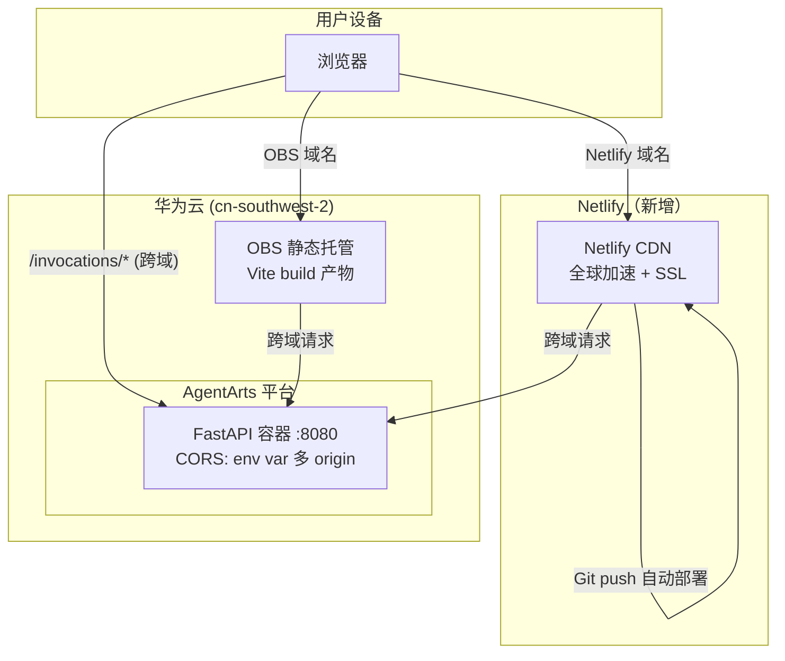
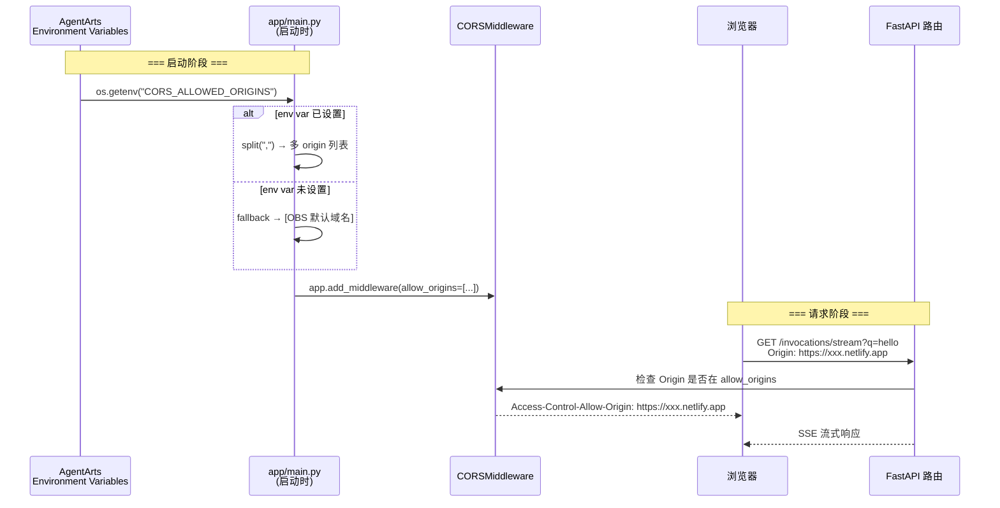
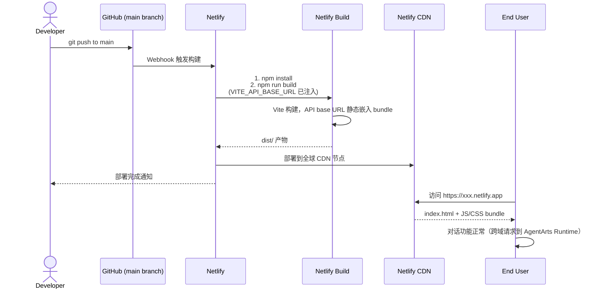
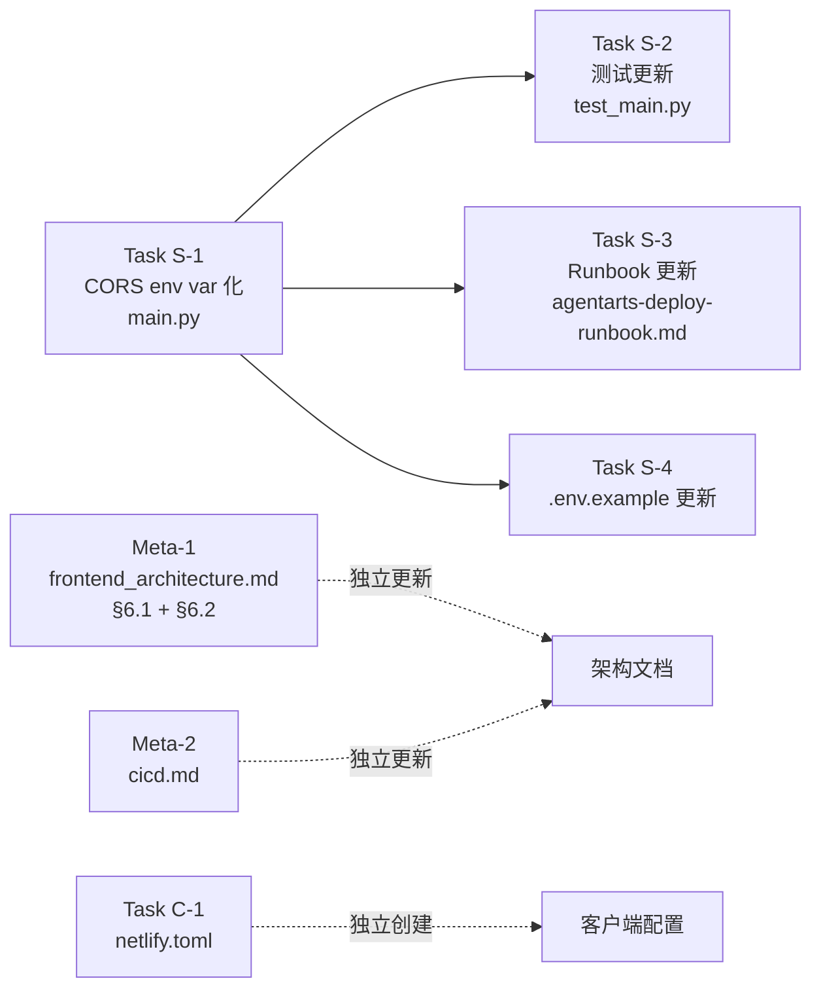

# Feature 12 Netlify Deployment — Implementation Plan

> 版本：v1.0 | 状态：Planning | 关联 Issue：[feature-12-netlify-deployment](./issue.md)

---

## 0. Issue Evaluation

| 维度 | 结果 | 说明 |
|------|------|------|
| Staleness | ✅ | 引用的架构文档（`frontend_architecture.md`、`cicd.md`、`agentarts-deploy-runbook.md`）全部存在且内容与 issue 描述一致；代码现状（`main.py` CORS 硬编码、`test_main.py` 单 origin 测试、`chat-adapter.ts` 已使用 `VITE_API_BASE_URL`）与 issue 描述完全匹配 |
| Feasibility | ✅ | 实现路径明确：① CORS 硬编码 → env var 驱动（标准 12-factor app 模式）② 新增 `netlify.toml`（纯配置）③ 更新架构文档（增量补充）。不违反任何 Accepted ADR |
| Completeness | ✅ | Issue 包含清晰的 scope（4 个方面）、明确的验收标准（5 条验证）、推荐的代码片段、以及明确的 "不涉及" 边界 |
| Impact Scope | ✅ | Service 侧：`main.py` CORS 逻辑 + `tests/test_main.py` 测试；Client 侧：新增 `netlify.toml`；Meta 侧：3 份架构文档。OBS 部署不受影响，无跨领域耦合 |

**判定：ACCEPT**

---

## 1. Issue Summary

**类型**：Feature

**目标**：为 `personal-assistant-client` 前端新增 Netlify 部署目标，作为现有 OBS 部署的补充。通过 Netlify Git 集成实现 `git push → 自动构建 → 自动部署`，提供全球 CDN + 免费 SSL，且与 OBS 通道互不干扰。

**涉及架构文档**：
- `personal-assistant-meta/architecture/frontend_architecture.md` §6.1（拓扑图）+ §6.2（部署小节）
- `personal-assistant-meta/architecture/devops/cicd.md`
- `personal-assistant-meta/architecture/devops/agentarts-deploy-runbook.md` §1.5

**涉及配置文件**：
- `personal-assistant-service/.env.example`（新增 `CORS_ALLOWED_ORIGINS` 环境变量说明）

---

## 2. API Changes

**无 API schema 变更**。CORS 中间件（`CORSMiddleware`）是 FastAPI 中间件层配置，不属于 path operation，不会体现在 OpenAPI spec 中。无需更新 `openapi.json`。

**唯一的契约变化**：
- 后端 CORS `allow_origins` 从硬编码单域名切换为环境变量驱动的多域名列表
- Service-Dev 需要实现的 env var 契约：`CORS_ALLOWED_ORIGINS` — 逗号分隔的 origin 列表，如果未设置则 fallback 到当前 OBS 域名
- 这是部署时配置，不是 API 接口变化

---

## 3. Service Tasks（personal-assistant-service）

### 3.1 Task S-1：CORS 中间件环境变量化

**文件**：`personal-assistant-service/app/main.py`

**当前状态**（line 42-48）：
```python
app.add_middleware(
    CORSMiddleware,
    allow_origins=["https://personal-assistant-web-chat.obs-website.cn-southwest-2.myhuaweicloud.com"],
    allow_credentials=True,
    allow_methods=["*"],
    allow_headers=["*"],
)
```

**目标状态**：从环境变量 `CORS_ALLOWED_ORIGINS` 读取逗号分隔的 origin 列表，未设置时 fallback 到当前 OBS 域名。

**具体修改**：

1. 在 `app.add_middleware(...)` 之前（line 42 之前）插入 env var 读取逻辑：

```python
import os

_default_origins = [
    "https://personal-assistant-web-chat.obs-website.cn-southwest-2.myhuaweicloud.com"
]
_env_origins = os.getenv("CORS_ALLOWED_ORIGINS")
_allowed_origins = (
    [o.strip() for o in _env_origins.split(",")] if _env_origins else _default_origins
)
```

2. 将 `app.add_middleware(...)` 的 `allow_origins` 改为 `_allowed_origins`：

```python
app.add_middleware(
    CORSMiddleware,
    allow_origins=_allowed_origins,
    allow_credentials=True,
    allow_methods=["*"],
    allow_headers=["*"],
)
```

**注意事项**：
- `import os` 是**新增导入** — 当前 `main.py` 没有显式 `import os`（`dotenv` 的 `load_dotenv` 不提供 `os` 命名空间）。必须在 `app = FastAPI(...)` 之后、`app.add_middleware(...)` 之前添加
- 注意不要在 line 14 的 `CORSMiddleware` import 之前插入 `import os`（遵循文件现有的 `# noqa: E402` 风格），放在 `app = FastAPI(...)` 之后、`app.add_middleware(...)` 之前即可
- `_allowed_origins` 变量名使用下划线前缀表示模块级私有

### 3.2 Task S-2：更新 CORS 测试适配多 origin 模式

**文件**：`personal-assistant-service/tests/test_main.py`

**当前状态**（line 367-399）：
- `ALLOWED_ORIGIN` 常量指向单个 OBS 域名
- `test_cors_middleware_allow_origins` 断言 `allow_origins == [ALLOWED_ORIGIN]`（精确匹配单元素列表）

**需要修改的测试**：

| 测试方法 | 当前行为 | 目标行为 |
|----------|---------|---------|
| `test_cors_middleware_allow_origins` (line 387-400) | 断言 `allow_origins == [单域名]` | 断言 OBS 域名在 `allow_origins` 列表中（`in` 而非 `==`） |
| `test_preflight_options_ping_with_correct_origin` (line 434) | 检查 `allow-origin == ALLOWED_ORIGIN` | 检查 `allow-origin == ALLOWED_ORIGIN`（不变 — 仍返回匹配的 origin） |
| 所有使用 `ALLOWED_ORIGIN` 的测试 | 单域名对比 | 保持不变 — 这些测试验证的是 **CORS 行为**（preflight 响应头正确性），不验证 `allow_origins` 列表长度 |

**具体修改**：

1. **`test_cors_middleware_allow_origins`**（line 387-400）：将精确匹配断言改为包含断言：

```python
def test_cors_middleware_allow_origins(self):
    """The CORSMiddleware should allow the OBS static website origin (at minimum)."""
    from fastapi.middleware.cors import CORSMiddleware

    from app.main import app

    cors_mws = [mw for mw in app.user_middleware if mw.cls is CORSMiddleware]
    assert len(cors_mws) == 1, (
        f"Expected exactly one CORSMiddleware, got {len(cors_mws)}"
    )
    origins = cors_mws[0].kwargs["allow_origins"]
    assert ALLOWED_ORIGIN in origins, (
        f"Expected {ALLOWED_ORIGIN!r} to be in allow_origins, got {origins!r}"
    )
```

2. **新增测试 `test_cors_allow_origins_from_env_var`**：验证从环境变量读取多 origin 的能力。这个测试需要在未设置 `CORS_ALLOWED_ORIGINS` 环境变量时验证 fallback 行为（OBS 域名在列表中），在设置了环境变量时验证多 origin 读取。

   注意：由于 `app` 是在模块导入时创建的（`from app.main import app` 在文件顶部 line 16），而 CORS 配置在模块加载时确定，env var 测试需要特殊处理。推荐方案：

   - **测试 A**（默认行为）：在未设置 `CORS_ALLOWED_ORIGINS` 时，验证 `ALLOWED_ORIGIN in origins`
   - **测试 B**（env var 行为）：使用 `monkeypatch.setenv("CORS_ALLOWED_ORIGINS", "https://a.example.com,https://b.example.com")` + `importlib.reload` 重新加载 `app.main` 来验证多 origin 读取

   测试 B 的实现参考：

```python
import importlib
import os


class TestCORSEnvVar:
    def test_cors_allowed_origins_from_env_var(self, monkeypatch):
        """When CORS_ALLOWED_ORIGINS is set, use it as comma-separated list."""
        monkeypatch.setenv(
            "CORS_ALLOWED_ORIGINS",
            "https://a.example.com,https://b.example.com",
        )
        # Reload the module to pick up the new env var
        import app.main

        importlib.reload(app.main)

        from fastapi.middleware.cors import CORSMiddleware

        cors_mws = [mw for mw in app.main.app.user_middleware if mw.cls is CORSMiddleware]
        origins = cors_mws[0].kwargs["allow_origins"]
        assert origins == ["https://a.example.com", "https://b.example.com"]

        # Cleanup: reload again without the env var to restore default state
        monkeypatch.delenv("CORS_ALLOWED_ORIGINS", raising=False)
        importlib.reload(app.main)
```

   ⚠️ **注意**：`importlib.reload` 可能影响共享的 `app` 实例。建议将此测试放在测试文件的最后（在 `class TestCORSEnvVar` 中），并在 `teardown` 中恢复默认状态。或者，如果 `reload` 引入的不稳定性过高，可以将此测试标记为 `skip` 并添加注释说明它依赖 `reload`。

### 3.3 Task S-3：更新部署 runbook

**文件**：`personal-assistant-meta/architecture/devops/agentarts-deploy-runbook.md`

**修改位置**：§1.5 "Pre-Deployment Code Change — CORS 中间件配置"

**当前内容**（line 107-127）：CORS 中间件配置示例使用硬编码单域名

**修改方案**：

1. 将 line 107-117 的代码示例从硬编码单域名改为 env var 驱动模式：

```python
# 在 app = FastAPI(...) 之后（line 39 之后）、app.add_middleware 之前添加：
import os

_default_origins = [
    "https://personal-assistant-web-chat.obs-website.cn-southwest-2.myhuaweicloud.com"
]
_env_origins = os.getenv("CORS_ALLOWED_ORIGINS")
_allowed_origins = (
    [o.strip() for o in _env_origins.split(",")] if _env_origins else _default_origins
)

app.add_middleware(
    CORSMiddleware,
    allow_origins=_allowed_origins,
    allow_credentials=True,
    allow_methods=["*"],
    allow_headers=["*"],
)
```

2. 在 §1.5 末尾新增一个小节说明环境变量配置：

```markdown
### 环境变量 `CORS_ALLOWED_ORIGINS`

AgentArts Runtime 环境变量配置（在 `.agentarts_config.yaml` 的 `environment_variables` 中）：

```yaml
- key: CORS_ALLOWED_ORIGINS
  value: "https://<obs-domain>,https://<netlify-domain>.netlify.app"
```

- 多个 origin 用英文逗号分隔（不包含空格，代码自动 strip）
- 如果不设置此环境变量，fallback 到 OBS 默认域名
- Netlify 域名格式：`https://<site-name>.netlify.app`
```

3. 将 CORS 验证命令（line 142-148）更新为支持多 origin：

```bash
# 部署后，从 OBS 域名和 Netlify 域名分别发起跨域请求验证 CORS 头
curl -sI -X OPTIONS "<runtime-domain>/ping" \
  -H "Origin: https://<bucket-name>.obs-website.cn-southwest-2.myhuaweicloud.com" \
  -H "Access-Control-Request-Method: GET"

curl -sI -X OPTIONS "<runtime-domain>/ping" \
  -H "Origin: https://<site-name>.netlify.app" \
  -H "Access-Control-Request-Method: GET"
# 两者均期望：响应头包含 Access-Control-Allow-Origin: <对应的 origin>
```

### 3.4 Task S-4：更新 `.env.example` 环境变量参考

**文件**：`personal-assistant-service/.env.example`

**当前状态**（line 1-14）：仅包含 LLM Provider 相关环境变量（`MAAS_API_KEY`、`DEEPSEEK_API_KEY` 和旧版兼容变量）

**修改方案**：在文件末尾追加 CORS 配置小节：

```ini
# ── CORS 配置 ──
# 逗号分隔的允许 Origin 列表。未设置时默认仅允许 OBS 静态网站域名。
# 示例（单域名）：
#   CORS_ALLOWED_ORIGINS=https://personal-assistant-web-chat.obs-website.cn-southwest-2.myhuaweicloud.com
# 示例（多域名 — OBS + Netlify）：
#   CORS_ALLOWED_ORIGINS=https://obs-domain.example.com,https://<site-name>.netlify.app
# CORS_ALLOWED_ORIGINS=
```

**说明**：
- `.env.example` 是 Service 环境变量的权威参考，开发者应从中了解所有可用配置项
- 注释中给出单域名和多域名两种示例，方便开发者按需选择
- 最后一行空值注释（`# CORS_ALLOWED_ORIGINS=`）提示此变量为可选配置，不设置时使用默认值

---

## 4. Client Tasks（personal-assistant-client）

### 4.1 Task C-1：创建 `netlify.toml`

**文件**：`personal-assistant-client/netlify.toml`（新建）

**内容**：

```toml
# Netlify 部署配置 — personal-assistant-client
#
# Netlify 自动检测 monorepo 结构（base 指向子目录），
# 在 git push 到 main 后自动构建并部署。
#
# SPA 路由回退：所有非文件路径请求返回 /index.html (200)

[build]
  base = "personal-assistant-client"
  command = "npm run build"
  publish = "dist"

[[redirects]]
  from = "/*"
  to = "/index.html"
  status = 200
```

**说明**：
- `base`：Netlify 的 monorepo 支持字段，指定构建命令的执行目录
- `command`：使用 `npm run build`（等同于 `tsc -b && vite build`），构建时需确保 Netlify 环境变量中已设置 `VITE_API_BASE_URL`
- `publish`：Vite 构建输出目录（`dist/`），与 `vite.config.ts` 中 `build.outDir` 一致
- `[[redirects]]`：SPA fallback 规则，所有路径回退到 `index.html`，由前端路由接管

**注意事项**：
- Netlify 自动提供 `NODE_VERSION` 环境变量（默认读取 `.nvmrc` 或 `engines.node`），项目 `package.json` 中未设置 `engines.node`，Netlify 会使用其默认版本（当前为 Node 20）。如果需要锁定版本，后续可在 `package.json` 中添加 `engines.node` 字段
- 构建产物 `dist/` 无需 `.gitignore` 排除（已被 `.gitignore` 覆盖）

### 4.2 Task C-2：Netlify 环境变量文档

**无需创建新文件**。在 `agentarts-deploy-runbook.md` 的 CORS 环境变量小节（§1.5，Task S-3 新增）中已涵盖 `CORS_ALLOWED_ORIGINS` 包含 Netlify 域名的说明。

**Netlify Site Settings 中需手动配置的环境变量**（在 Netlify 控制台操作，不涉及代码变更）：

| 变量名 | 值 | 说明 |
|--------|-----|------|
| `VITE_API_BASE_URL` | `https://<runtime-domain>` | AgentArts Runtime 域名（与 OBS 部署使用相同值） |

这是部署时的一次性配置，不是代码变更。Netlify 控制台路径：Site Settings → Environment variables。

### 4.3 确认无需前端代码变更

已验证 `personal-assistant-client/src/lib/chat-adapter.ts` 已通过以下方式使用 `VITE_API_BASE_URL`：

```typescript
const baseUrl: string = (
  import.meta.env.VITE_API_BASE_URL ?? ""
).replace(/\/$/, "");
```

- 开发模式（`VITE_API_BASE_URL` 未设置）→ `baseUrl = ""` → 请求走 Vite dev proxy → `localhost:8080`
- 生产模式（`VITE_API_BASE_URL` 已设置）→ `baseUrl = "<runtime-domain>"` → 直连 AgentArts Runtime

Netlify 构建时通过环境变量注入 `VITE_API_BASE_URL`，Vite 将其静态嵌入 bundle，**无需修改任何前端源代码**。

---

## 5. Test Requirements

### 5.1 Service 单元测试

| 测试文件 | 测试内容 | 优先级 |
|----------|---------|--------|
| `tests/test_main.py` | 更新 `test_cors_middleware_allow_origins`：断言 OBS 域名在 `allow_origins` 中（`in` 而非 `==`） | P0 — 必须通过 |
| `tests/test_main.py` | 新增 `test_cors_allowed_origins_from_env_var`：设置 `CORS_ALLOWED_ORIGINS` 后验证多 origin 读取 | P1 — 推荐 |
| `tests/test_main.py` | 新增 `test_cors_empty_env_var_behavior`：验证 `CORS_ALLOWED_ORIGINS=""` 时不会意外放行所有 origin | P1 — 推荐 |
| `tests/test_main.py` | 保持所有 preflight 和 normal request CORS 测试不变 | P0 — 必须通过 |

**通过标准**：`uv run pytest tests/test_main.py -k "cors" -v` 全部通过

### 5.2 Client 单元测试

`netlify.toml` 是纯配置文件，无单元测试。但需验证：

- `npm run build` 在设置 `VITE_API_BASE_URL` 后构建成功
- 构建产物 `dist/` 包含 `index.html` 和 `assets/` 目录

**验证命令**：
```bash
cd personal-assistant-client
VITE_API_BASE_URL="https://test.example.com" npm run build
# 期望：构建成功，dist/ 目录生成
```

### 5.3 E2E 验证场景

| 场景 | 步骤 | 期望结果 |
|------|------|----------|
| **E2E-1：Netlify 页面加载** | 浏览器访问 Netlify 域名 | 页面正常渲染，无 JS 报错 |
| **E2E-2：SSE 流式对话** | 在 Netlify 页面发送对话消息 | 收到 AI 流式回复，逐字渲染正常 |
| **E2E-3：CORS 无报错** | DevTools Console 检查 | 无 `Access-Control-Allow-Origin` 相关错误 |
| **E2E-4：SPA fallback** | 直接访问 Netlify 非根路径（如 `/chat`） | 返回 HTTP 200，页面正常渲染 |
| **E2E-5：OBS 不受影响** | 浏览器访问 OBS 域名，发送对话 | 与 Netlify 部署前行为一致，功能正常 |
| **E2E-6：多 origin CORS** | 从 OBS 域名和 Netlify 域名分别发起跨域请求 | 两者均收到正确的 `Access-Control-Allow-Origin` 响应头 |

**Edge Cases**：
- `CORS_ALLOWED_ORIGINS` 未设置 → fallback 到 OBS 默认域名（向后兼容）
- `CORS_ALLOWED_ORIGINS` 设置为空字符串 `""` → `[o.strip() for o in "".split(",")]` 产生 `[""]`，此时 `allow_origins=[""]`。FastAPI/Starlette CORSMiddleware 对 `""` 的行为需要实测验证 — **建议在 Task S-2 中作为独立 edge case 测试**，确认空字符串不会意外放行所有 origin
- `CORS_ALLOWED_ORIGINS` 包含带 trailing slash 的 origin → `strip()` 不处理 `/`（需要确认 Starlette/CORSMiddleware 是否容忍 trailing slash）
- OAuth Cookie 跨域隔离：从 OBS 登录后的 Cookie 不会发送到 Netlify 域名（不同 origin），用户需在 Netlify 重新登录 — 这是预期行为，不需要特殊处理

---

## 6. Mermaid Diagrams

### 6.1 整体部署拓扑（更新后）



### 6.2 CORS 环境变量化：数据流



### 6.3 Netlify 自动部署流程



---

## 7. Architecture Document Updates Summary

| 文档 | 章节 | 变更内容 |
|------|------|---------|
| `frontend_architecture.md` | §6.1 整体拓扑 + §6.2 Web Chat 前端部署 | §6.1：拓扑图中新增 Netlify 部署节点及数据流；§6.2：在 "当前阶段：OBS 静态托管" 后新增 "并行阶段：Netlify 部署" 小节 |
| `devops/cicd.md` | §5 分层决策总结 | 表格中新增 Netlify 行，说明其为 Layer 之外的独立部署通道（Git 集成自动部署） |
| `agentarts-deploy-runbook.md` | §1.5 CORS 中间件配置 | 将 CORS 配置从硬编码单域名改为 env var 驱动的多域名模式；新增环境变量配置说明；更新验证命令 |
| `personal-assistant-service/.env.example` | 文件末尾 | 新增 `─ CORS 配置 ─` 小节，记录 `CORS_ALLOWED_ORIGINS` 变量及用法示例 |

### 7.1 `frontend_architecture.md` 变更

#### §6.1 整体拓扑图更新

当前 §6.1 的 `flowchart TB` 在 `HuaweiCloud` 子图中仅包含 `CDN → OBS` 前端部署路径，未体现 Netlify。更新方案：

**选项 A（推荐）**：在现有拓扑图的 `UserDevices` 子图外新增 `Netlify` 平行子图，并添加 `Browser → Netlify → FastAPI` 数据流。这比直接在 `HuaweiCloud` 子图中塞 Netlify 更准确（Netlify 不在华为云内）。

**选项 B**：在拓扑图下方加注释标注 "Netlify 部署为平行通道，详见 §6.2"。

无论哪个选项，目标都是让读者从 §6.1 的 overview diagram 就意识到 Netlify 的存在，而不是等到 §6.2 才首次发现。

具体新增 Mermaid 子图（选项 A）：

```mermaid
subgraph Netlify["Netlify CDN（平行通道）"]
    NetlifyCDN_node["Netlify<br/>Git push → 自动构建部署"]
end
```

并在连线区添加：
```
Browser -->|"Netlify 域名"| NetlifyCDN_node
NetlifyCDN_node -->|"跨域请求"| FastAPI
```

> 完整更新后的拓扑图参见本 plan §6.1。

#### §6.2 新增 Netlify 部署小节

在 "当前阶段：OBS 静态托管" 表格后、"目标阶段：OBS + CDN + 自定义域名" 之前，新增：

```markdown
#### 并行阶段：Netlify 部署（新增）

Netlify 作为 OBS 部署的补充通道，提供自动构建和全球 CDN，与 OBS 独立运行：

```
Web Chat 部署（Netlify）
  浏览器 → https://<site-name>.netlify.app/
    ├── index.html, assets/*  → Netlify CDN（Git push 自动部署）
    └── fetch /invocations/*  → 跨域请求 FastAPI 容器
```

| 维度 | 说明 |
|------|------|
| **构建** | Git push 到 main 后 Netlify 自动构建（`npm run build`） |
| **CDN** | 全球节点 + 免费 SSL，无需额外配置 |
| **跨域** | 存在，需 FastAPI CORS 多 origin 配置 |
| **适用** | 快速验证、国际访问加速、与 OBS 互为备份 |
```

### 7.2 `cicd.md` §5 表格新增行

在 "分层决策总结" 表格 "Layer 3" 行后添加：

```markdown
| Netlify（补充通道） | Git 集成自动部署 | `netlify.toml` + 控制台 env vars | push 到 main |
```

### 7.3 `agentarts-deploy-runbook.md` §1.5

已在 §3.3 Task S-3 中详述。

---

## 8. Implementation Order & Dependencies



**并行组**：
- **组 A（Service）**：S-1 → S-2, S-3, S-4（S-1 先改代码，S-2/S-3/S-4 可并行执行）
- **组 B（Meta 文档）**：Meta-1、Meta-2 可并行更新
- **组 C（Client）**：C-1 独立创建

所有组之间无阻塞依赖，可并行执行。

---

## 9. Deployment Verification Checklist

部署后逐项验证（由 E2E 测试覆盖或人工验证）：

- [ ] Netlify 构建成功（Netlify Dashboard → Deploys 页面）
- [ ] `curl -sI https://<site-name>.netlify.app/` → HTTP 200
- [ ] `curl -sI https://<site-name>.netlify.app/chat` → HTTP 200（SPA fallback）
- [ ] 浏览器访问 Netlify 域名 → 页面正常渲染
- [ ] 发送对话消息 → SSE 流式回复正常
- [ ] DevTools Console → 无 CORS 错误
- [ ] OBS 域名访问 → 功能不受影响
- [ ] `curl -sI -X OPTIONS <runtime>/ping -H "Origin: <netlify-domain>"` → `access-control-allow-origin: <netlify-domain>`
- [ ] `curl -sI -X OPTIONS <runtime>/ping -H "Origin: <obs-domain>"` → `access-control-allow-origin: <obs-domain>`
