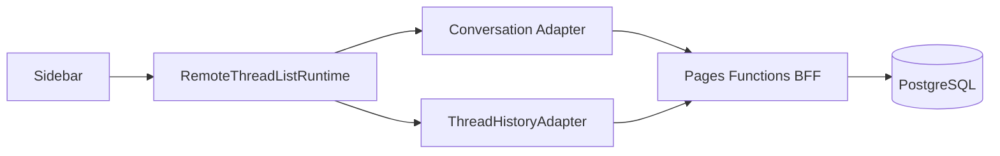

# Client Implementation Plan — Feature 14

## 1. Client 与 BFF tasks

### assistant-ui runtime

1. 将 `RuntimeProvider` 改为 `useRemoteThreadListRuntime` 外层 +
   `useLocalRuntime(chatAdapter, { adapters: { history } })` 内层。
2. 新增 `RemoteThreadListAdapter`：
   `list/initialize/fetch/rename/archive/unarchive/delete/generateTitle`。
3. 每个 Conversation 注入独立 `ThreadHistoryAdapter`；`load()` 将 normalized DTO
   decode 为 assistant-ui exported message repository，`append()` 只提交 user
   message identity，不允许客户端声明可信 assistant output。
4. `chatAdapter` 从 active thread runtime 取得 `conversation_id`，请求 body 携带
   `conversation_id` 与 stable `client_message_id`。

### UI

按已确认 preview 实现：

- Desktop 292px Conversation sidebar；mobile 为 overlay drawer
- New Chat、switch、rename、archive、delete
- title、recent timestamp、message preview
- history skeleton、retry error、empty welcome state
- footer 显示 `warming|ready|degraded`
- `ResetSessionButton` 退役为 `NewConversationButton`

### Pages Functions BFF

Pages Functions 是 Conversation/lifecycle authority：

- 使用 `jose` + remote JWKS 验证 Microsoft JWT，可信 claim 映射为 `user_id`
- 通过 Cloudflare Hyperdrive + `pg >= 8.16.3` 访问 PostgreSQL
- Conversation CRUD/history pagination
- Runtime ensure/stop 与 lease single-flight
- `/invocations` ownership check、lease lookup、header injection、SSE passthrough
- 累积 trusted assistant token，在 `done` boundary 写入
  `conversation_messages`
- pre-warm failure 使用 client-generated UUID implicit fallback；首次 upstream
  success 后登记 active implicit lease

## 2. HTTP contract

| Method | Route | 说明 |
|--------|-------|------|
| GET/POST | `/api/conversations` | cursor list / idempotent create |
| GET/PATCH/DELETE | `/api/conversations/:id` | fetch / rename-status / soft delete |
| GET | `/api/conversations/:id/messages` | cursor history |
| POST | `/api/runtime-session/ensure` | idempotent pre-warm |
| DELETE | `/api/runtime-session` | guarded stop |
| POST | `/api/legacy-conversation-migrations` | 一次性 legacy hint |
| POST | `/invocations` | ownership-aware streaming proxy |

## 3. Race/error policy

- history response 带 generation token；切换后旧 response 被丢弃
- New Chat double-click 由 disabled state + `Idempotency-Key` 防重
- ensure timeout 2–3 秒后进入 degraded，不阻塞 composer
- 同一 client message ID 重试只返回/续用同一 persisted user message
- title generation 失败使用首条 user message deterministic fallback
- delete 不 stop user Runtime Session

## 4. 文件

| 文件/目录 | 动作 |
|-----------|------|
| `src/components/RuntimeProvider.tsx` | remote runtime integration |
| `src/components/chat/ChatPage.tsx` | preview layout integration |
| `src/components/chat/ConversationSidebar.tsx` | 新增 |
| `src/components/chat/RuntimeStatus.tsx` | 新增 |
| `src/lib/conversations/*` | adapters、API、DTO、history |
| `src/lib/chat/chat-api-client.ts` | invocation identity |
| `src/lib/chat/session.ts` | legacy hint only，迁移后删除 key |
| `functions/api/conversations/*` | CRUD/history |
| `functions/api/runtime-session/*` | ensure/stop |
| `functions/invocations.js` | ownership-aware proxy |
| `functions/_shared/*` | JWT、DB、lease、response helpers |
| `personal-assistant-infra/cloudflare.tf` | Hyperdrive binding + auth/runtime vars |
| `preview/feature-14/index.html` | 保留为 approved visual reference |

## 5. Frontend tests

- adapter method mapping 与 pagination
- initial metadata → history hydration 顺序
- switch race 不串消息
- loading/error/empty 三态互斥
- New Chat idempotency
- rename/archive/delete
- warming/ready/degraded 且 degraded 可发送
- mobile drawer
- legacy hint 只提交一次，成功后删除 localStorage key

