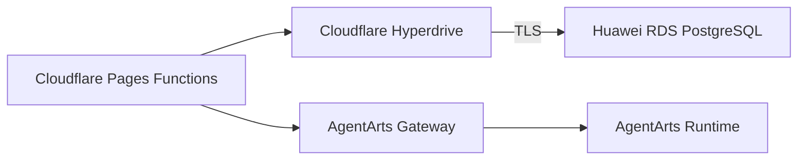

# Infrastructure Implementation Plan — Feature 14

## 1. Infrastructure changes

不新增 Huawei Cloud compute。复用 Feature 1.2 RDS PostgreSQL 与现有 AgentArts
Runtime/Gateway。

Cloudflare 增加：

- Hyperdrive configuration，origin 指向 RDS PostgreSQL TLS endpoint
- Pages binding `HYPERDRIVE`
- `nodejs_compat` compatibility flag
- non-secret vars：Runtime name、Gateway base URL、OIDC issuer/audience、
  pre-warm timeout、idle timeout
- RDS credential 仅存于 Hyperdrive configuration/Cloudflare secret，不写入 repo

以上长期配置由 `personal-assistant-infra` 中的 OpenTofu
`cloudflare/cloudflare` provider 管理；Wrangler 仅发布 Pages 静态资源与
Functions 代码。

RDS security group 必须允许 Hyperdrive origin connectivity。上线前轮换当前
application DB credential，并为 BFF 创建 least-privilege role：

- Conversation tables：SELECT/INSERT/UPDATE/DELETE
- Runtime lease tables：SELECT/INSERT/UPDATE
- 不授予 LangGraph checkpoint blob 的日常读取权限

Legacy migration 由 FastAPI 的 Service DB role 执行；BFF role 不读取 Checkpoint
tables。

## 2. Deployment order

1. `uv run alembic upgrade head`
2. 创建/验证 Hyperdrive
3. deploy FastAPI contract
4. deploy Pages Functions BFF
5. deploy Client UI
6. smoke test 后启用 pre-warm flag

Rollback：关闭 pre-warm flag并恢复旧 UI build；新表保留，不 destructive rollback。

## 3. Validation

- `tofu fmt -check -recursive && tofu validate`
- `wrangler pages dev` 使用 local Hyperdrive connection string
- production Hyperdrive TLS query
- secret 不出现在 bundle、logs、responses
- RDS connection count 在预期范围
- sessions-start/start latency metrics 可见

