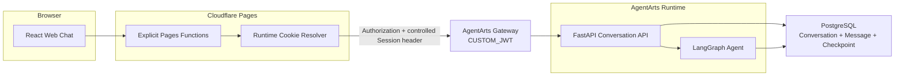
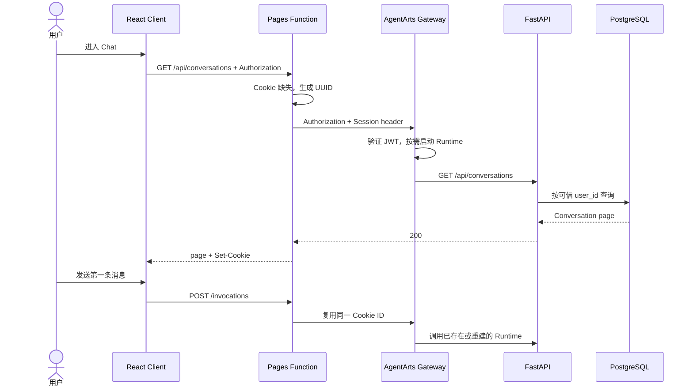

# Feature 14: Web Chat 多 Conversation 与 Runtime 提前唤醒

> 状态：Implementation Complete / Deployment Validation Pending
> 日期：2026-07-14 | 实现验证：2026-07-15
> 关联计划：[`plan.md`](./plan.md)
> Spike：[`spike.md`](./spike.md)
> UI Preview：[`preview.html`](./preview.html)

## 动机

当前 Web Chat 的一个 browser-generated Session ID 同时承担三件事：

1. AgentArts Runtime routing key；
2. LangGraph Checkpoint 的 `thread_id`；
3. 浏览器当前对话标识。

这会导致用户无法自然地创建、切换和恢复多个 Conversation，也让 Runtime 的临时生命周期
与业务数据生命周期混在一起。

Feature 14 的目标是：

- 支持创建、切换、重命名、归档和永久删除 Conversation；
- 页面刷新后恢复 Conversation 列表和消息；
- 使用随机 HttpOnly Cookie 复用 Runtime Session；
- 进入 Chat 时通过必要的 Conversation list 请求提前触发 Runtime；
- 保持 BFF 薄，不让它访问数据库或承担业务授权；
- 以展示项目的规模实现，不引入生产级发布平台和后台运维系统。

## 平台事实与待验证假设

1. AgentArts Invocation 要求 `X-Hw-Agentarts-Session-Id`。
2. 合法的 application-generated Runtime Session ID 可以直接用于 Invocation。
3. 项目按“Runtime Session ID 是逻辑路由键”设计：平台回收底层 instance 后预期可继续
   使用相同 ID，并由下一次请求重建执行实例。该行为尚未完成部署回收 probe，不作为已验证
   的 Runtime SLA。
4. `POST /runtimes/{runtime_name}/sessions-start` 不接收调用方指定的 Session ID，而是
   返回另一个由平台生成的 ID。
5. AgentArts API 文档没有为 `sessions-start` 定义 ready 状态、TTL 或首条消息延迟保证。
6. 已部署的 CUSTOM_JWT Gateway 会验证 JWT，并把原始 `Authorization` 转发给 FastAPI。
   该事实已于 2026-07-14 验证。
7. 旧路径已观察到 Gateway suffix rewrite；Feature 14 的 GET、POST、PATCH、DELETE 和
   resolver Session header 仍需在部署环境执行 G1 窄 probe。

## 核心决策

1. `conversation_id`、LangGraph `thread_id` 和 `runtime_session_id` 分离。
2. Cloudflare Pages Function 生成随机 Runtime Session ID，存入 HttpOnly session Cookie。
3. BFF 覆盖调用方提供的 Runtime Session header，但不校验 JWT、不访问数据库。
4. FastAPI 从 Gateway 已验证并转发的 JWT `sub` 派生 `user_id`。
5. Conversation API 位于现有 FastAPI Service，不增加新的部署单元。
6. 进入 Chat 时的 `GET /api/conversations` 同时承担业务加载和 application-level
   warm-up；不接入 `sessions-start`。
7. 只持久化 Conversation 和 Message，不持久化 Runtime/Sandbox lease，也不创建
   `invocation_runs`。
8. 不自动重试 Agent Invocation。网络失败后由用户明确重发，并使用新的
   `client_message_id`。
9. 同一 Conversation 的 Invocation 与 Delete 使用 PostgreSQL Advisory Lock 互斥。
10. 数据层使用 PostgreSQL；in-memory fake 只用于纯 Unit Test，不维护 SQLite 版本。

## 概念基础

### Conversation

Conversation 是用户可见、可持久化的对话。它包含标题、状态和消息历史，不依赖某个
Runtime instance 是否仍存活。

### LangGraph `thread_id`

每个 Conversation 对应一个 LangGraph thread：

```text
thread_id = user_id + ":" + conversation_id
```

把 `user_id` 放进 `thread_id` 可以隔离不同用户，即使 UUID 极小概率发生重复，也不会
共享 Checkpoint。

### Runtime Session ID

Runtime Session ID 是 AgentArts 的逻辑路由键，不是：

- 用户身份；
- Conversation ID；
- 物理容器或进程 ID；
- 平台实例永久存活的证明。

同一个 Runtime Session 可以承载多个 Conversation；同一个 Conversation 也可以从不同
浏览器的不同 Runtime Session 访问。业务连续性来自 PostgreSQL 和 Checkpoint，而不是
Runtime instance。

### Runtime 与 Sandbox

| 概念 | 作用 |
|------|------|
| Runtime | 运行 Personal Assistant FastAPI、Agent graph 和工具编排 |
| Sandbox | 将来供 Code Interpreter 等工具执行用户代码的隔离环境 |

Sandbox 可能由 Runtime 内的工具发起，但不是 Runtime 本身。Feature 14 不实现 Sandbox，
也不设计 `sandbox_session_leases`。

## 为什么不持久化 Lease

Lease 是“某个资源在一段时间内由谁使用或占有”的记录。完整 lease 通常会存：

- lease 自己的主键；
- owner/user；
- 平台 Session ID；
- `warming/ready/expired/stopped` 等状态；
- 开始、最后使用、结束时间；
- failure reason。

这些字段只有在应用需要续租、抢占、超时回收、后台 stop 或审计资源生命周期时才有价值。
Feature 14 仅需要复用一个逻辑 routing key。应用用 Cookie 保存该 key，并把实例回收后
同 ID 重建作为待部署验证的设计假设；业务连续性始终来自 PostgreSQL，而不依赖该假设。

如果建立 lease 表，应用就必须持续判断平台状态并修复漂移，但平台文档没有提供可查询的
ready/TTL contract。数据库中的“ready”反而可能是假状态。因此本 Feature 不创建：

- `runtime_session_leases`；
- `sandbox_session_leases`；
- idle cleanup scheduler；
- stop retry worker。

## 目标架构

图类型：**Component Diagram（组件图）**。用于说明 Feature 14 使用的组件和职责边界。



| 组件 | 负责 | 不负责 |
|------|------|--------|
| React Client | UI、选中 Conversation、获取 JWT、消费 SSE | Runtime ID、业务授权、持久化真相 |
| Cloudflare BFF | same-origin proxy、Cookie、header overwrite、SSE 透传 | JWT 验证、数据库、Conversation 业务逻辑 |
| AgentArts Gateway | JWT 验证、Runtime routing | Conversation ownership、Message 持久化 |
| FastAPI Service | 用户身份派生、CRUD、Agent 调用、消息写入 | 生成或保存浏览器 Runtime ID |
| PostgreSQL | Conversation、Message、Checkpoint、Advisory Lock | Runtime ready/TTL 镜像 |

## Runtime Cookie Contract

Cookie：

```http
Set-Cookie: pa_runtime_session=<uuid-v4>; Path=/; HttpOnly; Secure; SameSite=Lax
```

规则：

1. BFF 用 `crypto.randomUUID()` 生成 ID。
2. Cookie 是 session Cookie，不设置 `Expires`、`Max-Age` 或 `Domain`。
3. 部署环境必须使用 `Secure`；显式 local 配置可以在 HTTP preview 中省略 `Secure`。
4. BFF 不把原始 Cookie header 转发给 Gateway。
5. BFF 删除浏览器提供的 Runtime Session header，再注入 Cookie 对应的唯一值。
6. Runtime ID 不进入 JSON、DOM state、analytics、OAuth state 或业务数据库。
7. logout/account switch 删除 Runtime Cookie。
8. 多 Tab 首次并发可能短暂生成两个 ID；最后写入的 Cookie 胜出。该竞争不影响业务数据，
   不为此引入数据库协调。

图类型：**Sequence Diagram（时序图）**。用于说明 Cookie 建立和 application-level
warm-up。



`GET /api/conversations` 首先是产品所需的数据请求。它可能提前承担 cold start，但 UI
不展示 `warming/ready/degraded`，文档也不承诺平台 ready 状态。

## 身份与授权

可信链路：

1. Client 发送 Entra `Authorization: Bearer <token>`。
2. BFF 原样转发 Authorization，不解析 JWT 来做授权。
3. Gateway 验证 signature、issuer、audience 和 expiry。
4. FastAPI 只在 Gateway 后接收请求，从已验证 token 的 `sub` 派生 `user_id`。
5. 所有 Conversation 查询都同时使用 `user_id` 和 `conversation_id`。

浏览器提供的 `X-HW-AgentGateway-User-Id` 不能作为 ownership 依据。Feature 14 删除
Client 对该 header 的发送，并删除 BFF 对它的信任。

## API Contract

所有 Personal Assistant 自定义 wire JSON 使用 `snake_case`。Pydantic model 使用
PascalCase，并按用途加 `Request`、`Response`、`Event`、`Error` 后缀。Frontend
内部变量可以使用 `camelCase`，转换只发生在 Client API adapter。

| Method | Path | 用途 |
|--------|------|------|
| `GET` | `/api/conversations` | 分页列出当前用户的 Conversation |
| `POST` | `/api/conversations` | 创建 Conversation |
| `GET` | `/api/conversations/{conversation_id}` | 读取单个 Conversation |
| `PATCH` | `/api/conversations/{conversation_id}` | 重命名或归档/恢复 |
| `DELETE` | `/api/conversations/{conversation_id}` | 永久删除 |
| `GET` | `/api/conversations/{conversation_id}/messages` | 分页读取消息 |
| `POST` | `/invocations` | 现有 Agent Invocation，新增 Conversation 字段 |

Invocation request 新增：

```json
{
  "conversation_id": "6ee32f02-4c87-4c16-bcc8-cc69277ee42f",
  "client_message_id": "d18b81bc-b6ba-4c9f-91fd-b773a7815eb9",
  "message": "帮我看看明天的日程",
  "stream": true
}
```

SSE payload 继续使用 JSON，并保持 `snake_case`。API 不返回
`runtime_session_id`、`runtime_status` 或 lease 状态。

Pages Function 只代理这套业务 API，不增加第二套 API。

## 数据模型

图类型：**ER Diagram（实体关系图）**。用于说明两张业务表与用户、消息的关系。

```mermaid
erDiagram
    USER ||--o{ CONVERSATION : owns
    CONVERSATION ||--o{ CONVERSATION_MESSAGE : contains

    CONVERSATION {
        bigint pk PK
        uuid id
        text user_id
        text title
        text status
        timestamptz created_at
        timestamptz updated_at
        timestamptz archived_at
    }

    CONVERSATION_MESSAGE {
        bigint sequence PK
        uuid id
        bigint conversation_pk FK
        text role
        jsonb content
        uuid client_message_id
        uuid reply_to_message_id
        timestamptz created_at
    }
```

### `conversations`

- `pk`：内部 bigint 主键，也作为 Advisory Lock key；不暴露给客户端。
- `id`：公开 UUID，与 `user_id` 组成唯一约束。
- `user_id`：来自可信 JWT `sub`。
- `status`：仅 `active` 或 `archived`。
- `archived_at`：归档时间；永久删除不使用 soft-delete 字段。

### `conversation_messages`

- `sequence`：稳定分页 cursor 和显示顺序。
- `conversation_pk`：外键，`ON DELETE CASCADE`。
- `role`：Feature 14 read model 只保存 `user` 和 `assistant`。
- `content`：版本化 JSONB message parts。
- `client_message_id`：用户消息幂等键；同一 Conversation 内唯一。
- `reply_to_message_id`：assistant 对应的 user message；唯一，防止重复写答案。

不创建：

- Runtime/Sandbox lease 表；
- `invocation_runs`；
- retry/outbox 表；
- soft-delete/Trash 表；
- BFF session-to-user 映射表。

## Message Persistence Contract

Feature 14 保留流式体验，但不建立重试状态机：

1. 取得 Conversation Advisory Lock。
2. 验证 ownership 和 Conversation 状态。
3. 在短事务中写入 user message；重复 `client_message_id` 返回
   `409 duplicate_message`，不会再次调用 Agent。
4. Invocation Service 使用 `thread_id=user_id:conversation_id` 调用 Agent，并把
   Agent 的结构化非 terminal event 转换为 SSE。
5. 正常完成后，在短事务中写 assistant message、更新 Conversation 时间。
6. DB commit 成功后才发送 success terminal `done=true`；同步 JSON 也只在 commit
   后返回。
7. 任一退出路径都释放 Advisory Lock。

Client、BFF 和 Service 都不自动重试 `POST /invocations`。用户明确重发时生成新的
`client_message_id`，表示一次新操作。

`AgentHandler` 不再拥有 HTTP/SSE terminal event，不把异常转换为成功结束，也不在
Agent 已开始执行后重新调用 graph。它只产出结构化的 token/custom event 并向上抛出
异常；sync 和 stream transport 共用同一个 Invocation Service execution core。

展示项目接受一个明确 trade-off：进程可能在部分 token 已发送、但 assistant message
尚未 commit 时终止。刷新后会保留 user message而不显示未完成答案；用户可以重新发送。
本 Feature 不增加 `invocation_runs`、reconciliation endpoint 或后台恢复任务来掩盖这
个极低概率窗口。

## Conversation Advisory Lock

同一用户可能从两个浏览器、两个 Runtime Session 同时操作同一 Conversation，
`asyncio.Lock` 无法跨进程协调。实现使用 PostgreSQL session-level Advisory Lock：

1. 先按 `user_id + conversation_id` 查到内部 `conversation.pk`。
2. 用 `pg_try_advisory_lock(pk)` 非阻塞取锁。
3. Invocation 和 Delete 使用相同 key。
4. 未取到锁返回 `409 conversation_busy`，不等待、不重试。
5. LLM/SSE 期间持有 lock connection，但不持有数据库 transaction。
6. 在 `finally` 中 unlock；连接断开时 PostgreSQL 也会自动释放 session lock。

锁只负责互斥，不代表 ownership、lease、retry 或 Runtime 生命周期。

## 永久删除

用户点击 Delete 后：

1. Service 校验 ownership；
2. 尝试取得同一 Conversation Advisory Lock；
3. 删除 `conversations` row，messages 由外键 cascade，使业务数据立即不可访问；
4. 调用 LangGraph Checkpointer 的 `adelete_thread(thread_id)` 清理内部状态；
5. 成功返回 `204`。

操作可重复。若业务 row 已删但 Checkpoint 清理失败，本次返回错误；再次 Delete 会按
`user_id:conversation_id` 重试 Checkpoint 清理并返回 `204`。Feature 14 不实现 Trash、
retention、后台 purge 或恢复功能。

## OAuth Callback Compatibility

当前 callback context helper 从浏览器请求的 Runtime Session header 取值。新 Client
不再发送该 header，因此 BFF 必须把 Cookie resolver 得到的
`runtime_session_id` 显式传给 callback helper，并写入现有短时 HttpOnly
`pa_oauth2_callback_session` Cookie。

OAuth callback 使用发起授权时的 snapshot 做 Runtime routing；用户身份仍由 Gateway
验证的 JWT 和 signed state 决定。Runtime ID 不是 ownership 输入。

新 OAuth state 不再放入 Runtime Session ID。为兼容已有 demo 数据：

- parser 可读取旧 state 中的 `session_id`，但忽略它；
- 新 state 和新 DB row 不再写该值；
- 现有 `oauth2_callback_states.session_id` 改为 nullable，旧 row 保留。

## Schema Setup

这里存在最小的 schema migration，因为要新增两张表，并把现有 OAuth callback 字段改为
nullable。它不是生产级 migration 工程。

固定方案：

- 使用 Alembic 管理 application-owned schema；
- 一次 additive upgrade 创建 `conversations`、`conversation_messages` 并完成 OAuth
  兼容调整；
- 部署演示环境前执行一次 `uv run alembic upgrade head`；
- local/integration test 使用 disposable PostgreSQL；
- demo 数据不需要保留时，可以直接重建数据库后再运行 upgrade；
- 不设计生产级权限分层、零停机双写、自动 downgrade 或多阶段 rollback。

LangGraph Checkpointer 自有表仍由现有 library setup 管理，不纳入本 Feature 的 Alembic
revision。

## 范围

### 包含

- Conversation sidebar 与 CRUD；
- Message read model 和刷新恢复；
- 三类 ID 的职责拆分；
- BFF 随机 HttpOnly Runtime Cookie；
- Gateway 后的 FastAPI Conversation API；
- PostgreSQL Advisory Lock；
- 最小 Alembic schema update；
- OAuth callback context 回归修复；
- warm-up latency 测量。

### 不包含

- AgentArts Session lifecycle API 集成；
- Runtime/Sandbox lease；
- 新部署服务；
- BFF 数据库连接；
- 迁移旧 localStorage Session/Checkpoint；展示环境从新 Conversation 开始；
- Invocation 自动 retry、run ledger、reconciliation worker；
- soft delete、retention、purge worker；
- 生产级 Runtime 发布编排；
- Sandbox Tool；
- 跨 Conversation semantic Memory。

## 验收标准

### AC1 Conversation

- [x] 用户可以创建、列出、切换、重命名、归档、恢复和永久删除自己的 Conversation。
- [x] 页面刷新后恢复列表和消息。
- [x] 用户不能读取或修改其他用户的数据。

### AC2 Session 与身份

- [x] BFF 建立并复用随机 HttpOnly Runtime Cookie。
- [x] Browser-provided Runtime Session/User header 不能决定 routing 或 ownership。
- [x] FastAPI 从 Gateway 已验证的 JWT `sub` 派生 `user_id`。
- [ ] 相同 Runtime ID 在平台回收 instance 后仍可继续调用。
- [x] Runtime ID 不进入 Conversation、Message 或 OAuth state。

### AC3 Warm-up

- [x] 进入 Chat 请求 Conversation list，并与随后 Invocation 复用同一 Cookie ID。
- [x] 不新增 readiness/no-op route，不展示虚构的 ready 状态。
- [ ] 记录直接首条 Invocation 与先加载列表两组的 p50/p95。

### AC4 Message 与并发

- [x] user message 在 Agent 调用前持久化。
- [x] assistant message commit 后才发送 terminal `done=true`。
- [x] 相同 `client_message_id` 不会再次执行 Agent。
- [x] 同一 Conversation 最多一个 Invocation；Delete 与 Invocation 互斥。
- [x] 系统不自动重试 Invocation。
- [x] sync JSON 与 SSE 使用同一个 lock、幂等和 Message persistence core。
- [x] `AgentHandler` 不发送 terminal SSE、不吞异常、不重新执行已开始的 Agent run。

### AC5 Schema 与测试

- [x] Alembic 可初始化空 PostgreSQL，并可升级包含现有 OAuth callback 表的 demo DB。
- [x] migration 只增加本 Feature 必需的 schema，不创建 lease/run/retry 表。
- [x] PostgreSQL integration test 覆盖 CRUD、ownership、cascade 和 Advisory Lock。
- [x] 纯业务 Unit Test 可使用 in-memory fake；不维护 SQLite Store。
- [x] OpenAPI 与新增 route/schema 同步。

### AC6 Client 与 OAuth

- [x] E2E 覆盖创建、发送、切换、刷新和删除。
- [x] E2E 覆盖 Cookie 建立、复用、非法值轮换和 logout。
- [x] E2E 覆盖跨用户访问拒绝。
- [x] OAuth 发起后主 Runtime Cookie 变化，callback 仍使用发起时的 snapshot。
- [x] assistant-ui remote thread 的 `remoteId` 等于 `conversation_id`，切换后从
  Message API hydration。
- [x] UI 不显示 Runtime warming/ready/degraded 状态。

## 风险与取舍

| 风险 | 处理 |
|------|------|
| Gateway 不支持 Feature 14 custom methods/header | 部署前完成 G1 窄 probe；失败时调整 API method mapping |
| Conversation list 没有降低首条消息延迟 | 保留必要的列表请求，删除“预热收益”宣传 |
| 首次多 Tab 生成两个 Runtime ID | 接受临时资源重复，业务状态不依赖该 ID |
| 部分 SSE 已显示但 assistant 尚未写库时进程终止 | 刷新后只保留 user message；用户明确重发，不增加恢复系统 |
| Delete 两个存储步骤之一失败 | 返回错误并允许幂等重试；不向用户报告假成功 |
| Advisory Lock connection 被长期占用 | 使用有限并发和专用 lock connection；busy 立即返回 409 |
| lock connection 在 Agent 执行中断开 | 最终写入前验证连接，失败则不 commit/done；展示项目不保证该异常瞬间的全局互斥 |

## Four-Question Gate

| 问题 | 结论 | 说明 |
|------|------|------|
| Is it best practice? | **Yes** | 业务 ID 与基础设施 routing key 分离；Cookie 为 HttpOnly；ownership 只使用 Gateway 验证的身份。 |
| Is it industry standard? | **Yes** | Browser -> thin BFF -> Gateway -> FastAPI -> PostgreSQL 是主流分层；Alembic 和 PostgreSQL Advisory Lock 都是成熟方案。 |
| Is it conventional? | **Yes** | 只使用现有组件和两张业务表，新成员可按普通 CRUD、SSE 和数据库锁理解。 |
| Is it modern? | **Yes** | Web Crypto、FastAPI/Pydantic、React adapter、PostgreSQL JSONB 和真实 integration test 符合当前生态。 |

四问的范围是“展示项目的正确性和可维护性”，不是生产级高可用。方案明确接受极少数
stream-before-commit 故障窗口，换取不引入 Run ledger、reconciliation worker 和复杂发布
系统。

## 依赖与受影响文档

- `personal-assistant-meta/architecture/api.md`
- `personal-assistant-meta/architecture/session-state-management.md`
- `personal-assistant-meta/architecture/auth/feature-15-calendar-oauth2-architecture.md`
- `personal-assistant-meta/architecture/cloud-service/cloudflare/pages.md`
- `personal-assistant-meta/architecture/cloud-service/huaweicloud/agentarts.md`

## 参考

- AgentArts API PDF：§4.7.1.1 `StartRuntimeSession`、§4.7.1.2
  `ExecuteRuntimeWithPrefix`、§4.7.1.3 `ExecuteRuntime`、§4.7.1.7
  `StopRuntimeSession`
- [`spike.md`](./spike.md)
- [`plan.md`](./plan.md)
- [`architecture/api.md`](../../../architecture/api.md)
