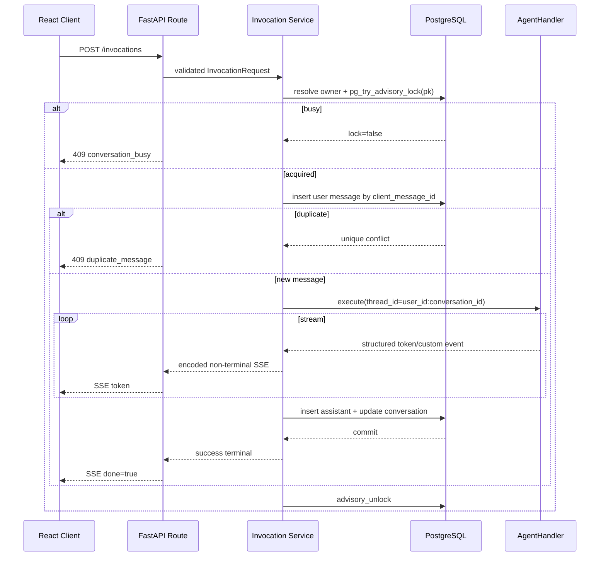
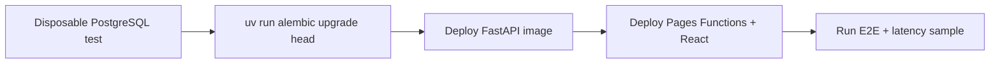

# Feature 14 Implementation Plan: 多 Conversation 与 Runtime 提前唤醒

> 版本：v1.0 | 状态：Implementation Complete / Deployment Validation Pending | 日期：2026-07-15
> Issue: [`issue.md`](./issue.md) | Spike: [`spike.md`](./spike.md)

## Executive Summary

本计划只改现有 Web Chat、Cloudflare Pages Functions、AgentArts FastAPI Service 和
PostgreSQL：

```text
Browser -> Cloudflare Pages Function -> AgentArts Gateway -> FastAPI -> PostgreSQL
```

三个 ID 的职责固定为：

| ID | Owner | 作用域 | 保存位置 |
|----|-------|--------|----------|
| `conversation_id` | FastAPI | User + Conversation | PostgreSQL |
| `thread_id=user_id:conversation_id` | FastAPI | LangGraph Conversation state | PostgreSQL Checkpoint |
| `runtime_session_id` | Cloudflare BFF | Browser Cookie jar | HttpOnly session Cookie |

进入 Chat 时，Client 本来就要调用 `GET /api/conversations`。该请求带上 Cookie-derived
Runtime Session ID，经 Gateway 触发 Runtime，因此兼作 application-level warm-up。

本 Feature 不增加部署服务、lease 表、Run ledger、后台任务或生产级发布编排。

## 0. Implementation Checks

这些是实现前后的窄检查，不是新发布平台。

| Check | 状态 | 证明内容 |
|-------|------|----------|
| G0 Gateway identity | **Passed 2026-07-14** | Gateway 验证 JWT，FastAPI 可读取转发的 Authorization，部署路径没有 auth bypass |
| G1 Gateway routing | **Pending** | custom suffix 的 GET/POST/PATCH/DELETE 可到达 FastAPI，Session header 保持生效 |
| G2 PostgreSQL schema | **Passed 2026-07-15** | Alembic empty/existing/idempotent migration 与 PostgreSQL CRUD、cascade、Advisory Lock tests 通过 |

G1 失败时只需调整 route/method mapping；不要新增中间服务。G2 失败时修正 migration 或
schema；不要引入数据库角色平台、网络 runner 或自动恢复系统。

## 1. Target Architecture

图类型：**Component Diagram（组件图）**。用于说明实现组件和依赖。

```mermaid
flowchart LR
    subgraph Browser["Browser"]
        UI["React Web Chat"]
        Adapter["Client API Adapter"]
    end

    subgraph Cloudflare["Cloudflare Pages"]
        Routes["Explicit Pages Functions"]
        Resolver["Runtime Cookie Resolver"]
        Proxy["Shared AgentArts Proxy"]
    end

    Gateway["AgentArts Gateway<br/>CUSTOM_JWT + PREFIX_MATCH"]

    subgraph Runtime["AgentArts Runtime"]
        RoutesAPI["FastAPI Routes"]
        ConversationService["Conversation Service"]
        Agent["AgentHandler + LangGraph"]
    end

    DB["PostgreSQL"]

    UI --> Adapter --> Routes
    Routes --> Resolver --> Proxy --> Gateway
    Gateway --> RoutesAPI
    RoutesAPI --> ConversationService
    ConversationService --> DB
    ConversationService --> Agent
    Agent --> DB
```



| 组件 | 新职责 | 明确禁止 |
|------|--------|----------|
| Client | Conversation UI、API adapter、SSE hydration | 生成 Runtime ID、决定 ownership |
| Pages Functions | Cookie、受控 header、same-origin proxy | DB、JWT 授权、消息写入 |
| Gateway | JWT 验证和 Runtime routing | Conversation 业务规则 |
| FastAPI | identity、CRUD、lock、Agent 调用、Message write model | 保存 browser Runtime ID |
| PostgreSQL | Conversation、Message、Checkpoint、lock | Runtime lifecycle 状态 |

## 2. BFF Runtime Cookie

### 2.1 Shared resolver

新增 `functions/_shared/runtime-session.js`：

```js
const RUNTIME_SESSION_COOKIE = "pa_runtime_session";
const RUNTIME_SESSION_HEADER = "x-hw-agentarts-session-id";
const RUNTIME_SESSION_PATTERN =
  /^[0-9a-f]{8}-[0-9a-f]{4}-4[0-9a-f]{3}-[89ab][0-9a-f]{3}-[0-9a-f]{12}$/i;
```

Resolver contract：

1. 用 Cookie parser 读取精确名称，不做 substring parsing。
2. 合法值直接复用；缺失或非法时调用 `crypto.randomUUID()`。
3. 删除 inbound Runtime Session header。
4. 将 resolver 返回值设置为唯一 upstream Runtime Session header。
5. 不把原始 `Cookie` header 转发给 Gateway。
6. 新值在所有响应路径写入 Cookie，包括 upstream error：

```http
Set-Cookie: pa_runtime_session=<uuid>; Path=/; HttpOnly; Secure; SameSite=Lax
```

7. local HTTP preview 只有在 `PA_ENV=local` 时省略 `Secure`。
8. Runtime ID 不进入 JSON、DOM、日志、analytics 或 OAuth state。

### 2.2 Explicit proxy routes

复用 shared proxy，但为业务 route 保留显式 Pages Function：

| Frontend path | Pages Function | FastAPI path |
|---------------|----------------|--------------|
| `POST /invocations` | `functions/invocations.js` | `POST /invocations` |
| `GET/POST /api/conversations` | `functions/api/conversations.js` | same |
| `GET/PATCH/DELETE /api/conversations/{id}` | `functions/api/conversations/[conversation_id].js` | same |
| `GET /api/conversations/{id}/messages` | `functions/api/conversations/[conversation_id]/messages.js` | same |
| `POST /api/conversations/{id}/invocations/{client_message_id}/cancel` | `functions/api/conversations/[conversation_id]/invocations/[client_message_id]/cancel.js` | same |
| `POST /auth/logout` | `functions/auth/logout.js` | BFF-only |

`POST /auth/logout` 删除 Runtime Cookie 和 OAuth callback context Cookies，返回 `204`。
它不调用 `sessions-stop`。

Proxy 只转发各 route 需要的 method、path、Authorization、content headers、body 和已知
业务 query 参数；不复制任意平台控制 query。SSE body 原样透传，不解析、不 tee、不写
数据库。

## 3. Identity And OAuth

### 3.1 Trusted user

修改 Service identity dependency：

1. deployed environment 从 Gateway 转发的 Authorization payload 读取必需的 `sub`；
2. `sub` 作为唯一 canonical `user_id`；
3. caller `X-HW-AgentGateway-User-Id` 被忽略或与 `sub` 不一致时拒绝；
4. local fixture 只在显式 local config 可用。

BFF 不校验 JWT。它位于 Gateway 前，只负责转发。业务数据授权全部发生在 Gateway 后的
FastAPI。

### 3.2 OAuth callback context

修改 `applyCallbackContextCookies()`，不再从 browser request 读取 Runtime Session
header，而是接收 BFF resolver 返回的 `runtime_session_id`。

发起授权时：

- 把该 ID 写入短时 HttpOnly `pa_oauth2_callback_session`；
- 新 signed state 不放 `session_id`；
- 新 `oauth2_callback_states` row 不写 `session_id`。

回调时：

- callback proxy 从 snapshot Cookie 恢复 Session header；
- Gateway 验证 Authorization；
- Service 用可信 `sub` 与 signed state 做 ownership 校验；
- 旧 state 中存在的 `session_id` 可读取但被忽略。

## 4. Database Schema

### 4.1 Scope

这是最小 schema setup：

- application-owned schema 使用 Alembic；
- query/store 继续使用 async psycopg，不引入 ORM model layer；
- LangGraph Checkpointer tables 继续由现有 `AsyncPostgresSaver.setup()` 管理；
- 只有两个新业务表；
- schema setup 只执行 additive Alembic revisions。

### 4.2 Revisions

| Revision | 内容 |
|----------|------|
| `20260714_01_app_schema_baseline` | 空库时创建现有 OAuth callback table；已有表时验证兼容结构；将 legacy `session_id` 改为 nullable |
| `20260714_02_conversations` | 创建 `conversations` 和 `conversation_messages` |

两条 revision 都是 additive。旧 OAuth row 保留，不做数据 rewrite。现有 demo 数据不需要
保留时，可以删除 disposable database 后直接 `alembic upgrade head`。

### 4.3 `conversations`

```sql
CREATE TABLE conversations (
    pk BIGINT GENERATED ALWAYS AS IDENTITY PRIMARY KEY,
    id UUID NOT NULL,
    user_id TEXT NOT NULL,
    title TEXT NOT NULL CHECK (char_length(title) BETWEEN 1 AND 200),
    status TEXT NOT NULL DEFAULT 'active'
        CHECK (status IN ('active', 'archived')),
    created_at TIMESTAMPTZ NOT NULL DEFAULT now(),
    updated_at TIMESTAMPTZ NOT NULL DEFAULT now(),
    archived_at TIMESTAMPTZ,
    UNIQUE (user_id, id),
    CHECK (
        (status = 'active' AND archived_at IS NULL)
        OR (status = 'archived' AND archived_at IS NOT NULL)
    )
);

CREATE INDEX conversations_user_status_updated_idx
    ON conversations (user_id, status, updated_at DESC, id DESC);
```

`pk` 只在 Service/DB 内使用，并作为 Advisory Lock key。所有公开 item query 同时使用
`user_id` 和 `id`。

### 4.4 `conversation_messages`

```sql
CREATE TABLE conversation_messages (
    sequence BIGINT GENERATED ALWAYS AS IDENTITY PRIMARY KEY,
    id UUID NOT NULL UNIQUE,
    conversation_pk BIGINT NOT NULL
        REFERENCES conversations(pk) ON DELETE CASCADE,
    reply_to_message_id UUID
        REFERENCES conversation_messages(id),
    role TEXT NOT NULL CHECK (role IN ('user', 'assistant')),
    content JSONB NOT NULL,
    client_message_id UUID,
    created_at TIMESTAMPTZ NOT NULL DEFAULT now(),
    CHECK (
        (role = 'user' AND client_message_id IS NOT NULL
            AND reply_to_message_id IS NULL)
        OR (role = 'assistant' AND client_message_id IS NULL
            AND reply_to_message_id IS NOT NULL)
    )
);

CREATE INDEX conversation_messages_page_idx
    ON conversation_messages (conversation_pk, sequence);

CREATE UNIQUE INDEX conversation_messages_client_user_idx
    ON conversation_messages (conversation_pk, client_message_id)
    WHERE role = 'user';

CREATE UNIQUE INDEX conversation_messages_assistant_reply_idx
    ON conversation_messages (reply_to_message_id)
    WHERE role = 'assistant';
```

`content` 使用版本化 JSON：

```json
{
  "version": 1,
  "parts": [
    {"type": "text", "text": "你好"}
  ]
}
```

Feature 14 不把 reasoning token、OAuth state、Auth URL 或 Runtime ID 写入 Message read model。

### 4.5 Absent tables

Migration 必须证明没有创建：

- `runtime_session_leases`；
- `sandbox_session_leases`；
- `invocation_runs`；
- retry/outbox table；
- soft-delete/Trash table。

## 5. Service Implementation

### 5.1 Module layout

| File | 操作 | 作用 |
|------|------|------|
| `app/auth.py` | modify | 从 Gateway-validated Authorization 派生 `user_id` |
| `app/conversations/models.py` | add | Pydantic request/response/error models |
| `app/conversations/store.py` | add | async psycopg CRUD 和分页 |
| `app/conversations/service.py` | add | ownership、归档和 delete 规则 |
| `app/conversations/locks.py` | add | Advisory Lock context manager |
| `app/conversations/routes.py` | add | Conversation routes |
| `app/invocations/service.py` | add/refactor | sync/stream 共用 execution core；Message persistence、SSE terminal 与 no-retry ownership |
| `app/agent_handler.py` | modify | 接收 Conversation，构造 `thread_id`；只产出结构化非 terminal event 并抛出异常 |
| `app/main.py` | modify | 注册 router |

实现前按仓库规则对每个要修改的 symbol 运行 GitNexus impact analysis。

### 5.2 Pydantic and wire naming

- Pydantic class：PascalCase + `Request`、`Response`、`Event` 或 `Error`。
- 所有自定义 HTTP/SSE JSON：`snake_case`。
- 不配置全局 camelCase `alias_generator`。
- Frontend adapter 可以将 wire object 映射为内部 camelCase domain object。

建议 models：

- `ConversationCreateRequest`
- `ConversationPatchRequest`
- `ConversationResponse`
- `ConversationListResponse`
- `ConversationMessageResponse`
- `ConversationMessageListResponse`
- `InvocationRequest`
- `InvocationEvent`
- `ApiError`

### 5.3 Conversation API rules

`GET /api/conversations`

- default 只返回 active；
- 支持 `status`、`cursor`、`limit`；
- cursor 使用 `updated_at + id` 的 opaque encoding；
- response 使用 `items`、`next_cursor`。

`POST /api/conversations`

- Service 生成 UUID；
- 空标题使用简短默认标题；
- 返回 `201`。

`GET/PATCH /api/conversations/{conversation_id}`

- query 必须带 trusted `user_id`；
- PATCH 只允许 title/status；
- 非 owner 对外统一为 `404`。

`GET /api/conversations/{conversation_id}/messages`

- 先验证 Conversation ownership；
- 按 `sequence` 正序分页；
- cursor 为最后一条 `sequence`。

### 5.4 Invocation flow

图类型：**Sequence Diagram（时序图）**。用于说明无自动 retry 的流式消息写入，以及
terminal event 的唯一 owner。



Rules：

- `AgentHandler` 不返回预编码 SSE string，不发送 success/error terminal，不捕获异常后
  伪装成正常完成；
- `AgentHandler` 不在 Checkpointer error 后重新调用已经开始的 graph。允许在写入
  durable user message 之前重新建立失效的数据库资源，但开始 Agent execution 后不重跑；
- Invocation Service 是 lock、user/assistant Message、assistant content aggregation、
  success/error transport terminal 的唯一 owner；
- sync JSON 与 SSE 调用同一个 execution core。sync 在 assistant commit 后返回 JSON；
  SSE 在同一 commit 后发送 success `done=true`；
- Agent/business failure 可以发送明确的 error terminal，但不得写 assistant completed
  row，也不得被上层当成 success；
- Client 只允许在发送 POST **之前**刷新 token；收到 POST 的 401/403 后不得重放同一个
  Invocation；
- Service、BFF、Client 都不自动 retry 已开始的 Invocation；
- Agent 执行期间不保持数据库 transaction。
- archived Conversation 不允许 Invocation。
- assistant commit 失败时不发送 `done=true`。
- disconnect/cancel 释放 lock；已显示但未 commit 的 partial token 不进入历史。
- 同一 Conversation busy 返回 409；不同 Conversation 可并发。

#### Bug 23 cancellation addendum

Browser transport abort 只能作为 best-effort，不能证明 Cloudflare 与 AgentArts Gateway 后的
execution 已停止。Client Stop 另外发送幂等
`POST /api/conversations/{conversation_id}/invocations/{client_message_id}/cancel`；Service
active execution registry 以 `user_id + conversation_id + client_message_id` 定位任务，在
204 前等待 Advisory Lock 释放。同一 Conversation 的下一次 `POST /invocations` 必须等待
该 cancellation command 完成。

Registry 在 `InvocationService.prepare()` 前 reserve request key。若 cancellation command
先到，Service 保存 120 秒 tombstone，迟到的原 Invocation 返回
`409 invocation_cancelled`，且不会写 Message 或取得 Advisory Lock。Client cancellation
使用 15 秒 timeout；失败结果保留在 Conversation barrier，下一次发送会用原
`client_message_id` 重试 cancellation，成功前禁止新的 Invocation POST。

### 5.5 Advisory Lock

实现 `ConversationLock`：

- 输入 internal `conversation.pk`；
- 从有限 psycopg pool 取得专用 connection；
- 调用 `SELECT pg_try_advisory_lock(%s)`；
- false 立即返回 domain busy error；
- context exit 在 `finally` 调用 `pg_advisory_unlock` 并归还 connection；
- connection 失效时依赖 PostgreSQL session close 自动释放。

不使用 hash key，因此没有 user-controlled hash collision 问题。锁不承担 Runtime
lifecycle 或任务恢复。

### 5.6 Permanent delete

`DELETE`：

1. 按可信 user 查 Conversation；
2. 取得同一 Advisory Lock，busy 返回 409；
3. 删除 Conversation row 并 commit，Message cascade；
4. 调用 `checkpointer.adelete_thread(thread_id)`；
5. 返回 `204`。

若第 4 步失败则返回错误。重复 Delete 即使业务 row 已不存在，也会按
`user_id:conversation_id` 再次执行 Checkpoint cleanup；成功后返回 `204`。没有 soft
delete、retention 或 purge scheduler。

## 6. Client Implementation

### 6.1 API adapter

新增 `src/lib/conversations/api.ts`：

- wire type 使用 `snake_case`；
- adapter 输出内部 camelCase domain type；
- 不读取或保存 Runtime Cookie；
- 不发送 Runtime Session header；
- 不发送 `X-HW-AgentGateway-User-Id`；
- 每次用户发送使用 `crypto.randomUUID()` 创建 `client_message_id`；
- Invocation 请求不自动 retry。

### 6.2 assistant-ui runtime integration

使用当前已安装的 `@assistant-ui/react 0.14.x`
`useRemoteThreadListRuntime`，不在单一 `useLocalRuntime` 外手写第二套 thread 状态机：

```text
useRemoteThreadListRuntime
  RemoteThreadListAdapter
    list/fetch       -> GET /api/conversations
    initialize       -> POST /api/conversations
    rename           -> PATCH title
    archive          -> PATCH status=archived
    unarchive        -> PATCH status=active
    delete           -> DELETE /api/conversations/{conversation_id}
  runtimeHook
    useLocalRuntime(chatAdapter, { adapters: { history } })
  ThreadHistoryAdapter
    load             -> GET /api/conversations/{conversation_id}/messages
    append           -> no-op; Invocation Service is the only Message writer
```

Contract：

- `RemoteThreadListAdapter.remoteId = conversation_id`，`externalId` 同值；
- New Chat 先建立 assistant-ui local thread；首次发送时 `initialize()` 创建
  Conversation，并把返回的 `conversation_id` 绑定为 remote ID；
- per-thread Provider/closure 向 ChatModelAdapter 提供当前 remote ID；Invocation body
  必须携带该 `conversation_id` 和新生成的 `client_message_id`；
- `ThreadHistoryAdapter.load()` 按 API cursor 读取完整可见历史，映射稳定 message ID、
  parent ID 和 content parts；
- history `append()` 不调用 Message write API，避免 assistant-ui 与 Invocation Service
  双写；
- Feature 14 只支持线性对话；隐藏/禁用 edit、regenerate 和 branch UI，后续另行设计这些
  操作的 Checkpoint 与 Message semantics；
- selected Conversation change 由 `threadId` 驱动 runtime switch；hydration 完成前保持
  loading state，不能短暂显示空 welcome state。

### 6.3 UI

- desktop sidebar 与 mobile drawer 共用同一 Conversation state；
- 支持 new、select、rename、archive/restore、delete；
- Delete 使用确认 dialog；成功后切换到下一条或创建新 Conversation；
- 初次加载显示 skeleton，history 完成前不闪现错误的空白 welcome state；
- `409 conversation_busy` 显示可重试提示；
- `409 duplicate_message` 触发 history refresh，不重新执行 Agent。

### 6.4 Warm-up

Chat route mount 后立即请求 Conversation list。列表失败显示普通加载错误；它不是 Runtime
readiness API。若本地已有选中 Conversation，用户仍可重试列表后继续。

### 6.5 Design preview

[`preview.html`](./preview.html) 是 Feature 14 的静态交互稿，用于确认 desktop sidebar、
mobile drawer、Conversation selection、loading/empty、rename、archive/restore 和 delete
confirmation。它使用 mock data，不调用 API，也不是 React 实现来源。

Preview 与产品 contract 一致：不显示 Runtime warming/ready/degraded，不声称
application-level warm-up 已完成。实际实现仍复用 assistant-ui、shadcn/ui、Lucide 和
`DESIGN.md` tokens。

### 6.6 Local development

现有 Vite dev proxy 直连 FastAPI，绕过 Pages Function。它必须在 dev server 边界注入
固定的 local-only Session header；FastAPI 的 local auth fixture 继续由显式 local config
控制。Cookie resolver 的真实行为使用 `npm run pages:dev` 测试。任何 local fixture 都
不能进入 deployed build 配置。

## 7. Minimal Deployment

图类型：**Deployment Diagram（部署顺序图）**。用于说明展示环境的最小更新顺序。



规则：

- local 与 CI 使用真实 disposable PostgreSQL；
- deployed demo 在 Service 更新前执行一次 `alembic upgrade head`；
- demo 数据不重要时允许重建 DB，再从空库初始化；
- migration 失败就停止该次手工/CI 部署；
- 不做 automatic downgrade；修正 migration 后重新执行；
- 不需要 `personal-assistant-infra` 变更。

## 8. Test Plan

### 8.1 Service

- migration：empty DB、existing OAuth table、upgrade twice；
- Store：CRUD、ownership、pagination、archive、cascade；
- lock：same Conversation conflict、different Conversation parallel、exception releases lock；
- Invocation：duplicate ID、assistant commit-before-done、sync/stream common core、
  AgentHandler no terminal/no retry、error propagation、显式 cancellation 释放 lock；
- Delete：busy、success、idempotent missing、Checkpoint failure；
- auth：trusted `sub`、forged user header、missing Authorization；
- OpenAPI schema uses `snake_case`。

### 8.2 BFF

- missing/valid/invalid Cookie；
- caller Session header overwritten；
- raw Cookie not forwarded；
- error response still sets newly generated Cookie；
- logout expires cookies；
- Authorization forwarded；
- SSE stream remains byte-for-byte pass-through；
- callback helper receives resolver Session ID。

### 8.3 Client

- sidebar CRUD and selection；
- `useRemoteThreadListRuntime` adapter mapping and lazy `initialize`；
- per-thread history load with no-op append，防止双写；
- selected remote ID enters every Invocation；
- wire/domain naming adapter；
- no Runtime/User header；
- unique `client_message_id`；
- no retry on fetch ambiguity；
- Stop 后发送 Conversation-scoped cancellation，并在下一次 Invocation 前等待 204；
- cancellation 失败时保留 barrier 并用相同 key 重试；15 秒 timeout 防止无限 pending；
- loading, empty, error, busy and delete states；
- 清除旧 localStorage Session；展示环境不迁移旧 Checkpoint。

### 8.4 E2E

- create A/B, send messages, switch, refresh；
- second user cannot access first user's UUID；
- two browser contexts have different Runtime Cookies but share user business data；
- same Conversation concurrent send returns one 409；
- abort SSE、显式取消并立即继续发送不会返回 `conversation_busy`；
- cancellation 抢先到达时，迟到 Invocation 不进入 Agent；full-stack 204 后无 sleep 重试；
- Delete removes history and blocks access；
- OAuth callback keeps authorization-start snapshot after main Cookie rotation；
- G1 method/path probe；
- warm-up latency cohorts。

## 9. Warm-up Measurement

比较至少两组 fresh Cookie：

1. fresh Cookie -> direct `POST /invocations`；
2. fresh Cookie -> `GET /api/conversations` -> same-Cookie Invocation。

记录 Conversation list duration、time to first SSE byte、time to first model token（可区分时）、
total duration、failure count、p50 和 p95。若没有稳定收益，只保留列表加载，不再使用
“预热改善延迟”的产品表述。

## 10. Implementation 与 Deployment Order

1. 添加 Alembic revisions 和 PostgreSQL integration fixtures，通过 G2。
2. 修改 Service identity，移除 caller user header ownership。
3. 实现 Conversation models/store/routes。
4. 实现 Advisory Lock、Invocation Message flow 和 Delete。
5. 实现 BFF Cookie resolver、显式 routes、logout 和 OAuth callback snapshot。
6. 实现 RemoteThreadListAdapter、per-thread history adapter、sidebar 和 hydration。
7. 生成 OpenAPI，运行 unit/integration/E2E。
8. 部署后执行 G1 route/method/header probe 和 Runtime instance 回收 probe。
9. 执行 demo schema upgrade、部署并采集 warm-up sample。

## 11. Task Breakdown

### Service / DB

- [x] Add Alembic config and two additive revisions.
- [x] Add disposable PostgreSQL test fixture.
- [x] Add Conversation Pydantic models using snake_case wire fields.
- [x] Add store, ownership and pagination.
- [x] Add Conversation Advisory Lock.
- [x] Add CRUD routes.
- [x] Update Invocation for `conversation_id`, `client_message_id` and commit-before-done.
- [x] Refactor `AgentHandler` to emit structured non-terminal events, propagate errors and never
  replay an Agent run.
- [x] Make sync JSON and SSE share one Invocation Service execution core.
- [x] Add permanent Delete with `adelete_thread()`.
- [x] Derive `user_id` from Gateway-validated Authorization.
- [x] Remove Runtime ID from new OAuth state/rows.
- [x] Regenerate `openapi.json`.

### BFF / Client

- [x] Add shared Runtime Cookie resolver.
- [x] Overwrite caller Runtime/User headers.
- [x] Add explicit Conversation proxy routes.
- [x] Keep SSE as pass-through.
- [x] Pass resolver ID to OAuth callback context helper.
- [x] Add logout Cookie cleanup.
- [x] Add Client Conversation API adapter.
- [x] Replace the single-thread provider with `useRemoteThreadListRuntime`.
- [x] Add RemoteThreadListAdapter and per-thread load-only history adapter.
- [x] Add sidebar/drawer and CRUD interactions.
- [x] Add history hydration and clear obsolete localStorage Session.
- [x] Stop sending Runtime/User headers.
- [x] Disable automatic Invocation retry.

### E2E / Docs

- [ ] Run G1 probe.
- [x] Add multi-user, multi-browser, concurrency, delete and OAuth callback E2E.
- [ ] Measure warm-up cohorts.
- [x] Update architecture docs after implementation behavior is verified.

## 12. Verification Commands

Service:

```bash
cd personal-assistant-service
uv sync
uv run ruff check .
uv run ruff format --check .
uv run alembic upgrade head
uv run pytest tests/
uv run python scripts/generate_openapi.py
```

Client:

```bash
cd personal-assistant-client
npm ci
npm run test
npm run build
```

E2E:

```bash
cd personal-assistant-e2e
uv sync
uv run ruff check .
uv run pytest
```

### Verification Results (2026-07-15)

| Boundary | Result |
|----------|--------|
| Service | `269 passed, 9 skipped`; Ruff lint passed |
| Client | `162 passed`; production build passed |
| E2E | `75 passed, 1 manual deselected`; Ruff lint and format passed |
| PostgreSQL | empty/existing/idempotent Alembic migration、CRUD、ownership、cascade、Advisory Lock passed |
| Pages boundary | Runtime Cookie、header overwrite、multi-browser、OAuth snapshot、logout passed through Wrangler + Service |

Service `ruff format --check .` 仍报告两个本次未修改的既有文件：
`scripts/generate_openapi.py` 与 `tests/test_email_integration.py`。Feature 14 影响文件已格式化；
本轮不混入无关格式化 diff。

Deployment pending：G1 custom method/path probe、Runtime instance 回收后复用同一 ID、
demo deployment，以及 fresh-cookie warm-up 两组的 p50/p95。上述项目不得用本地 E2E
替代真实 AgentArts 证据。

## 13. Risk Register

| 风险 | 缓解 |
|------|------|
| Gateway custom method 不透传 | G1 probe 后按实际 mapping 调整，不新增服务 |
| caller user header 导致越权 | ownership 只使用 Gateway-validated JWT `sub` |
| Cookie 与 OAuth callback context 脱节 | helper 显式接收 resolver ID，E2E 覆盖 Cookie rotation |
| duplicate request 重复执行 Agent | Conversation-scoped `client_message_id` unique constraint，返回 409 |
| 同一 Conversation 并发 | internal bigint key + PostgreSQL Advisory Lock |
| partial SSE 后进程退出 | 不发送 done，不自动重试；刷新只显示已 commit 的历史 |
| AgentHandler 继续发送 terminal 或内部 retry | Invocation Service 独占 terminal；contract test 证明 graph 只调用一次 |
| assistant-ui history adapter 与 Service 双写 Message | history append 为 no-op；只有 Invocation Service 写 Message |
| Delete 与 Invocation 竞争 | 共用 Advisory Lock |
| lock connection 在 Agent 执行中断开 | 最终写入前验证连接，失败则不 commit/done；展示项目不保证该异常瞬间的全局互斥 |
| SQLite 测试与 PostgreSQL 行为不同 | integration/local 使用 disposable PostgreSQL |
| schema 设计继续膨胀 | migration 只允许本计划列出的两张业务表和 OAuth nullable change |

## 14. Four-Question Gate

| 问题 | 结论 | Plan evidence |
|------|------|---------------|
| Is it best practice? | **Yes** | identity/routing/business IDs 分离；HttpOnly Cookie；server-side ownership；真实数据库并发测试。 |
| Is it industry standard? | **Yes** | thin BFF、Gateway auth、FastAPI、PostgreSQL、Alembic。 |
| Is it conventional? | **Yes** | 普通 CRUD + SSE + DB lock；没有新控制服务、lease 或 job framework。 |
| Is it modern? | **Yes** | Web Crypto、Pydantic、React adapter、JSONB、async psycopg。 |

G2 schema/test 已通过。剩余 deployment validation 是 G1 Gateway method routing、Runtime
instance 回收后复用，以及 warm-up latency cohorts；它们是窄平台验证，不扩展为发布平台
设计，也不能由本地 deterministic E2E 代替。
