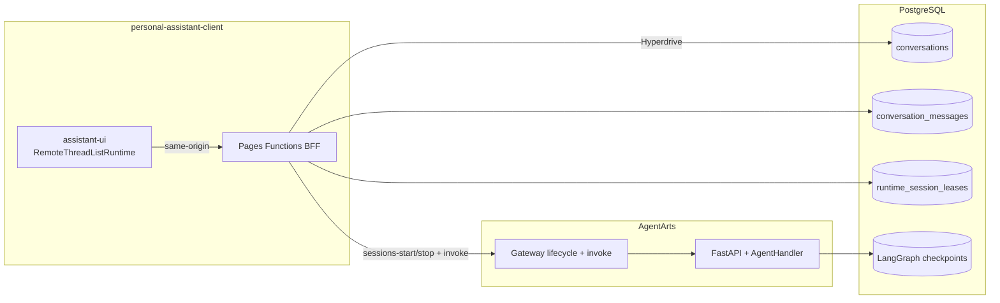
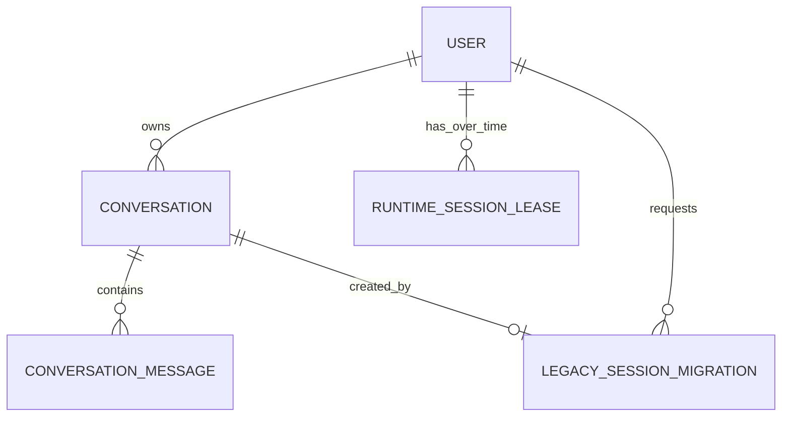
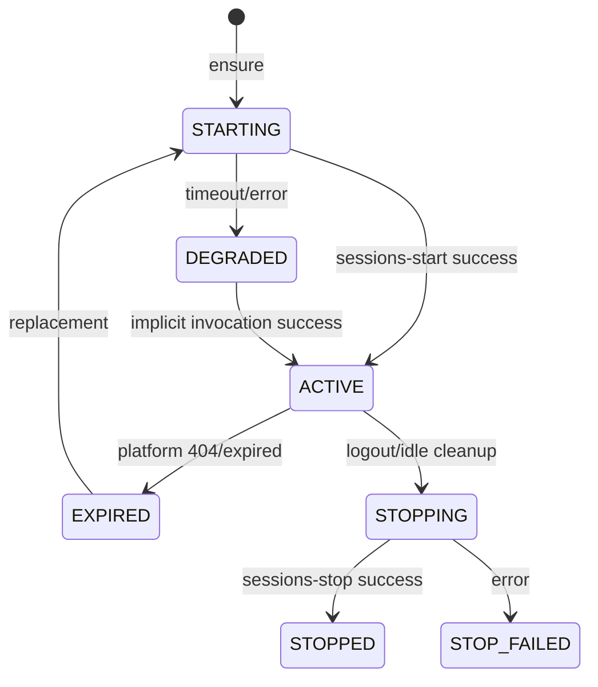

# Implementation Plan — Feature 14: Multi-Conversation Runtime Pre-warm

> 状态：Human Approval Required  
> Visual baseline：`personal-assistant-client/preview/feature-14/index.html`

## 0. Issue Evaluation

| 维度 | 结果 | 说明 |
|------|------|------|
| Staleness | ✅ | Feature 13、Inbound Identity、PostgreSQL 与 durable Checkpointer 已存在 |
| Feasibility | ✅ | assistant-ui remote runtime、Pages Functions Hyperdrive 与 AgentArts lifecycle contract 均有明确实现路径 |
| Completeness | ✅ | Issue 已冻结 identity/cardinality、failure fallback、migration 与 AC |
| Impact Scope | ⚠️ | 跨 Client/BFF、Service、PostgreSQL、Cloudflare 与 E2E；需分阶段发布 |

**判定：ACCEPT。**

## 1. Integrated architecture

核心选择：将 Lifecycle/Conversation BFF 部署在 Cloudflare Pages Functions，而非
AgentArts Runtime 内。原因是 `sessions-start` 是被预热 Runtime 的外部 lifecycle
入口；若 ensure endpoint 自身位于该 Runtime，会形成“先启动才能预热”的循环依赖。
Pages Functions 通过 Hyperdrive 访问现有 PostgreSQL，以 transaction/advisory lock
实现跨 Tab single-flight。



### Stable invariants

1. `conversation_id` 是 durable product identity。
2. `thread_id = "{user_id}:{conversation_id}"`，Conversation 与 thread 1:1。
3. `runtime_session_id` 是 user-scoped replaceable lease；不同 User 不共享。
4. UI history 来自 `conversation_messages`，Checkpoint 不作为日常分页 API。
5. Sandbox Session 仍为 Conversation-scoped lazy resource，不在本 Feature 创建。

## 2. AgentArts API spike conclusion

基于官方 PDF v03（2026-06-11）：

- `POST /runtimes/{runtime_name}/sessions-start`
  - request：`Authorization`，无 body
  - response：`{code, message, data: {session_id}}`
  - Session ID 最长 64，仅字母、数字、`-`、`_`
- Execute：`X-Hw-Agentarts-Session-Id` 必选
- `POST /runtimes/{runtime_name}/sessions-stop`
  - `Authorization` + `X-Hw-Agentarts-Session-Id`

Start section 的 request example 误写为 `sessions-stop`；实现以 URI/schema 为准。
以下平台行为不能从文档保证，作为 deployment spike/feature flag gate：重复 start
行为、ready semantics、idle timeout/配额、stop 后 ID reuse、真实 latency。

## 3. API contract

### Browser same-origin API

| Method | Path | Contract |
|--------|------|----------|
| GET | `/api/conversations?after=&limit=&status=` | cursor list |
| POST | `/api/conversations` | `Idempotency-Key`; optional title |
| GET | `/api/conversations/{id}` | ownership-scoped metadata |
| PATCH | `/api/conversations/{id}` | rename/archive/unarchive + optimistic version |
| DELETE | `/api/conversations/{id}` | idempotent soft delete |
| GET | `/api/conversations/{id}/messages?before=&limit=` | normalized history |
| POST | `/api/runtime-session/ensure` | `warming|ready|degraded` |
| DELETE | `/api/runtime-session` | guarded stop |
| POST | `/api/legacy-conversation-migrations` | legacy Session hint |
| POST | `/invocations` | streaming invocation proxy |

Invocation body：

```json
{
  "conversation_id": "018f...",
  "client_message_id": "018f...",
  "message": "你好",
  "stream": true
}
```

BFF 验证 JWT、ownership 与 lease，注入 Runtime Session header。FastAPI 再做
ownership defense-in-depth，并只从可信 `user_id + conversation_id` 派生 thread。

### Normalized message DTO

```json
{
  "id": "018f...",
  "parent_id": null,
  "role": "user",
  "content": [{"type": "text", "text": "你好"}],
  "sequence": 1,
  "status": "complete",
  "created_at": "2026-06-22T00:00:00Z"
}
```

`content` versioned JSON parts 支持未来 attachment/tool UI；本期只接受 text。

## 4. Database design



关键 constraint：

- active Runtime lease 对 `user_id` partial unique
- `runtime_session_id` global unique
- Conversation create idempotency unique per User
- message identity/sequence unique per Conversation
- ownership query index `(user_id, id)`
- BFF DB role 不可读取 Checkpoint tables

## 5. Runtime state machine



Ensure 使用 PostgreSQL advisory lock + transaction 中的二次检查。start 外部调用不能
长期持有普通 row lock；实现采用短 lease ownership token：插入 `starting` row 后
提交，owner 调用平台，其他请求轮询 bounded interval。owner crash 的 stale
`starting` lease 可按 timeout takeover。任何竞争 loser best-effort stop 多余 Session。

## 6. Message consistency

1. BFF 以 `client_message_id` 幂等写入 user message（`pending`）。
2. BFF 转发 invocation；FastAPI/Checkpoint 是 Agent execution truth。
3. BFF tee SSE，累积 assistant text；收到 `done` 后写 trusted assistant message，
   并将 user message 标记 `complete`。
4. upstream error/断流将 user message标记 `failed|uncertain`，不伪造 assistant。
5. reconciliation job 通过 LangGraph public state API 修复 uncertain turn。

该设计不宣称跨 LLM/Checkpoint/BFF 的 distributed transaction；通过幂等 identity、
明确 status 与 reconciliation 达到 eventual consistency。

## 7. assistant-ui integration

- `useRemoteThreadListRuntime` 是 Conversation selection/list authority。
- 内层每 thread 使用现有 `useLocalRuntime(chatAdapter)`。
- `RemoteThreadListAdapter.remoteId = conversation_id`。
- `ThreadHistoryAdapter.load()` 恢复 exported repository。
- Provider 首次 commit 必须渲染 children；skeleton/error 在 always-mounted Thread
  内展示。
- approved preview 的 sidebar/topbar/composer layout 迁入 React/Tailwind。

## 8. Legacy migration

1. Client 首次登录读取旧 `agentarts-session-id`，只作为 hint 提交一次。
2. BFF 绑定 verified User 后调用 Service internal migration。
3. Service 派生旧 `thread_id = user_id:legacy_session_id`，读取 public state API。
4. Human/AI text messages 以 deterministic identity 幂等投影。
5. 成功后写 marker并删除 localStorage key；失败保留原 key/Checkpoint供重试。
6. 正常 list/history 不查询 Checkpoint。

## 9. Ordered implementation

### Phase A — Schema and Service

1. SQL migration、DB pool/repository
2. invocation contract + ownership
3. stable conversation thread_id + per-thread lock
4. legacy migration/reconciliation primitives
5. Service unit/integration tests

### Phase B — BFF

1. JWT verification and Hyperdrive connector
2. Conversation CRUD/history
3. runtime ensure/stop state machine
4. ownership-aware invocation/SSE persistence
5. Functions tests and feature flags

### Phase C — Client

1. remote thread adapters/history
2. approved sidebar/UI states
3. runtime status and New Chat
4. legacy migration UX
5. responsive/component tests

### Phase D — E2E and rollout

1. multi-Conversation/history tests
2. multi-Tab/multi-User concurrency/security
3. pre-warm success/fallback/latency
4. canary deploy with pre-warm disabled
5. enable pre-warm; observe; remove legacy reset path

## 10. File ownership matrix

| Domain | Paths |
|--------|-------|
| meta-dev | architecture/specs and this issue directory |
| service-dev | `personal-assistant-service/app/{main,agent_handler,database,conversations}.py`, migrations, tests |
| client-dev | React UI/adapters, `functions/**`, `wrangler.toml`, tests |
| infra-dev | Hyperdrive/RDS role/network runbook and validation |
| e2e-tester | `personal-assistant-e2e/tests/features/feature-14-*` |

## 11. Acceptance/test matrix

全部 AC1–AC10 由 `test-plan.md` 覆盖。Merge gate：

- Service Ruff + pytest
- Client Vitest + build + Functions tests
- E2E 14-01..14-12
- `gitnexus detect-changes`
- secret scan
- production spike confirms start/stop behavior and latency

## 12. Risks and mitigations

| Risk | Severity | Mitigation |
|------|:--------:|------------|
| cross-user data leak | Critical | BFF JWT verify + user-scoped SQL + FastAPI ownership defense |
| duplicate Runtime sessions | High | partial unique + starting lease owner/takeover + loser stop |
| pre-warm/invoke race | High | bounded wait + implicit UUID fallback |
| read model/checkpoint drift | High | stable message IDs/status + reconciliation |
| same thread concurrent writes | High | per-thread serialization |
| Hyperdrive/RDS network failure | High | degraded UI; existing invocation fallback; feature flag |
| stop kills active request | Medium | active-run/last-used guard + closing state |
| official API example typo | Medium | URI/schema tests; deployment spike |

## 13. Four-Question Gate

| Gate | Result |
|------|:------:|
| Best practice | Yes — durable product identity、replaceable compute lease、defense in depth |
| Industry standard | Yes — BFF、PostgreSQL read model、cursor pagination、idempotency |
| Conventional | Yes — assistant-ui remote threads、REST resources、lease state machine |
| Modern | Yes — Cloudflare Hyperdrive、React 19、LangGraph durable execution |

## 14. Human approval gate

正式 implementation 前需确认本 Plan，尤其是：

1. Cloudflare Pages Functions + Hyperdrive 作为 BFF deployment boundary；
2. soft-delete + eventual Checkpoint cleanup；
3. assistant message 由 BFF 在 SSE completion boundary 写 read model；
4. rollout 先关闭 pre-warm，验证后再启用。
