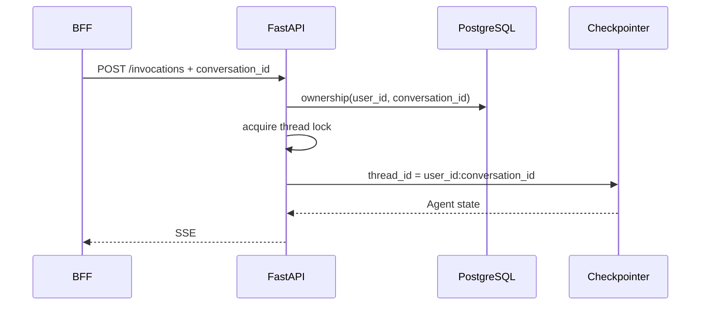

# Service Implementation Plan — Feature 14

## 1. API 与 data model

### Invocation contract

`POST /invocations` request 新增：

| 字段 | 类型 | 约束 |
|------|------|------|
| `conversation_id` | UUID string | 必选；必须属于 authenticated user |
| `client_message_id` | UUID string | 必选；Conversation 内幂等 |
| `message` | string | 非空 |
| `stream` | boolean | 保持现有 contract |

FastAPI 不再用 Runtime Session header 构造 `thread_id`。`AgentHandler` 接收
`conversation_id`，固定派生 `thread_id = f"{user_id}:{conversation_id}"`。

### PostgreSQL schema

使用 SQLAlchemy 2.x metadata + Alembic versioned migration（psycopg 3）新增：

- `conversations`：`id`, `user_id`, `title`, `status`, timestamps,
  `idempotency_key`, `version`
- `conversation_messages`：`id`, `conversation_id`, `parent_id`, `role`,
  `content JSONB`, `sequence`, `status`, timestamps
- `runtime_session_leases`：`id`, `user_id`, `runtime_session_id`, `status`,
  `source`, latency/timestamps/failure fields
- `legacy_session_migrations`：`user_id`, `legacy_session_hash`,
  `conversation_id`, `status`, timestamps/error

Constraints：

- partial unique active Runtime lease per `user_id`
- global unique `runtime_session_id`
- unique `(conversation_id, sequence)` 与 `(conversation_id, id)`
- unique `(user_id, idempotency_key)` for Conversation create
- status CHECK constraints；所有 ownership index 以 `user_id` 开头

## 2. Service tasks

1. 新增 `app/database.py`，管理 psycopg async pool、transaction helper 与 migration。
2. 新增 Conversation repository，仅暴露 ownership、message append、legacy migration
   所需方法。
3. 修改 `InvocationRequest` 与 `/invocations`：
   - 校验 UUID；
   - `(user_id, conversation_id)` ownership check；
   - 以 `conversation_id` 调用 AgentHandler；
   - 保留 Runtime Session header extraction，仅用于 logging/correlation。
4. 修改 `AgentHandler._build_config(user_id, conversation_id)` 并增加 per-thread
   lock registry，串行化同 Conversation 的 active invocation。
5. 提供仅供 BFF 调用的 legacy migration route：
   `POST /invocations/internal/legacy-conversation-migrations`。请求携带 legacy Session
   hint；Service 以可信 user 派生旧 `thread_id`，使用 LangGraph public state API
   读取最新 state，幂等投影 Human/AI messages。
6. Conversation delete 的 Checkpoint 清理采用 background/reconciliation workflow；
   v1 默认 soft-delete metadata，UI 立即隐藏，清理失败可重试。
7. 增加 structured events：
   `conversation.invocation.started/completed`,
   `conversation.migration.completed/failed`,
   `thread.lock.waited`。

## 3. 文件

| 文件 | 动作 |
|------|------|
| `personal-assistant-service/app/main.py` | 修改 request contract、ownership 与 migration route |
| `personal-assistant-service/app/agent_handler.py` | 修改 thread identity、per-thread serialization |
| `personal-assistant-service/app/database.py` | 新增 |
| `personal-assistant-service/app/conversations.py` | 新增 repository/service |
| `personal-assistant-service/migrations/0001_feature_14_conversations.sql` | 新增 |
| `personal-assistant-service/app/settings.py` | 增加 DB pool/migration settings |
| `personal-assistant-service/.env.example` | 同步 settings |

## 4. Backend tests

- schema constraints 与 migration 幂等
- ownership：其他 user 返回 404
- 同 Conversation 跨 Tab invocation 被串行化
- 不同 Conversation 可并行且 thread_id 隔离
- Runtime Session replacement 不改变 thread_id
- legacy migration 重试、去重、过滤 Tool/internal message
- migration failure 不写 marker、不删除 Checkpoint
- `/invocations` 缺失/非法 `conversation_id` 与 `client_message_id`

