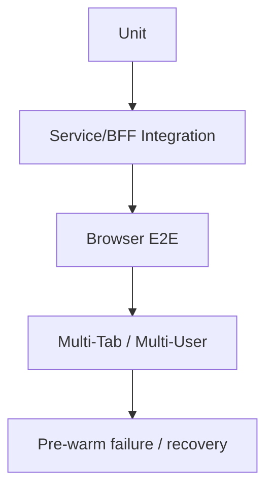

# Test Plan — Feature 14

## 1. Backend

- DB migration/constraint tests
- Conversation ownership negative tests
- stable `thread_id = user_id:conversation_id`
- per-thread serialization and cross-thread concurrency
- legacy checkpoint migration/backfill
- Runtime replacement does not affect Checkpoint recovery

## 2. Frontend/BFF

- JWT validation：missing/expired/wrong issuer/wrong audience
- list/create/fetch/rename/archive/delete + cursor pagination
- ensure single-flight under concurrent requests
- sessions-start timeout/401/500 → degraded
- implicit fallback records replacement lease after successful invocation
- SSE assistant message is stored only by trusted BFF completion path
- history hydration loading/error/retry and stale-response cancellation
- responsive sidebar and approved preview parity

## 3. E2E

File: `personal-assistant-e2e/tests/features/feature-14-multi-session-runtime-prewarm/`

| ID | Scenario |
|----|----------|
| E2E-14-01 | create A → send → create B → send → switch A |
| E2E-14-02 | refresh restores selected Conversation and visible history |
| E2E-14-03 | delayed A history then switch B; no cross-thread injection |
| E2E-14-04 | history API failure shows retry, not empty welcome |
| E2E-14-05 | pre-warm success reduces measured first-message critical path |
| E2E-14-06 | pre-warm timeout/error still permits invocation fallback |
| E2E-14-07 | two tabs ensure concurrently create at most one active lease |
| E2E-14-08 | two tabs same Conversation obey serialization policy |
| E2E-14-09 | two users cannot read/mutate each other’s resources |
| E2E-14-10 | delete Conversation keeps shared user Runtime active |
| E2E-14-11 | archive/unarchive and title generation |
| E2E-14-12 | legacy checkpoint is backfilled once and original remains intact |

## 4. Commands

- Service: `uv run ruff check . && uv run ruff format --check . && uv run pytest tests/`
- Client: `npm run test && npm run build`
- Functions: `npm run test`
- E2E: `pytest personal-assistant-e2e/ -m feature -v`
- GitNexus: `npx gitnexus detect-changes --scope all`

