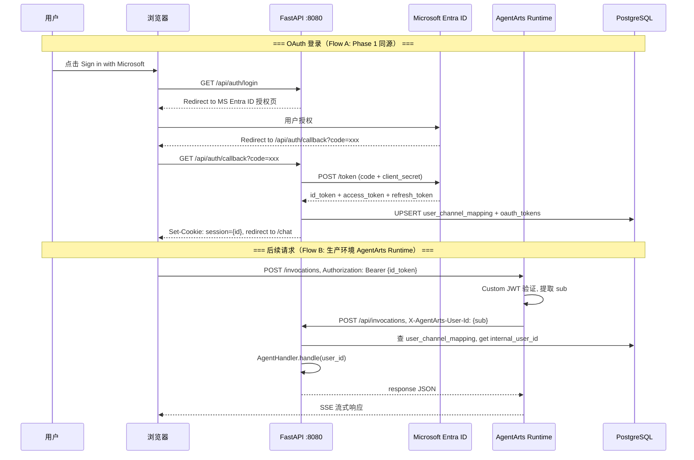
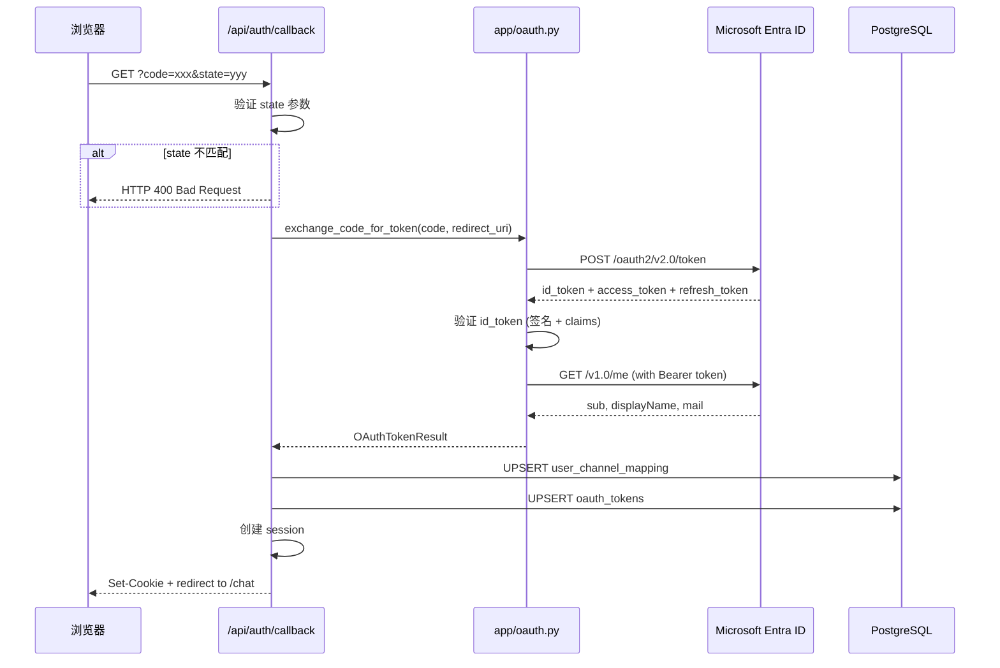
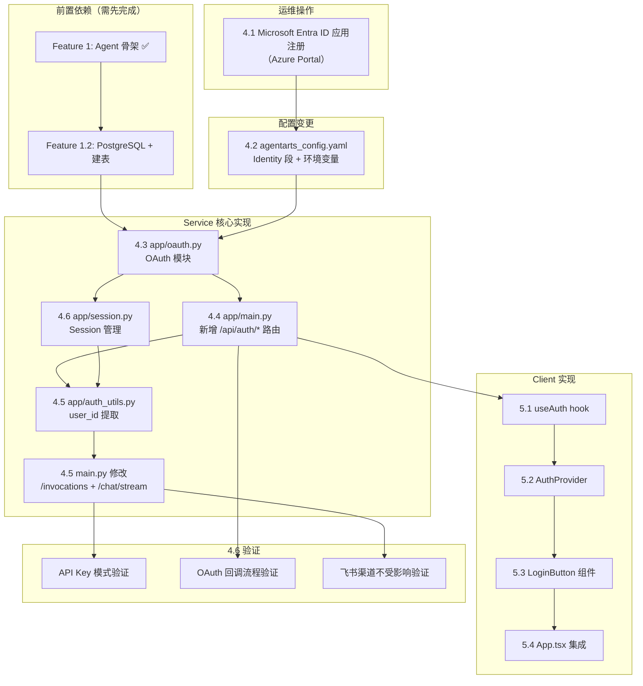
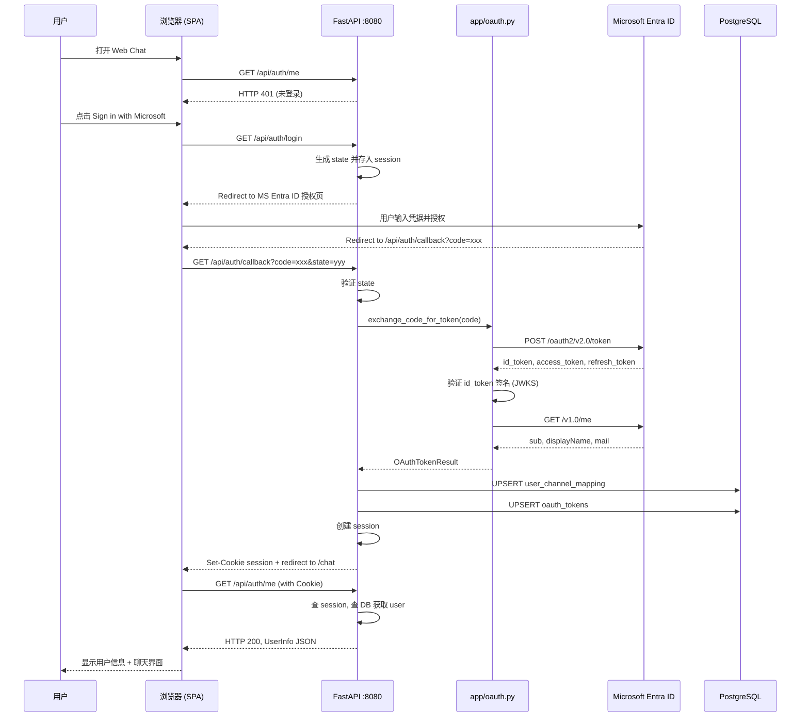
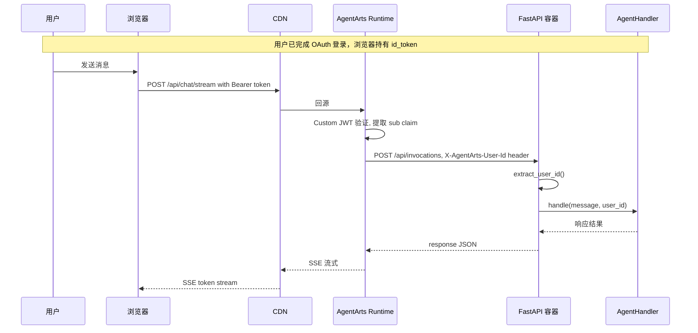
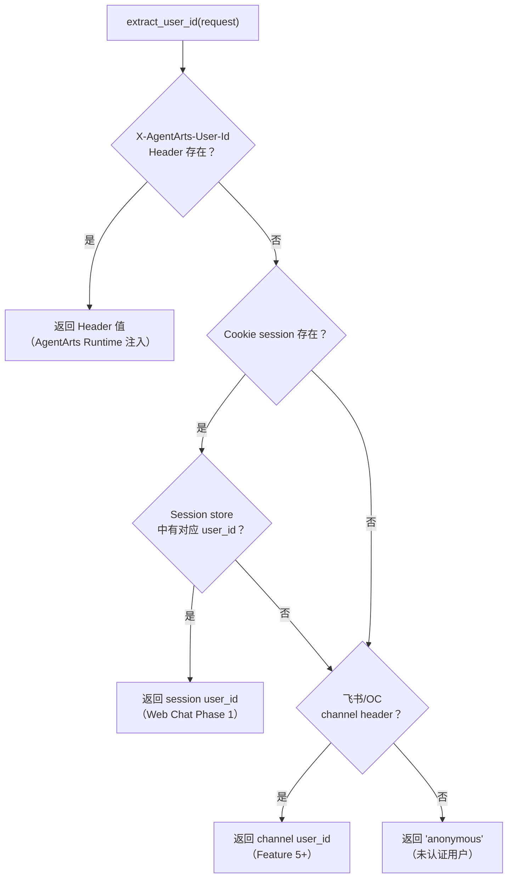

# Feature 4: Inbound Identity 认证 — Implementation Plan

> 版本：v1.1 | 日期：2026-06-08 | 状态：Ready for Implementation

---

## 0. Issue Evaluation

| 维度 | 结果 | 说明 |
|------|------|------|
| Staleness | ✅ | 引用的架构文档（`overall_architecture.md` #3/#4/#9、`backend_architecture.md` #2/#3、`frontend_architecture.md` #2.1）均存在且内容与 Issue 描述匹配。ADR-007 已 Accepted 并确认 Microsoft Entra ID |
| Feasibility | ✅ | 实现路径明确：OAuth Code Exchange（`app/oauth.py`）→ FastAPI `/auth/callback` → Cookie/Header 身份注入 → `agentarts_config.yaml` Identity 配置。`httpx` 已在 `pyproject.toml` 中可用 |
| ADR 兼容性 | ✅ | ADR-007（Microsoft Entra ID）— 已遵循；ADR-004（FastAPI）— 通过 FastAPI 路由实现；ADR-012（PostgreSQL）— 使用其定义的表结构；无冲突 |
| Completeness | ✅ | Issue 包含 6 个子任务（4.1–4.6），每个有 checkbox 验收标准。验证方式覆盖 API Key、OAuth 回调、飞书不受影响三个维度 |
| Impact Scope | ✅ | Service 侧：`app/oauth.py`（新文件）、`app/main.py`（新增路由）、`agentarts_config.yaml`（新增 identity 段）；Client 侧：`LoginPlaceholder` → 真实登录按钮、Auth context；依赖 Feature 1.2 提供的数据库表 |

**判定：ACCEPT** → 继续编写 Implementation Plan。

> ⚠️ **风险提示**：依赖 Feature 1.2（PostgreSQL）的 `user_channel_mapping` + `oauth_tokens` 表。如果 Feature 1.2 尚未完成，4.3 OAuth 模块中的 token 持久化逻辑需以 Feature 1.2 完成为前置条件。OAuth 回调的基础流程（code 交换 + Cookie 设置）可在无数据库的情况下先行实现和验证。

---

## 1. Issue Summary

| 属性 | 值 |
|------|-----|
| **类型** | Feature |
| **目标** | 配置 AgentArts Identity 的 Inbound 认证（Microsoft Entra ID Custom JWT + API Key），使用户身份在 Request Header 中自动注入 |
| **架构文档** | `architecture/overall_architecture.md` #3 认证流、#4 Identity 设计、#9 项目结构；`architecture/backend_architecture.md` #2 路由设计、#3 Agent 处理逻辑；`architecture/frontend_architecture.md` #2.1 Web Chat 登录流程 |
| **ADR 引用** | [ADR-007](../ADR/ADR-007-identity-provider.md) — Microsoft Entra ID 选型；[ADR-012](../ADR/ADR-012-database-postgresql.md) — PostgreSQL 表结构 |
| **前置依赖** | Feature 1（Agent 骨架 ✅）、Feature 1.2（PostgreSQL，提供 `user_channel_mapping` + `oauth_tokens` 表）|
| **被依赖** | Feature 5（Web Chat 完整登录体验）、Feature 6-8（Outbound 工具，需要 user_id） |

---

## 2. Architecture Context

### 2.1 Inbound 认证数据流

Feature 4 实现两条身份注入路径，共享同一个 `/api/auth/callback` 端点：



### 2.2 两种部署模式的认证差异

| 维度 | Phase 1（同源部署） | 生产（AgentArts Runtime） |
|------|---------------------|--------------------------|
| **JWT 验证方** | FastAPI 自行验证 Cookie | AgentArts Runtime 验证 JWT |
| **身份传递** | Cookie `session` → 查 DB | `X-AgentArts-User-Id` Header |
| **`agentarts_config.yaml`** | `key_auth`（跳过平台层验证，直连 FastAPI） | `authorizer_type: CUSTOM_JWT` |
| **前端凭证管理** | HTTP-only Cookie，前端无感知 | id_token 需在前端存储（或依靠 Cookie → 服务端代理） |

Phase 1 模式下，浏览器直连 FastAPI（不经过 AgentArts Runtime），因此无需 `CUSTOM_JWT` 验证。AgentArts Runtime 的 `CUSTOM_JWT` 配置仅供生产部署使用。Feature 4 **同时配置两种模式**：`CUSTOM_JWT`（生产）+ `KEY_AUTH`（开发/直连）。

---

## 3. API Changes

### 3.1 新增路由

| 路由 | 方法 | 用途 | 认证要求 |
|------|------|------|----------|
| `/api/auth/login` | GET | 重定向至 Microsoft Entra ID 授权页 | 无 |
| `/api/auth/callback` | GET | OAuth 回调：code → token → Cookie → 302 | 无 |
| `/api/auth/me` | GET | 返回当前登录用户信息（读 Cookie/Header） | Cookie 或 Header |
| `/api/auth/logout` | POST | 清除 Cookie | 无 |

> **路由前缀说明**：本 plan 使用 `/api/auth/*` 前缀，与现有 `/api/ping`、`/api/invocations`、`/api/chat/stream` 保持一致。`backend_architecture.md` §2 中路由定义为 `/auth/callback`（无 `/api` 前缀），这是早期设计稿，**应在本 Feature 实施后同步更新 `backend_architecture.md` §2**，将所有路由统一为 `/api/*` 前缀格式。同理，`frontend_architecture.md` §2.1 中新增的路由（`/api/auth/login`、`/api/auth/me`、`/api/auth/logout`）也应在后续补充到该架构文档中。

### 3.2 Request/Response Models

```python
# app/schemas/auth.py
from pydantic import BaseModel

class UserInfoResponse(BaseModel):
    """GET /api/auth/me 响应"""
    user_id: str           # internal user_id（如 "entra-<sub>"）
    display_name: str      # Microsoft 显示名
    email: str             # Microsoft 邮箱
    channel: str           # "entra_id"
    is_authenticated: bool # 始终为 True（未登录返回 401）

class AuthErrorResponse(BaseModel):
    """OAuth 错误响应"""
    error: str
    error_description: str | None = None
```

### 3.3 `agentarts_config.yaml` Identity 段

在现有 `runtime:` 下新增 `identity_configuration` 段（完整配置）：

```yaml
runtime:
  # ... 现有 invoke_config / network_config / observability 等保持不变 ...

  identity_configuration:
    # ── Inbound: Custom JWT (Microsoft Entra ID) ──
    authorizer_type: CUSTOM_JWT
    authorizer_configuration:
      custom_jwt:
        discovery_url: https://login.microsoftonline.com/${MS_ENTRA_TENANT_ID}/v2.0/.well-known/openid-configuration
        allowed_audience:
          - "${MS_ENTRA_CLIENT_ID}"
        allowed_clients:
          - "${MS_ENTRA_CLIENT_ID}"
        allowed_scopes:
          - "openid"
          - "profile"
          - "email"
      # ── Inbound: API Key (开发调试) ──
      key_auth:
        api_keys:
          - "opencode-dev-api-key-2026"
```

> **`allowed_scopes` 说明**：AgentArts Runtime 的 `allowed_scopes` 用于验证 JWT 中的 `scp` claim。`offline_access` scope 不在 id_token 的 `scp` claim 中出现（它仅在 token 请求时用于获取 refresh_token），因此 **不需要** 加入 Runtime 配置的 `allowed_scopes`。但 Microsoft Entra ID 应用注册（§4.1 步骤 5）**必须**勾选 `offline_access` 权限，否则 token 交换时不会返回 `refresh_token`。

> 环境变量 `${MS_ENTRA_TENANT_ID}`、`${MS_ENTRA_CLIENT_ID}` 等需在 `environment_variables` 段中声明。

### 3.4 环境变量新增

```yaml
environment_variables:
  # ... 现有 MAAS_API_KEY 等保持不变 ...
  - key: MS_ENTRA_CLIENT_ID
    value: "<Microsoft Entra ID Application (client) ID>"
  - key: MS_ENTRA_CLIENT_SECRET
    value: "<Microsoft Entra ID Client Secret>"
  - key: MS_ENTRA_TENANT_ID
    value: "<Azure AD Tenant ID>"
  - key: MS_ENTRA_REDIRECT_URI
    value: "https://<runtime-domain>/api/auth/callback"
  - key: SESSION_SECRET
    value: "<随机生成 64 字符密钥>"
```

> **生成 SESSION_SECRET**：`python -c "import secrets; print(secrets.token_urlsafe(48))"`

### 3.5 Client TypeScript 类型

```typescript
// src/types/auth.ts（新增文件）
export interface UserInfo {
  user_id: string;
  display_name: string;
  email: string;
  channel: "entra_id";
  is_authenticated: boolean;
}
```

---

## 4. Service Tasks

### 4.1 Microsoft Entra ID 应用注册（运维操作）

> ⚠️ 这是 Azure Portal 手动作业，不产生代码。完成后方可继续 4.2-4.6。

**操作步骤**：
1. 登录 [Azure Portal](https://portal.azure.com/) → Microsoft Entra ID → 应用注册 → 新注册
2. 配置：
   - **名称**：`personal-assistant-web-chat`
   - **支持的帐户类型**：仅此组织目录中的帐户（单租户）
   - **重定向 URI**：Web → `http://localhost:8080/api/auth/callback`（开发）/ `https://<prod-domain>/api/auth/callback`（生产）
3. 注册完成后记录：
   - `Application (client) ID` → 用作 `MS_ENTRA_CLIENT_ID`
   - `Directory (tenant) ID` → 用作 `MS_ENTRA_TENANT_ID`
4. 证书和密码 → 新建客户端密码 → 记录 → 用作 `MS_ENTRA_CLIENT_SECRET`
5. API 权限 → 添加权限 → Microsoft Graph → 委托的权限：
   - `openid`（默认已选）
   - `profile`（默认已选）
   - `email`（默认已选）
   - `offline_access`（获取 refresh_token）

**产出物**：三个机密值（`MS_ENTRA_CLIENT_ID`、`MS_ENTRA_CLIENT_SECRET`、`MS_ENTRA_TENANT_ID`），写入 `.env` 文件（不提交 Git）。

---

### 4.2 Identity 配置（`agentarts_config.yaml` + 环境变量）

**文件**：`personal-assistant-service/.agentarts_config.yaml`

**变更**：在 `runtime:` 块中新增 `identity_configuration` 段（内容见 §3.3）。同时在 `environment_variables` 中添加 §3.4 的 5 个新变量。

**验证**：
```bash
# 检查 YAML 语法
python -c "import yaml; yaml.safe_load(open('.agentarts_config.yaml'))"
# 确认 identity_configuration 段存在
python -c "
import yaml
cfg = yaml.safe_load(open('.agentarts_config.yaml'))
assert 'identity_configuration' in cfg['agents']['personal-assistant']['runtime']
print('OK')
"
```

---

### 4.3 OAuth 模块（`app/oauth.py`）

**新文件**：`personal-assistant-service/app/oauth.py`

**核心职责**：
- 封装 Microsoft Entra ID OAuth 2.0 Authorization Code Flow
- 使用 `httpx`（已在依赖中）进行异步 HTTP 调用
- 可选的 `msal` 库集成（推荐，减少手写 OAuth 逻辑）

**函数签名设计**：

```python
# app/oauth.py

import os
import hashlib
import secrets
from dataclasses import dataclass
from urllib.parse import urlencode

import httpx

# ── 常量 ──
MS_AUTHORITY = "https://login.microsoftonline.com"
MS_SCOPE = "openid profile email offline_access"


@dataclass
class OAuthTokenResult:
    """OAuth code 交换结果"""
    id_token: str
    access_token: str
    refresh_token: str | None
    expires_in: int
    user_sub: str        # Microsoft Entra ID subject (唯一用户标识)
    display_name: str
    email: str


def get_authorization_url(redirect_uri: str | None = None, state: str | None = None) -> str:
    """生成 Microsoft Entra ID 授权 URL。
    
    redirect_uri 默认从环境变量 MS_ENTRA_REDIRECT_URI 读取。
    前端调用此函数（或直接访问 /api/auth/login），返回 302 到 Microsoft。
    """
    ...


async def exchange_code_for_token(code: str, redirect_uri: str) -> OAuthTokenResult:
    """用 authorization code 向 Microsoft token endpoint 交换 token。
    
    1. POST https://login.microsoftonline.com/{tenant}/oauth2/v2.0/token
       body: grant_type=authorization_code&code={code}&redirect_uri={...}
             &client_id={...}&client_secret={...}
    2. 验证 id_token 签名和 claims（aud, iss, exp, nonce）
    3. 调 Microsoft Graph /me 获取用户 display_name, email
    4. 返回 OAuthTokenResult
    """
    ...


def generate_state() -> str:
    """生成 OAuth state 参数（防 CSRF）。"""
    return secrets.token_urlsafe(32)


def internal_user_id_from_sub(sub: str) -> str:
    """从 Microsoft Entra ID subject 派生出 internal_user_id。
    
    格式：entra-<sub>（如 entra-abcdef1234567890）
    """
    return f"entra-{sub}"
```

**实现要点**：

| 步骤 | 说明 | 关键注意事项 |
|------|------|-------------|
| **Token 交换** | POST `{MS_AUTHORITY}/{tenant}/oauth2/v2.0/token` | `client_secret` 只在服务端使用，绝不出现在浏览器 |
| **id_token 验证** | 验证 JWT 签名（从 OIDC discovery 获取 JWKS）、验证 `aud`/`iss`/`exp`/`nonce` | 不验证会导致 token 伪造风险 |
| **获取用户信息** | GET `https://graph.microsoft.com/v1.0/me`，带 `Authorization: Bearer {access_token}` | Microsoft Graph `/me` 是标准的用户信息端点 |
| **State 验证** | 授权前生成随机 state → 存 session → 回调时比对 | 防 CSRF 攻击 |
| **PKCE** | 必须启用 PKCE（`code_verifier` + `code_challenge`，S256），符合 OAuth 2.0 安全最佳实践（RFC 7636） | 即使使用 client_secret，PKCE 增加一层防护，防止 authorization code 拦截攻击 |

**依赖**：
- `httpx>=0.28.0` — 已在 `pyproject.toml` 中
- `msal>=1.31.0` — **推荐添加**（Microsoft 官方 Python OAuth 库，减少手写 token 交换和验证逻辑）
- `python-jose[cryptography]` 或 `PyJWT>=2.0` — JWT 验证（如果用 `msal`，则 `msal` 内部处理）

**异步适配说明**：`msal` 库底层使用同步的 `requests` 库。在 FastAPI async 路由中使用时，**必须**将所有 `msal` 的 HTTP 调用用 `asyncio.to_thread()` 包装，避免阻塞 event loop：

```python
import asyncio

# 方案 A: 使用 msal + asyncio.to_thread()（推荐，减少手写逻辑）
result = await asyncio.to_thread(
    msal_app.acquire_token_by_authorization_code,
    code, scopes=MS_SCOPE, redirect_uri=redirect_uri
)

# 方案 B: 直接用 httpx 手写 token 交换（无需 to_thread，已异步）
async with httpx.AsyncClient() as client:
    resp = await client.post(token_url, data={...})
    result = resp.json()
```

> 推荐**方案 A**（`msal` + `asyncio.to_thread()`）：`msal` 处理了 token 缓存、自动刷新、JWT 验证等细节，避免手写容易出错的安全代码。

**`pyproject.toml` 依赖更新**：
```toml
dependencies = [
    # ... 现有 ...
    "msal>=1.31.0",
]
```

**文件结构变更后**：
```
app/
├── oauth.py          ← 新增
├── schemas/
│   └── auth.py       ← 新增（Pydantic models）
├── main.py           ← 修改：新增 /api/auth/* 路由
├── agent_handler.py  ← 修改：user_id 提取逻辑增强
└── ...
```

---

### 4.4 路由（`GET /api/auth/callback`）

**文件**：`personal-assistant-service/app/main.py`

**新增路由**：

```python
# ── OAuth 认证路由 ──

@app.get("/api/auth/login")
async def auth_login(request: Request):
    """发起 Microsoft Entra ID OAuth 登录流程。
    
    1. 如果用户已有有效 session cookie → 302 到 /chat（避免重复登录）
    2. 否则：生成 state → 存 session → 302 到 Microsoft 授权页。
    
    redirect_uri 从环境变量 MS_ENTRA_REDIRECT_URI 读取（§3.4）。
    """
    ...

@app.get("/api/auth/callback")
async def auth_callback(code: str, state: str, request: Request):
    """OAuth 回调端点。
    
    1. 验证 state（防 CSRF）
    2. exchange_code_for_token(code, redirect_uri)
    3. UPSERT user_channel_mapping（Write internal_user_id ↔ entra_id sub）
    4. UPSERT oauth_tokens（存 refresh_token，用于后续 Outbound 工具）
    5. Set session cookie → 302 到 /chat
    """
    ...

@app.get("/api/auth/me")
async def auth_me(request: Request):
    """返回当前登录用户信息。
    
    从 Cookie 或 X-AgentArts-User-Id Header 提取 user_id，
    查 DB 获取用户详情后返回 UserInfoResponse。
    """
    ...

@app.post("/api/auth/logout")
async def auth_logout(request: Request):
    """登出：清除 Cookie。"""
    ...
```

**回调处理流程**（详细）：



**关键决策：Cookie vs JWT 前端持有**

| 方案 | Cookie（Phase 1 推荐） | Bearer Token（前端持有）|
|------|----------------------|------------------------|
| **实现复杂度** | 低：服务端 Set-Cookie，浏览器自动发送 | 中：前端需存储 token、附加到请求 |
| **安全性** | 高：HttpOnly + Secure + SameSite | 中：token 暴露给 JavaScript（XSS 风险）|
| **AgentArts Runtime 兼容** | 需直连 FastAPI（不经过 Runtime） | Runtime 可验证 JWT 后注入 Header |
| **跨域友好** | 否（需同源） | 是（但本项目用同源部署回避） |

**Feature 4 采用 Cookie 方案**（Phase 1 同源部署）。生产环境切 AgentArts Runtime 后，通过 `agentarts_config.yaml` 的 `CUSTOM_JWT` 方式验证 JWT，Runtime 注入 `X-AgentArts-User-Id` header。两种模式共存，互不冲突。

---

### 4.5 AgentHandler 身份读取

**文件**：`personal-assistant-service/app/agent_handler.py`、`personal-assistant-service/app/main.py`

**现状**：`main.py` 的 `/api/invocations` 已从 `X-AgentArts-User-Id` Header 提取 user_id。
`/api/chat/stream` 目前硬编码 `user_id="anonymous"`。

**增强逻辑**（提取为公共函数）：

```python
# app/auth_utils.py（新增）

from fastapi import Request

async def extract_user_id(request: Request) -> str:
    """多来源 user_id 提取，按优先级：
    
    1. X-AgentArts-User-Id header（AgentArts Runtime 注入 / API Key 直连）
    2. Cookie 中的 session → 查服务端 session store → 取 user_id
    3. 飞书/OfficeClaw 渠道特异性 header（后续 Feature 扩展）
    4. Fallback: "anonymous"
    """
    # Priority 1: AgentArts Runtime injected
    agent_user = request.headers.get("X-AgentArts-User-Id")
    if agent_user:
        return agent_user

    # Priority 2: Session cookie (Web Chat Phase 1)
    session_id = request.cookies.get("session")
    if session_id:
        # 查服务端 session store（内存 dict 或 Redis）
        session_data = await get_session(session_id)
        if session_data and session_data.get("user_id"):
            return session_data["user_id"]

    # Priority 3: Feishu / OfficeClaw (TODO: Feature 5)
    
    # Fallback
    return "anonymous"
```

**修改 `main.py`**：
- `/api/invocations`：用 `extract_user_id(request)` 替代直接读 Header
- `/api/chat/stream`：用 `extract_user_id(request)` 替代硬编码 `"anonymous"`

**验证**：
```bash
# 1. API Key 模式（Header 注入）
curl -X POST http://localhost:8080/api/invocations \
  -H "Content-Type: application/json" \
  -H "X-AgentArts-User-Id: dev-user" \
  -d '{"message":"hello"}'
# 期望：正常返回，AgentHandler 收到 user_id="dev-user"

# 2. 无身份
curl -X POST http://localhost:8080/api/invocations \
  -H "Content-Type: application/json" \
  -d '{"message":"hello"}'
# 期望：正常返回，AgentHandler 收到 user_id="anonymous"
```

---

### 4.6 Session 管理

**新文件**：`personal-assistant-service/app/session.py`

Feature 4 需要轻量级的服务端 session 存储，用于：
- OAuth state 参数（防 CSRF）
- 登录后 session → user_id 映射
- Cookie `session` → 身份关联

**Phase 1 方案**：内存 dict + TTL（开发阶段，无需 Redis）

```python
# app/session.py
import time
import secrets
from dataclasses import dataclass, field

@dataclass
class SessionData:
    user_id: str
    created_at: float = field(default_factory=time.time)
    oauth_state: str | None = None

# 简易 TTL dict（后续可替换为 Redis / 数据库）
_sessions: dict[str, SessionData] = {}

async def create_session(user_id: str, oauth_state: str | None = None) -> str:
    """创建新 session，返回 session_id。"""
    session_id = secrets.token_urlsafe(32)
    _sessions[session_id] = SessionData(user_id=user_id, oauth_state=oauth_state)
    return session_id

async def get_session(session_id: str) -> SessionData | None:
    """获取 session（含 TTL 检查，默认 24h）。"""
    ...

async def delete_session(session_id: str) -> None:
    """删除 session（登出时调用）。"""
    ...

async def cleanup_expired_sessions(ttl_seconds: int = 86400) -> int:
    """清理过期 session，返回清理数量。
    
    应在 FastAPI lifespan 中启动后台 asyncio task 定期调用（建议每 10 分钟）。
    """
    ...
```

> **TTL 清理说明**：`get_session()` 在读取时检查 TTL 并返回 `None`（逻辑过期），但过期 entry 不会自动从 `_sessions` dict 中移除。`cleanup_expired_sessions()` 负责物理清理，防止内存泄漏。Phase 1 内存 dict 场景下，需在 lifespan 中启动后台清理 task。切到 Redis 后利用 `EXPIRE` 自动清理，不再需要此函数。

> **循环导入约束**：`session.py` **禁止** import `auth_utils.py`（后者调用前者的 `get_session()`）。所有共享类型（如 `SessionData`）定义在 `session.py` 中，由 `auth_utils.py` 单向导入。

---

## 5. Client Tasks

### 5.1 认证状态管理

**新文件**：`personal-assistant-client/src/hooks/useAuth.ts`

```typescript
// src/hooks/useAuth.ts
export interface AuthState {
  user: UserInfo | null;
  isLoading: boolean;
  isAuthenticated: boolean;
  login: () => void;       // 跳转 /api/auth/login
  logout: () => Promise<void>; // POST /api/auth/logout
}
```

**实现逻辑**：
1. `useEffect` on mount → `GET /api/auth/me`
2. 如果 200 → 设置 user 状态，`isAuthenticated: true`
3. 如果 401 → `isAuthenticated: false`，user null
4. `login()` → `window.location.href = '/api/auth/login'`
5. `logout()` → `POST /api/auth/logout` → 清除状态 → 刷新页面

### 5.2 认证上下文提供者

**新文件**：`personal-assistant-client/src/components/AuthProvider.tsx`

```typescript
import { createContext, useContext } from "react";
import { useAuth, AuthState } from "@/hooks/useAuth";

const AuthContext = createContext<AuthState | null>(null);

export function AuthProvider({ children }: { children: ReactNode }) {
  const auth = useAuth();
  return <AuthContext.Provider value={auth}>{children}</AuthContext.Provider>;
}

export function useAuthContext() {
  const ctx = useContext(AuthContext);
  if (!ctx) throw new Error("useAuthContext must be used within AuthProvider");
  return ctx;
}
```

### 5.3 登录按钮

**修改文件**：`personal-assistant-client/src/components/LoginPlaceholder.tsx` → 替换为真实登录组件

```typescript
// src/components/LoginButton.tsx（替代 LoginPlaceholder.tsx）
import { useAuthContext } from "@/components/AuthProvider";
import { Button } from "@/components/ui/button";

export function LoginButton() {
  const { user, isAuthenticated, isLoading, login, logout } = useAuthContext();

  if (isLoading) {
    return <div className="...">加载中...</div>;
  }

  if (isAuthenticated && user) {
    return (
      <div className="flex items-center gap-2 ...">
        <span>{user.display_name}</span>
        <Button variant="ghost" size="sm" onClick={logout}>登出</Button>
      </div>
    );
  }

  return (
    <Button onClick={login} className="...">
      Sign in with Microsoft
    </Button>
  );
}
```

### 5.4 App.tsx 集成

**修改文件**：`personal-assistant-client/src/App.tsx`

```tsx
import { AuthProvider } from "@/components/AuthProvider";
import { LoginButton } from "@/components/LoginButton";

function App() {
  return (
    <AuthProvider>
      <RuntimeProvider>
        <TooltipProvider>
          <div className="flex h-dvh flex-col bg-background">
            <LoginButton />
            <div className="flex-1 min-h-0">
              <Thread />
            </div>
          </div>
        </TooltipProvider>
      </RuntimeProvider>
    </AuthProvider>
  );
}
```

### 5.5 chat-adapter 认证头

**创建或修改文件**：`personal-assistant-client/src/lib/chat-adapter.ts`

> **前置检查**：该文件由 Feature 1.1（Web Chat 前端）创建。如果文件尚不存在，需先完成 Feature 1.1 或在本 Feature 中补建基础 adapter 文件。

当前 adapter 发送请求时自动携带 Cookie（同源请求默认行为）。无需显式添加 `Authorization` header（Phase 1 Cookie 方案）。待生产环境切换 AgentArts Runtime 后再添加 Bearer token 逻辑。

---

## 6. Database Changes（Feature 1.2 提供，Feature 4 消费）

> ⚠️ 以下表结构由 **Feature 1.2** 创建。Feature 4 负责**读写**这些表。

### 6.1 `user_channel_mapping`

```sql
-- 由 Feature 1.2 创建，Feature 4 使用
CREATE TABLE user_channel_mapping (
    id               BIGSERIAL PRIMARY KEY,
    internal_user_id TEXT NOT NULL,        -- "entra-<sub>"
    channel          TEXT NOT NULL CHECK (channel IN ('entra_id', 'feishu', 'officeclaw', 'web_chat')),
    channel_user_id  TEXT NOT NULL,        -- Microsoft Entra ID "sub" claim
    created_at       TIMESTAMPTZ NOT NULL DEFAULT now(),
    updated_at       TIMESTAMPTZ NOT NULL DEFAULT now(),
    UNIQUE (internal_user_id, channel),
    UNIQUE (channel, channel_user_id)
);
```

Feature 4 在 OAuth 回调中执行：
```sql
INSERT INTO user_channel_mapping (internal_user_id, channel, channel_user_id)
VALUES ('entra-<sub>', 'entra_id', '<sub>')
ON CONFLICT (channel, channel_user_id) DO UPDATE
SET updated_at = now();
```

### 6.2 `oauth_tokens`

```sql
-- 由 Feature 1.2 创建，Feature 4 使用
CREATE TABLE oauth_tokens (
    id            BIGSERIAL PRIMARY KEY,
    mapping_id    BIGINT NOT NULL REFERENCES user_channel_mapping(id) ON DELETE CASCADE,
    provider      TEXT NOT NULL CHECK (provider IN ('microsoft_entra_id')),
    access_token  TEXT,
    refresh_token TEXT,
    expires_at    TIMESTAMPTZ,
    created_at    TIMESTAMPTZ NOT NULL DEFAULT now(),
    updated_at    TIMESTAMPTZ NOT NULL DEFAULT now()
);
```

Feature 4 在 OAuth 回调中执行：
```sql
INSERT INTO oauth_tokens (mapping_id, provider, access_token, refresh_token, expires_at)
VALUES (<mapping_id>, 'microsoft_entra_id', '<access_token>', '<refresh_token>', now() + interval '<expires_in> seconds')
ON CONFLICT ... -- 或先 DELETE 旧 token 再 INSERT
```

> **注意**：`refresh_token` 用于 Feature 6-8 的 Outbound User Federation（刷新即将过期的 access token 以调用 Microsoft 365 API）。Feature 4 阶段只需存入，无需消费。

---

## 7. Implementation Order



**顺序说明**：

| 步骤 | 可并行？ | 说明 |
|------|----------|------|
| Feature 1.2 → 4.3 | ❌ 串行 | OAuth 模块需要 `user_channel_mapping` + `oauth_tokens` 表 |
| 4.1 ‖ 4.2 ‖ Feature 1.2 | ✅ 并行 | 应用注册和配置编写不依赖代码 |
| 4.3 → 4.4 | ❌ 串行 | `/auth/callback` 调 `exchange_code_for_token()` |
| 4.4 → 4.5 | ❌ 串行 | user_id 提取依赖 `/auth/callback` 设的 Cookie |
| 4.4 → 5.x (Client) | ✅ 并行 | Client 可先用 `/api/auth/me` 的 mock 开发 |
| 5.1 → 5.2 → 5.3 → 5.4 | ❌ 串行 | hook → context → 组件 → App |

---

## 8. Test Requirements

### 8.1 Service 单元测试

| 测试对象 | 测试文件 | 测试用例 |
|----------|----------|----------|
| `get_authorization_url()` | `tests/test_oauth.py` | 生成的 URL 包含正确的 `client_id`、`redirect_uri`、`scope`、`response_type=code` |
| `exchange_code_for_token()` | `tests/test_oauth.py` | Mock Microsoft token endpoint 响应 → 返回 OAuthTokenResult；异常场景（invalid_grant、expired code）→ 抛出明确异常 |
| `extract_user_id()` | `tests/test_auth_utils.py` | Header 优先 > Cookie > anonymous；无任何身份时返回 "anonymous" |
| `/api/auth/callback` | `tests/test_main.py` | `httpx.AsyncClient` 测试：有效 code → 302 + Set-Cookie；无效 code → 400；state 不匹配 → 400 |
| `/api/auth/login` | `tests/test_main.py` | 无 Cookie → 302 到 Microsoft；已有有效 session Cookie → 302 直接到 `/chat` |
| `/api/auth/me` | `tests/test_main.py` | 带有效 Cookie → 200 + UserInfoResponse；无 Cookie → 401 |
| `/api/auth/logout` | `tests/test_main.py` | POST → Cookie 清除 |
| `/api/invocations` 身份注入 | `tests/test_main.py` | 带 `X-AgentArts-User-Id` → AgentHandler 收到正确 user_id |

### 8.2 Client 单元测试

| 测试对象 | 测试文件 | 测试用例 |
|----------|----------|----------|
| `useAuth` hook | `src/hooks/useAuth.test.ts` | `/api/auth/me` 200 → isAuthenticated=true；401 → false；login() → window.location mock |
| `LoginButton` | `src/components/LoginButton.test.tsx` | 未登录 → 显示 "Sign in with Microsoft" 按钮；已登录 → 显示用户名+登出按钮 |
| `AuthProvider` | `src/components/AuthProvider.test.tsx` | 子组件可通过 `useAuthContext()` 获取 auth state |

### 8.3 E2E 测试

| 场景 | 测试文件 | 步骤 |
|------|----------|------|
| **API Key 模式认证** | `tests/e2e/test_inbound_auth.py` | `curl -H "X-AgentArts-User-Id: dev-user" /api/invocations` → 200，Agent 正常响应 |
| **OAuth 回调流程** | `tests/e2e/test_inbound_auth.py` | 模拟 `/api/auth/callback?code=valid_mock_code&state=xxx` → 302 → Cookie 设置 → `/api/auth/me` 返回用户信息 |
| **飞书渠道不受影响** | `tests/e2e/test_inbound_auth.py` | `/feishu/webhook`（带飞书 payload）→ 不依赖 OAuth，正常工作 |
| **无身份回归** | `tests/e2e/test_inbound_auth.py` | 不带任何身份信息 → 仍然返回 200（anonymous），不崩溃 |

### 8.4 边缘场景

| 场景 | 预期行为 |
|------|----------|
| Microsoft Entra ID 返回 `error=access_denied` | `/auth/callback` 返回 400 `{"error": "access_denied"}` |
| Token 端点超时（网络故障） | `exchange_code_for_token()` 抛 `httpx.TimeoutException` → 路由返回 502 |
| OAuth code 已使用（重放攻击） | Microsoft 返回 `invalid_grant` → 路由返回 400 |
| State 参数缺失或篡改 | 路由返回 400 `{"error": "invalid_state"}` |
| `id_token` 签名无效（伪造 token） | `exchange_code_for_token()` 抛 `JWTError` → 路由返回 401 |
| Cookie 被清除后访问 `/api/auth/me` | 返回 401 |
| `X-AgentArts-User-Id` 和 Cookie 同时存在 | AgentArts Header 优先 |
| 已登录用户访问 `/api/auth/login` | 检测到有效 session cookie → 302 直接跳转 `/chat`，不重复发起 Microsoft 授权 |
| Session TTL 过期后访问 `/api/auth/me` | 返回 401，前端触发重新登录 |

---

## 9. Mermaid Diagrams

### 9.1 完整 OAuth 登录流程



### 9.2 Identity Header 注入流程（生产）



### 9.3 多来源 user_id 提取决策树



---

## 10. Key Decisions Summary

| 决策 | 选择 | 依据 |
|------|------|------|
| **OAuth 库** | `msal` (Microsoft Authentication Library) | Microsoft 官方 Python 库，处理 OAuth code exchange + JWT 验证，减少手写逻辑。工业标准 |
| **Cookie vs 前端持有 token** | HTTP-only Cookie（Phase 1） | 同源部署无跨域问题，Cookie 天然防 XSS（前端代码无法读取） |
| **JWT 验证位置** | AgentArts Runtime（生产）/ FastAPI（开发） | 生产由 Runtime 的 CUSTOM_JWT 模块验证；Phase 1 Cookie 模式跳过 Runtime |
| **Session 存储** | 内存 dict（Phase 1）→ PostgreSQL 表 / Redis（生产） | 零依赖起步，生产化路径清晰 |
| **user_id 格式** | `entra-<sub>` | 语义化前缀区分渠道；`sub` 是 Microsoft Entra ID 的唯一用户标识 |
| **`internal_user_id` 生成** | `f"entra-{sub}"` | ADR-007 确认单 IdP 场景，无需复杂 ID 映射 |
| **state 参数** | 必须，存 session | 防止 CSRF 攻击，OAuth 2.0 安全最佳实践 |
| **PKCE** | 必须启用（`code_verifier` + `code_challenge`，S256） | OAuth 2.0 安全最佳实践（RFC 7636），防 authorization code 拦截 |

---

## 11. Risk & Mitigation

| 风险 | 影响 | 缓解措施 |
|------|------|----------|
| Feature 1.2 未完成，`user_channel_mapping` 表不存在 | 4.3 OAuth 回调中 token 持久化无法实现 | OAuth 回调基础流程（code 交换 + Cookie 设置）可先行实现；token 持久化代码写好但用 `if db_available` 守卫；Feature 1.2 完成后切开关 |
| Microsoft Entra ID 租户/应用注册审批延迟 | 无法获取 client_id/secret，阻塞验证 | 开发阶段用 API Key 模式（`key_auth`）先行验证 `/api/invocations` 的身份注入；OAuth 流程用 mock endpoint 写测试 |
| `msal` 库与 `httpx` 异步冲突 | Token 端点调用可能阻塞 event loop | `msal` 底层支持 `requests`（同步），用 `asyncio.to_thread()` 包装或直接用 `httpx` 手写 token 交换（`httpx` 已在依赖中） |
| AgentArts CUSTOM_JWT 不支持 Microsoft OIDC | 生产环境 JWT 验证不通过 | ADR-007 已确认 Microsoft Entra ID 为标准 OIDC Provider；`discovery_url` 使用 v2.0 端点（完全 OIDC 兼容） |
