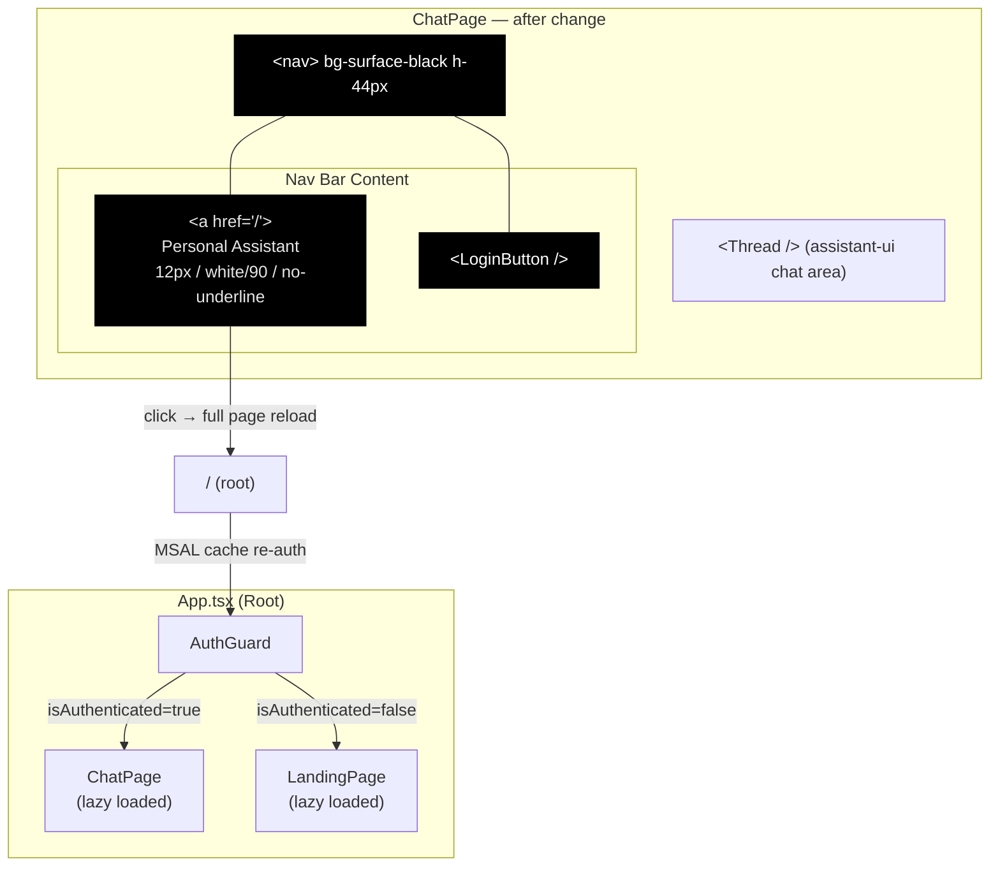
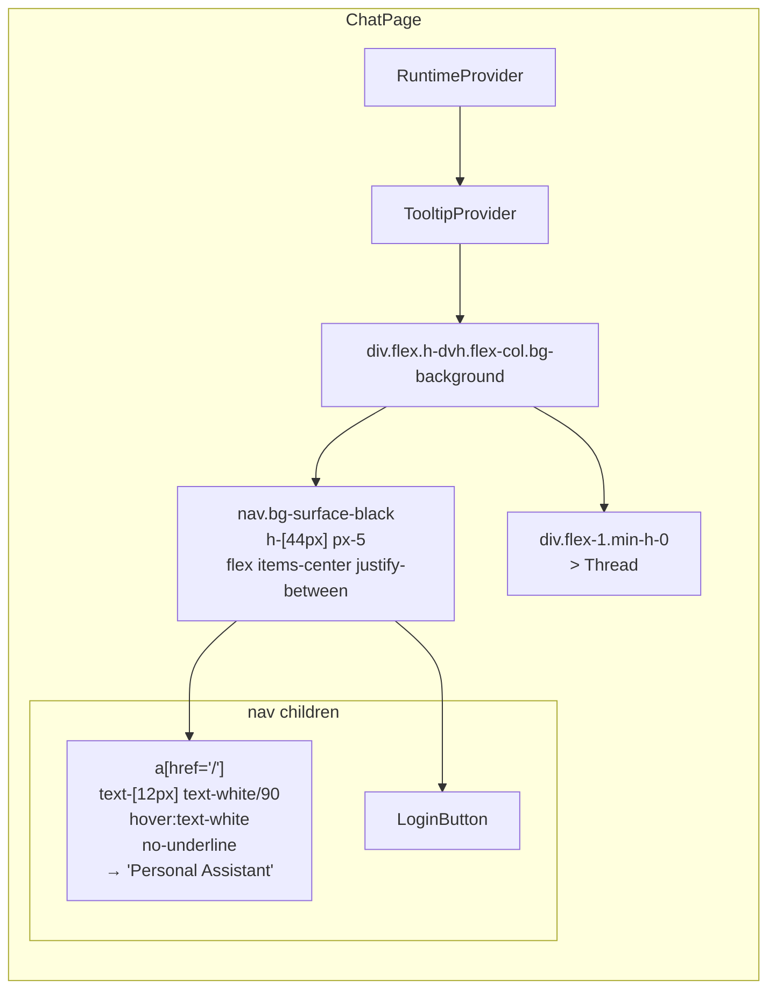

# client-plan.md — Chat Page Design Polish + Home Hyperlink

> **Issue**: `feature-chat-page-design-polish`  
> **Feature branch**: `feat/chat-page-design-polish`  
> **Target file**: `personal-assistant-client/src/components/chat/ChatPage.tsx`  
> **Design reference**: `personal-assistant-client/DESIGN.md` → `components.global-nav`  
> **Status**: Draft

---

## 1. Overview

This issue aligns ChatPage's top bar with the `global-nav` design token defined in DESIGN.md — the same design already implemented by `GlobalNav.tsx` on the landing page. It also wraps the "Personal Assistant" label in an `<a href="/">` hyperlink for navigation back to the root.

**Scope**: Single-file change (`ChatPage.tsx`). No new dependencies, no new components, no router.

---

## 2. Design Target: `global-nav` Component Spec

From `DESIGN.md` (§Components → `global-nav`):

| Property | Value |
|----------|-------|
| `backgroundColor` | `{colors.surface-black}` → `#000000` |
| `textColor` | `{colors.on-dark}` → `#ffffff` |
| `typography` | `{typography.nav-link}` → SF Pro Text, 12px, fontWeight 400, lineHeight 1.0, letterSpacing -0.12px |
| `height` | 44px |
| `decoration` | No borders, no shadows, no gradients |

**Existing reference implementation**: `personal-assistant-client/src/components/landing/GlobalNav.tsx` already uses `bg-surface-black`, `h-[44px]`, `px-5`, `text-[12px]`, `text-white/90`.

---

## 3. Exact Code Changes

### 3.1 File: `personal-assistant-client/src/components/chat/ChatPage.tsx`

#### Before (current)

```tsx
import { Thread } from "@/components/assistant-ui/thread";
import { TooltipProvider } from "@/components/ui/tooltip";
import { RuntimeProvider } from "@/components/RuntimeProvider";
import { LoginButton } from "@/components/LoginButton";

function ChatPage() {
  return (
    <RuntimeProvider>
      <TooltipProvider>
        <div className="flex h-dvh flex-col bg-background">
          <div className="flex items-center justify-between px-4 py-2 border-b">
            <span className="text-sm text-muted-foreground">
              Personal Assistant
            </span>
            <LoginButton />
          </div>
          <div className="flex-1 min-h-0">
            <Thread />
          </div>
        </div>
      </TooltipProvider>
    </RuntimeProvider>
  );
}

export default ChatPage;
```

#### After (target)

```tsx
import { Thread } from "@/components/assistant-ui/thread";
import { TooltipProvider } from "@/components/ui/tooltip";
import { RuntimeProvider } from "@/components/RuntimeProvider";
import { LoginButton } from "@/components/LoginButton";

function ChatPage() {
  return (
    <RuntimeProvider>
      <TooltipProvider>
        <div className="flex h-dvh flex-col bg-background">
          <nav className="flex h-[44px] w-full items-center justify-between bg-surface-black px-5">
            <a
              href="/"
              className="text-[12px] font-normal leading-none tracking-[-0.12px] text-white/90 no-underline hover:text-white transition-colors"
              aria-label="Personal Assistant, 返回首页"
            >
              Personal Assistant
            </a>
            <LoginButton />
          </nav>
          <div className="flex-1 min-h-0">
            <Thread />
          </div>
        </div>
      </TooltipProvider>
    </RuntimeProvider>
  );
}

export default ChatPage;
```

### 3.2 Change Map

| Line Content | Before | After | Reason |
|---|---|---|---|
| Header element | `<div className="flex items-center justify-between px-4 py-2 border-b">` | `<nav className="flex h-[44px] w-full items-center justify-between bg-surface-black px-5">` | Match `global-nav` design: 44px height, black background, no border, wider horizontal padding |
| Label element | `<span className="text-sm text-muted-foreground">` | `<a href="/" className="text-[12px] font-normal leading-none tracking-[-0.12px] text-white/90 no-underline hover:text-white transition-colors" aria-label="...">` | Match `nav-link` typography (12px, tracking -0.12px), switch to hyperlink on dark background |
| Whitespace choice | n/a (`<span>` is inline) | `<a>` is inline; newline + indentation before closing `</a>` / `</nav>` keeps `LoginButton` on same line | JSX readability; no effect on rendered DOM (Tailwind `flex` on parent owns layout) |

### 3.3 Tailwind Class Breakdown

| Class | Purpose | Source |
|---|---|---|
| `h-[44px]` | Fixed 44px height per DESIGN.md `global-nav.height` | Arbitrary value |
| `w-full` | Full-width header across viewport | Tailwind utility |
| `flex items-center justify-between` | Horizontal flex layout: brand left, `LoginButton` right, vertically centered | Tailwind utility |
| `bg-surface-black` | `#000000` background → DESIGN.md `{colors.surface-black}` | `@theme` block in `index.css` (already defined) |
| `px-5` | 20px horizontal padding, matching `GlobalNav.tsx` | Tailwind spacing scale |
| `text-[12px]` | 12px font size → DESIGN.md `{typography.nav-link.fontSize}` | Arbitrary value |
| `font-normal` | fontWeight 400 → DESIGN.md `{typography.nav-link.fontWeight}` | Tailwind utility |
| `leading-none` | lineHeight 1.0 → DESIGN.md `{typography.nav-link.lineHeight}` | Tailwind utility |
| `tracking-[-0.12px]` | letterSpacing -0.12px → DESIGN.md `{typography.nav-link.letterSpacing}` | Arbitrary value |
| `text-white/90` | Off-white text on black → DESIGN.md `{colors.on-dark}` (with opacity for visual comfort) | Tailwind opacity modifier |
| `no-underline` | No default underline on link per Apple style | Tailwind utility |
| `hover:text-white` | Full white on hover for feedback | Tailwind state variant |
| `transition-colors` | Smooth color transition on hover | Tailwind utility |
| `aria-label` | Accessibility: describes link purpose for screen readers | HTML attr |

### 3.4 CSS Variables & Design Tokens Already In Place

All required CSS infrastructure already exists. No changes needed to `index.css`:

```
index.css → @theme block:
  --color-surface-black: #000000   ← bg-surface-black utility is available

No additional @theme entries needed.
```

The `nav-link` typography token (`12px / 400 / 1.0 / -0.12px`) is not defined as a Tailwind utility class — it is applied inline via arbitrary values, matching how `GlobalNav.tsx` does it.

---

## 4. Design System Alignment

### 4.1 Consistency with Landing Page

| Aspect | `GlobalNav.tsx` (Landing) | `ChatPage.tsx` (after) | Aligned? |
|---|---|---|---|
| Background | `bg-surface-black` | `bg-surface-black` | ✅ |
| Height | `h-[44px]` | `h-[44px]` | ✅ |
| Padding | `px-5` | `px-5` | ✅ |
| Font size | `text-[12px]` | `text-[12px]` | ✅ |
| Font weight | (defaults to `font-normal`) | `font-normal` | ✅ |
| Line height | (defaults to Tailwind default) | `leading-none` (1.0, more accurate) | ⚠️ Slightly more accurate |
| Letter spacing | (not specified) | `tracking-[-0.12px]` | ⚠️ More accurate |
| Text color | `text-white/90` | `text-white/90` | ✅ |
| Border | none | none | ✅ |
| Shadow | none | none | ✅ |
| Brand label | `<span>` | `<a href="/">` | 🔗 Hyperlink added |

**Note**: The ChatPage's `leading-none` and `tracking-[-0.12px]` are more precise matches to DESIGN.md's `nav-link` typography than `GlobalNav.tsx`'s current implementation. This is intentional — ChatPage sets the more accurate baseline; `GlobalNav.tsx` can be updated in a follow-up cleanup.

### 4.2 Apple Design Principles Satisfied

| Principle | How This Change Satisfies It |
|---|---|
| No decorative chrome | Removed `border-b` — no borders, no shadows, no gradients on the nav bar |
| Surface-black for global nav | Changed from transparent `bg-background` to `bg-surface-black` |
| Single accent color | No new colors introduced — white-on-black uses existing `on-dark` palette |
| Nav-link typography | 12px / 400 / 1.0 / -0.12px matches the `nav-link` token |
| 44px touch target | `h-[44px]` meets Apple's minimum touch target requirement |
| No underline by default | `no-underline` class — Apple-style links don't underline the brand mark |

---

## 5. Accessibility

| Concern | Implementation |
|---|---|
| **Link semantics** | Wrapped in an `<a>` element — browsers announce it as a navigable link, keyboard-focusable by default |
| **ARIA label** | `aria-label="Personal Assistant, 返回首页"` — describes both brand name and purpose (return to home) for screen readers |
| **Keyboard navigation** | `<a>` receives native `:focus-visible` ring via Tailwind's `outline-ring/50` (from `index.css` `@layer base`) |
| **`href="/"` behavior** | Full page reload to root. Since app has no client-side router, this is correct and expected. MSAL will re-authenticate from in-memory cache via `handleRedirectPromise()` in `main.tsx`, so the user lands on LandingPage or ChatPage seamlessly |
| **Contrast ratio** | `#ffffff` (at 90% opacity ≈ `#e6e6e6`) on `#000000` → contrast ratio ≈ 18.5:1, well above WCAG AAA 7:1 for normal text |
| **Color not sole indicator** | Hover state uses both color change (`text-white`) and browser's default cursor change to pointer |

---

## 6. Test Considerations

### 6.1 Existing Tests That Reference ChatPage

**`personal-assistant-client/src/App.test.tsx`** — Mocks ChatPage with a test marker:

```tsx
vi.mock("./components/chat/ChatPage", () => ({
  default: () => <div data-testid="chat-page">ChatPage</div>,
}));
```

**Impact**: No change needed. The mock replaces the entire component, so ChatPage's internal markup changes don't affect `App.test.tsx`. Tests still correctly verify that ChatPage renders when authenticated.

### 6.2 New Tests to Write

Create `personal-assistant-client/src/components/chat/ChatPage.test.tsx`:

| Test ID | Scenario | Assertion |
|---|---|---|
| **CP-01** | Renders without crashing | Component mounts without throw |
| **CP-02** | Renders the `<nav>` element with `bg-surface-black` | `screen.getByRole("navigation")` exists and has class `bg-surface-black` |
| **CP-03** | Renders "Personal Assistant" as a link | `screen.getByRole("link", { name: /Personal Assistant/ })` exists |
| **CP-04** | Link has `href="/"` | `getByRole("link").getAttribute("href")` equals `"/"` |
| **CP-05** | Link has `aria-label` describing home navigation | `getByRole("link").getAttribute("aria-label")` includes "返回首页" |
| **CP-06** | Link has `no-underline` class (no default underline) | Element's `className` includes `no-underline` |
| **CP-07** | Renders `<LoginButton />` inside the nav | LoginButton is a child of the `<nav>` element |
| **CP-08** | Nav has fixed height 44px | Nav element has class `h-[44px]` |
| **CP-09** | Thread area is rendered | `Thread` component is rendered (verify via mock) |

**Mocking strategy for ChatPage.test.tsx**:

```tsx
// Mock heavy dependencies that ChatPage wraps
vi.mock("@/components/RuntimeProvider", () => ({
  RuntimeProvider: ({ children }: { children: React.ReactNode }) => <>{children}</>,
}));
vi.mock("@/components/assistant-ui/thread", () => ({
  Thread: () => <div data-testid="thread">Thread</div>,
}));
vi.mock("@/components/ui/tooltip", () => ({
  TooltipProvider: ({ children }: { children: React.ReactNode }) => <>{children}</>,
}));
vi.mock("@/components/LoginButton", () => ({
  LoginButton: () => <div data-testid="login-button">LoginButton</div>,
}));
```

### 6.3 Tests NOT Affected

| Test File | Why Not Affected |
|---|---|
| `LoginButton.test.tsx` | Tests LoginButton in isolation; ChatPage's header wrap doesn't change LoginButton's internal behavior |
| `LoginPage.test.tsx` | Tests the login page; ChatPage is a different route entirely |
| `App.test.tsx` | ChatPage is fully mocked; internal markup changes are invisible to this test |
| `AuthGuard.test.tsx` | Tests auth gate logic only; no ChatPage dependency |
| All `__tests__/` files | Landing page component tests; no ChatPage dependency |

### 6.4 Visual Regression Note

The `data-testid` on the ChatPage mock in `App.test.tsx` stays unchanged. If snapshot tests are added later, they will capture the new header automatically.

---

## 7. UI Flow Diagram



---

## 8. Component Hierarchy (After Change)



---

## 9. Implementation Tasks

### Task 1: Update ChatPage.tsx Header

- **File**: `personal-assistant-client/src/components/chat/ChatPage.tsx`
- **Action**: Replace the header `<div>` with a `<nav>` element matching `global-nav` spec
- **Changes**:
  1. Change `<div className="flex items-center justify-between px-4 py-2 border-b">` → `<nav className="flex h-[44px] w-full items-center justify-between bg-surface-black px-5">`
  2. Change `<span className="text-sm text-muted-foreground">` → `<a href="/" className="text-[12px] font-normal leading-none tracking-[-0.12px] text-white/90 no-underline hover:text-white transition-colors" aria-label="Personal Assistant, 返回首页">`
  3. Change closing `</span>` → `</a>`
  4. Change closing `</div>` → `</nav>`
  5. Ensure `LoginButton` import remains unchanged
- **Verification**: `npm run typecheck` passes; `npm run dev` renders black nav bar

### Task 2: Write ChatPage Unit Tests

- **File**: `personal-assistant-client/src/components/chat/ChatPage.test.tsx` (new)
- **Action**: Create test file with scenarios CP-01 through CP-09 (see §6.2)
- **Verification**: `npx vitest run src/components/chat/ChatPage.test.tsx` — all tests pass

### Task 3: Verify Existing Tests Still Pass

- **Action**: Run full test suite
- **Command**: `npx vitest run`
- **Expected**: All 12+ existing tests pass unchanged (especially `App.test.tsx`, `LoginButton.test.tsx`)

### Task 4: Visual Verification

- **Action**: `npm run dev` and inspect in browser
- **Checklist**:
  - [ ] Authenticated → ChatPage shows black nav bar, 44px tall, with "Personal Assistant" link on left and LoginButton on right
  - [ ] Hover over "Personal Assistant" → text brightens from `white/90` to `white`, cursor changes to pointer
  - [ ] Click "Personal Assistant" → page reloads, MSAL re-authenticates from cache, lands on ChatPage (if still authenticated) or LandingPage
  - [ ] Dev mode (`VITE_ENTRA_CLIENT_ID` unset) → `LoginButton` shows "Dev Mode — Proxy auth enabled" on black background
  - [ ] No border or shadow visible on the nav bar
  - [ ] Chat thread area fills remaining viewport height below the 44px nav

---

## 10. Out of Scope (Explicitly Excluded)

| Item | Reason |
|---|---|
| Changing `LoginButton` styling for dark background | `LoginButton` is a shared component; changing it would also affect any future light-background usage. Follow-up issue if needed |
| Adding `react-router-dom` or any client-side router | No router exists in this codebase; `<a href="/">` with full-page reload is the correct and simplest solution for the current SPA architecture |
| Updating `GlobalNav.tsx` to add `tracking-[-0.12px]` and `leading-none` | This is a separate cleanup task for landing page consistency; ChatPage sets the more accurate baseline |
| Adding dark-mode support for the ChatPage header | The `global-nav` spec is explicitly `#000000` background regardless of theme; dark mode is not applicable |
| Touch/gesture support for the link | Standard `<a>` behavior is sufficient; no swipe or gesture requirements in spec |

---

## 11. Risk Assessment

| Risk | Likelihood | Impact | Mitigation |
|---|---|---|---|
| MSAL re-auth on `<a href="/">` click fails or shows flash | Low | Medium — user sees loading spinner briefly | MSAL uses in-memory cache; `handleRedirectPromise()` in `main.tsx` processes cached tokens silently. Already tested in existing auth flow |
| `LoginButton` text invisible on black background (dev mode) | Low | Low — dev mode only, text is `text-xs text-muted-foreground` which maps to `#8E8E93` | `#8E8E93` on `#000000` has ~5.4:1 contrast ratio, passes WCAG AA. Acceptable for dev mode |
| `LoginButton` out-of-the-box button variants look inconsistent on black | Medium | Low — cosmetic only | Noted as out of scope (§10). The existing `Button variant="ghost"` used in `GlobalNav.tsx`'s login button works on black; `LoginButton` uses `variant="outline"` and `variant="default"` which may need follow-up tuning |
