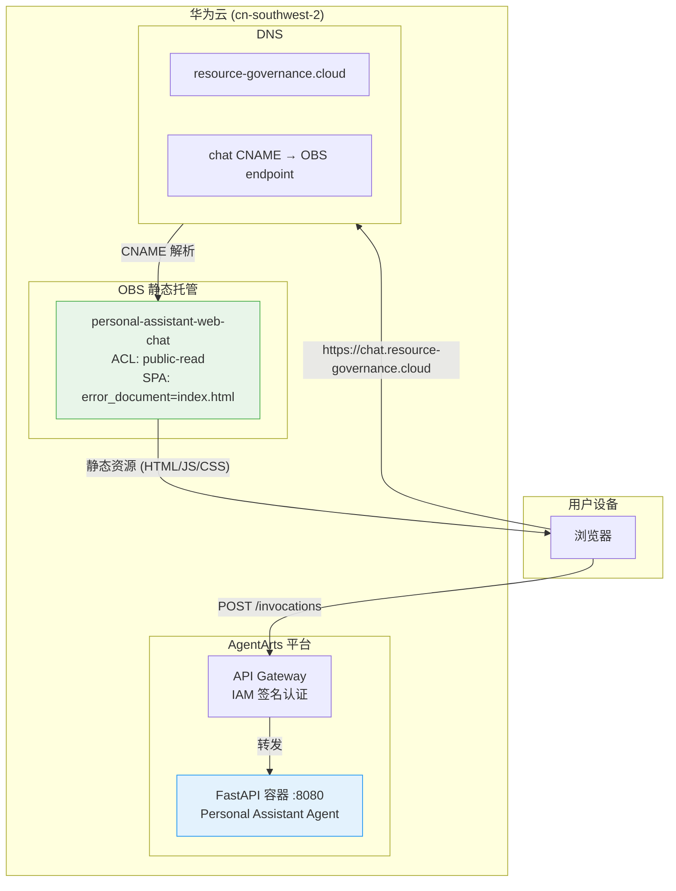

# Infra Plan — Chat Page Design Polish

> **Issue**: `personal-assistant-meta/issues/features/feature-chat-page-design-polish/`  
> **Feature Branch**: `feat/chat-page-design-polish`  
> **Plan Author**: personal-assistant-meta-infra-planner  
> **Date**: 2026-06-14

---

## 0. Assessment — No Infrastructure Changes Required

| 维度 | 结果 | 说明 |
|------|------|------|
| IaC Changes | ❌ None | 无新增/修改的华为云资源（OBS、RDS、SWR、IAM、VPC、EIP、CDN 均不变） |
| AgentArts Config | ❌ None | `.agentarts_config.yaml` 无变更（容器/认证/可观测配置不变） |
| Network & Security | ❌ None | CORS、CDN、TLS、IAM policy 均不变 |
| OBS Static Hosting | ❌ None | OBS bucket `personal-assistant-web-chat` 无需修改，前端 `npm run build` 产出物与现有部署流程完全一致 |
| DNS | ❌ None | `chat.resource-governance.cloud` CNAME 记录不变 |

**判定：本 issue 为纯 Client 前端视觉变更，不涉及任何基础设施层修改。**

---

## 1. IaC Changes

**无变更。**

所有 `personal-assistant-infra/*.tf` 文件无需修改。当前管理的资源保持不变：

| Resource | Terraform Type | Name | 本次变更 |
|----------|---------------|------|---------|
| OBS Bucket | `huaweicloud_obs_bucket` | `personal-assistant-web-chat` | 不变 |
| DNS Zone | `huaweicloud_dns_zone` | `resource-governance.cloud` | 不变 |
| DNS Recordset | `huaweicloud_dns_recordset` | `chat.resource-governance.cloud` | 不变 |

**原因**：本次变更是对 `personal-assistant-client/src/components/chat/ChatPage.tsx` 的视觉润色（Apple 风格 header + "Personal Assistant" 超链接至 `/`）。这些改动是纯 CSS/JSX 层面的前端代码变更，经 `npm run build` 构建后产出标准的 `dist/` 目录，OBS CDN 正常分发。OBS bucket 的 static website hosting 配置（SPA fallback: `error_document=index.html`）天然支持新增的 `<a href="/">` 前端路由跳转，无需任何 IaC 或 bucket 配置调整。

---

## 2. Network & Security

**无变更。**

| 关注点 | 当前状态 | 本次变更 |
|--------|---------|---------|
| CORS (`allow_origins`) | OBS 静态网站域名 | 不变 — "Personal Assistant" 超链接是 SPA 内部 `<a href="/">` 导航，不产生跨域请求 |
| CDN | OBS static website endpoint | 不变 |
| TLS | 无需证书（OBS 自带 HTTPS） | 不变 |
| IAM | 无需额外 IAM policy | 不变 |
| VPC / EIP | 无（前端走 OBS，后端走 AgentArts Gateway） | 不变 |

"Personal Assistant" 文本新增的超链接 `<a href="/">` 是 React SPA 客户端路由（由 `react-router` 或条件渲染处理），不触发后端请求，不经过 AgentArts Gateway，没有任何 network boundary 变化。

---

## 3. Infrastructure Test Cases

| # | 测试项 | 命令 | 期望结果 |
|---|--------|------|---------|
| T-1 | IaC 语法验证 | `cd personal-assistant-infra && tofu validate` | `Success! The configuration is valid.` |
| T-2 | IaC 变更计划（空变更） | `cd personal-assistant-infra && tofu plan` | `No changes. Your infrastructure matches the configuration.` |
| T-3 | IaC 格式检查 | `cd personal-assistant-infra && tofu fmt -check` | 无格式差异输出 |

> T-2 是关键验证：`tofu plan` 应报告 **零变更**，确认本次 issue 没有对 `personal-assistant-infra/` 产生任何 drift。

---

## 4. Infrastructure Topology (Unchanged)

以下为当前基础设施拓扑——本次变更**不修改任何节点或连线**：

**数据流不变**：
1. 用户浏览器访问 `https://chat.resource-governance.cloud` → DNS CNAME 解析 → OBS bucket 返回 `index.html`
2. ChatPage 中的 "Personal Assistant" 超链接 `<a href="/">` 是 SPA 内部导航，由前端路由处理，不产生新的 HTTP 请求
3. 对话消息通过 `POST /invocations` 发送到 AgentArts Gateway → FastAPI 容器

---

## 5. Summary

本次 issue 的 scope 完全限定在 `personal-assistant-client/` 前端代码中：

- **涉及文件**：`src/components/chat/ChatPage.tsx`（header 样式润色 + 超链接）
- **不涉及**：任何 `personal-assistant-infra/` 文件、`.agentarts_config.yaml`、华为云资源、网络配置

`personal-assistant-infra-dev` 无需执行任何操作。基础设施验证（`tofu validate` + `tofu plan`）确认零变更后即可标记 infra 部分完成。
