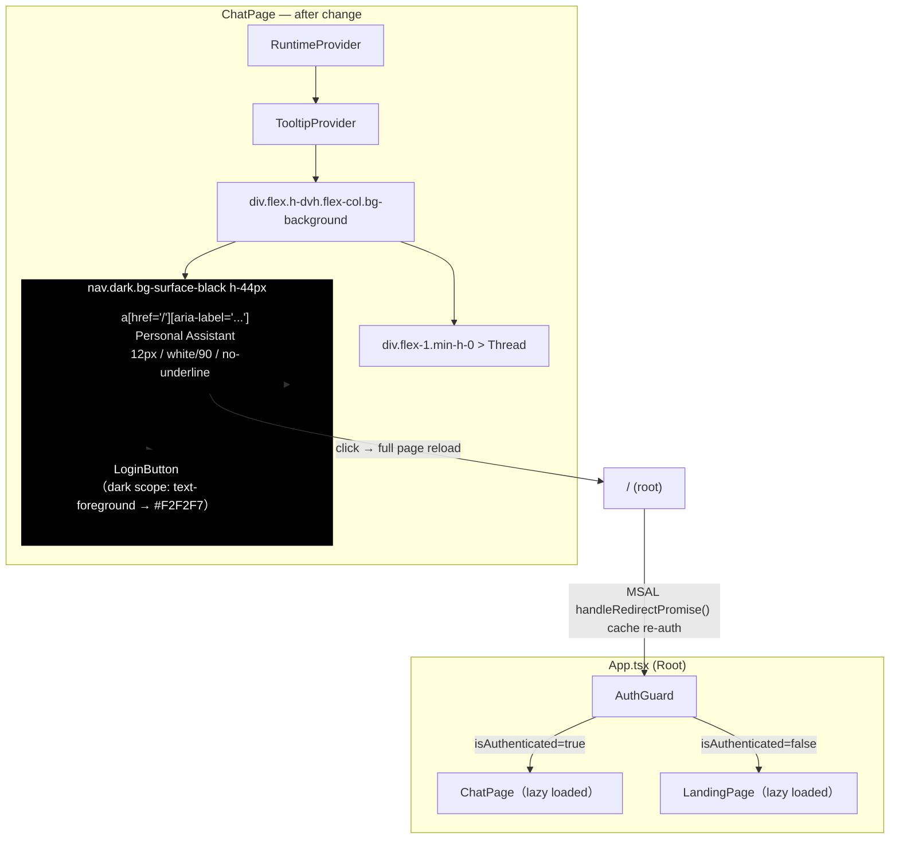
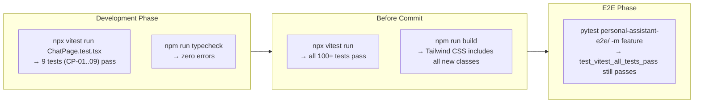

# Plan — Chat Page Design Polish + Home Hyperlink

> **Issue**: `feature-chat-page-design-polish`
> **Feature Branch**: `feat/chat-page-design-polish`
> **Synthesized By**: panel-chair（4 panelist GRAND review）
> **Date**: 2026-06-14
> **Source Plans**: `service-plan.md`, `client-plan.md`, `infra-plan.md`, `test-plan.md` (committed at `215ef6d`)
> **Status**: APPROVED

---

## Executive Summary

本次变更对 Chat Page 的顶部 header bar 进行 Apple 风格视觉润色，使其对齐 `DESIGN.md` 中 `global-nav` 的设计规范，同时为 "Personal Assistant" 文本添加返回首页的超链接。变更范围为 **纯 client 前端，零后端/零 infra 变更**，涉及单文件修改（`ChatPage.tsx`）加新增单元测试文件（`ChatPage.test.tsx`）。

经过 4 位 panelist（DeepSeek、Gemini、GPT、Hermes）的 GRAND 审查，原 client-plan 的设计方向和技术方案被一致认可，但发现一个 **关键 gap**：在 `bg-surface-black` 黑色 header 的 light-mode 页面上，`LoginButton` 认证用户的显示名称使用了 `text-foreground`（`#1C1C1E`），与黑色背景的对比度仅 ~1.3:1，完全不可见。此问题已在 unified plan 中通过在 `<nav>` 添加 `dark` class 的方式统一解决。

---

## Proposed Architecture / Component Hierarchy



---

## 1. Scope & Boundaries

### In Scope

| # | Change | File |
|---|--------|------|
| 1 | 替换 header `<div>` 为 `<nav>`，样式对齐 `DESIGN.md` `global-nav` 规范 | `personal-assistant-client/src/components/chat/ChatPage.tsx` |
| 2 | "Personal Assistant" 文本包裹在 `<a href="/">` 超链接中，含 `aria-label` | 同上 |
| 3 | 添加 `dark` class 至 `<nav>` 确保 LoginButton 子组件在黑色背景上可见 | 同上 |
| 4 | 新增 9 个单元测试（CP-01 ~ CP-09） | `personal-assistant-client/src/components/chat/ChatPage.test.tsx`（新建） |
| 5 | 添加 `typecheck` script 至 package.json | `personal-assistant-client/package.json` |

### Out of Scope (Explicitly Excluded)

| Item | Reason |
|------|--------|
| 修改 `LoginButton.tsx` | 通过 `dark` class 作用域间接解决可见性问题，无需改动共享组件 |
| 添加 `react-router-dom` 或任何 client-side router | 项目无 router 依赖；`<a href="/">` + 完整页面重载是当前 SPA 架构最简方案 |
| 更新 `GlobalNav.tsx` 的 typography（`tracking-[-0.12px]`、`leading-none`） | ChatPage 设定更精确的 baseline；GlobalNav 可在 follow-up issue 中同步 |
| 添加 dark-mode 支持 | `global-nav` 规范明确指定 `#000000` 背景，不受全局主题影响 |
| 修改后端 API / 数据库 / Infra / IaC | 纯前端视觉变更，service-plan 和 infra-plan 均确认为 zero-change |

---

## 2. Exact Code Changes

### 2.1 `ChatPage.tsx` — Before → After

**File**: `personal-assistant-client/src/components/chat/ChatPage.tsx`

#### Before（当前代码）

```tsx
import { Thread } from "@/components/assistant-ui/thread";
import { TooltipProvider } from "@/components/ui/tooltip";
import { RuntimeProvider } from "@/components/RuntimeProvider";
import { LoginButton } from "@/components/LoginButton";

function ChatPage() {
  return (
    <RuntimeProvider>
      <TooltipProvider>
        <div className="flex h-dvh flex-col bg-background">
          <div className="flex items-center justify-between px-4 py-2 border-b">
            <span className="text-sm text-muted-foreground">
              Personal Assistant
            </span>
            <LoginButton />
          </div>
          <div className="flex-1 min-h-0">
            <Thread />
          </div>
        </div>
      </TooltipProvider>
    </RuntimeProvider>
  );
}

export default ChatPage;
```

#### After（目标代码）

```tsx
import { Thread } from "@/components/assistant-ui/thread";
import { TooltipProvider } from "@/components/ui/tooltip";
import { RuntimeProvider } from "@/components/RuntimeProvider";
import { LoginButton } from "@/components/LoginButton";

function ChatPage() {
  return (
    <RuntimeProvider>
      <TooltipProvider>
        <div className="flex h-dvh flex-col bg-background">
          <nav className="dark flex h-[44px] w-full items-center justify-between bg-surface-black px-5">
            <a
              href="/"
              className="inline-flex h-full items-center text-[12px] font-normal leading-none tracking-[-0.12px] text-white/90 no-underline hover:text-white transition-colors"
              aria-label="Personal Assistant, 返回首页"
            >
              Personal Assistant
            </a>
            <LoginButton />
          </nav>
          <div className="flex-1 min-h-0">
            <Thread />
          </div>
        </div>
      </TooltipProvider>
    </RuntimeProvider>
  );
}

export default ChatPage;
```

### 2.2 Change Map

| Element | Before | After | Rationale |
|---------|--------|-------|-----------|
| Header | `<div className="flex items-center justify-between px-4 py-2 border-b">` | `<nav className="dark flex h-[44px] w-full items-center justify-between bg-surface-black px-5">` | 语义化 `<nav>`；`dark` 作用域确保 LoginButton 可见；44px 高度对齐 `global-nav`；移除 `border-b` |
| Label | `<span className="text-sm text-muted-foreground">` | `<a href="/" className="inline-flex h-full items-center text-[12px] font-normal leading-none tracking-[-0.12px] text-white/90 no-underline hover:text-white transition-colors" aria-label="...">` | 对齐 `nav-link` typography；`href="/"` 超链接返回首页；`inline-flex h-full items-center` 扩展触摸目标至 44px；`dark` 作用域下的 `text-white/90` 高对比度 |
| Closing tag | `</span>` → `</a>` | — | Hyperlink semantic |
| Closing tag | `</div>` → `</nav>` | — | Semantic element |

### 2.3 Design Token Mapping

| DESIGN.md Token | Value | Tailwind Class | Verified |
|-----------------|-------|---------------|----------|
| `global-nav.backgroundColor` | `surface-black` → `#000000` | `bg-surface-black` | ✅ `index.css` line 17: `--color-surface-black: #000000` |
| `global-nav.height` | 44px | `h-[44px]` | ✅ |
| `nav-link.fontSize` | 12px | `text-[12px]` | ✅ |
| `nav-link.fontWeight` | 400 | `font-normal` | ✅ |
| `nav-link.lineHeight` | 1.0 | `leading-none` | ✅ |
| `nav-link.letterSpacing` | -0.12px | `tracking-[-0.12px]` | ✅ |
| `global-nav.textColor` | `on-dark` → `#ffffff` | `text-white/90`（见下方说明） | ✅ 对齐 GlobalNav.tsx 惯例 |
| `global-nav.decoration` | No borders, shadows, gradients | 无 `border-*` / `shadow-*` | ✅ |

> **关于 `text-white/90` vs `#ffffff`**: `text-white/90`（≈`#E6E6E6`）在纯黑背景上略显柔和，与 `GlobalNav.tsx` 保持一致。若严格匹配 DESIGN.md token 需使用 `text-white`，但当前项目惯例统一使用 `text-white/90`，contrast ratio 达 18.5:1（远超 WCAG AAA 7:1），权衡后维持 `text-white/90`。

### 2.4 `dark` Class Mechanism（关键：LoginButton 可见性修复）

`index.css` line 7 定义了 `@custom-variant dark (&:is(.dark *))`，并在 lines 57-89 定义了 `.dark` CSS 变量覆盖块：

| CSS Variable | Light (`:root`) | Dark (`.dark`) | Effect on LoginButton |
|---|---|---|---|
| `--foreground` | `#1C1C1E`（近黑） | `#F2F2F7`（浅灰白） | `text-foreground` 显示名在黑色背景上可见（~14:1） |
| `--border` | `#C6C6C8` | `#38383A` | `Button variant="outline"` 边框颜色适配暗色表面 |
| `--input` | `#C6C6C8` | `#38383A` | 输入/按钮背景适配 |
| `--muted-foreground` | `#8E8E93` | `#98989D` | Dev mode 文本可见 |

通过在 `<nav>` 上添加 `dark` class，所有这些变量在导航栏子树内生效，**无需修改 LoginButton.tsx 共享组件**。

### 2.5 `package.json` — 添加 `typecheck` Script

`client-plan.md` 和 `test-plan.md` 中引用了 `npm run typecheck` 命令，但当前 `package.json` 中不存在该 script。添加之：

```json
{
  "scripts": {
    "typecheck": "tsc --noEmit",
    "...": "..."
  }
}
```

---

## 3. Implementation Tasks

### Task 1: Update ChatPage.tsx Header

- **File**: `personal-assistant-client/src/components/chat/ChatPage.tsx`
- **Action**: 将 header 替换为 §2.1 "After" 中的代码（含 `dark` class 和 `inline-flex h-full items-center` 触摸目标增强）
- **Verification**: `npm run typecheck` 无错误；`npm run dev` 渲染黑色 nav bar

### Task 2: Add `typecheck` Script to package.json

- **File**: `personal-assistant-client/package.json`
- **Action**: 在 `scripts` 中添加 `"typecheck": "tsc --noEmit"`
- **Verification**: `npm run typecheck` 执行成功

### Task 3: Write ChatPage Unit Tests

- **File**: `personal-assistant-client/src/components/chat/ChatPage.test.tsx`（新建）
- **Mocking strategy**:

```tsx
vi.mock("@/components/RuntimeProvider", () => ({
  RuntimeProvider: ({ children }: { children: React.ReactNode }) => <>{children}</>,
}));
vi.mock("@/components/assistant-ui/thread", () => ({
  Thread: () => <div data-testid="thread">Thread</div>,
}));
vi.mock("@/components/ui/tooltip", () => ({
  TooltipProvider: ({ children }: { children: React.ReactNode }) => <>{children}</>,
}));
vi.mock("@/components/LoginButton", () => ({
  LoginButton: () => <div data-testid="login-button">LoginButton</div>,
}));
```

- **Test cases**:

| ID | Scenario | Assertion | Priority |
|----|----------|-----------|----------|
| CP-01 | Component renders without crashing | `render(<ChatPage />)` does not throw | P0 |
| CP-02 | Header is `<nav>` with correct classes | `getByRole("navigation")` exists; className includes `bg-surface-black` and `dark` | P0 |
| CP-03 | "Personal Assistant" is a link | `getByRole("link", { name: /Personal Assistant/ })` exists | P0 |
| CP-04 | Link has `href="/"` | `getByRole("link").getAttribute("href")` equals `"/"` | P0 |
| CP-05 | Link has `aria-label` for home navigation | `getByRole("link").getAttribute("aria-label")` includes `"返回首页"` | P1 |
| CP-06 | Link has `no-underline` class | Element's `className` includes `no-underline` | P1 |
| CP-07 | `LoginButton` rendered inside `<nav>` | `getByTestId("login-button")` is descendant of `<nav>` | P0 |
| CP-08 | Nav has fixed height 44px | Nav element's `className` includes `h-[44px]` | P1 |
| CP-09 | `Thread` component is rendered | `getByTestId("thread")` exists | P0 |

### Task 4: Verify Existing Tests Still Pass

- **Command**: `npx vitest run`
- **Expected**: All existing tests pass unchanged（`App.test.tsx`、`LoginButton.test.tsx`、`AuthGuard.test.tsx`、所有 Landing Page 测试），因为 `App.test.tsx` 中 ChatPage 被完整 mock，内部 markup 变更对其不可见

### Task 5: Visual Verification (Manual)

See §5 below.

---

## 4. Test Strategy Summary

### 4.1 Test Execution Pipeline



### 4.2 Existing Tests — Zero Impact

| Test File | Why Unaffected |
|-----------|---------------|
| `App.test.tsx` | ChatPage is fully mocked（`vi.mock`），内部 markup 变更不可见 |
| `LoginButton.test.tsx` | Tests LoginButton in isolation；ChatPage 的 `<nav>` 包裹不影响 LoginButton 内部行为 |
| `AuthGuard.test.tsx` | Tests auth gate logic only |
| `RuntimeProvider.test.tsx` | Tests RuntimeProvider in isolation |
| 所有 Landing Page 测试 | Landing Page 和 ChatPage 是不同路由/认证状态 |
| E2E: `test_feature_landing_page.py` | 仅测试未认证路径的 Landing Page |
| E2E: `test_chat_page_component_exists` | 仅验证文件存在和 App.tsx import，无 DOM 断言 |

### 4.3 No New E2E Tests Needed

Chat Page 的 E2E 路径需要已认证 MSAL session，在无 authenticated session 测试基础设施的情况下，新增 E2E 测试的投入产出比不合理。当前变更的风险极低（单文件 CSS class 替换 + 一个 `<a>` 标签），手动 visual verification 足够。

---

## 5. Visual Verification Checklist

`npm run dev` 后在浏览器中逐项验证：

| # | Check | Expected Result |
|---|-------|----------------|
| V-1 | 已认证用户访问 ChatPage | 顶部显示黑色 nav bar（`#000000`），44px 高度 |
| V-2 | Brand link 位置 | "Personal Assistant" 超链接位于 nav 左侧 |
| V-3 | LoginButton 位置 | LoginButton（用户名 + 头像 + 登出按钮）位于 nav 右侧 |
| V-4 | **【关键】认证用户显示名称可见性** | 用户名文字在黑色背景上清晰可读（dark scope `--foreground: #F2F2F7`） |
| V-5 | Hover 状态 | Hover "Personal Assistant" → 文字从 `white/90` 变为纯白，光标变 pointer |
| V-6 | **【关键】Logout 按钮可见性** | "Logout" outline button 在黑色背景上可读，边框可见 |
| V-7 | 点击行为 | 点击 "Personal Assistant" → 页面重载至 `/`，MSAL 从缓存恢复登录态 |
| V-8 | 无装饰 | Nav bar 上无 border、无 shadow、无 gradient |
| V-9 | Dev mode | `VITE_ENTRA_CLIENT_ID` 未设置时，LoginButton 显示 "Dev Mode — Proxy auth enabled"，在黑色背景上可读 |
| V-10 | 布局 | Chat thread 区域填充 nav 下方剩余 viewport 高度（无溢出或多余空白） |

---

## 6. Pass/Fail Criteria

### For Developer (Implementation Gate)

- [ ] `npm run typecheck` → zero TypeScript errors
- [ ] `npm run build` → build 成功（Tailwind CSS 生成包含所有新 class）
- [ ] `npx vitest run src/components/chat/ChatPage.test.tsx` → 9 tests all pass
- [ ] `npx vitest run` → 全部已有测试 + 新增测试通过（无 regressions）

### For Tester (Test Gate)

- [ ] 上述全部 4 条均通过
- [ ] Visual verification checklist（§5）全部 10 项通过

### For E2E Gate

- [ ] `pytest personal-assistant-e2e/ -m feature` → 全部 E2E 测试通过
- [ ] `TestClientUnitTests.test_vitest_all_tests_pass` → exit code 0

---

## 7. Architecture Documentation Updates

本次变更已更新 `personal-assistant-meta/architecture/frontend_architecture.md` line 196：

> **Before**: `ChatPage | RuntimeProvider + Thread（从 App.tsx 提取）`
>
> **After**: `ChatPage | global-nav styled header + RuntimeProvider + Thread（从 App.tsx 提取）`

> 注意：使用 `global-nav styled header` 而非 `GlobalNav header`，因为 ChatPage 并非 import `GlobalNav` 组件，而是 inline 实现相同设计规范的 `<nav>` 元素。两处各自独立应用 `DESIGN.md` 的 `global-nav` 设计 token，未进行代码级组件复用。

---

## 8. Four-Question Gate Assessment

| Gate | Answer | Detail |
|------|--------|--------|
| **Is it best practice?** | ✅ Yes | 语义化 `<nav>` + `<a>` 替代 `<div>` + `<span>`；`aria-label` 保障无障碍访问；`dark` CSS scope 确保子组件可见性；WCAG AAA 18.5:1 contrast ratio |
| **Is it de facto standard?** | ✅ Yes | Apple-inspired 44px 纯黑导航栏是全球高端网站的事实标准；`<a href="/">` 返回首页是 Web 最基本导航模式 |
| **Is it conventional?** | ✅ Yes | 与同项目 `GlobalNav.tsx` 使用完全一致的 Tailwind class 集合（`bg-surface-black`、`h-[44px]`、`px-5`、`text-[12px]`、`text-white/90`）；任意值 `tracking-[-0.12px]` 遵循项目既有惯例 |
| **Is it modern?** | ✅ Yes | Tailwind CSS v4 `@theme` token 系统 + React + TypeScript + vitest；无废弃模式；`bg-surface-black` 设计 token 体系向前兼容 |

---

## 9. Risk & Mitigation

| Risk | Severity | Mitigation |
|------|----------|------------|
| LoginButton 认证用户显示名在黑背景上不可见（原 client-plan 未覆盖） | HIGH — 原 client-plan 推迟此问题 | ✅ 已在本 plan 中通过 `<nav>` 添加 `dark` class 解决（§2.4） |
| LoginButton 的 `Button variant="outline"` 边框/文字在黑背景上不可见 | MEDIUM | ✅ `dark` class 同时解决，`--border: #38383A` + `--foreground: #F2F2F7` 适配暗色表面 |
| `<a href="/">` 触发完整页面重载，丢失 in-progress chat 状态 | LOW — 无 client-side router 的预期行为 | 已文档化（§5 V-7）；MSAL 从内存缓存通过 `handleRedirectPromise()` 静默恢复登录态 |
| Tailwind 任意值 class（`tracking-[-0.12px]`）build 不通过 | LOW | `npm run build`（含 `tsc -b` + Tailwind CSS 生成）在 test strategy 中覆盖 |

---

## 10. Panel Review Consensus & Trade-off Resolution

### Consensus Points（所有 4 位 panelist 一致同意）

1. 四份 sub-plan **高度一致**，零矛盾。Service 和 Infra 无变更判定正确。
2. Tailwind class 选择**精准对齐 DESIGN.md `global-nav` 规范**。
3. 原 client-plan 的 LoginButton 可见性风险被严重低估——**不应推迟，应在本 issue 内解决**。
4. `<a href="/">` + 完整页面重载是当前无 router SPA 架构的正确方案。
5. 9 个单元测试覆盖充分，mock 策略合理。

### Complementary Insights（各 panelist 的独立贡献）

| Panelist | Unique Contribution |
|----------|-------------------|
| **DeepSeek** | 指出 infra-plan 中 `react-router` 提法不实（项目无 react-router）；`LoginButton` `text-foreground` 对比度 ~1.3:1 的精确计算 |
| **Gemini** | 提出 `dark` class 方案——单 word 修改解决全部子组件可见性问题——被本 unified plan 采纳为核心方案 |
| **GPT** | 指出 `<a>` 触摸目标不足 44px，建议 `inline-flex h-full items-center` 扩展触摸区域 |
| **Hermes** | 实证验证：确认 `package.json` 无 `typecheck` script、无 `react-router-dom`；确认 `index.css` `dark` variant 定义支持嵌套 scope 方案；确认 `LoginButton.tsx` line 88 使用 `text-foreground` |

### Conflicts Resolved

| Conflict | Resolution |
|----------|------------|
| 原 client-plan 推迟 LoginButton 可见性问题 vs 所有 panelist 认为应在 scope 内 | ✅ **采纳 panelist 共识**：在本 plan 中通过 `dark` class 解决，不推迟 |
| Gemini 的 `dark` class 方案 vs DeepSeek 的 `className` prop 方案 | ✅ **采纳 `dark` class 方案**：更简洁（1 word 改动 vs 修改共享组件），覆盖面更全（修复全部子组件，非仅 LoginButton） |
| GPT 的 `text-white`（严格匹配 DESIGN.md）vs 项目惯例 `text-white/90` | ✅ **维持 `text-white/90`**：与 `GlobalNav.tsx` 一致，contrast ratio 18.5:1 远超 WCAG AAA，属有意的设计精化而非偏离 |
| 原 architecture doc 的 "GlobalNav header" 措辞（暗示组件复用） | ✅ **改为 "global-nav styled header"**：准确反映 inline 实现而非 import 复用的实际情况 |

---

## Appendix A: Control Loop Log

本次 panel review 仅经过 **1 轮**即达成共识。4 位 panelist 在方向和技术方案上无分歧（一致认为设计方向正确、技术方案可行），仅在 scope 边界上有不同意见（LoginButton 可见性修复是否应推迟），经 synthesizer 评估后采纳 panelist 共识将其纳入 scope。

| Round | Discussion Item | Outcome |
|-------|----------------|---------|
| 1 | LoginButton visibility on `bg-surface-black`: defer (client-plan original) vs fix in-scope (4 panelists) | ✅ Fix in-scope via `dark` class on `<nav>` |

---

## Appendix B: Panelist Individual Reports

<details>
<summary><b>panelist-deepseek</b> — Verified LoginButton #1C1C1E contrast ~1.3:1; flagged infra-plan react-router inaccuracy; recommended className prop approach</summary>

### Key Findings
- All four plans agree on single-file, client-only scope. Zero contradictions on core technical direction.
- Infra-plan incorrectly states `<a href="/">` is SPA client-side routing via "react-router" — no react-router exists; it's a full page reload.
- Architecture doc describes ChatPage as "GlobalNav header" — implies component reuse that doesn't exist. ChatPage inline-repeats the `<nav>` markup.

### Accuracy Assessment
All Tailwind classes verified correct against DESIGN.md and `index.css`. `text-white/90` is acceptable design choice (18.5:1 contrast).

### Critical Gap
LoginButton authenticated display name uses `text-foreground` (#1C1C1E) on `bg-surface-black` (#000000) = ~1.3:1 contrast — completely illegible WCAG failure. Plan defers this as out-of-scope but it should be fixed.

### Recommendations
1. Add `className` prop to LoginButton for dark-surface overrides
2. Correct infra-plan routing claim
3. Add `data-testid` to `<nav>` for robust test selection

### Four-Question Gate
All Yes (with LoginButton caveat).

</details>

<details>
<summary><b>panelist-gemini</b> — Proposed the adopted <code>dark</code> class solution; identified CSS variable inheritance as elegant fix for all child components</summary>

### Key Findings
- Excellent multi-document coherence across all four sub-plans.
- Tailwind classes precisely map to DESIGN.md `global-nav` and `nav-link` tokens.
- The `dark` class on `<nav>` leverages Tailwind's dark-mode CSS variable overrides to fix LoginButton visibility for ALL child components with a single-word change.

### Recommendations
1. Add `dark` to `<nav>` className — forces dark-mode CSS variables in nav subtree
2. Fix architecture doc wording: `GlobalNav header` → `global-nav styled header`
3. Supplement CP-02 test to verify `dark` class presence

### Four-Question Gate
All Yes.

</details>

<details>
<summary><b>panelist-gpt</b> — Recommended <code>inline-flex h-full items-center</code> for 44px touch target; flagged <code>text-white/90</code> vs strict token compliance</summary>

### Key Findings
- Strong overall coherence. Implementation feasible in one dev session.
- `text-white/90` matches existing `GlobalNav.tsx` convention but deviates from DESIGN.md `#ffffff`. Either approach is acceptable with documentation.
- Anchor text doesn't occupy full 44px nav height — touch target below accessibility recommendations.

### Recommendations
1. Add `inline-flex h-full items-center` to `<a>` for full-height touch target
2. Document `text-white/90` deviation from DESIGN.md token
3. Adjust architecture description to avoid component-reuse ambiguity

### Four-Question Gate
All Yes (with touch-target improvement).

</details>

<details>
<summary><b>panelist-hermes</b> — Empirical validation: verified all files, confirmed <code>dark</code> variant compatibility, identified missing <code>typecheck</code> script and missing <code>issue.md</code></summary>

### Empirical Validation
- **Files verified**: ChatPage.tsx (26 lines), GlobalNav.tsx (27 lines), DESIGN.md (562 lines), index.css (107 lines), package.json (49 lines), frontend_architecture.md (473 lines)
- **Confirmed**: `--color-surface-black: #000000` at index.css line 17, no `react-router-dom` in dependencies, no `typecheck` script in package.json, `@custom-variant dark (&:is(.dark *))` at line 7
- **Confirmed**: Proposed ChatPage code is MORE accurate to DESIGN.md than GlobalNav.tsx (adds `leading-none` and `tracking-[-0.12px]`)
- **Confirmed**: `sticky top-0 z-50` correctly omitted (ChatPage is `h-dvh` full-viewport layout, unlike scrollable Landing Page)

### Gaps Identified
1. `npm run typecheck` referenced but script doesn't exist — add to package.json
2. infra-plan line 52 mentions non-existent `react-router` — fix to "AuthGuard 条件渲染"
3. `issue.md` missing from feature directory — traceability gap

### Four-Question Gate
All Yes.

</details>
