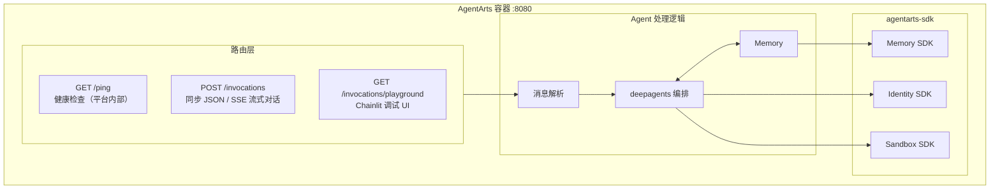

# Service Implementation Plan — Chat Page Design Polish

> **Issue**: `personal-assistant-meta/issues/features/feature-chat-page-design-polish`  
> **Feature Branch**: `feat/chat-page-design-polish`  
> **Plan Author**: personal-assistant-meta-service-planner  
> **Date**: 2026-06-14

---

## 1. Summary

This is a **client-only** visual polish change. The issue requests:

1. Apple-inspired header styling on the Chat Page per `DESIGN.md`
2. A hyperlink from the "Personal Assistant" header text to `/`

Both changes are entirely within the frontend — specifically `personal-assistant-client/src/components/chat/ChatPage.tsx`. No backend API endpoints, no database schema changes, no business logic, and no external service integrations are involved.

**Conclusion: No service changes are needed.**

---

## 2. API Changes

**None.** This issue does not touch any FastAPI routes, Pydantic schemas, or the OpenAPI spec. The existing `POST /invocations` single-path architecture (see [`backend_architecture.md` §2](../../../architecture/backend_architecture.md#22-路由表)) remains unchanged.

| Route | Method | Change |
|-------|--------|--------|
| `POST /invocations` | POST | ❌ No change |
| `GET /ping` | GET | ❌ No change |
| `GET /invocations/playground` | GET | ❌ No change |
| All other routes | — | ❌ No change |

---

## 3. Service Tasks

**None.** No backend code in `personal-assistant-service/` requires modification for this issue.

| Task | Action | Rationale |
|------|--------|-----------|
| Backend API | No action | Chat page header styling and hyperlink are pure client-side rendering |
| Database schema | No action | No data model changes needed |
| Business logic | No action | No agent behavior, memory, or identity changes needed |
| External services | No action | No AgentArts SDK integration changes needed |
| Configuration | No action | No env vars, settings, or `.agentarts_config.yaml` changes needed |
| OpenAPI spec | No action | No API surface change — the `personal-assistant-meta-service-dev` API update step should be skipped |
| API type sync | No action | The `personal-assistant-meta-client-dev` API type sync step should be skipped |

---

## 4. Backend Test Cases

**None.** No backend test additions or modifications are needed.

---

## 5. Architecture Baseline

The backend architecture as documented in [`backend_architecture.md`](../../../architecture/backend_architecture.md) remains unchanged:

> All components above are untouched by this issue.

---

## 6. Client-Side Changes (Reference Only)

For context, the client-side changes are confined to `personal-assistant-client/src/components/chat/ChatPage.tsx`:

1. **Header styling**: Update the `
` to match Apple Design Language per `DESIGN.md` (e.g., 44px height, `bg-surface-black`, white text, no bottom border)
2. **Home hyperlink**: Wrap the "Personal Assistant" `` in an `<a href="/">` tag so it navigates to the Landing Page at `/`

These are implemented by `personal-assistant-client-dev` per the `client-plan.md` — no service-side involvement.

---

## 7. Escalation

No ambiguity to escalate. This is a well-defined client-only change with zero backend impact.
