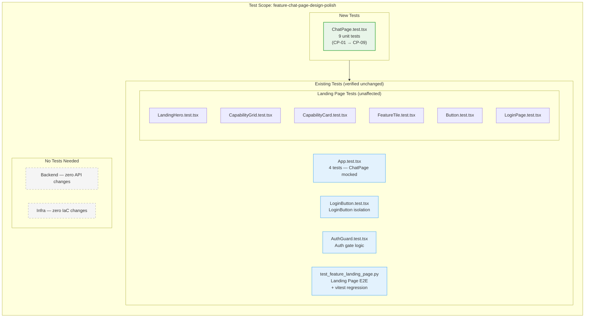
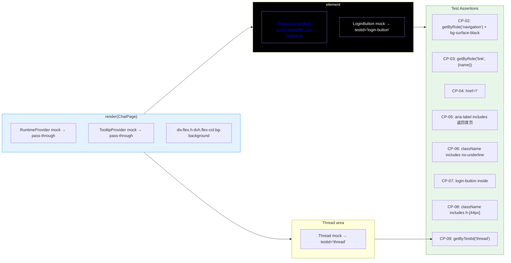

# Test Plan — Chat Page Design Polish + Home Hyperlink

> **Issue**: `feature-chat-page-design-polish`  
> **Feature branch**: `feat/chat-page-design-polish`  
> **Plan type**: Client-only visual change  
> **Plan author**: personal-assistant-meta-test-planner  
> **Date**: 2026-06-14

---

## 1. Scope Summary

This issue modifies a **single file** — `personal-assistant-client/src/components/chat/ChatPage.tsx` — making two changes:

| # | Change | Type |
|---|--------|------|
| 1 | Replace header `<div>` with a `<nav>` matching `global-nav` design (44px height, `bg-surface-black`, 12px white text, no border) | Visual / styling |
| 2 | Wrap "Personal Assistant" label in `<a href="/">` hyperlink with `aria-label` | Markup / accessibility |

**No backend changes** (confirmed by `service-plan.md`), **no infra changes** (confirmed by `infra-plan.md`). All testing is frontend-only.

---

## 2. Backend Test Cases

**None required.** The service-plan confirms zero API, database, or business logic changes. All existing backend routes (`POST /invocations`, `GET /ping`, `GET /invocations/playground`) remain unchanged. No backend tests need to be added or modified.

**Verification**: Existing backend test suite should still pass with zero regressions — run `uv run pytest personal-assistant-service/tests/` as a sanity check, but this is not part of the issue scope.

---

## 3. Frontend Test Cases

### 3.1 New Unit Tests: `ChatPage.test.tsx`

**File**: `personal-assistant-client/src/components/chat/ChatPage.test.tsx` (new)

**Framework**: vitest + @testing-library/react

**Mocking strategy**: Mock all heavy dependencies (`RuntimeProvider`, `Thread`, `TooltipProvider`, `LoginButton`) as pass-through or test-marker components. This is required because `RuntimeProvider` depends on assistant-ui's full runtime context, and `Thread` is a complex AI chat component — both are tested in their own suites.

```tsx
vi.mock("@/components/RuntimeProvider", () => ({
  RuntimeProvider: ({ children }: { children: React.ReactNode }) => <>{children}</>,
}));
vi.mock("@/components/assistant-ui/thread", () => ({
  Thread: () => <div data-testid="thread">Thread</div>,
}));
vi.mock("@/components/ui/tooltip", () => ({
  TooltipProvider: ({ children }: { children: React.ReactNode }) => <>{children}</>,
}));
vi.mock("@/components/LoginButton", () => ({
  LoginButton: () => <div data-testid="login-button">LoginButton</div>,
}));
```

#### Test Case Matrix

| Test ID | Scenario | Assertion | Priority |
|---------|----------|-----------|----------|
| **CP-01** | Component renders without crashing | `render(<ChatPage />)` does not throw | P0 (critical) |
| **CP-02** | Header is a `<nav>` element with `bg-surface-black` | `screen.getByRole("navigation")` exists, its `className` includes `bg-surface-black` | P0 |
| **CP-03** | "Personal Assistant" is rendered as a link | `screen.getByRole("link", { name: /Personal Assistant/ })` exists | P0 |
| **CP-04** | Link has `href="/"` | `getByRole("link").getAttribute("href")` equals `"/"` | P0 |
| **CP-05** | Link has `aria-label` describing home navigation | `getByRole("link").getAttribute("aria-label")` includes `"返回首页"` | P1 (accessibility) |
| **CP-06** | Link has `no-underline` class | Element's `className` includes `no-underline` | P1 |
| **CP-07** | `LoginButton` is rendered inside the `<nav>` | `screen.getByTestId("login-button")` exists, DOM confirms it is a descendant of `<nav>` | P0 |
| **CP-08** | Nav has fixed height 44px via `h-[44px]` | Nav element's `className` includes `h-[44px]` | P1 |
| **CP-09** | `Thread` component is rendered | `screen.getByTestId("thread")` exists (via mock) | P0 |

#### CP-07 Detailed Assertion Strategy

Since `LoginButton` is mocked to render `<div data-testid="login-button">`, CP-07 verifies that this test marker is a descendant of the `<nav>` element. Example:

```tsx
const nav = screen.getByRole("navigation");
const loginBtn = screen.getByTestId("login-button");
expect(nav.contains(loginBtn)).toBe(true);
```

#### Edge Cases to Cover

| Edge Case | Test Approach |
|-----------|--------------|
| Link renders correct text content | `getByRole("link").textContent` equals `"Personal Assistant"` (exact match, trims whitespace) |
| Link does not have default browser underline | Verify `no-underline` class exists (CP-06), or check `getComputedStyle` for `text-decoration: none` |
| Hover class exists | Element's `className` includes `hover:text-white` (optional — can be combined into CP-06 or a separate visual-snapshot test) |
| Transition class exists | Element's `className` includes `transition-colors` |
| Multiple `<nav>` elements don't confuse queries | Use `screen.getByRole("navigation")` — ChatPage renders exactly one `<nav>`, so this is unambiguous |

### 3.2 Existing Tests — Impact Analysis

| Test File | Path | Impact | Action |
|-----------|------|--------|--------|
| `App.test.tsx` | `src/App.test.tsx` | **None** — ChatPage is fully mocked (`vi.mock("./components/chat/ChatPage", ...)` replaces the entire component with `<div data-testid="chat-page">ChatPage</div>`). Internal ChatPage markup changes are invisible to this test. | No action needed; verify test still passes |
| `LoginButton.test.tsx` | `src/components/LoginButton.test.tsx` | **None** — Tests LoginButton in isolation. ChatPage's wrapping in a `<nav>` does not change LoginButton's behavior or props. | No action needed; verify test still passes |
| `AuthGuard.test.tsx` | `src/__tests__/AuthGuard.test.tsx` | **None** — Tests auth gate logic only; renders ChatPage via mock. No ChatPage internals are tested here. | No action needed |
| `RuntimeProvider.test.tsx` | `src/components/RuntimeProvider.test.tsx` | **None** — Tests RuntimeProvider in isolation. | No action needed |
| `LandingPage.test.tsx` | `src/__tests__/` (various) | **None** — All Landing Page tests test components on the unauthenticated path. ChatPage is on the authenticated path. No overlap. | No action needed |
| `LoginPage.test.tsx` | `src/components/landing/LoginPage.test.tsx` | **None** — LoginPage is a separate route. | No action needed |
| `CapabilityGrid.test.tsx`, `CapabilityCard.test.tsx`, `FeatureTile.test.tsx`, `LandingHero.test.tsx`, `Button.test.tsx` | `src/__tests__/` (various) | **None** — All Landing Page component tests. | No action needed |
| E2E — `TestClientUnitTests.test_chat_page_component_exists` | `personal-assistant-e2e/tests/features/test_feature_landing_page.py` | **None** — This test only verifies ChatPage.tsx file exists and is referenced in App.tsx. No markup assertions. | No action needed |

### 3.3 Tests NOT to Write (Out of Scope)

| Why Skip | Rationale |
|----------|-----------|
| Snapshot tests | The project does not currently use snapshot testing. Adding snapshot infrastructure for a single test is not warranted. |
| Visual regression tests (pixel-diff) | Requires visual regression tooling (e.g., Percy, Chromatic) not present in the project. Manual visual verification is sufficient (§5). |
| `LoginButton` dark-background styling tests | `LoginButton` is a shared component; its appearance on black background is noted as a follow-up concern in the client-plan (§10). Changing LoginButton for dark backgrounds is out of scope. |
| `GlobalNav.tsx` consistency tests | Updating GlobalNav to match ChatPage's more accurate typography (`tracking-[-0.12px]`, `leading-none`) is out of scope per client-plan §10. |

---

## 4. E2E Scenarios

### 4.1 Assessment

This is a **client-only visual change**. The Chat Page E2E path requires an authenticated MSAL session, which adds complexity beyond what this purely visual change warrants. However, the following E2E considerations apply:

### 4.2 Existing E2E Tests — Impact

| Test File | Impact | Action |
|-----------|--------|--------|
| `tests/features/test_feature_landing_page.py` | **None** — This suite tests the Landing Page (unauthenticated path) via Playwright. The Chat Page is only rendered when `isAuthenticated=true`. None of the Landing Page assertions touch ChatPage markup. | No action needed |
| `TestClientUnitTests.test_vitest_all_tests_pass` | **Indirect** — This regression test runs `npx vitest run` and expects all tests to pass. The new ChatPage.test.tsx will increase the total test count. The current assertion expects ≥95 tests; adding 9 tests should keep the total above this threshold. | Verify the test count increases (but still ≥95) after ChatPage.test.tsx is added |
| `TestClientUnitTests.test_chat_page_component_exists` | **None** — Only checks file existence and App.tsx import. No DOM assertions. | No action needed |
| All other E2E test files | **None** — No other E2E tests interact with ChatPage. | No action needed |

### 4.3 Recommended E2E Additions

Given the low risk of this change and the authentication barrier for testing ChatPage in E2E, **no new E2E test file is recommended**. If the team later adds E2E infrastructure for authenticated ChatPage sessions, the following scenarios should be added:

| Priority | Scenario | Description |
|----------|----------|-------------|
| P2 (nice-to-have) | ChatPage nav bar renders on authenticated session | After MSAL login, verify `<nav>` element with `bg-surface-black` class exists on ChatPage |
| P2 (nice-to-have) | "Personal Assistant" link navigates to root | Click the `<a href="/">` in ChatPage header → page reloads to root, MSAL re-authenticates from cache, ChatPage re-renders (or LandingPage if session expired) |
| P3 (future) | Console has no errors after ChatPage render | Verify no JS errors in console when ChatPage mounts (similar to `test_landing_page_has_no_console_errors`) |

### 4.4 Setup Requirements (for future E2E)

When authenticated ChatPage E2E tests are added:

- **Services to start**: Vite dev server (`npm run dev`), no backend needed for visual-only tests
- **Environment variables**: `VITE_ENTRA_CLIENT_ID`, `VITE_ENTRA_AUTHORITY`, `VITE_ENTRA_REDIRECT_URI` must be set for MSAL to initialize in non-dev mode
- **Test infrastructure**: Playwright browser context with MSAL redirect interception (as done in existing Landing Page tests), plus MSAL token injection or mock for pre-authenticated state

---

## 5. Regression Cases

**Not applicable.** This issue is a feature (visual polish), not a bug fix. There is no original bug to reproduce.

---

## 6. Test Execution Strategy

### 6.1 During Development (personal-assistant-client-dev)

```bash
# Run only the new ChatPage tests (fast feedback loop)
npx vitest run src/components/chat/ChatPage.test.tsx
```

**Expected**: All 9 tests (CP-01 through CP-09) pass.

### 6.2 Before Commit (personal-assistant-client-tester)

```bash
# Full unit test suite
npx vitest run

# Type checking
npm run typecheck

# Build verification (ensures Tailwind classes resolve correctly)
npm run build
```

**Expected**:
- All vitest tests pass (existing 100+ tests + 9 new ChatPage tests)
- TypeScript compilation succeeds with no errors
- `npm run build` produces valid `dist/` output

### 6.3 After Commit (personal-assistant-e2e-tester)

```bash
# Run full E2E suite (includes TestClientUnitTests regression)
pytest personal-assistant-e2e/ -m feature
```

**Expected**: `TestClientUnitTests.test_vitest_all_tests_pass` still passes (exit code 0). The total vitest test count will have increased due to the new ChatPage.test.tsx.

### 6.4 Visual Verification (Manual)

Per client-plan §9 Task 4 — developer manually verifies in browser:

| # | Check | Expected |
|---|-------|----------|
| V-1 | Authenticated state | ChatPage shows black nav bar (`#000000`), 44px tall |
| V-2 | Brand link position | "Personal Assistant" link on left side of nav |
| V-3 | LoginButton position | `LoginButton` on right side of nav |
| V-4 | Hover state | Hover over "Personal Assistant" → text brightens from `white/90` to solid `white`, cursor changes to pointer |
| V-5 | Click behavior | Click "Personal Assistant" → page reloads to `/`, MSAL re-authenticates from cache |
| V-6 | No decoration | No border, no shadow, no gradient visible on the nav bar |
| V-7 | Dev mode | When `VITE_ENTRA_CLIENT_ID` is unset, `LoginButton` shows "Dev Mode — Proxy auth enabled" on black background |
| V-8 | Layout | Chat thread area fills remaining viewport height below the 44px nav (no overflow or whitespace gap) |

---

## 7. Test Coverage Diagram



### Test Flow: ChatPage Rendering & Assertions



---

## 8. Risk & Mitigation

| Risk | Likelihood | Impact | Mitigation in Testing |
|------|-----------|--------|-----------------------|
| Tailwind class `bg-surface-black` not resolving | Low | Medium — nav bar appears with default/transparent background | CP-02 verifies class exists; `npm run build` confirms CSS generation; visual verification V-1 catches it |
| Arbitrary value classes (`h-[44px]`, `text-[12px]`, `tracking-[-0.12px]`) cause build failure | Low | High — build breaks | `npm run typecheck` and `npm run build` in execution strategy catch this |
| `<a href="/">` causes full page reload, breaking React state | Low | Medium — user loses in-progress chat | Visual verification V-5; this is expected behavior (no client-side router) and documented in client-plan §5 |
| `aria-label` missing or incorrect, breaking screen reader navigation | Low | Medium — accessibility regression | CP-05 verifies `aria-label` includes expected text |
| Existing `App.test.tsx` mock breaks if ChatPage export changes | Low | Medium — but export does not change (still `export default ChatPage`) | Verified by impact analysis (§3.2); test still passes as-is |

---

## 9. Pass/Fail Criteria

### For personal-assistant-client-tester

**All must pass:**

1. `npx vitest run src/components/chat/ChatPage.test.tsx` → all 9 tests pass (CP-01 through CP-09)
2. `npx vitest run` → all existing tests + new tests pass (no regressions)
3. `npm run typecheck` → zero TypeScript errors
4. `npm run build` → build succeeds (Tailwind CSS generation includes all new classes)

### For personal-assistant-e2e-tester

**All must pass:**

1. `pytest personal-assistant-e2e/ -m feature` → all feature E2E tests pass
2. `TestClientUnitTests.test_vitest_all_tests_pass` → exit code 0, test count ≥ 95

### For personal-assistant-e2e-reviewer

- Verify ChatPage.test.tsx exists at the expected path
- Verify no existing tests were removed or incorrectly modified
- Verify mock strategy is correct (no real RuntimeProvider/Thread instantiation in unit tests)

---

## 10. Test File Checklist

| File | Action | Path |
|------|--------|------|
| `ChatPage.test.tsx` | **Create** | `personal-assistant-client/src/components/chat/ChatPage.test.tsx` |
| `App.test.tsx` | Verify pass (no changes) | `personal-assistant-client/src/App.test.tsx` |
| `LoginButton.test.tsx` | Verify pass (no changes) | `personal-assistant-client/src/components/LoginButton.test.tsx` |
| `AuthGuard.test.tsx` | Verify pass (no changes) | `personal-assistant-client/src/__tests__/AuthGuard.test.tsx` |
| All `__tests__/` files | Verify pass (no changes) | `personal-assistant-client/src/__tests__/*.test.tsx` |
| E2E landing page | Verify pass (no changes) | `personal-assistant-e2e/tests/features/test_feature_landing_page.py` |
