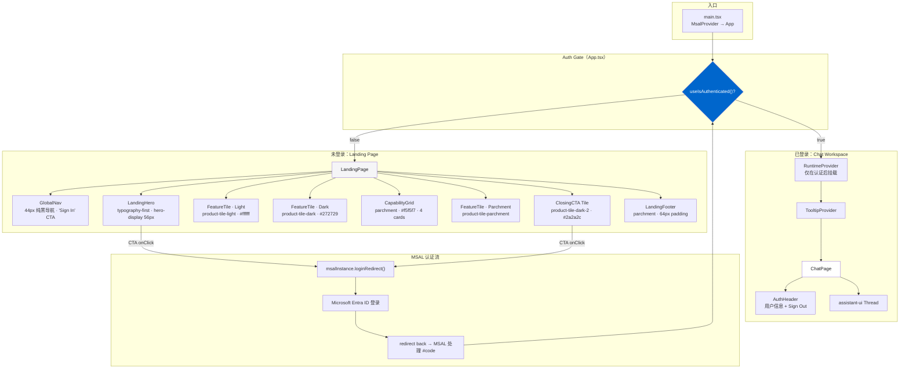
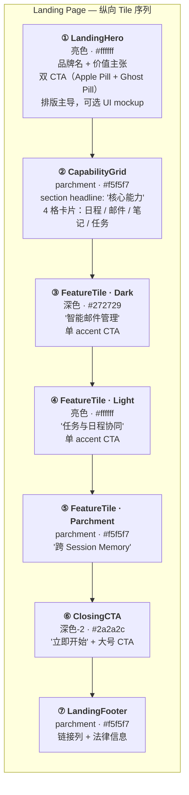
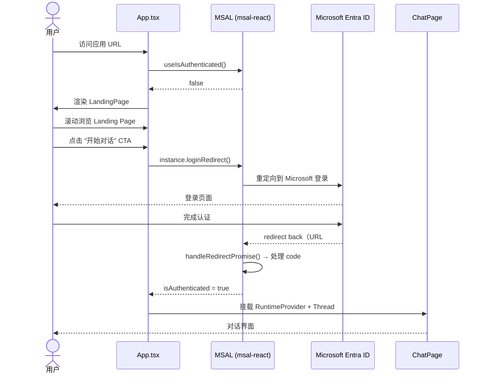
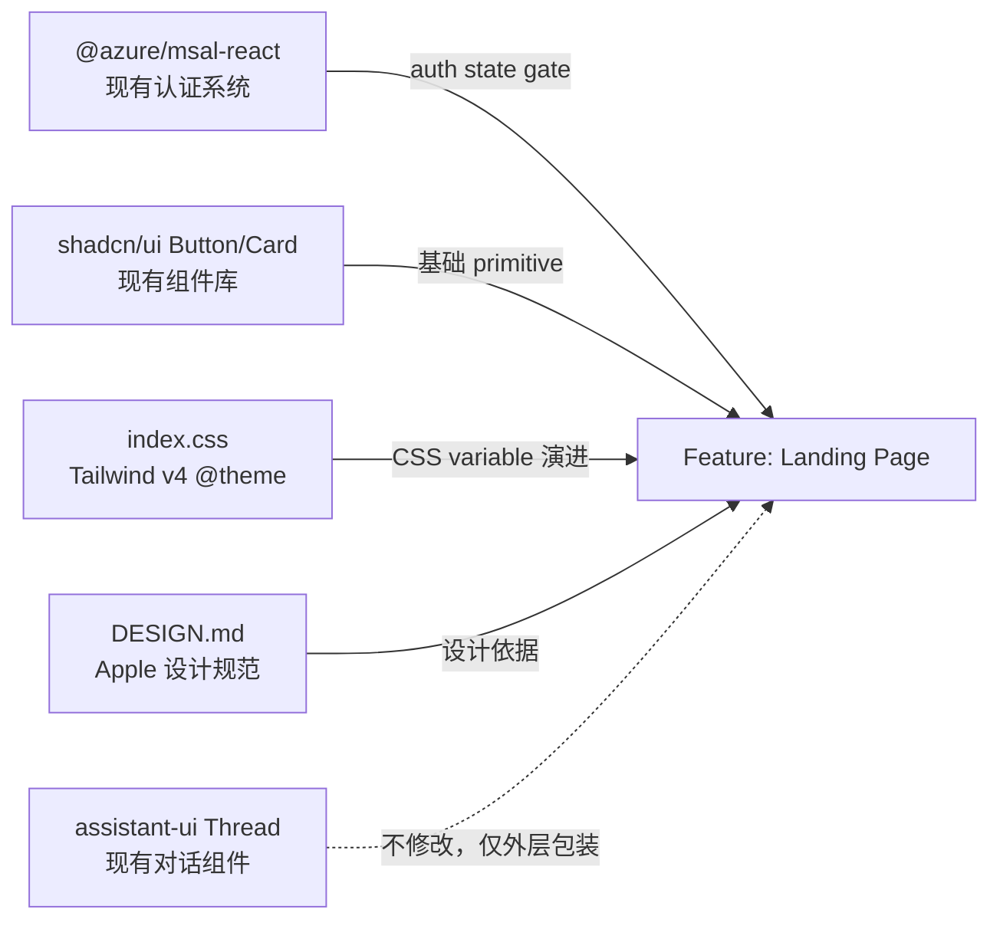

# Landing Page — Apple Design Language 前端首页

## Motivation

当前 `personal-assistant-client` 没有 Landing Page。`App.tsx` 直接渲染 `RuntimeProvider → Thread`，未登录用户仅看到一行 "请登录以开始对话" 的提示。这缺失了：
- **产品介绍**：用户无法在登录前了解 Assistant 能做什么
- **品牌建立**：无视觉 identity，无价值主张展示
- **转化引导**：无清晰的 CTA 引导用户完成首次登录/对话

本项目已有一份完整的 Apple 设计语言分析文档 [`personal-assistant-client/DESIGN.md`](../../personal-assistant-client/DESIGN.md)，定义了色彩、排版、间距、组件规范和设计哲学。本次变更基于该设计系统，为其构建一个**遵循 Apple 设计语言的 Landing Page**，在用户登录前展示产品价值，登录后无缝进入对话界面。

## Scope

### In Scope
- 新建 Landing Page 组件树（`src/components/landing/`），包含 Hero、Feature Tile、Capability Grid、Footer
- 基于 `isAuthenticated` 状态的页面分流逻辑（未登录→Landing，已登录→Chat）
- CSS Theme 演进：将 `--primary` 从 `#007AFF` 改为 DESIGN.md 的 `#0066cc`（Action Blue）
- 新增 Apple 表面颜色 token（parchment、dark tiles）到 Tailwind v4 `@theme`
- 排版覆写：body 17px（非 16px）、headline 负字间距、weight 500→600 重映射
- Apple Pill Button 变体（`rounded-full`、`active:scale-95`、padding 11px×22px）
- 响应式布局，遵循 DESIGN.md 断点（1440/1068/833/734/640/480px）
- 端到端流程验证：用户访问 → 浏览 Landing → 点击 CTA → MSAL 登录 → 进入 Chat

### Out of Scope
- 引入 `react-router` 做页面路由（本次用 auth 状态条件渲染；后续 OBS CDN 配置完成后迁移）
- 重写 `assistant-ui` Thread 组件样式（仅做外层 layout 包装）
- 产品摄影/插图资产的最终产出（使用 typography-first + UI mockup 策略，资产待 Meta 阶段定稿）
- Landing Page 的暗色模式（本次仅实现亮色主题，与 DESIGN.md 分析的 Apple 默认白天模式一致）
- 飞书/OfficeClaw 渠道的 Landing Page（仅 Web Chat 渠道）

## 设计

### Architecture

> 基于 auth 状态的条件渲染：`isAuthenticated === false` → LandingPage，`true` → ChatPage。RuntimeProvider 仅在认证后挂载，避免未认证时初始化 assistant-ui 适配器。



### Tile Sequence（页面纵向节奏）

> 遵循 Apple 的亮暗交替节奏——颜色变化即为分割线。全出血（full-bleed）tile，`rounded.none`，`gap: 0`。



### Auth Flow（认证流程）



### Dependencies

> 本 Feature 依赖的现有系统组件和外部条件。



## Acceptance Criteria

- [ ] 未登录用户访问应用时，展示完整的 Landing Page（非白屏或单行提示）
- [ ] Landing Page 包含：Hero（品牌 + CTA）、至少 3 个 Feature Tile（亮/暗交替）、Capability Grid（4 卡片）、Footer
- [ ] 所有 CTA 按钮点击触发 `msalInstance.loginRedirect()`，跳转 Microsoft Entra ID 登录
- [ ] 登录成功后自动切换到 ChatPage（`RuntimeProvider` + `Thread`），无需手动刷新
- [ ] Tailwind v4 `@theme` 包含 DESIGN.md 定义的表面颜色 token（`canvas-parchment`、`surface-tile-1/2/3`、`surface-black`）
- [ ] `--primary` CSS variable 值为 `#0066cc`（Action Blue），替代原有的 `#007AFF`
- [ ] Button 组件新增 `apple-primary` 和 `apple-secondary` 变体（pill 形状、`active:scale-95`）
- [ ] Body 基础字号为 17px（非 16px），headline 带负字间距（`-0.28px`）
- [ ] 全出血 tile 无圆角、无阴影、无装饰性渐变
- [ ] 页面在 480px–1440px 范围内响应式正常，导航栏在 ≤833px 折叠
- [ ] `RuntimeProvider` 仅在 `isAuthenticated === true` 时挂载，未登录时不初始化
- [ ] 现有 Chat 功能（assistant-ui Thread）不受影响，登录后对话正常工作
- [ ] TypeScript 编译无错误，`npm run build` 成功
- [ ] 现有测试（`LoginButton.test.tsx`、`RuntimeProvider.test.tsx`）全部通过

## Four-Question Gate

| Question | Answer | Notes |
|----------|--------|-------|
| **Is it best practice?** | **Yes**（含 documented trade-off） | 组件化拆分（LandingPage / ChatPage 分离）、auth-gated RuntimeProvider 挂载、主题 token 化均符合最佳实践。**架构 trade-off**：采用条件渲染而非 react-router 做页面分流——这是因为 OBS 静态托管不原生支持 SPA fallback（需 CDN rewrite 配置）且 MSAL redirect hash 与 HashRouter 存在冲突。此选择是**有文档记录的临时偏离**，已在代码中预留向 react-router 迁移的结构（独立的 Page 组件、清晰的 auth gate）。详见 §Notes 迁移路径。 |
| **Is it de facto standard?** | **Yes** | Apple 设计语言是全球顶级消费界面的事实标准。Landing Page → auth gate → app workspace 的 SaaS 模式被 OpenAI ChatGPT、Anthropic Claude、Notion AI 等广泛采用。单 accent 色、pill CTA、亮暗交替 tile 均源自 Apple 生产系统（apple.com）。CSS variable + Tailwind v4 @theme 是当前主流前端工程的 token 管理方式。 |
| **Is it conventional?** | **Yes** | Hero → Features Grid → Feature Tiles → CTA → Footer 是 Landing Page 最经典的内容结构。Auth 状态条件渲染在小型 SPA（<3 个页面）中是常规做法。新成员看到 `<LandingPage />` / `<ChatPage />` 的命名和 `App.tsx` 中的 auth gate 可立即理解页面分流逻辑。 |
| **Is it modern?** | **Yes** | React 19 + Tailwind CSS v4 + shadcn/ui 是 React 前端领先技术栈。Apple 2024–2025 的 Web 设计语言（hero-display 56px 负字间距、单一 Action Blue、全出血 tile）代表当前界面设计前沿。`active:scale-95` 微交互、`backdrop-filter: blur` frosted nav、CSS `@theme` 自定义 token 均为现代 CSS 实践。 |

## Affected Architecture Docs

- `personal-assistant-meta/architecture/frontend_architecture.md` — 需新增 §2.1.3 Landing Page 小节

## Notes

### Design Translation 策略

Apple 设计语言原生于 **e-commerce**（产品摄影→产品 tile）。向 AI Assistant 的映射如下：

| Apple 电商原语 | AI Landing 翻译 | 视觉策略 |
|---|---|---|
| 产品摄影（iPhone/Mac） | 品牌排版 + 可选 UI mockup | typography-first hero；若 Meta 阶段产出 mockup，可置于 hero 底部带系统唯一 drop-shadow |
| Product Tile（亮/暗交替） | Feature Tile：每个 tile 展示一项核心能力 | 标题 + 描述 + 可选示意图 + 单 accent CTA |
| Store Utility Card Grid | Capability Grid：4 格能力卡片 | `{rounded.lg}` 18px、hairline 边框、icon + 标题 + 描述 |
| Buy / Learn More CTA | 开始对话 / 了解更多 | Apple Pill Button（`rounded-full`、`#0066cc`、`active:scale-95`） |
| 产品规格对比 | 集成与安全说明 | parchment tile 上的 grid 展示 Microsoft 365 集成、Entra ID 认证等 |

### CSS Theme 演进（非重写）

**Step 1** — 更新 `--primary`：
```css
:root {
  --primary: 210 100% 40%;  /* #0066cc → HSL，兼容 shadcn */
  --primary-foreground: 0 0% 100%;
}
```

**Step 2** — 添加 Apple 表面颜色：
```css
@theme {
  --color-canvas-parchment: #f5f5f7;
  --color-surface-tile-1: #272729;
  --color-surface-tile-2: #2a2a2c;
  --color-surface-tile-3: #252527;
  --color-surface-black: #000000;
  --color-primary-focus: #0071e3;
  --color-primary-on-dark: #2997ff;
}
```

**Step 3** — 排版覆写：
```css
@theme {
  --font-weight-medium: 600;  /* weight 500 → 600 重映射 */
}
@layer base {
  html, body {
    font-size: 17px;
    line-height: 1.47;
    letter-spacing: -0.374px;
  }
}
```

### 向 react-router 的迁移路径

当前选择条件渲染（非 router）是基于 OBS + MSAL 的实际约束。迁移计划：

1. **Infra 前置任务**：配置 OBS CDN 将所有路径 fallback 到 `index.html`（标准 SPA rewrite 规则）
2. **代码已就绪**：`<LandingPage />` 和 `<ChatPage />` 已是独立组件，迁移仅需将 `App.tsx` 中的三元表达式替换为 `<BrowserRouter>` + `<Routes>`
3. **时机**：CDN rewrite 部署完成后，在后续 iteration 中完成迁移（预计 ~20 行改动）

### 风险与缓解

| 风险 | 缓解 |
|------|------|
| **MSAL redirect 后短暂白屏**：登录回调 → React rehydrate 之间有间隙 | `App.tsx` 中检查 `msalInstance` 的 `inProgress` 状态，显示 Apple-style loading spinner |
| **两种蓝色并存（旧 `#007AFF` vs 新 `#0066cc`）** | 统一为 `#0066cc`。shadcn 组件自动继承 `--primary` 变更，无需逐一修改 |
| **assistant-ui 样式冲突**：Typography 覆写可能影响 Thread 内部 | 将 Apple 排版覆写限制在 `.landing-page` 作用域内（使用 CSS `@scope` 或 wrapper class），避免污染 assistant-ui 内部样式 |
| **非 Apple 平台渲染差异**：SF Pro 字体、hairline 边框、backdrop-filter | Geist Variable 已安装作为 fallback 字体；hairline 最小设为 1px（非 Retina 屏幕通过 media query）；backdrop-filter 在不支持的浏览器上 fallback 为纯色背景 |
| **首屏性能**：Landing Page 和 Chat 组件都被打包 | 使用 `React.lazy()` + `<Suspense>` 对 `<LandingPage />` 做 code splitting——未登录用户加载 Landing，已登录用户加载 Chat |

## Advisor Reports（supporting data）

<details>
<summary>DeepSeek Report</summary>

### Key Findings
- 目前没有 Landing Page，App.tsx 直接渲染 Thread。未登录体验缺失。
- Apple 设计语言需要从 e-commerce 映射到 AI 领域：产品→能力，产品摄影→排版/UI mockup。
- 不引入 react-router 是最实际的做法（SPA 仅 2 个视图，MSAL hash 与 HashRouter 冲突）。
- assistant-ui Thread 组件实例化成本高，应在 auth 后才挂载 RuntimeProvider。
- 现有 shadcn Button 不支持 Apple pill 语法，需新增变体。

### Architecture Recommendation
基于 auth 状态的条件渲染：
```
App.tsx
├── isAuthenticated === false → <LandingPage />（不挂载 RuntimeProvider）
└── isAuthenticated === true  → <RuntimeProvider> → <ChatPage />
```

### Component Breakdown
- `LandingPage.tsx` — 顶层容器
- `LandingHero.tsx` — Hero tile（typography-first，hero-display 56px）
- `FeatureTile.tsx` — 可复用 tile（variant: light/parchment/dark/dark-2）
- `FeatureGrid.tsx` — parchment tile 上的能力网格
- `CapabilityCard.tsx` — 网格中的单张卡片（store-utility-card 样式）
- `LandingFooter.tsx` — footer

### Tile Sequence
1. Hero（亮色）→ 2. Capability Grid（parchment）→ 3. Feature Tile（深色）→ 4. Feature Tile（亮色）→ 5. Closing CTA（深色-2）→ 6. Footer（parchment）

### Four-Question Gate: All Yes
（详见 DeepSeek 完整报告）

</details>

<details>
<summary>Gemini Report</summary>

### Key Findings
- AI 场景下用高精度 UI Mockup、卡片化交互过程、极简抽象动画替代实体硬件摄影。
- 严格执行色彩交替（Light ↔ Dark）代替显式分割线。
- 整页仅一种彩色：Action Blue `#0066cc`；深色 tile 上升级为 Sky Link Blue `#2997ff`。
- 所有 Button 强制使用 `transform: scale(0.95)` 点击微交互。

### Architecture Recommendation
基于 auth 状态的条件渲染，与 DeepSeek 一致。强调 SubNavFrosted 粘性毛玻璃二级导航。

### Design Translation
详细的 Apple 电商 → AI Landing 映射表（Integration Registry、Privacy & Trust section 等）。

### Component Breakdown
- `GlobalNav`（44px 纯黑）
- `SubNavFrosted`（52px 粘性毛玻璃）
- `HeroTile`（min-h-[85vh]，大视口 AI Workspace Mockup 配合系统 drop-shadow）
- `CapabilityTile`（Props: theme, title, tagline, imageSrc, reverse, ctaText）
- `IntegrationGrid`（18px 圆角卡片）
- `Footer`（高密度链接网格，leading-[2.41]）

### Risks
- MSAL Auth 回调与 SPA 状态撕裂
- 高保真 Mockup 图片的性能载荷（需 WebP + aspect-ratio 占位 + lazy loading）
- Tailwind v4 与 DESIGN.md token 引用的一致性

### Four-Question Gate: All Yes
（详见 Gemini 完整报告）

</details>

<details>
<summary>GPT Report</summary>

### Key Findings
- 最佳方案：创建独立的未登录 Landing Page，登录后进入现有 Thread chat。
- 不要深度重写 assistant-ui，仅用 Apple 风格 layout/navigation 包装。
- Landing Page 应为 typography-first + 一个高质量 chat/product mockup。
- CTA 单一明确："开始对话"/"登录后开始"，使用 MSAL login。

### Architecture Recommendation
基于 auth 条件渲染（与 DeepSeek/Gemini 一致），结构为：
```
<App> → <AppChrome> → isAuthenticated ? <ChatApp /> : <LandingPage />
```

### Component Structure
- `src/components/layout/` — AppChrome, GlobalNav, Footer
- `src/components/landing/` — LandingPage, HeroSection, CapabilityTile, CapabilityTiles, AssistantPreview, TrustPrivacySection, ChannelSection, FinalCTA
- `src/components/chat/` — ChatApp, ChatHeader

### Risks
- assistant-ui styling mismatch（wrap, don't rewrite）
- OBS static hosting routing（avoid BrowserRouter unless CDN fallback configured）
- shadcn/ui default shadows/borders 可能违反 DESIGN.md
- Color conflict: 当前 `#007AFF` vs DESIGN.md `#0066cc`

### Four-Question Gate: All Yes
（详见 GPT 完整报告）

</details>

<details>
<summary>Hermes Report</summary>

### Key Findings
- 条件渲染（Option A）在可用性上最务实（避免 OBS 404、消除 MSAL hash 冲突、clean RuntimeProvider lifecycle）。
- 但 Four-Question Gate 严格评估：条件渲染在"最佳实践""行业标准""常规做法""现代性"四项上均获 No——因为 state-driven page switching 违反 Separation of Concerns。
- 提出 **Hybrid 方案**：立即用条件渲染实现 Landing Page，同时结构化代码为后续 react-router 迁移做好准备。

### Design Translation
- Core Insight：电商的"产品"是物理对象，AI Assistant 的"产品"是用户的 augmented life。
- Hero 替代方案：Ambient Day-at-a-Glance Widget、Active Drafting Canvas、Pulse Ring。
- Tile 替换：Command Center / Inbox Outpost / Knowledge Vault / Delegation Core（亮暗交替）。
- 无产品摄影时的 material realism 策略：文字/代码/日历块作为带系统 shadow 的物理对象、纹理背景、氛围摄影。

### Component Breakdown（11 个组件）
1. LandingPage, 2. GlobalNav, 3. LandingHero, 4. FeatureTile, 5. CapabilityCard, 6. CapabilityGrid, 7. ChatSimulator, 8. PrimaryCTA, 9. SecondaryCTA, 10. LandingFooter, 11. ChatPage

### Four-Question Gate: 条件渲染获 Partial（架构上），但设计获 Yes。迁移路径恢复全 Yes。
（详见 Hermes 完整报告及 5 个 hermes CLI session 的原始输出）

</details>
