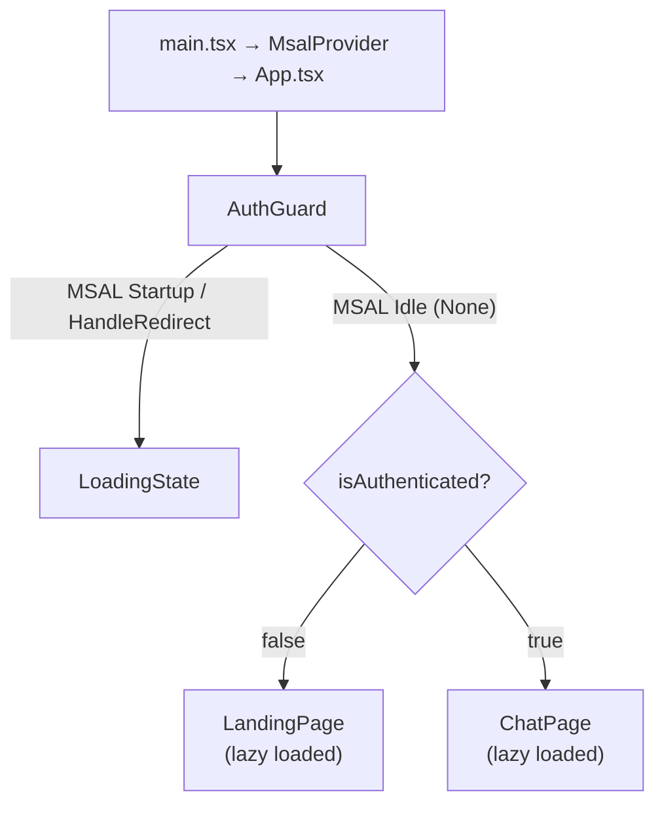
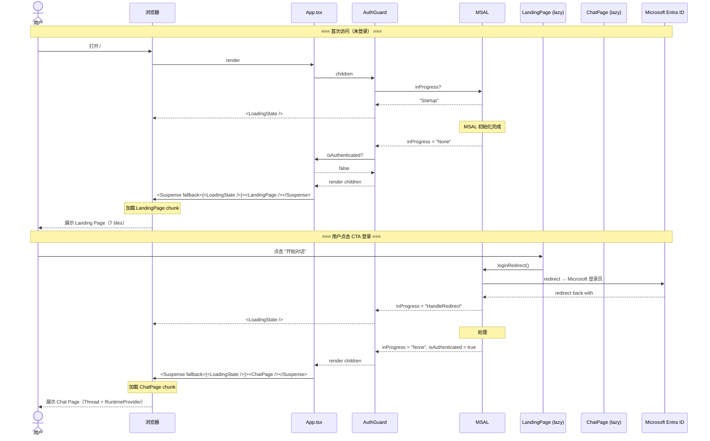

# Implementation Plan — Landing Page（Apple Design Language 前端首页）

> **Issue**: `personal-assistant-meta/issues/features/feature-landing-page/issue.md`  
> **Feature Branch**: `feat/feature-landing-page`  
> **Plan Author**: personal-assistant-meta-dev  
> **Date**: 2026-06-13

---

## 0. Issue Evaluation

| 维度 | 结果 | 说明 |
|------|------|------|
| Staleness | ✅ | 全新 feature，引用的 `frontend_architecture.md`、`DESIGN.md` 均存在且内容匹配 |
| Feasibility | ✅ | 技术路径明确：AuthGuard（MSAL InteractionStatus）→ CSS theme 扩展 → 组件分层实现。所有依赖已就绪（MSAL、Tailwind CSS v4、shadcn Button、辅助 UI Thread） |
| Completeness | ✅ | Issue 包含完整的组件规格、TypeScript prop 类型、CSS 变更、12 条验收标准 |
| Impact Scope | ✅ | 纯 Client 侧变更。Service 侧零改动。影响范围：11 个新文件 + 3 个修改文件 + 1 个架构文档更新 |
| ADR 冲突 | ✅ | 与 ADR-008（Vite+React+Tailwind）、ADR-013（assistant-ui）、ADR-007（MSAL Entra ID）均无冲突。不修改 Thread 内部，不引入新路由框架 |

**判定：ACCEPT** → 继续编写 Implementation Plan。

---

## 1. Summary

当前 `App.tsx` 直接渲染 `RuntimeProvider → Thread`，未登录用户仅看到"请登录以开始对话"一行提示。本次变更为 Web Chat 添加遵循 Apple Design Language（[`DESIGN.md`](../../../personal-assistant-client/DESIGN.md)）的 Landing Page：

- **7-tile 序列**：LandingHero → CapabilityGrid → FeatureTile (Dark) → FeatureTile (Light) → FeatureTile (Parchment) → ClosingCTA → LandingFooter
- **AuthGuard**：基于 MSAL `InteractionStatus` 防止 redirect 回调期间 Landing Page 闪现
- **Code Splitting**：`React.lazy()` + `<Suspense>` 分离 Landing Page 和 Chat Page 代码块
- **RuntimeProvider 延迟挂载**：仅在 ChatPage 中挂载，避免未登录用户加载 assistant-ui 依赖
- **CSS Theme 演进**：`--primary → #0066cc` + Apple 表面颜色 token + 17px body 基准
- **Apple Pill Button**：shadcn Button 新增 `apple-primary` / `apple-secondary` 变体

纯前端改动，无 API 变更。

---

## 2. Files Changed

### New Files（10 个，`personal-assistant-client/src/`）

| # | File Path | Type | Description |
|---|-----------|------|-------------|
| 1 | `components/landing/AuthGuard.tsx` | New | MSAL `InteractionStatus` 认证状态 gate；transition 期间渲染 LoadingState |
| 2 | `components/landing/LoadingState.tsx` | New | Apple-style 简约 spinner，仅供 AuthGuard transition 和 Suspense fallback 使用 |
| 3 | `components/landing/GlobalNav.tsx` | New | 44px 纯黑全局导航栏，右侧 "登录" 按钮触发 MSAL login redirect；≤833px 仅保留登录按钮 |
| 4 | `components/landing/LandingPage.tsx` | New | Landing Page 顶层容器，编排 GlobalNav + 7-tile 序列，注入 login CTA handler |
| 5 | `components/landing/LandingHero.tsx` | New | 首屏 Hero tile（typography-first，56px hero-display，双 CTA Pill Button） |
| 6 | `components/landing/FeatureTile.tsx` | New | 可复用全出血 tile（variant: `light` / `parchment` / `dark` / `dark-2`） |
| 7 | `components/landing/CapabilityCard.tsx` | New | 单张能力卡片（store-utility-card 样式，18px 圆角，hairline 边框） |
| 8 | `components/landing/CapabilityGrid.tsx` | New | 响应式能力卡片网格（1/2/4 列自适应） |
| 9 | `components/landing/ClosingCTA.tsx` | New | 薄包装组件：复用 `<FeatureTile variant="dark-2">` 渲染最后的 CTA tile |
| 10 | `components/landing/LandingFooter.tsx` | New | 页脚（parchment 背景，链接列 + 法律信息） |

### New File（1 个，`personal-assistant-client/src/`）

| # | File Path | Type | Description |
|---|-----------|------|-------------|
| 11 | `components/chat/ChatPage.tsx` | New | 从 `App.tsx` 提取的 Chat 页面（RuntimeProvider + TooltipProvider + Thread + 顶栏），用于 lazy loading |

### Modified Files（3 个，`personal-assistant-client/src/`）

| # | File Path | Type | Description |
|---|-----------|------|-------------|
| 12 | `App.tsx` | Modified | 重构为 AuthGuard + Suspense + 条件渲染（LandingPage vs ChatPage lazy） |
| 13 | `index.css` | Modified | `--primary → #0066cc`；新增 Apple 表面颜色 `@theme` token；body font-size 17px |
| 14 | `components/ui/button.tsx` | Modified | CVA 变体新增 `apple-primary` 和 `apple-secondary` |

### Modified Meta File（1 个）

| # | File Path | Type | Description |
|---|-----------|------|-------------|
| 15 | `personal-assistant-meta/architecture/frontend_architecture.md` | Modified | 新增 §2.1.3 Landing Page 小节 |

### Files NOT Changed

| File | Reason |
|------|--------|
| `main.tsx` | MsalProvider 包裹结构不变 |
| `lib/auth.ts` | MSAL 配置不变 |
| `stores/auth-store.ts` | Zustand token store 不变 |
| `components/LoginButton.tsx` | 登录按钮逻辑不变（移至 ChatPage 内使用） |
| `components/RuntimeProvider.tsx` | 组件不变，仅调用位置从 App 移到 ChatPage |
| `components/assistant-ui/thread.tsx` | 不修改 assistant-ui Thread 内部 |

---

## 3. Implementation Steps

> 步骤顺序已按依赖关系排列：CSS 主题和 Button 变体是所有视觉组件的基础，AuthGuard + LoadingState 是 App 重构的基础，组件从叶子到容器逐层构建。

### Step 1 — CSS Theme：更新 `--primary` 并新增 Apple 表面颜色 token

**File**: `personal-assistant-client/src/index.css`

**Actions**:

1. 将 `:root` 中的 `--primary` 从 `#007AFF` 改为 `210 100% 40%`（HSL，对应 `#0066cc`），同步更新 `--primary-foreground`、`--ring`、`--chart-1`、`--sidebar-primary`、`--sidebar-ring`
2. 在现有 `@theme inline { ... }` 块之后新增一个 `@theme { ... }` 块，定义 Apple 表面颜色 token：
   ```css
   @theme {
     --color-canvas-parchment: #f5f5f7;
     --color-surface-tile-1: #272729;
     --color-surface-tile-2: #2a2a2c;
     --color-surface-tile-3: #252527;
     --color-surface-black: #000000;
     --font-weight-medium: 600;
   }
   ```
3. 在 `@layer base` 块中追加全局排版覆写：
   ```css
   @layer base {
     /* ... existing rules remain ... */
     html, body {
       font-size: 17px;
       line-height: 1.47;
       letter-spacing: -0.374px;
     }
   }
   ```
   ⚠️ **Risk note**: 此改动为全局生效。若 assistant-ui Thread 内部排版出现偏移，应在后续 issue 中通过 `.landing-page` scope 限制或对 Thread 内部做局部 reset。

**Verification**: `grep --color=always "210 100% 40%" index.css` 确认 primary 值已更新；`grep "canvas-parchment" index.css` 确认新 token 存在；`npm run dev` 启动无 CSS 编译错误。

---

### Step 2 — Button Variants：添加 `apple-primary` 和 `apple-secondary`

**File**: `personal-assistant-client/src/components/ui/button.tsx`

**Actions**:

在 `buttonVariants` 的 `variant` 对象中新增两个条目：

```ts
apple-primary:
  "bg-[#0066cc] text-white rounded-full px-[22px] py-[11px] text-[17px] leading-[1.47] tracking-[-0.374px] active:scale-95 transition-transform hover:bg-[#0071e3]",
apple-secondary:
  "bg-transparent text-[#0066cc] border border-[#0066cc] rounded-full px-[22px] py-[11px] text-[17px] leading-[1.47] tracking-[-0.374px] active:scale-95 transition-transform hover:bg-[#0066cc]/10",
```

注意：`rounded-full` 覆盖基类 `rounded-lg`；`text-[17px]` 覆盖基类 `text-sm`；`hover:bg-[#0071e3]` 使用 Apple 的 `primary-focus` 色。`transition-transform` 有意覆盖基类 `transition-all`——Apple pill button 的 micro-interaction 仅需 scale transform 动画，不应有 color/background 的过渡。

**Verification**: TypeScript 编译通过 — `variant="apple-primary"` 类型应在 `VariantProps<typeof buttonVariants>` 推断范围之内。

---

### Step 3 — `LoadingState` 组件

**File**: `personal-assistant-client/src/components/landing/LoadingState.tsx` (New)

**Spec**:
- 全屏居中布局（`h-dvh`），白色背景
- 一个简约的居中 spinner：Apple 风格用小号 `animate-spin` 圆环、颜色 `text-[#0066cc]/60`、尺寸 24×24px
- 无文字，无额外 chrome
- 无 props，纯展示组件

```tsx
function LoadingState() {
  return (
    <div className="flex h-dvh items-center justify-center bg-white">
      <div className="h-6 w-6 animate-spin rounded-full border-2 border-[#0066cc]/20 border-t-[#0066cc]/60" />
    </div>
  );
}
```

**Verification**: 目视检查 spinner 居中、旋转平滑。

---

### Step 4 — `AuthGuard` 组件

**File**: `personal-assistant-client/src/components/landing/AuthGuard.tsx` (New)

**Spec**: 照搬 issue 中的 AuthGuard 代码，一字不差：

```tsx
import { type ReactNode } from "react";
import { InteractionStatus } from "@azure/msal-browser";
import { useIsAuthenticated, useMsal } from "@azure/msal-react";
import { LoadingState } from "./LoadingState";

export function AuthGuard({ children }: { children: ReactNode }) {
  const { inProgress } = useMsal();
  const isAuthenticated = useIsAuthenticated();

  const isAuthTransition =
    inProgress === InteractionStatus.Startup ||
    inProgress === InteractionStatus.HandleRedirect ||
    (!isAuthenticated && inProgress !== InteractionStatus.None);

  if (isAuthTransition) {
    return <LoadingState />;
  }

  return <>{children}</>;
}
```

**关键设计点**（已在 issue 中通过 Gemini & GPT 双审）：
- 使用 `InteractionStatus` 枚举，不裸字符串
- 显式排除 `acquireToken`（静默刷新不触发全屏 loading）
- `!isAuthenticated && inProgress !== None` 作为兜底，覆盖 `Login`、`Logout` 等状态

**Verification**: 登录回调期间不闪现 LandingPage，LoadingState 平滑过渡到 ChatPage。

---

### Step 5 — `GlobalNav` 全局导航栏

**File**: `personal-assistant-client/src/components/landing/GlobalNav.tsx` (New)

**Props**:

| Prop | Type | Required | Description |
|------|------|----------|-------------|
| `onLogin` | `() => void` | Yes | 点击 "登录" 按钮时触发，调用 MSAL `loginRedirect` |

**实现要点**:

1. **映射 `global-nav`**（DESIGN.md）：
   - 高度：`h-[44px]`（固定 44px）
   - 背景：`bg-surface-black`（`#000000`）
   - 文字：`text-white` + `text-[12px]`（`nav-link`）
   - 全宽：`w-full`，sticky 置顶

2. 内部布局（`flex items-center justify-between`，水平内边距 ~20px）：
   - 左侧：品牌名 "Personal Assistant"（可选，白色文字，小号）
   - 右侧："登录" 按钮 — 使用 shadcn `Button` 的 `variant="ghost"` + `size="sm"`（白色文字），`onClick` 触发 `onLogin`。或使用简化的纯文本按钮以贴近 Apple global-nav 的极简风格

3. 响应式折叠（≤833px）：简化处理——左侧品牌名可隐藏，右侧仅保留 "登录" 按钮

4. 无阴影、无边框（Apple nav 是纯黑条，无底部阴影）

```tsx
import { Button } from "@/components/ui/button";

interface GlobalNavProps {
  onLogin: () => void;
}

export function GlobalNav({ onLogin }: GlobalNavProps) {
  return (
    <nav className="sticky top-0 z-50 flex h-[44px] w-full items-center justify-between bg-surface-black px-5">
      <span className="text-[12px] font-normal text-white/90 hidden sm:inline">
        Personal Assistant
      </span>
      <div className="sm:ml-auto">
        <Button variant="ghost" size="sm" onClick={onLogin}
          className="text-[12px] text-white hover:text-white/80">
          登录
        </Button>
      </div>
    </nav>
  );
}
```

**Verification**: 导航栏 44px 纯黑，右侧 "登录" 按钮可见，点击触发 MSAL redirect；缩小窗口至 ≤833px 时品牌名隐藏，登录按钮保留。

---

### Step 6 — `FeatureTile` 可复用组件

**File**: `personal-assistant-client/src/components/landing/FeatureTile.tsx` (New)

**Props**:

| Prop | Type | Required | Default | Description |
|------|------|----------|---------|-------------|
| `variant` | `"light" \| "parchment" \| "dark" \| "dark-2"` | Yes | — | 表面颜色 |
| `headline` | `string` | Yes | — | 能力标题 |
| `description` | `string` | Yes | — | 能力描述 |
| `cta` | `{ label: string; onClick: () => void }` | No | — | 可选 CTA |
| `children` | `ReactNode` | No | — | 视觉元素插槽 |

**实现要点**:

1. 使用 variant → 背景色映射：
   ```ts
   const surfaceMap = {
     light: "bg-white text-[#1d1d1f]",
     parchment: "bg-canvas-parchment text-[#1d1d1f]",
     dark: "bg-surface-tile-1 text-white",
     "dark-2": "bg-surface-tile-2 text-white",
   };
   ```

2. 全出血 tile：
   - `rounded-none` — 零圆角
   - 无 `shadow` — 零阴影
   - `py-[80px]`（映射 `spacing.section` 80px）— 上下内边距。使用 px 绝对值而非 Tailwind 的 `py-20`（5rem），因为 Step 1 已将 root font-size 改为 17px，`py-20` = 85px 会产生 5px 偏差
   - 无 gap 与相邻 tile（颜色变化即为分割线）

3. 内部布局：居中内容区，最大宽度参照 Apple 规范（~980px），左右自动居中。内容纵向排列：
   - 标题：`text-[40px] font-semibold leading-[1.1] tracking-[0]`（`display-lg`）
   - 描述：`text-[17px] font-normal leading-[1.47] tracking-[-0.374px] mt-6`
   - 可选 CTA：`mt-8`，使用 `apple-primary` Button
   - 可选 children：`mt-12`

**Verification**: 4 个 variant 均渲染正确的背景色；`rounded-none` 生效；无阴影。

---

### Step 7 — `LandingHero` 组件

**File**: `personal-assistant-client/src/components/landing/LandingHero.tsx` (New)

**Props**:

| Prop | Type | Required | Description |
|------|------|----------|-------------|
| `headline` | `string` | Yes | 品牌名（e.g., "Personal Assistant"） |
| `tagline` | `string` | Yes | 价值主张 |
| `primaryCta` | `{ label: string; onClick: () => void }` | Yes | 主 CTA |
| `secondaryCta` | `{ label: string; onClick: () => void }` | No | 次 CTA |

**实现要点**:

1. 白色背景全出血 tile（同 FeatureTile `light` variant 布局模式），`rounded-none`，`min-h-[85vh]` 确保视觉分量
2. 内容居中，纵向排列：
   - 品牌名 headline：`text-[56px] font-semibold leading-[1.07] tracking-[-0.28px]`（`hero-display`）
   - 价值主张 tagline：`text-[28px] font-normal leading-[1.14] tracking-[0.196px] mt-6`（`lead`）
   - 双 CTA 按钮组：`mt-12`，横排 `flex gap-4`，主 CTA 用 `apple-primary`，次 CTA 用 `apple-secondary`（**仅当 `secondaryCta` prop 存在时渲染**——使用 `{secondaryCta && <Button variant="apple-secondary" ...>}` 条件守卫）
3. Typography-first：无产品摄影、无 mockup 资产

**Verification**: 56px headline 渲染正确，双 CTA 按钮间距适当，`active:scale-95` 点击缩放效果生效。

---

### Step 8 — `CapabilityCard` 组件

**File**: `personal-assistant-client/src/components/landing/CapabilityCard.tsx` (New)

**Props**:

| Prop | Type | Required | Description |
|------|------|----------|-------------|
| `icon` | `LucideIcon` | Yes | 能力图标（来自 lucide-react） |
| `title` | `string` | Yes | 能力名称 |
| `description` | `string` | Yes | 一句话描述 |

**实现要点**:

1. **映射 `store-utility-card`**：白色背景 + `rounded-[18px]` + 1px solid `border-[#e0e0e0]`（hairline）+ `p-6`（24px）+ **无 shadow**
2. 内部纵向排列：
   - 图标：`24×24px`，颜色 `text-[#0066cc]`
   - 标题：`text-[17px] font-semibold leading-[1.24] tracking-[-0.374px] mt-4`（`body-strong`）
   - 描述：`text-[17px] font-normal leading-[1.47] tracking-[-0.374px] mt-2 text-[#7a7a7a]`

**Verification**: 4 张能力卡渲染一致，圆角 18px，hairline 边框可见，无阴影。

---

### Step 9 — `CapabilityGrid` 组件

**File**: `personal-assistant-client/src/components/landing/CapabilityGrid.tsx` (New)

**Props**:

| Prop | Type | Required | Description |
|------|------|----------|-------------|
| `headline` | `string` | Yes | Section 标题（e.g., "核心能力"） |
| `cards` | `{ icon: LucideIcon; title: string; description: string }[]` | Yes | 卡片列表 |

**实现要点**:

1. 全出血 parchment tile（`bg-canvas-parchment`，`rounded-none`，`py-[80px]`）
2. Section 标题：`text-[40px] font-semibold leading-[1.1]`，居中
3. 响应式卡片网格：
   - `≤833px`：单列（`grid-cols-1`）
   - `834–1068px`：双列（`grid-cols-2`）
   - `≥1069px`：4 列（`grid-cols-4`）
   - 卡片间距：`gap-6`（~24px）
4. 网格居中容器：`max-w-[980px] mx-auto`

**Verification**: 在不同视口宽度下调整浏览器窗口，验证列数切换。

---

### Step 10 — `ClosingCTA` 组件

**File**: `personal-assistant-client/src/components/landing/ClosingCTA.tsx` (New)

**Props**:

| Prop | Type | Required | Description |
|------|------|----------|-------------|
| `cta` | `{ label: string; onClick: () => void }` | Yes | 大号 Pill CTA |

**实现要点**:

1. 内部直接复用 `<FeatureTile variant="dark-2">`，将 CTA 渲染在 tile 内容区
2. ClosingCTA 自身是一个薄包装，不引入新布局逻辑
3. CTA 按钮使用 `apple-primary`，配合大号文本（`text-[18px]`）以突出"立即开始"

**Verification**: 渲染深色 tile（#2a2a2c），CTA 按钮居中显示。

---

### Step 11 — `LandingFooter` 组件

**File**: `personal-assistant-client/src/components/landing/LandingFooter.tsx` (New)

**无 props**。纯静态内容。

**实现要点**:

1. `bg-canvas-parchment` 背景，`rounded-none`，`py-[64px]`（64px 纵向内边距，使用 px 绝对值避免 root font-size 17px 导致的 rem 偏差）
2. 内容居中，`max-w-[980px] mx-auto`
3. 文字：`text-[12px]`（`fine-print`），颜色 `text-[#7a7a7a]`（`ink-muted-48`）
4. 结构：
   - 品牌名 + 简要说明
   - 可选链接行（文档、隐私、条款）
   - 版权声明

**Verification**: 页脚文字排版正确，颜色符合 `ink-muted-48`（#7a7a7a）。

---

### Step 12 — `LandingPage` 容器组件

**File**: `personal-assistant-client/src/components/landing/LandingPage.tsx` (New)

**无 props**。内部硬编码 Landing Page 的文案内容和 login handler。

**实现要点**:

1. 使用 `useMsal().instance` 获取 MSAL instance，定义 `handleLogin`：
   ```tsx
   import { useMsal } from "@azure/msal-react";
   import { loginRequest } from "@/lib/auth";

   function LandingPage() {
     const { instance } = useMsal();
     const handleLogin = () => instance.loginRedirect(loginRequest);
     // ...
   }
   ```

2. 渲染 GlobalNav + 7-tile 序列（自上而下），无外层 layout wrapper：
   ```
   <GlobalNav onLogin={handleLogin} />
   <LandingHero headline="Personal Assistant" tagline="您的 AI 助手，用自然语言管理日程、邮件、笔记和任务" primaryCta={{ label: "开始对话", onClick: handleLogin }} secondaryCta={{ label: "了解更多", onClick: handleLogin }} />
   <CapabilityGrid headline="核心能力" cards={[{icon: Calendar, title: "日程管理", desc: "..."}, ...]} />
   <FeatureTile variant="dark" headline="..." description="..." cta={{ label: "了解更多", onClick: handleLogin }} />
   <FeatureTile variant="light" headline="..." description="..." cta={{ label: "了解更多", onClick: handleLogin }} />
   <FeatureTile variant="parchment" headline="..." description="..." />
   <ClosingCTA cta={{ label: "立即开始", onClick: handleLogin }} />
   <LandingFooter />
   ```

3. 所有 CTA 的 `onClick` 统一调用 `handleLogin`（触发 MSAL login redirect）。保持 CTA 行为简单一致——无需 scrollTo 或复杂的页面内导航

4. 顶层加 `className="landing-page"` wrapper div，作为 Apple 排版 scope
   - ⚠️ 若后续 Thread 排版受 body 17px 影响，可在此 scope 内做局部 override 或在 Thread 内做 reset

**Verification**: 未登录用户访问时展示完整的 7-tile 序列，每个 CTA 点击触发 MSAL login redirect。

---

### Step 13 — 提取 `ChatPage` 组件

**File**: `personal-assistant-client/src/components/chat/ChatPage.tsx` (New)

**目的**：将当前 `App.tsx` 中的 Chat UI 提取为独立组件，交给 `React.lazy()` 做 code splitting。`RuntimeProvider` 只在 ChatPage 内挂载，未登录用户永不加载 assistant-ui 依赖。

**实现**：将 `App.tsx` 的现有 return 内容原样搬入 ChatPage：

```tsx
import { useIsAuthenticated } from "@azure/msal-react";
import { Thread } from "@/components/assistant-ui/thread";
import { TooltipProvider } from "@/components/ui/tooltip";
import { RuntimeProvider } from "@/components/RuntimeProvider";
import { LoginButton } from "@/components/LoginButton";

function ChatPage() {
  const isAuthenticated = useIsAuthenticated();

  return (
    <RuntimeProvider>
      <TooltipProvider>
        <div className="flex h-dvh flex-col bg-background">
          <div className="flex items-center justify-between px-4 py-2 border-b">
            <span className="text-sm text-muted-foreground">
              {isAuthenticated ? "已登录" : "请登录以开始对话"}
            </span>
            <LoginButton />
          </div>
          <div className="flex-1 min-h-0">
            <Thread />
          </div>
        </div>
      </TooltipProvider>
    </RuntimeProvider>
  );
}

export default ChatPage;
```

**注意**：保留 `useIsAuthenticated()` 在 ChatPage 内部——即使 AuthGuard 已确保认证通过才渲染 ChatPage，防御性编程更安全。

**Verification**: `import()` 语句可正常解析；default export 存在。

---

### Step 14 — 重构 `App.tsx`

**File**: `personal-assistant-client/src/App.tsx` (Modify)

**Actions**:

1. 移除现有所有 import 和 return 内容
2. 新 `App.tsx` 结构：

```tsx
import { useIsAuthenticated } from "@azure/msal-react";
import React, { Suspense } from "react";
import { AuthGuard } from "@/components/landing/AuthGuard";
import { LoadingState } from "@/components/landing/LoadingState";

const ChatPage = React.lazy(() => import("./components/chat/ChatPage"));
const LandingPage = React.lazy(() => import("./components/landing/LandingPage"));

function App() {
  const isAuthenticated = useIsAuthenticated();

  return (
    <AuthGuard>
      <Suspense fallback={<LoadingState />}>
        {isAuthenticated ? <ChatPage /> : <LandingPage />}
      </Suspense>
    </AuthGuard>
  );
}

export default App;
```

**关键设计决策**：

| 决策 | 理由 |
|------|------|
| `RuntimeProvider` 不放 App 层 | 避免未登录用户加载 assistant-ui 依赖（code splitting 的核心收益） |
| `AuthGuard` 包裹 `Suspense` | MSAL transition 期间的 LoadingState 优先级高于 lazy chunk 加载的 LoadingState |
| `LoadingState` 复用为 Suspense fallback | 减少组件碎片；AuthGuard 和 Suspense 不会同时触发（互斥时间窗口） |
| 不引入 react-router | Issue scope 明确排除路由框架；条件渲染已足够 |

**Verification**:
- `npm run dev` 启动，未登录时展示 LoadingState → LandingPage
- 点击 CTA 登录 → MSAL redirect → 回调时展示 LoadingState → 自动切换 ChatPage
- 已登录用户刷新页面 → 短暂 LoadingState → ChatPage（含 Thread、RuntimeProvider 正常运行）
- `npm run build` 成功，bundle 分析确认 ChatPage 和 LandingPage 为独立 chunk

---

### Step 15 — 架构文档更新

**File**: `personal-assistant-meta/architecture/frontend_architecture.md` (Modify)

**Action**: 在 §2.1.2（本地开发与网关模拟）之后新增 §2.1.3 Landing Page 小节。

详见下方 §5 Architecture Update。

---

## 4. API Changes

**No API changes are needed.** This is a pure frontend feature. The Service side requires zero modifications.

> 因此，personal-assistant-meta-service-dev 和 personal-assistant-meta-client-dev 的 API sync 步骤应跳过。

---

## 5. Architecture Update

### §2.1.3 Landing Page — 待新增内容

在 `frontend_architecture.md` 的 §2.1.2（本地开发与网关模拟）和 §2.2（飞书直连）之间插入以下 Markdown：

```markdown
#### 2.1.3 Landing Page

未登录用户访问 Web Chat 时展示遵循 Apple Design Language 的 Landing Page，替代原有的"请登录以开始对话"占位文本。

**架构**：

App.tsx 通过 AuthGuard 将 MSAL 认证流程中的三种状态分流：



**AuthGuard 逻辑**：

- 检查 MSAL `InteractionStatus` 枚举：`Startup`、`HandleRedirect` 或未认证期间任何非 `None` 状态 → 渲染 LoadingState
- 排除 `acquireToken`（静默 token 刷新不触发 loading）
- MSAL idle 后交由 `isAuthenticated` 决定渲染 LandingPage 或 ChatPage

**Landing Page Tile 序列**（自上而下，全出血，tile 间 0 gap，颜色变化即为分割线）：

| Order | Tile | 背景色 | 内容 |
|-------|------|--------|------|
| — | GlobalNav | `#000000` (surface-black) | 44px 纯黑导航栏，右侧 "登录" 按钮；≤833px 时仅保留登录按钮 |
| 1 | LandingHero | `#ffffff` | 品牌名 + 价值主张（hero-display 56px）+ 双 CTA Pill Button |
| 2 | CapabilityGrid | `#f5f5f7` (parchment) | Section headline + 4 格能力卡片（日程/邮件/笔记/任务） |
| 3 | FeatureTile (Dark) | `#272729` (tile-1) | 核心能力展示（display-lg 40px headline + body 17px 描述 + CTA） |
| 4 | FeatureTile (Light) | `#ffffff` | 核心能力展示 |
| 5 | FeatureTile (Parchment) | `#f5f5f7` | 核心能力展示 |
| 6 | ClosingCTA | `#2a2a2c` (tile-2) | "立即开始" + 大号 Pill CTA |
| 7 | LandingFooter | `#f5f5f7` | 链接列 + 法律信息 |

**Code Splitting 策略**：

- `ChatPage` 和 `LandingPage` 均通过 `React.lazy()` + `<Suspense>` 实现按需加载
- `RuntimeProvider`（含 assistant-ui 依赖）仅在 ChatPage 内挂载，未登录用户永不加载
- `LoadingState` 组件同时作为 AuthGuard transition 和 Suspense fallback 的 loading 指示器

**组件清单**：

| 组件 | 职责 |
|------|------|
| `AuthGuard` | MSAL InteractionStatus 认证状态 gate |
| `LoadingState` | Apple-style 简约 spinner |
| `GlobalNav` | 44px 纯黑全局导航栏，右侧 "登录" 按钮 |
| `LandingPage` | 顶层容器，编排 GlobalNav + tile 序列，注入 login CTA handler |
| `LandingHero` | 首屏 typography-first hero（hero-display 56px + 双 CTA） |
| `FeatureTile` | 可复用全出血 tile（variant: light/parchment/dark/dark-2） |
| `CapabilityCard` | 单张能力卡片（store-utility-card 样式，18px 圆角，hairline 边框） |
| `CapabilityGrid` | 响应式能力卡片网格（1/2/4 列） |
| `ClosingCTA` | FeatureTile dark-2 变体包装 |
| `LandingFooter` | parchment 背景页脚 |
| `ChatPage` | RuntimeProvider + Thread（从 App.tsx 提取） |

**设计 Token**：

- `--primary: 210 100% 40%`（#0066cc Action Blue）
- 新增 Tailwind CSS v4 `@theme` 表面颜色 token：`canvas-parchment`、`surface-tile-1`、`surface-tile-2`、`surface-tile-3`、`surface-black`
- Body 基准字号 17px（非 16px）
- 全出血 tile：`rounded-none`，无阴影，无渐变
- shadcn Button 新增 `apple-primary` / `apple-secondary` pill 变体（`rounded-full`、`active:scale-95`）

**设计系统依据**：[`DESIGN.md`](../../../personal-assistant-client/DESIGN.md)
```

---

## 6. Sequence Diagram: 首次访问流程



---

## 7. Risks & Mitigations

| 风险 | 等级 | 缓解措施 |
|------|------|---------|
| **Body 17px 全局覆写影响 assistant-ui Thread 排版** | Medium | 当前 issue 范围不修改 Thread 内部。若出现偏移，在后续 issue 中通过 `.landing-page` wrapper scope 限制 Apple 排版，或对 Thread 做局部 `font-size: 16px` reset。现有 CSS 中 Thread 依赖 `--font-sans` 和 shadcn 变量，不受 body font-size 直接影响 |
| **`--font-weight-medium: 600` 全局覆写影响所有 `font-medium` utility** | Low-Medium | 此改动源于 DESIGN.md 体重梯度设计要求（绝不使用 500）。Shadcn UI 和 assistant-ui 中所有 `font-medium` 将从默认 500 变为 600。应在 implementation 阶段审计视觉影响：检查 Button、Label、Dialog title 等使用 `font-medium` 的 shadcn 组件。若特定组件出现视觉偏移，可局部用 `font-normal` override 回退 |
| **两种蓝色并存（#007AFF → #0066cc）** | Low | `--primary` CSS variable 统一为 `#0066cc`。所有 shadcn 组件通过 `bg-primary` / `text-primary` 引用该变量，自动继承。唯一显式引用旧颜色的地方（如 LoginButton 的 `variant="default"` 使用 `bg-primary`）也会自动切换 |
| **MSAL 状态机边缘情况** | Low | AuthGuard 使用 `InteractionStatus` 枚举 + `!isAuthenticated && inProgress !== None` 兜底逻辑，覆盖 `Login`、`Logout` 等状态。`acquireToken` 被显式排除 |
| **Code splitting 导致首次 ChatPage 加载闪烁** | Low | ChatPage chunk 较小（仅 Thread + RuntimeProvider），且浏览器缓存后不再触发加载。`LoadingState` 简约设计不产生明显闪烁感 |
| **非 Apple 平台字体回退** | Low | `Geist Variable` 已安装在 `@fontsource-variable/geist`，font stack 包含 `system-ui, -apple-system`。非 Apple 平台上 Geist 作为 SF Pro 的近似替代 |
| **无产品摄影资产** | Low | typography-first hero 策略。56px headline + 28px tagline + 双 Pill CTA 已足以撑起视觉分量。若后续产出 UI mockup，可作为 hero 底部视觉元素加入 |

---

## 8. Test Requirements

### Client Unit Tests（Vitest）

| Test Scope | What to Test |
|------------|-------------|
| `AuthGuard` | `InteractionStatus.Startup` → renders LoadingState；`InteractionStatus.HandleRedirect` → renders LoadingState；`InteractionStatus.None` + `isAuthenticated=false` → renders children；`InteractionStatus.None` + `isAuthenticated=true` → renders children；`InteractionStatus.AcquireToken` + authenticated → renders children（不触发 loading） |
| `FeatureTile` | 4 个 variant 均渲染正确背景色 class；`rounded-none` 存在；children slot 正确渲染 |
| `CapabilityCard` | icon/title/description 渲染；`rounded-[18px]` class 存在；hairline border class 存在；无 shadow |
| `LandingHero` | headline 56px class 存在；双 CTA 按钮存在；secondaryCta 为 undefined 时不渲染 |
| `CapabilityGrid` | cards 数组正确映射为 CapabilityCard；响应式 grid class 存在 |
| `Button` variants | `apple-primary` render output 包含 `rounded-full`、`bg-[#0066cc]`、`active:scale-95`；`apple-secondary` render output 包含 `border-[#0066cc]`、`rounded-full` |
| `App` integration | isAuthenticated=false → LandingPage lazy chunk；isAuthenticated=true → ChatPage lazy chunk |

### Build Checks

- `npm run build` 成功（零 error）
- `npx tsc --noEmit` 通过
- Bundle 分析确认 `ChatPage` 和 `LandingPage` 为独立 chunk

### E2E Tests（personal-assistant-e2e）

| Scenario | Verification |
|----------|-------------|
| 未登录用户首次访问 | 展示 Landing Page（7 tiles 自上而下渲染） |
| 点击 LandingHero CTA "开始对话" | 触发 MSAL login redirect |
| MSAL 回调期间 | 展示 LoadingState（非 LandingPage 闪现） |
| 回调完成后 | 自动切换到 ChatPage（含 Thread UI） |
| 已登录用户刷新页面 | 直接展示 ChatPage（无 LandingPage 闪现） |
| Landing Page 响应式 | 480px / 640px / 833px / 1068px / 1440px 断点下布局正确 |
| 现有 Chat 功能不受影响 | 登录后对话正常，SSE 流式渲染正常 |
```

