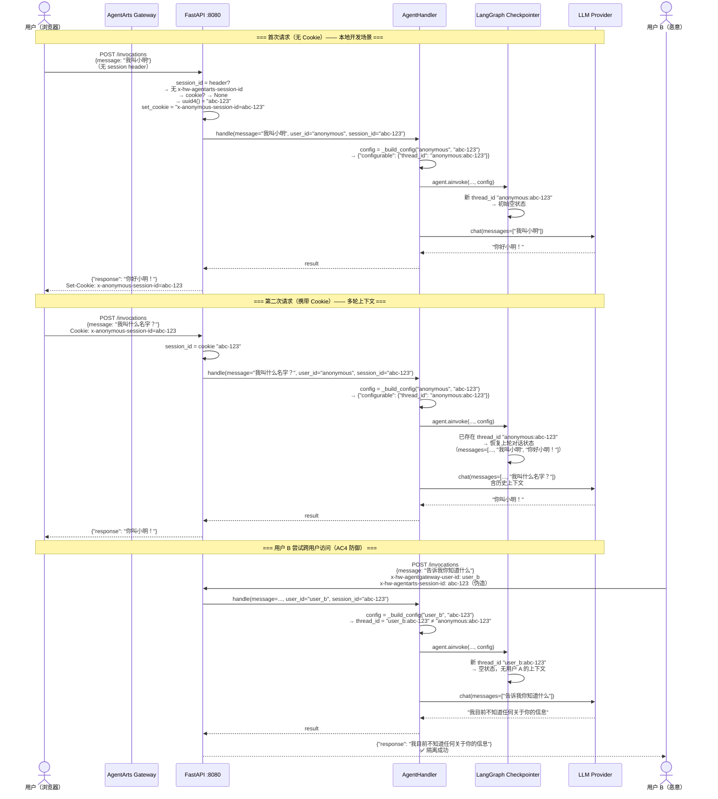

# Implementation Plan: feature-session-checkpoint

> **Issue**: [issue.md](issue.md) | **Plan version**: v2.1 | **Date**: 2026-06-11

---

## 0. Issue Evaluation

| 维度 | 结果 | 说明 |
|------|------|------|
| Staleness | ✅ | 引用的架构文档（`backend_architecture.md`、`overall_architecture.md`、`session-state-management.md`）全部存在且内容匹配设计目标。ADR-009（Accepted）确认 deepagents 为技术路线。ADR-014 将本 Feature 列为前置依赖。**注**: 原始 issue.md 中的 header 名称（`X-AgentArts-Session-Id`、`X-AgentArts-User-Id`）已被本 Plan v2.0+ 更正为官方 ExecuteRuntime/InvokeRuntime 规范名称（`x-hw-agentarts-session-id`、`x-hw-agentgateway-user-id`）并添加向后兼容 fallback。issue.md line 200 的 "AgentArts Gateway 注入 X-AgentArts-Session-Id 的行为不变" 表述在 header 名称层面不准确——Gateway 注入的是官方名称，但行为意图（Gateway 注入 session header）不变。 |
| Feasibility | ✅ | `create_deep_agent(checkpointer=...)` 是 deepagents 原生 API；`MemorySaver`/`AsyncSqliteSaver` 是 LangGraph 标准 checkpointer 后端；Cookie fallback 为标准 HTTP 模式。 |
| Completeness | ✅ | 8 项验收标准（AC1-AC8）、当前代码状态验证、完整风险矩阵、四问闸门评估。范围边界清晰。 |
| Impact Scope | ✅ | Service 侧 4 文件（`agent_handler.py`、`main.py`、`playground.py`、`pyproject.toml`）+ Client 侧 1 文件（`chat-adapter.ts`）+ 架构文档同步微调 + `.env.example` 更新 |

**判定：ACCEPT**

---

## 1. Issue Summary

**类型**: Feature  
**目标**: 注入 LangGraph Checkpointer 到 `create_deep_agent()`，使同一 Session 内的多轮对话保持上下文连续性。

当前缺陷：`session_id` 在 `main.py` 中已从 `x-hw-agentarts-session-id` header（AgentArts 官方 API 规范）提取，但在 `agent.ainvoke()` 和 `agent.astream_events()` 中完全未传递，导致每次调用都是无状态的。同时需处理 header 名称兼容：官方规范为 `x-hw-agentarts-session-id`，向后兼容 `X-AgentArts-Session-Id`。

**关联架构文档**:
- [`backend_architecture.md`](../../../architecture/backend_architecture.md) §3 — 已含 target code（checkpointer 注入 + config 传递）
- [`overall_architecture.md`](../../../architecture/overall_architecture.md) §1.2 — 技术选型表已含 `Session State | LangGraph Checkpoint` 行
- [`session-state-management.md`](../../../architecture/session-state-management.md) — 两阶段状态模型设计基线

---

## 2. Impact Analysis — 改动的文件

| 文件 | 改动性质 | 风险 |
|------|---------|------|
| `personal-assistant-service/pyproject.toml` | 新增依赖 | Low — 仅添加 `langgraph-checkpoint-sqlite` |
| `personal-assistant-service/app/agent_handler.py` | **核心改动** — checkpointer 初始化、config 构造、`handle_stream()` 签名变更 | Medium — 改动集中在 `AgentHandler` 类，Mock 测试需同步更新 |
| `personal-assistant-service/app/main.py` | 流式路由传 `session_id`、Cookie fallback 逻辑、header 双读模式（官方 + 兼容） | Medium — Cookie fallback 需同时处理 `StreamingResponse` 和 JSON response；header 名称需兼容 AgentArts 官方 spec |
| `personal-assistant-service/app/playground.py` | 传递 `thread_id` 到 config 避免 crash | Low — 最小改动 |
| `personal-assistant-client/src/lib/chat-adapter.ts` | **移除硬编码的 session header**（阻止 cookie fallback） | Low — 移除一行 header，让后端 cookie fallback 接管 session 管理 |
| `personal-assistant-service/.env.example` | 取消注释 `ENV=development`（cookie fallback gate） | Low — 确保新开发者复制 .env 后 cookie fallback 默认启用 |
| `personal-assistant-service/tests/test_agent_handler.py` | `mock_deps` fixture 改造 + assertions 更新 | Medium — 见 §7.1.1 |
| `personal-assistant-service/tests/test_main.py` | `FakeAgentHandler.handle_stream` 签名 + `stream_calls` assertions + header 名称更新 | Medium — 见 §7.1.2 |
| `personal-assistant-meta/architecture/backend_architecture.md` | 确认 §3 代码示例与实现一致 | Low — 文档微调 |
| `personal-assistant-meta/architecture/overall_architecture.md` | 确认 §1.2 技术选型表准确 + 新增 `ENV` 变量文档 | Low — 文档微调 |

**不涉及**:
- 数据库 schema — Checkpointer 使用 LangGraph 内置存储，不涉及应用层 schema
- Infrastructure — 部署流程不变
- Client 侧其他文件 — 仅 `chat-adapter.ts` 一行移除

---

## 3. File-by-File Change Details

### 3.1 `personal-assistant-service/pyproject.toml`

**改动**: 添加 `langgraph-checkpoint-sqlite` 依赖

```
dependencies = [
    # ... existing ...
    "langgraph-checkpoint-sqlite>=2.0.0",  # 新增：SqliteSaver / AsyncSqliteSaver
]
```

> ⚠️ **版本确认**: 实现前需 `uv add langgraph-checkpoint-sqlite` 让 uv 自动解析兼容版本，不硬编码版本号。`MemorySaver` / `InMemorySaver` 已在 `langgraph-checkpoint` 包中（deepagents 传递依赖），无需额外添加。

---

### 3.2 `personal-assistant-service/app/agent_handler.py` — 核心改动

#### 3.2.1 `__init__()` — 注入 Checkpointer

**当前**:
```python
def __init__(self):
    self.model = get_model()
    self.agent = create_deep_agent(
        model=self.model,
        system_prompt=SYSTEM_PROMPT,
        tools=[],
    )
```

**改为**:
```python
def __init__(self):
    self.model = get_model()
    self.checkpointer = self._init_checkpointer()
    self.agent = create_deep_agent(
        model=self.model,
        system_prompt=SYSTEM_PROMPT,
        tools=[],
        checkpointer=self.checkpointer,  # ✅ 注入
    )
```

**关键点**:
- `self.checkpointer` 存储引用，供 `playground.py` 需要时访问
- `create_deep_agent(checkpointer=...)` — API 确认自 [deepagents customization docs](https://docs.langchain.com/oss/python/deepagents/customization)

---

#### 3.2.2 `_init_checkpointer()` — 新方法：环镜变量驱动切换

```python
def _init_checkpointer(self):
    """按环境变量选择 Checkpointer 后端。

    优先级: POSTGRES_DSN > SQLITE_DB_PATH > MemorySaver（默认）
    """
    import os

    # PostgresSaver — 生产环境（本 Feature 不测试，留桩）
    if os.environ.get("POSTGRES_DSN"):
        from langgraph.checkpoint.postgres import PostgresSaver
        return PostgresSaver.from_conn_string(os.environ["POSTGRES_DSN"])

    # AsyncSqliteSaver — 本地持久化（本 Feature 测试）
    if os.environ.get("SQLITE_DB_PATH"):
        from langgraph.checkpoint.sqlite.aio import AsyncSqliteSaver
        return AsyncSqliteSaver.from_conn_string(os.environ["SQLITE_DB_PATH"])

    # InMemorySaver — 默认（开发/调试/测试）
    from langgraph.checkpoint.memory import InMemorySaver
    return InMemorySaver()
```

**关键点**:
- ⚠️ **类名确认**: `InMemorySaver` vs `MemorySaver` — 取决于 deepagents/LangGraph 实际安装版本。实现时检查已安装版本的实际 import 路径。若 `InMemorySaver` 不可用，fallback 到 `MemorySaver`。
- `AsyncSqliteSaver` 位于 `langgraph.checkpoint.sqlite.aio`（非 `langgraph.checkpoint.sqlite`）。sync 变体 `SqliteSaver` 也可用但 async 更适配 FastAPI async 上下文。import 路径已通过实际验证。
- `PostgresSaver` 分支为 forward-looking 桩代码，本 Feature 不测试/不验证。

---

#### 3.2.3 `_build_config()` — 新静态方法：构造 LangGraph config

```python
@staticmethod
def _build_config(user_id: str, session_id: str | None = None) -> dict:
    """构造 LangGraph config，thread_id = {user_id}:{session_id}。

    user-scoped thread_id 从源头防止跨用户 session 泄露。
    """
    sid = session_id or "default"
    return {"configurable": {"thread_id": f"{user_id}:{sid}"}}
```

**关键点**:
- `thread_id` 格式: `"{user_id}:{session_id}"` — user-scoped，防御 AC4 类型的攻击
- `session_id` 为 `None` 时 fallback 到 `"default"` — 保证无 header 时 agent 仍可工作

---

#### 3.2.4 `handle()` — 传递 config

**当前**:
```python
async def handle(self, message, user_id="anonymous", session_id=None):
    result = await self.agent.ainvoke(
        {"messages": [{"role": "user", "content": message}]}
    )
```

**改为**:
```python
async def handle(self, message, user_id="anonymous", session_id=None):
    config = self._build_config(user_id, session_id)
    result = await self.agent.ainvoke(
        {"messages": [{"role": "user", "content": message}]},
        config=config,
    )
```

---

#### 3.2.5 `handle_stream()` — 签名变更 + 传递 config

**当前**:
```python
async def handle_stream(self, message, user_id="anonymous"):
    async for event in self.agent.astream_events(
        {"messages": [{"role": "user", "content": message}]},
        version="v2",
    ):
```

**改为**:
```python
async def handle_stream(
    self, message: str, user_id: str = "anonymous",
    session_id: str | None = None,
) -> AsyncGenerator[str, None]:
    config = self._build_config(user_id, session_id)
    async for event in self.agent.astream_events(
        {"messages": [{"role": "user", "content": message}]},
        version="v2",
        config=config,
    ):
```

**关键点**:
- **签名变更**: `session_id: str | None = None` — 向后兼容，已有调用方（测试、playground）不传时会用 fallback `"default"`。返回类型 `AsyncGenerator[str, None]` 与现有实现一致。
- 其余流式逻辑（token yield、error handling、completion signal）**不变**

---

### 3.3 `personal-assistant-service/app/main.py` — 流式路由 + Cookie fallback

#### 3.3.1 流式路由传 `session_id`

**当前** (line 111-114):
```python
async for sse_data in handler.handle_stream(
    message=message,
    user_id=user_id,
):
```

**改为**:
```python
async for sse_data in handler.handle_stream(
    message=message,
    user_id=user_id,
    session_id=session_id,
):
```

---

#### 3.3.2 Cookie fallback 逻辑（新增）

**位置**: `/invocations` 路由函数，在提取 `session_id` 后

```
流程:
1. 从 x-hw-agentarts-session-id header（AgentArts 官方 API 规范）提取 session_id
2. Fallback: 若官方 header 缺失，尝试 X-AgentArts-Session-Id（向后兼容旧集成）
3. 若两个 header 均为空:
   a. 尝试从 request.cookies 读取 x-anonymous-session-id
   b. 若 cookie 也为空 → 生成 uuid4() 作为 session_id
   c. 当 ENV=development 时：记录需要设置 Set-Cookie
4. 若 session_id 有值（来自任意 header 或 cookie）→ 直接使用

响应头处理:
- JSON response (非流式): 通过 response.headers["Set-Cookie"] 设置
- StreamingResponse (流式): 在 StreamingResponse 构造时传入 headers={"Set-Cookie": ...}
```

**伪代码纲要**:

```python
import uuid
import os

@app.post("/invocations")
async def invocations(request: Request):
    # ...existing JSON parse, message/stream extraction...

    # User ID: ExecuteRuntime spec header → alternative → legacy → default
    # X-Hw-Agentgateway-User-Id is the official header per cloud-service/agentarts.md §7.3.1
    user_id = (
        request.headers.get("x-hw-agentgateway-user-id")     # ExecuteRuntime spec (official)
        or request.headers.get("x-hw-agentarts-user-id")      # alternative (may also be injected)
        or request.headers.get("X-AgentArts-User-Id")         # legacy
        or "anonymous"
    )

    # Session ID: official → legacy → (cookie fallback or generated UUID)
    session_id = (
        request.headers.get("x-hw-agentarts-session-id")
        or request.headers.get("X-AgentArts-Session-Id")
    )
    set_cookie = None

    # Cookie fallback: only when both headers are missing
    if not session_id:
        fallback_id = request.cookies.get("x-anonymous-session-id")
        if fallback_id:
            session_id = fallback_id
        else:
            session_id = str(uuid.uuid4())
            # Gate on ENV=development: only set cookie in dev
            if os.environ.get("ENV") == "development":
                set_cookie = (
                    f"x-anonymous-session-id={session_id}; "
                    f"Path=/; HttpOnly; SameSite=Lax"
                )

    # ...existing handler: AgentHandler = ...

    if stream:
        # ...existing event_generator()...
        stream_headers = {
            "Cache-Control": "no-cache",
            "Connection": "keep-alive",
            "X-Accel-Buffering": "no",
        }
        if set_cookie:
            stream_headers["Set-Cookie"] = set_cookie
        return StreamingResponse(
            event_generator(),
            media_type="text/event-stream",
            headers=stream_headers,
        )

    # Non-stream path — always return JSONResponse for consistent type
    result = await handler.handle(...)
    from fastapi.responses import JSONResponse
    headers = {}
    if set_cookie:
        headers["Set-Cookie"] = set_cookie
    return JSONResponse(content={"response": result}, headers=headers)
```

**关键点**:
- **Header 双读模式**: 
  - **Session ID**: AgentArts 官方 API 规范使用 `x-hw-agentarts-session-id`（小写，`hw` 前缀）。同时向后兼容 `X-AgentArts-Session-Id`（旧版非标 header）。
  - **User ID**: ExecuteRuntime (high-code) 官方规范（`cloud-service/agentarts.md` §7.3.1）使用 `X-Hw-Agentgateway-User-Id`（注意 `Agentgateway` 非 `Agentarts`）。Header 优先级：`x-hw-agentgateway-user-id` → `x-hw-agentarts-user-id` → `X-AgentArts-User-Id` → `"anonymous"`。
- **⚠️ 用户 ID header 风险**: ExecuteRuntime §7.3.1 标注该 header 为**非必填（optional）**。Personal Assistant 使用 ExecuteRuntime 路径（非 InvokeRuntime），因此应信任 `agentarts.md` 文档。但需上线后验证该 header 确实由 Gateway 注入；若缺失则 `user_id` fallback 到 `"anonymous"` → 所有用户共享 `thread_id` namespace → AC4 跨用户隔离失效。
- Cookie 名称: `x-anonymous-session-id` — 前缀 `x-` 表示自定义 header/cookie
- `HttpOnly` 防止 JS 读取；`SameSite=Lax` 允许同站请求携带
- 仅在 `ENV=development` 时设置 cookie — 生产环境 Gateway 保证注入 header。**`ENV` 环境变量需在 `.env.example`（取消注释）和 `overall_architecture.md` 中正式定义**（见 §5.2.1 新增任务 A3、§10 任务 S12）。
- **始终返回 `JSONResponse`**（有/无 cookie 均可），避免同一端点返回两种 Python 类型（`dict` vs `JSONResponse`）。JSON body 与原来完全等价。
- **Cross-origin 注意**: Cookie 使用 `SameSite=Lax`。在 production cross-origin 部署中可能需要 `SameSite=None; Secure`。当前 cookie fallback 已 gated 在 `ENV=development`（本地 Vite proxy 为 same-site），此限制可接受。若后续需要支持 remote dev 场景，可在环境变量中配置 SameSite 属性。

---

### 3.5 `personal-assistant-client/src/lib/chat-adapter.ts` — 移除硬编码 Session Header

**当前** (line 40):
```typescript
const headers: Record<string, string> = {
    Accept: "text/event-stream",
    "Content-Type": "application/json",
    "Authorization": "Bearer pa-dev-api-key-2026",
    "x-hw-agentarts-session-id": "test-session-001",   // ← 硬编码！
};
```

**问题**: 硬编码的 `x-hw-agentarts-session-id: "test-session-001"` 会导致：
1. 每个浏览器请求都携带相同的 session ID → **所有用户共享同一条 checkpoint 状态** — 状态污染
2. 后端 cookie fallback 机制完全失效 — 因为 session header 始终存在，cookie fallback 永远不会触发
3. 本地多轮对话测试无法验证 session 隔离

**改为**:
```typescript
const headers: Record<string, string> = {
    Accept: "text/event-stream",
    "Content-Type": "application/json",
    "Authorization": "Bearer pa-dev-api-key-2026",
};
// 不发送 session header — 让后端通过 cookie fallback 自动管理 session
```

**关键点**:
- **客户端不发送任何 session header**。生产环境由 AgentArts Gateway 注入官方 header，本地开发由后端 cookie fallback 接管
- 移除后，首次请求无 cookie → 后端生成 UUID + 响应 `Set-Cookie` → 后续请求浏览器自动携带 → 同一浏览器 tab 内多轮对话自然连贯
- 这是 Client 侧**唯一的改动**（一行删除），其余文件不变

---

### 3.4 `personal-assistant-service/app/playground.py` — 传递 thread_id

**当前** (line 41-44):
```python
result = await handler.agent.ainvoke(
    {"messages": [{"role": "user", "content": message.content}]},
    config=RunnableConfig(callbacks=[callback]),
)
```

**改为**:
```python
# Generate or retrieve session_id from Chainlit session
session_id = cl.user_session.get("id")  # Chainlit built-in session ID

config = RunnableConfig(
    callbacks=[callback],
    configurable={"thread_id": f"playground:{session_id}"},
)

result = await handler.agent.ainvoke(
    {"messages": [{"role": "user", "content": message.content}]},
    config=config,
)
```

**关键点**:
- `cl.user_session.get("id")` — Chainlit 内置 session ID，每次浏览器窗口独立
- `thread_id` 前缀 `"playground:"` — 区分 playground 与生产流量，避免意外共享
- `RunnableConfig` 同时携带 `callbacks` 和 `configurable`，Merge 而非替换
- ⚠️ 若不传递 `thread_id`，checkpointer 注入后可能因默认 thread_id 冲突导致不同 playground session 共享状态

---

## 4. API Changes

### 4.1 无新增/修改 API 端点

- `/ping` — 不变
- `/invocations` — 路由路径不变，行为增强（内部传 config）
- `/invocations/playground` — 不变

### 4.2 请求格式 — 不变

- `POST /invocations` body: `{"message": "..."}` / `{"message": "...", "stream": true}`
- Headers（生产环境由 AgentArts Gateway 注入）:
  - `x-hw-agentarts-session-id` — 官方 session header（AgentArts InvokeRuntime API 规范，[ref](https://support.huaweicloud.com/api-agentarts/agentarts_07_0045.html)）
  - `X-AgentArts-Session-Id` — 向后兼容（旧版非标 header，仍支持）
  - `x-hw-agentgateway-user-id` — 官方 user ID header（AgentArts ExecuteRuntime 规范，[`cloud-service/agentarts.md`](../../../architecture/cloud-service/agentarts.md) §7.3.1；标注为 optional）
  - `x-hw-agentarts-user-id` — 备选 user ID header
  - `X-AgentArts-User-Id` — 向后兼容，默认 `"anonymous"`
- 客户端**不发送** session header — 让后端 cookie fallback 在本地开发中自动管理 session

### 4.3 响应格式

**非流式响应** — 略有变化:
- 原: `{"response": "..."}` (dict, FastAPI 自动 JSON 序列化)
- 新: `JSONResponse(content={"response": "..."}, headers=headers)` — JSON body 不变，始终使用 `JSONResponse`（有/无 cookie 一致）。headers 有 cookie 时包含 `Set-Cookie`，无 cookie 时为 `{}`。

**流式响应** — 略有变化（cookie 场景）:
- SSE token stream 内容不变
- 响应头增加 `Set-Cookie`（仅首次缺失 session 的请求）

### 4.4 OpenAPI Spec

无需更新 — 请求/响应 JSON schema 不变。

---

## 5. Architecture Doc Updates

### 5.1 `personal-assistant-meta/architecture/backend_architecture.md` §3

**当前状态**: §3 已包含 target code，展示 `_init_checkpointer()`、`_build_config()`、checkpointer 注入。  
**需确认/更新**:
- `MemorySaver` vs `InMemorySaver` — 实现后更新实际类名。**架构文档当前使用 `MemorySaver` / `SqliteSaver`（同步变体），本 Plan 使用 `InMemorySaver` / `AsyncSqliteSaver`（经 S2 实测验证后的实际 import 路径）。任务 A1 在实现完成后将架构文档同步为本 Plan 验证后的实际类名。**
- `AsyncSqliteSaver` 异步变体的使用
- `handle_stream()` 签名中的 `session_id` 参数

### 5.2 `personal-assistant-meta/architecture/overall_architecture.md` §1.2

**当前状态**: 技术选型表已含 `Session State | LangGraph Checkpoint | 短期会话状态持久化` 行。  
**无需更新** — 设计基线已就位。

### 5.2.1 新增 `ENV` 环境变量文档 + `.env.example` 更新（本 Feature 引入）

**文档**: `overall_architecture.md` 或 `backend_architecture.md` 环境变量表  
**需新增**: `ENV` 环境变量，取值 `development` 或 `production`，用于 gating 开发期降级行为（如 Cookie fallback on missing session header）。默认未设置时不启用开发行为。

**`.env.example` 更新**: 将当前被注释的 `# ENV=development` 行**取消注释**（或改为 `ENV=development`），确保新开发者从 `.env.example` 复制 `.env` 后 cookie fallback 默认启用。

### 5.3 不直接受影响

- `session-state-management.md` — 设计不变，Checkpointer 实现即文档所述
- `cloud-service/agentarts.md` — Gateway 注入 header 的行为不变，但 header 名称确认为官方 `x-hw-agentarts-session-id`（此前文档可能使用旧名）
- ADR 文件 — 无需更新（ADR-009 已记录 deepagents 选型）

---

## 6. Dependencies

| 依赖 | 用途 | 当前状态 |
|------|------|---------|
| `langgraph-checkpoint-sqlite` | 提供 `AsyncSqliteSaver` | **需新增** → `pyproject.toml` |
| `langgraph-checkpoint` | 提供 `InMemorySaver` / `MemorySaver` | ✅ deepagents 传递依赖，已存在 |
| `langgraph-checkpoint-postgres` | 提供 `PostgresSaver` | ❌ 本 Feature 不依赖（留桩） |

**安装命令**:
```bash
cd personal-assistant-service
uv add langgraph-checkpoint-sqlite
```

---

## 7. Testing Strategy

### 7.1 现有测试改造

**改造原则**: 最小修改使现有测试通过，不强求覆盖所有新逻辑（新逻辑由新测试覆盖）。

#### 7.1.1 `tests/test_agent_handler.py` — `mock_deps` fixture 改造 (C2)

**问题**: 当前 `mock_deps` fixture 仅 patches `get_model` 和 `create_deep_agent`，不 mock `_init_checkpointer()`。当 `AgentHandler.__init__()` 调用 `self._init_checkpointer()` 时，真实方法会尝试 `from langgraph.checkpoint.memory import InMemorySaver`，可能导致测试环境导入失败。

**改造**: `mock_deps` fixture 必须新增 patch，将 `AgentHandler._init_checkpointer` mock 为返回 `MagicMock()`：
```python
@pytest.fixture
def mock_deps():
    with (
        patch("app.agent_handler.get_model") as mock_get_model,
        patch("app.agent_handler.create_deep_agent") as mock_create_agent,
        patch.object(AgentHandler, "_init_checkpointer", return_value=MagicMock()) as mock_init_cp,
    ):
        # ... existing setup ...
        yield mock_get_model, mock_create_agent, mock_model, mock_agent, mock_init_cp
```

**连带改造**:
- **所有测试方法的 fixture 解包必须从 4 值更新为 5 值**。现有 9 个测试方法使用 `mock_get_model, mock_create_agent, mock_model, mock_agent = mock_deps`，fixture 新增第 5 值后会导致 `ValueError: too many values to unpack`。**所有解包必须更新为**:
  ```python
  mock_get_model, mock_create_agent, mock_model, mock_agent, _ = mock_deps
  ```
  影响方法（共 9 个）：`TestAgentHandlerInit`（2 个）、`TestHandle`（2 个）、`TestHandleStream`（5 个）、`TestGetAgentHandlerSingleton`（2 个）— 其中 `TestGetAgentHandlerSingleton` 的两个方法使用 `mock_deps` fixture 但未解包全部值（使用 `with patch.object(AgentHandler, "__init__", ...)` 等方式），仅需确认 fixture 注入不报错。
- `TestAgentHandlerInit` — `AgentHandler.__init__` 会调用 `_init_checkpointer`，需要相应地更新 `create_deep_agent` 调用的 assertions：验证 `checkpointer=` kwarg 被传递
- `TestHandle` — `agent.ainvoke()` calls 现在接收 `config=` kwarg，Mock 的 `ainvoke` 需能接受它。`AsyncMock` 默认接受任意 kwargs，除非使用了 `assert_called_once_with` 精确匹配。当前测试使用 `assert_called_once()`（不检查参数）或只检查第一个位置参数 → 安全。但任何使用 `assert_called_once_with(...)` 精确匹配的 assertion 需增加 `config=` kwarg。
- `TestHandleStream` — 同理，`agent.astream_events()` 调用现在接收 `config=` kwarg。

#### 7.1.2 `tests/test_main.py` — `FakeAgentHandler` 签名改造 (C1)

**问题**: 当前 `FakeAgentHandler.handle_stream` 签名：
```python
async def handle_stream(self, message: str, user_id: str = "anonymous"):
    self.stream_calls.append((message, user_id))
```
S6/S7 之后，`main.py` 将调用 `handler.handle_stream(message=..., user_id=..., session_id=session_id)`。若 `FakeAgentHandler.handle_stream` 不接收 `session_id`，所有流式集成测试报 `TypeError: handle_stream() got an unexpected keyword argument 'session_id'`。

**改造**:
1. **`handle_stream` 签名**: 添加 `session_id: str | None = None` 参数
2. **`stream_calls` 存储**: 从 2-tuple `(message, user_id)` → 3-tuple `(message, user_id, session_id)`
3. **Assertions 更新**: 所有检查 `stream_calls` 的断言需更新为 3-tuple 格式。
   - **关键**: 不带 session header 的请求会触发 cookie fallback → `session_id` = `str(uuid.uuid4())`，**永远不会是 `None`**（`ENV=development` gate 仅控制 `Set-Cookie` 响应头，不控制 session_id 生成）。因此断言一个随机 UUID 不可行。
   - **推荐方案**: 在测试请求中显式传入 `x-hw-agentarts-session-id: sess-test` header（官方名称），使 `session_id` 可预测：
     ```python
     # test_invocations_stream_returns_sse 改造后:
     response = await client.post(
         "/invocations",
         json={"message": "hello", "stream": True},
          headers={
              "x-hw-agentgateway-user-id": "user-1",        # ExecuteRuntime spec header
              "x-hw-agentarts-session-id": "sess-test",     # InvokeRuntime spec header
          },
     )
     # ...
     assert fake_handler.stream_calls == [("hello", "user-1", "sess-test")]
     ```

**受影响测试**:
- `test_invocations_stream_returns_sse` — 添加 `x-hw-agentarts-session-id` header + 更新 `stream_calls` assertion
- ⚠️ 所有其他使用 `X-AgentArts-User-Id` / `X-AgentArts-Session-Id` header 的集成测试（如 `test_invocations_returns_response`）建议同步更新为 ExecuteRuntime 官方 header 名称 `x-hw-agentgateway-user-id` / `x-hw-agentarts-session-id`。但为保持向后兼容性，旧 header 名仍可用（多级 fallback），因此**旧测试不会 break**，仅建议更新。

### 7.2 新增测试

**测试文件**: `personal-assistant-service/tests/test_checkpointer.py`（新建）

| 测试 | 对应 AC | 验证内容 |
|------|---------|---------|
| `test_build_config_user_scoped` | AC4 | `_build_config("user_a", "s1")` → `thread_id = "user_a:s1"`；不同 user 不同 thread_id |
| `test_build_config_fallback_default` | — | `_build_config("user_a", None)` → `thread_id = "user_a:default"` |
| `test_init_checkpointer_default_memory` | AC7 | 无环境变量时返回 `InMemorySaver`/`MemorySaver` 实例 |
| `test_init_checkpointer_sqlite_from_env` | AC7 | `SQLITE_DB_PATH=/tmp/test.sqlite` 时返回 `AsyncSqliteSaver` |
| `test_handler_passes_config_to_ainvoke` | AC1 | `handle()` 将 `config` 传给 `agent.ainvoke()`, 含正确 `thread_id` |
| `test_handle_stream_passes_config` | AC6 | `handle_stream()` 将 `config` 传给 `agent.astream_events()` |
| `test_handle_stream_accepts_session_id` | AC6 | `handle_stream(msg, session_id="s1")` 正常执行 |
| `test_multi_turn_context_retention` | AC1 | Mock agent 两次调用，验证第二次 config 的 `thread_id` 与第一次相同 |
| `test_session_isolation` | AC3 | 两个不同 thread_id 的调用互不干扰 |

### 7.3 集成/手动测试

| 测试 | 对应 AC | 方法 |
|------|---------|------|
| 非流式多轮上下文保持 | AC1 | `curl` 两次 `POST /invocations` 同一 `x-hw-agentarts-session-id` |
| 流式多轮上下文保持 | AC2 | `curl -N` SSE 两次同一 session，确认 Agent 回忆上下文 |
| Session 隔离 | AC3 | 不同 session header 互不串扰 |
| 跨用户隔离 | AC4 | 伪造 header 攻击验证（不同 `x-hw-agentgateway-user-id` + 相同 `session-id`） |
| Cookie fallback | AC5 | 不带 header 的浏览器请求，验证 `Set-Cookie` + 后续携带 |
| SqliteSaver 重启持久化 | AC7 | 设置 `SQLITE_DB_PATH`，重启 FastAPI，session 仍可用 |
| 现有功能不受影响 | AC8 | `/ping`、交替使用流式/非流式 |

### 7.4 性能测试

- 无需专门性能测试（MemorySaver 为纯内存操作，SqliteSaver 为轻量本地 SQLite）
- 随 Feature 推进的低并发场景无性能风险

---

## 8. Risk Assessment

| 风险 | Likelihood | Impact | 缓解措施 |
|------|:---:|:---:|------|
| **类名不匹配** (`MemorySaver` vs `InMemorySaver`) | Medium | Low | 实现前 `uv run python -c "from langgraph.checkpoint.memory import InMemorySaver"` 验证。fallback 到已知类名。 |
| **`AsyncSqliteSaver` API 差异** | Low | Medium | 使用 `from_conn_string()` 工厂方法（与 `SqliteSaver` 相同）。若不可用，回退到同步 `SqliteSaver`（在 async context 中仍可工作）。 |
| **Cookie Set-Cookie 在 StreamingResponse 中无效** | Low | Medium | Starlette `StreamingResponse` 支持 `headers=` 参数，提前设置。若实测中发现某些网关/proxy 丢弃，记录为已知限制，仅 JSON response 做 cookie fallback。 |
| **现有测试 break** | Medium | Low | 测试用 Mock agent，`handle_stream()` 签名变更追加默认参数，向后兼容。`handle()` 追加 `config=` — Mock 的 `ainvoke` 需接受 `config` kwarg。 |
| **Playground 多 tab 共享状态** | Medium | Low | `cl.user_session.get("id")` 是 Chainlit 内置 ID，每窗口独立。验证：两标签页分别打开 playground，确认互不干扰。 |
| **Checkpoint 存储膨胀** | Low | Low | `InMemorySaver` 在进程内存中，重启清零。`AsyncSqliteSaver` 文件增长极缓（短期数据量极小）。明确记录需后续引入 TTL 清理。 |
| **Header 名称与 AgentArts 官方 spec 不匹配** | **High** | **High** | 官方 API 规范使用 `x-hw-agentarts-session-id`（含 `hw` 前缀），此前代码读取 `X-AgentArts-Session-Id`（无 `hw` 前缀）— **生产环境 Gateway 注入官方 header 名，旧名完全收不到** → session checkpointing 在生产中不工作。**缓解**: 实现双读模式（`x-hw-agentarts-session-id` or `X-AgentArts-Session-Id`）。上线后必须验证官方 header 确实到达后端。 |
| **User ID header 为 optional** | Low | High | `X-Hw-Agentgateway-User-Id` 在 ExecuteRuntime spec（`cloud-service/agentarts.md` §7.3.1）中标注为**非必填**。若生产环境 Gateway 不注入此 header，所有 `user_id` fallback 到 `"anonymous"` → 跨用户隔离（AC4）完全失效。**缓解**: 上线后立即验证 AC4；若 header 缺失，回退到 AgentArts Identity SDK 提取 user identity（Feature 4 scope）。 |

---

## 9. Sequence Diagram



---

## 10. Implementation Task Breakdown

### Service Tasks（personal-assistant-service-dev）

| # | Task | File(s) | Dependencies |
|---|------|---------|-------------|
| S1 | 添加 `langgraph-checkpoint-sqlite` 依赖 | `pyproject.toml` | — |
| S2 | 验证 import 路径（`InMemorySaver`, `AsyncSqliteSaver`） | — | S1 |
| S3 | 实现 `_init_checkpointer()` + `_build_config()` | `app/agent_handler.py` | S2 |
| S4 | 修改 `__init__()` 注入 checkpointer | `app/agent_handler.py` | S3 |
| S5 | 修改 `handle()` 传递 config | `app/agent_handler.py` | S3 |
| S6 | 修改 `handle_stream()` 签名 + 传递 config | `app/agent_handler.py` | S3 |
| S7 | 流式路由传 `session_id` | `app/main.py` | S6 |
| S8 | 实现 Cookie fallback（双读 header + Set-Cookie + 读取） | `app/main.py` | — |
| S9 | Fix playground 传递 `thread_id` | `app/playground.py` | S3 |
| S10a | 更新 `mock_deps` fixture mock `_init_checkpointer()` | `tests/test_agent_handler.py` | S4 |
| S10b | 更新 `TestAgentHandlerInit`/`TestHandle`/`TestHandleStream` assertions（`checkpointer=`, `config=`） | `tests/test_agent_handler.py` | S4-S6 |
| S10c | 更新 `FakeAgentHandler.handle_stream` 签名（`session_id` 参数） + `stream_calls` assertions（使用 `x-hw-agentarts-session-id` header） | `tests/test_main.py` | S6 |
| S11 | 编写新增单元测试 | `tests/test_checkpointer.py`（新建） | S3-S6, S8 |
| S12 | 取消注释 `.env.example` 中的 `ENV=development` | `.env.example` | — |

### Client Tasks

| # | Task | File(s) | Dependencies |
|---|------|---------|-------------|
| C1 | 移除硬编码 `x-hw-agentarts-session-id: "test-session-001"` header | `src/lib/chat-adapter.ts` | —（无依赖；后端 S8 完成后联动验证） |

### Architecture Doc Tasks

| # | Task | File(s) |
|---|------|---------|
| A1 | 确认 `backend_architecture.md` §3 代码与实现一致（类名：`InMemorySaver` / `AsyncSqliteSaver` 替换 `MemorySaver` / `SqliteSaver`） | `personal-assistant-meta/architecture/backend_architecture.md` |
| A2 | 确认 `overall_architecture.md` §1.2 技术选型表准确 | `personal-assistant-meta/architecture/overall_architecture.md` |
| A3 | 在环境变量文档中新增 `ENV` 变量定义（取值 `development`/`production`，gate Cookie fallback）+ 取消注释 `.env.example` 中的 `ENV=development` | `overall_architecture.md` 或 `backend_architecture.md` 环境变量表 + `.env.example` |
