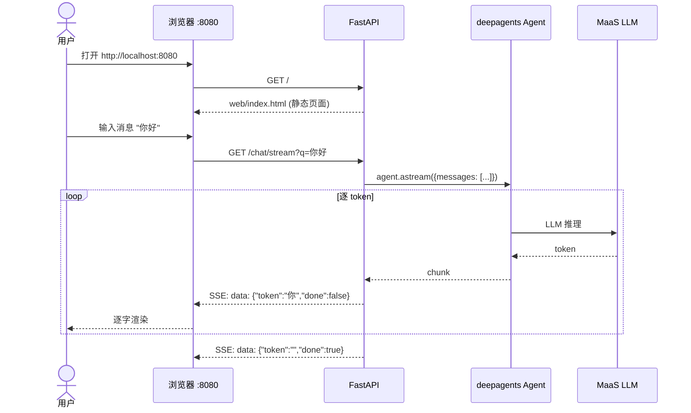
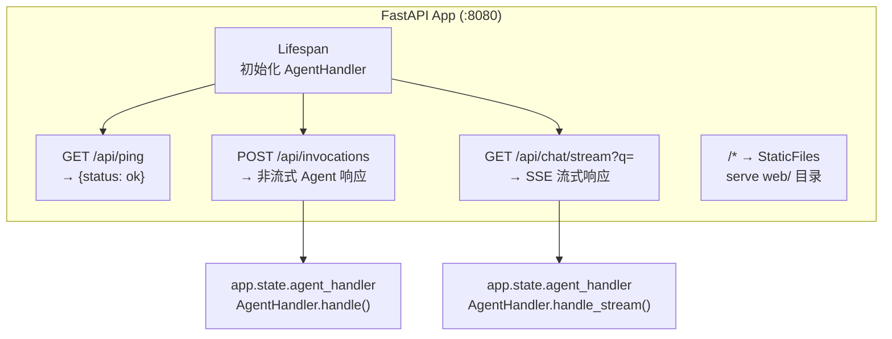
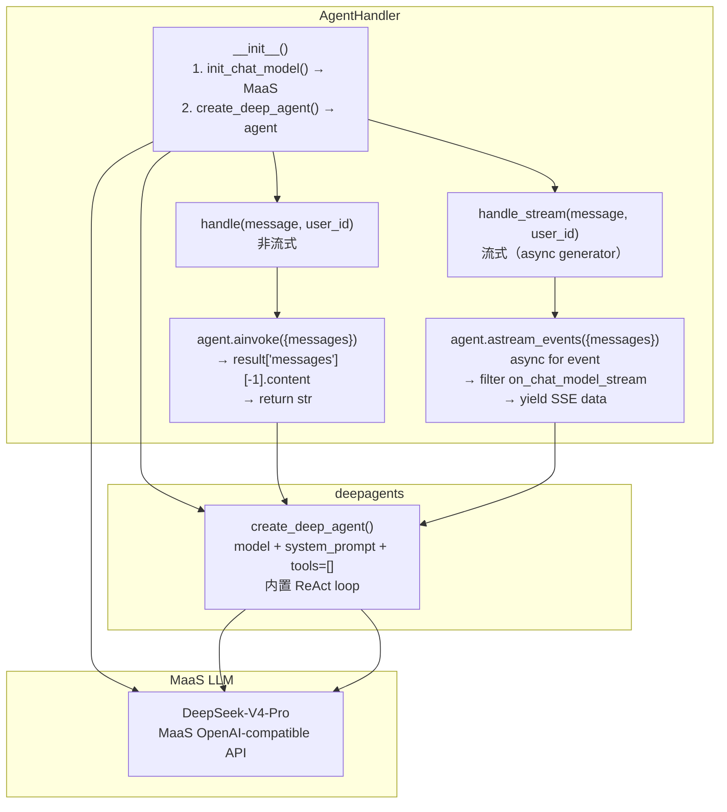
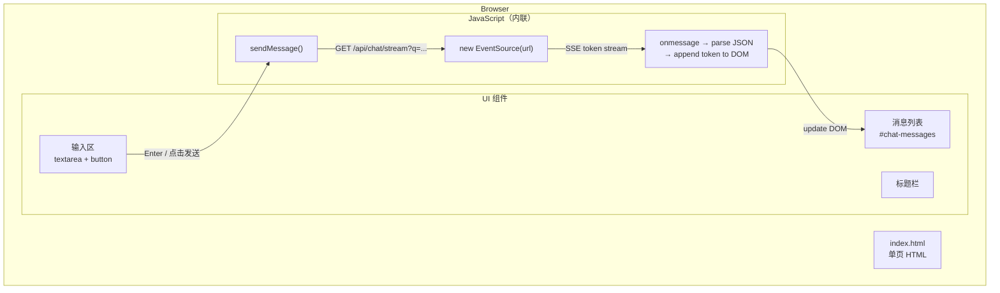

# Feature 1: Agent 骨架 + Web Chat 渠道 — 实施计划

> 版本：v1.0 | 日期：2026-06-06 | 对应 Issue：`issue.md`

---

## 1. 概述

### 1.1 交付物

Feature 1 搭建 Personal Assistant 的**最小可运行骨架**，以 Web Chat 作为第一条接入渠道。完成后可在浏览器中打开页面进行流式对话，无登录认证。

### 1.2 范围

| 在范围 | 不在范围 |
|--------|----------|
| FastAPI 应用入口（`app/main.py`）+ `/ping`、`/invocations`、`/chat/stream` | Memory 集成（Feature 2） |
| `web/index.html` 单页 HTML（文本输入 + SSE 流式渲染） | OfficeClaw（Feature 3） |
| Agent 处理逻辑（`app/agent_handler.py`）— 非流式 + 流式 | 用户认证 / OAuth（Feature 4） |
| deepagents 编排（`create_deep_agent()`，空 tools 列表） | 飞书渠道（Feature 5） |
| MaaS 模型连接（DeepSeek-V4-Pro） | 任何外部工具（Feature 6-8） |
| `pyproject.toml` + `uv.lock`（uv 包管理） | Vite + React 前端（Feature 5） |
| `.agentarts_config.yaml` 基础配置 | Chrome Extension |
| Dockerfile（ARM64 / Python 3.12） | — |

### 1.3 最终效果



---

## 2. 架构决策

### 2.1 相关 ADR

本阶段实现严格遵循以下已批准的 Architecture Decision Records：

| ADR | 决策 | 对本阶段的影响 |
|-----|------|---------------|
| **ADR-001** | Python 3.12 | Dockerfile `FROM python:3.12-slim`，本地开发用 3.12 |
| **ADR-004** | FastAPI 替代 AgentArtsRuntimeApp | `app/main.py` 使用 `FastAPI()`，保留 `/ping` + `/invocations` 兼容 |
| **ADR-005** | MaaS 作为 LLM 平台 | `init_chat_model("openai:deepseek-v4-pro", base_url=...)` |
| **ADR-008** | Vite + React + TypeScript（生产） | Phase 1 使用简化 HTML（ADR-008 明确允许作为起步方案） |
| **ADR-009** | deepagents 替代裸 LangGraph | `create_deep_agent()`，无 `app/graph.py` |
| **ADR-010** | uv + ruff（Astral 生态） | `pyproject.toml` 替代 `requirements.txt`，Dockerfile 使用 uv |

### 2.2 Issue 与 ADR 的偏差说明

Issue 原文写于部分 ADR 批准之前，以下内容以 ADR 为准：

| Issue 原文 | ADR 修正 | 原因 |
|-----------|----------|------|
| `requirements.txt` | `pyproject.toml` + `uv.lock` | ADR-010：全面采用 uv |
| `agentarts_config.yaml`（无前导点） | `.agentarts_config.yaml` | `overall_architecture.md` §7.1 标准命名 |
| `app/graph.py`（手写 StateGraph） | 不需要，deepagents 内置 ReAct loop | ADR-009：deepagents 替代裸 LangGraph |
| `langgraph` 为直接依赖 | `deepagents`（langgraph 为传递依赖） | ADR-009 |

### 2.3 无认证阶段的身份处理

Phase 1 不做认证，所有请求使用默认身份：

- `/invocations`：从 `X-AgentArts-User-Id` header 读取 user_id，无此 header 时使用 `"anonymous"`
- `/chat/stream`：由于 EventSource 不支持自定义 header，GET 请求的 user_id 固定为 `"anonymous"`
- 后续 Feature 4 引入 OAuth 后，`/chat/stream` 改为从 Cookie/JWT 中提取 user_id

### 2.4 API 路由 `/api` 前缀决策

**决策**：所有后端 API 路由统一加 `/api` 前缀（`/api/ping`、`/api/invocations`、`/api/chat/stream`）。StaticFiles mount 到 `/`，serve `web/` 目录。

**原因**：
1. **避免路由冲突**：StaticFiles mount `/*` 会拦截所有未匹配的请求。若 API 路由不加前缀（如裸 `/ping`），可能被 StaticFiles 覆盖。
2. **与 Phase 2 生产部署一致**：`frontend_architecture.md` §6.2 的生产方案通过 CDN 的 `/api/*` 路径分流到 FastAPI 容器。Phase 1 提前采用相同结构，后续无需改动路由。
3. **清晰的职责分离**：前端资源 `/*` vs API 端点 `/api/*`。

**注意**：以下架构文档中的代码示例使用裸路径（无 `/api` 前缀），系此决策前的简化示意，需在后续更新：

| 需更新的文档 | 章节 | 说明 |
|-------------|------|------|
| `overall_architecture.md` | §5.2 | 代码示例中 `@app.get("/ping")`、`@app.post("/invocations")` 应加 `/api` 前缀 |
| `backend_architecture.md` | §2 | 路由表中 `/ping`、`/invocations`、`/chat/stream` 应加 `/api` 前缀 |
| `devops/local-development.md` | §1.4 | 验证命令中 `curl /ping` 应改为 `curl /api/ping` |

> 以上文档更新不在 Feature 1 实施范围内，作为 follow-up 任务记录。

---

## 3. 文件清单

所有文件均在 `personal-assistant-service/` 目录下创建：

> **注意**：`web/` 目录当前放在 `personal-assistant-service/` 下是为了 Phase 1 同容器 serve 策略（FastAPI StaticFiles mount）。Feature 5 引入 Vite + React 前端后，前端代码将迁移到 `personal-assistant-client/` 目录，`personal-assistant-service/web/` 将被移除。`overall_architecture.md` §8 展示的是最终状态（`web/` 不在此目录），Phase 1 为过渡方案。

```
personal-assistant-service/
├── pyproject.toml                  # [NEW] 项目元数据 + 依赖 + ruff 配置
├── uv.lock                         # [NEW] 由 uv sync 生成的确定性锁文件
├── Dockerfile                      # [NEW] ARM64 镜像，Python 3.12，uv
├── .agentarts_config.yaml          # [NEW] AgentArts 部署配置（Phase 1 最小版）
├── .dockerignore                   # [NEW] 排除 .venv、__pycache__ 等
├── app/
│   ├── __init__.py                 # [NEW] 空文件，使 app 成为 Python 包
│   ├── main.py                     # [NEW] FastAPI 应用入口 + 路由定义
│   └── agent_handler.py            # [NEW] AgentHandler 类（deepagents 编排）
└── web/
    └── index.html                  # [NEW] 单页 HTML Chat UI（SSE 流式）

personal-assistant-meta/issues/features/feature-1-agent-skeleton/
├── issue.md                        # [EXISTING] 原始 issue
└── plan.md                         # [NEW] 本文件
```

| 文件 | 目的 | 预估行数 |
|------|------|----------|
| `pyproject.toml` | 声明依赖（fastapi, uvicorn, deepagents, langchain-openai 等）+ ruff 配置 | ~40 |
| `uv.lock` | 确定性依赖锁定（`uv sync` 自动生成） | auto |
| `Dockerfile` | ARM64 镜像构建，uv 安装依赖，启动 uvicorn | ~20 |
| `.agentarts_config.yaml` | AgentArts 平台部署描述 | ~40 |
| `.dockerignore` | 构建时排除不必要的文件 | ~10 |
| `app/__init__.py` | Python 包标记 | 空 |
| `app/main.py` | 路由定义、SSE、StaticFiles、lifespan | ~80 |
| `app/agent_handler.py` | AgentHandler 类、模型初始化、非流式+流式处理 | ~80 |
| `web/index.html` | 单页 Chat UI，EventSource SSE 客户端 | ~150 |

### 3.1 不创建的文件

以下文件在后续 Feature 才创建，本阶段**不要**创建：

| 文件 | 创建阶段 | 原因 |
|------|----------|------|
| `app/graph.py` | 永不创建 | ADR-009：deepagents 内置 ReAct loop |
| `app/memory.py` | Feature 2 | Memory 集成尚未开始 |
| `app/oauth.py` | Feature 4 | OAuth 尚未开始 |
| `app/feishu_adapter.py` | Feature 5 | 飞书渠道尚未开始 |
| `app/tools/*.py` | Feature 6-8 | 外部工具尚未开始 |
| `personal-assistant-client/*` | Feature 5 | Vite + React 前端尚未开始 |
| `requirements.txt` | 永不创建 | ADR-010：已迁移到 uv |

---

## 4. 实施步骤

### 任务映射（对应 Issue §1.1-1.8）

| 计划步骤 | Issue 任务 | 描述 |
|----------|-----------|------|
| Step 1 | 1.1 项目初始化 | pyproject.toml, Dockerfile, .agentarts_config.yaml, .dockerignore |
| Step 2 | 1.2 FastAPI 入口 | `app/main.py`：/ping, /invocations, /chat/stream, StaticFiles |
| Step 3 | 1.3 Web Chat 前端 | `web/index.html`：SSE 客户端，消息渲染 |
| Step 4 | 1.4 + 1.5 + 1.6 | `app/agent_handler.py`：deepagents 编排 + MaaS 模型连接 |
| Step 5 | 1.7 SSE 流式 | StreamingResponse + SSE 格式 |
| Step 6 | 1.8 验证 | curl 测试 + 浏览器测试 |

### Step 1：项目初始化

**目标**：建立项目骨架，确保 `uv sync` 成功安装所有依赖。

1. **创建 `pyproject.toml`**
   - `[project]`：name=`personal-assistant`，version=`0.1.0`，requires-python=`>=3.12`
   - `[project.dependencies]`：fastapi, uvicorn[standard], deepagents, langchain-openai, langchain-core, httpx
   - `[tool.ruff.lint]`：select 规则集（E, F, I, N, W, UP, B, C4, SIM）
   - `[tool.ruff.format]`：quote-style="double"，indent-style="space"
   - `[tool.uv]`：可选 dev-dependencies

2. **创建 `.dockerignore`**
   - 排除 `.venv/`, `__pycache__/`, `*.pyc`, `.git/`
   - **注意**：`uv.lock` **不能**排除——Dockerfile 使用 `--frozen` 标志依赖 lockfile 做确定性构建

3. **创建 `Dockerfile`**
   - Base image：`ghcr.io/astral-sh/uv:python3.12-bookworm`（内置 uv + Python 3.12）
   - 工作目录：`/app`
   - 先复制 `pyproject.toml` + `uv.lock`，运行 `uv sync --frozen --no-dev`
   - 再复制 `app/` + `web/` + `.agentarts_config.yaml`
   - EXPOSE 8080
   - CMD：`uv run uvicorn app.main:app --host 0.0.0.0 --port 8080`

4. **创建 `.agentarts_config.yaml`**（Phase 1 最小版）
   - `default_agent: personal-assistant`
   - `agents.personal-assistant.base`：name, entrypoint (`agent:app`), dependency_file (`pyproject.toml`), platform (`linux/arm64`), language (`python3`), base_image (`ghcr.io/astral-sh/uv:python3.12-bookworm`), region (`cn-southwest-2`)
     - **必须使用包含 uv 的 base image**：`artifact_source.commands` 执行 `uv sync --frozen --no-dev`，需要镜像中已安装 uv，`python:3.12-slim` 不含 uv 会导致构建失败
     - 备选方案：若 AgentArts 平台不支持第三方 registry 的 base image，可回退为 `python:3.12-slim` + `commands: ["pip install uv", "uv sync --frozen --no-dev"]`
   - `agents.personal-assistant.swr_config`：organization + repository
   - `agents.personal-assistant.runtime`：invoke_config (HTTP, 8080), network_config (PUBLIC), environment_variables (MODEL_API_KEY, MODEL_NAME, MODEL_URL)
   - 暂时不配置 `identity_configuration`（Feature 4 引入）

5. **运行 `uv sync`** 生成 `uv.lock` 并安装依赖

### Step 2：FastAPI 入口

**目标**：`app/main.py` 提供所有路由，`uvicorn` 可成功启动。

1. 创建 `app/__init__.py`（空文件）

2. 创建 `app/main.py`，包含：
   - **Lifespan**：应用启动时初始化 `AgentHandler` 实例（存入 `app.state`）
   - **`GET /ping`** → `{"status": "ok"}`
   - **`POST /invocations`** → 解析 JSON body，调用 `agent_handler.handle()`，返回 `{"response": "..."}`
   - **`GET /chat/stream?q=...`** → 调用 `agent_handler.handle_stream()`，返回 `StreamingResponse`（media_type=`text/event-stream`）
   - **StaticFiles mount**：`app.mount("/", StaticFiles(directory="web", html=True), name="web")`
     - `html=True` 确保 `/` 自动返回 `index.html`
     - StaticFiles 必须在路由之后 mount，或者在路由中单独处理根路径

3. **路由优先级处理**：
   - 由于 StaticFiles mount 会拦截所有请求，有两种方案：
     - **方案 A（推荐）**：API 路由加 `/api` 前缀（如 `/api/ping`、`/api/chat/stream`），StaticFiles mount 到 `/`
     - **方案 B**：不挂载 StaticFiles，在路由中用 `FileResponse` 返回 `index.html`，用另一个 mount 处理 `web/` 下的静态资源
   - **选定方案 A**，原因：
     - 更清晰的职责分离（前端 `/*` vs API `/api/*`）
     - 与 Feature 5 的 Vite 前端部署兼容（Phase 2 生产方案也是 `/api/*` 路径分流）
     - `frontend_architecture.md` §6.2 已列出此结构

   > **决策**：Phase 1 将 API 路由统一加 `/api` 前缀，与 `frontend_architecture.md` §6.2 中的 Phase 2 生产方案保持一致。

### Step 3：Web Chat 前端

**目标**：浏览器打开 `http://localhost:8080` 看到对话界面，输入消息后看到流式回复。

1. 创建 `web/index.html`，包含：
   - **HTML 结构**：标题栏 + 消息列表区 + 输入框 + 发送按钮
   - **CSS**：内联 `<style>`，简洁清晰的 Chat UI（类 iMessage 风格，用户消息右对齐、助手消息左对齐）
   - **JavaScript**（`<script>` 标签内，无需构建）：
     - 消息列表渲染：`addMessage(role, content)` 创建 DOM 元素
     - SSE 连接：`new EventSource('/api/chat/stream?q=' + encodeURIComponent(message))`
     - 逐 token 渲染：监听 `onmessage` 事件，解析 JSON `{token, done}`，追加到当前助手消息
     - `done: true` 时关闭 EventSource 连接
     - 支持 Enter 发送，Shift+Enter 换行
   - **状态处理**：loading 状态禁用输入框，错误显示 toast

2. 更新 `app/main.py`：
   - 确保 API 路由使用 `/api` 前缀
   - `app.mount("/", StaticFiles(directory="web", html=True), name="web")`

### Step 4：Agent 处理逻辑

**目标**：`AgentHandler` 类完成 deepagents 对话编排，连接 MaaS 模型。

1. 创建 `app/agent_handler.py`，包含：

   **`AgentHandler` 类设计**：

   ```python
   class AgentHandler:
       """共享 Agent 处理逻辑 — 所有渠道共用"""

       def __init__(self):
           # 1. 初始化 MaaS 模型连接
           self.model = init_chat_model(
               model=f"openai:{os.environ.get('MODEL_NAME', 'deepseek-v4-pro')}",
               base_url=os.environ.get("MODEL_URL", "https://api.modelarts-maas.com/openai/v1"),
               api_key=os.environ.get("MODEL_API_KEY"),
           )

           # 2. 创建 deepagents Agent（空 tools 列表）
           self.agent = create_deep_agent(
               model=self.model,
               system_prompt=SYSTEM_PROMPT,
               tools=[],  # Phase 1 无工具
           )

       async def handle(self, message: str, user_id: str = "anonymous",
                        session_id: str = None) -> str:
           """非流式处理 — 供 /invocations 使用"""
           result = await self.agent.ainvoke({
               "messages": [{"role": "user", "content": message}],
           })
           # 提取最后一条 AI 消息
           return result["messages"][-1].content

        async def handle_stream(self, message: str, user_id: str = "anonymous"):
            """流式处理 — 供 /chat/stream 使用，逐 chunk yield

            使用 astream_events(version="v2") 而非 astream() 的原因：
            - astream() 对 deepagents 返回的是 LangGraph 内部节点事件
              （如 agent/tools/finalize 节点的状态快照），不是 LLM token 级别输出；
              前端需要逐 token 渲染，astream() 无法直接满足。
            - astream_events(v2) 提供事件级别的流式控制，
              可精确过滤 on_chat_model_stream 事件获取 LLM 逐 token 输出。
              deepagents 底层是 LangGraph，LangGraph 的 astream_events 是
              获取 token 级流的推荐方式。
            - 注意：backend_architecture.md §3 的代码示例使用 astream() 仅为
              简化示意，实际实施中应使用 astream_events。

            参考：https://docs.langchain.com/oss/python/deepagents/streaming
            """
            async for event in self.agent.astream_events(
               {"messages": [{"role": "user", "content": message}]},
               version="v2",
           ):
               kind = event.get("event", "")
               if kind == "on_chat_model_stream":
                   token = event["data"]["chunk"].content
                   if token:
                       yield f"data: {json.dumps({'token': token, 'done': False})}\n\n"
           # 发送完成信号
           yield f"data: {json.dumps({'token': '', 'done': True})}\n\n"
   ```

2. **System Prompt 设计**（模块级常量 `SYSTEM_PROMPT`）：

   ```
   你是 Personal Assistant，一个智能个人助手，帮助用户管理日程、邮件、笔记和任务。

   ## 核心能力（将陆续上线）
   - 日程管理：创建、查询、修改和取消日程
   - 邮件处理：阅读、撰写和回复邮件
   - 笔记管理：创建和检索个人笔记
   - 任务追踪：管理待办事项和项目进度

   ## 当前状态
   你目前处于初始阶段，暂时无法调用外部工具（如日历、邮件、笔记等）。
   你可以进行友好的对话，回答用户的问题，提供建议，并帮助用户梳理思路。
   当用户询问与日程/邮件/笔记/任务相关的操作时，请友好地解释这些功能即将上线。

   ## 行为准则
   - 使用中文回复
   - 保持友好、专业、乐于助人的语调
   - 不清楚的事情坦诚说明，不要编造
   - 回复简洁有力，避免冗长
   ```

3. **环境变量处理**：
   - `MODEL_API_KEY`：必需，启动时检查，未设置则抛出清晰的错误信息
   - `MODEL_NAME`：可选，默认 `"deepseek-v4-pro"`
   - `MODEL_URL`：可选，默认 `"https://api.modelarts-maas.com/openai/v1"`

### Step 5：SSE 流式对话

**目标**：`/api/chat/stream` 端点正确返回 SSE 流。

1. 在 `app/main.py` 中实现：

   ```python
   @app.get("/api/chat/stream")
   async def chat_stream(q: str = "", request: Request = None):
       if not q.strip():
           return {"error": "Empty query"}

       agent_handler = request.app.state.agent_handler
       return StreamingResponse(
           agent_handler.handle_stream(message=q, user_id="anonymous"),
           media_type="text/event-stream",
           headers={
               "Cache-Control": "no-cache",
               "Connection": "keep-alive",
               "X-Accel-Buffering": "no",  # 禁用 nginx 缓冲
           },
       )
   ```

2. **SSE 数据格式**：
   ```
   data: {"token":"你","done":false}

   data: {"token":"好","done":false}

   data: {"token":"！","done":false}

   data: {"token":"","done":true}
   ```

3. **错误处理**：
   - 如果 LLM 调用失败，发送 error 事件：
     ```
     data: {"error":"模型调用失败：...","done":true}
     ```

### Step 6：验证

**目标**：通过所有验证项，确认系统端到端可工作。

1. **环境准备**：
   ```bash
   export MODEL_API_KEY="<your-maas-api-key>"
   cd personal-assistant-service
   uv sync
   ```

2. **启动服务**：
   ```bash
   uv run uvicorn app.main:app --host 0.0.0.0 --port 8080 --reload
   ```

3. **验证清单**（详见 §7）

---

## 5. 详细设计

### 5.1 `app/main.py` — FastAPI 应用



**关键设计点**：

1. **Lifespan 模式**：使用 FastAPI 的 lifespan context manager 在应用启动时初始化 `AgentHandler`，存入 `request.app.state.agent_handler`。避免模块级全局变量。

2. **API 路由前缀 `/api`**：所有后端路由使用 `/api` 前缀，避免与 StaticFiles 的路由冲突，也为 Phase 2 的生产部署（CDN `/api/*` 分流）做好准备。

3. **`/api/invocations`**：AgentArts 平台调用此端点进行对话。与 AgentArts 协议兼容——接受 JSON payload，返回 `{"response": "..."}`  格式。user_id 从 `X-AgentArts-User-Id` header 读取，fallback 到 `"anonymous"`。

4. **StaticFiles mount**：`app.mount("/", StaticFiles(directory="web", html=True), name="web")` 必须放在所有 API 路由定义**之后**（FastAPI 按注册顺序匹配路由）。

**代码结构概览**：

```python
# app/main.py
import os
from contextlib import asynccontextmanager
from fastapi import FastAPI, Request
from fastapi.responses import StreamingResponse
from fastapi.staticfiles import StaticFiles
from app.agent_handler import AgentHandler


@asynccontextmanager
async def lifespan(app: FastAPI):
    # 启动时
    api_key = os.environ.get("MODEL_API_KEY")
    if not api_key:
        raise RuntimeError("MODEL_API_KEY environment variable is required")
    app.state.agent_handler = AgentHandler()
    yield
    # 关闭时（无需清理）


app = FastAPI(lifespan=lifespan)


@app.get("/api/ping")
async def ping():
    return {"status": "ok"}


@app.post("/api/invocations")
async def invocations(request: Request):
    payload = await request.json()
    user_id = request.headers.get("X-AgentArts-User-Id", "anonymous")
    session_id = request.headers.get("X-AgentArts-Session-Id")
    handler: AgentHandler = request.app.state.agent_handler
    result = await handler.handle(
        message=payload.get("message", ""),
        user_id=user_id,
        session_id=session_id,
    )
    return {"response": result}


@app.get("/api/chat/stream")
async def chat_stream(q: str = "", request: Request = None):
    if not q.strip():
        return {"error": "Empty query"}
    handler: AgentHandler = request.app.state.agent_handler
    return StreamingResponse(
        handler.handle_stream(message=q, user_id="anonymous"),
        media_type="text/event-stream",
        headers={
            "Cache-Control": "no-cache",
            "Connection": "keep-alive",
            "X-Accel-Buffering": "no",
        },
    )


# StaticFiles mount 必须在所有路由之后
app.mount("/", StaticFiles(directory="web", html=True), name="web")
```

### 5.2 `app/agent_handler.py` — AgentHandler 类



**关键设计点**：

1. **模型初始化用 `init_chat_model()`**：来自 `langchain.chat_models`，与 ADR-005 一致。支持 `"openai:model-name"` 格式自动选择正确的 chat model 类。

2. **deepagents 使用 `create_deep_agent()`**：最简单的调用方式，只需 model + system_prompt + tools。Phase 1 的 tools 为空列表 `[]`。

3. **流式处理用 `astream_events(version="v2")`**：`agent.astream()` 对 deepagents 返回的是 LangGraph 内部节点事件（如 agent/tools/finalize 节点的状态快照），不是 LLM token 级别输出。`agent.astream_events(..., version="v2")` 提供事件级别的流式控制，可过滤 `on_chat_model_stream` 事件获取逐 token 输出，这是 LangGraph/deepagents 实现 token 级 SSE 流式的推荐方式。`backend_architecture.md` §3 中的 `astream()` 示例仅为简化示意，实际实施以本计划为准。

4. **会话隔离**：`ainvoke()` 每次调用独立，不跨请求保持状态（无 Memory 的 Phase 1 预期行为）。

5. **错误处理**：AgentHandler 中不捕获异常，让 FastAPI 的默认异常处理返回 500。后续 Feature 可添加更细致的错误分类。

**System Prompt 的 `.md` 外置考虑**：当前 Phase 1 直接在 `agent_handler.py` 中定义 `SYSTEM_PROMPT` 常量。后续若系统提示词变得更复杂，可外置到 `app/prompts/system.md` 文件并在初始化时读取。

### 5.3 `web/index.html` — SSE 客户端



**关键设计点**：

1. **EventSource 限制**：`EventSource` API 仅支持 GET 请求，不支持自定义 header。因此 `/api/chat/stream` 使用 query parameter 传递消息。对于很长的消息，可能需要改用 `fetch()` + `ReadableStream`，但 Phase 1 的简单场景下 `EventSource` 足够。

2. **多轮对话处理**：每次发送新消息时：
   - 关闭前一个 EventSource（如果还在流式输出）
   - 在消息列表中添加新的用户消息
   - 创建一个空的助手消息 DOM 元素（作为 token 追加的目标）
   - 开启新的 EventSource 连接

3. **Markdown 渲染**：Phase 1 不做 Markdown 渲染（纯文本展示）。Feature 5 引入 React 后会使用 `react-markdown`。

4. **无框架依赖**：所有代码在单个 `<script>` 标签中，不引入任何外部库。这确保了 Phase 1 的极简性和零构建步骤。

5. **样式方案**：内联 `<style>` 标签，类 iMessage 风格——用户消息右对齐（蓝底白字），助手消息左对齐（灰底黑字）。

**关键 JavaScript 逻辑**：

```javascript
// 核心逻辑（示意，非完整实现）
let currentEventSource = null;
let currentAssistantMsg = null;

function sendMessage() {
    const input = document.getElementById('user-input');
    const message = input.value.trim();
    if (!message) return;

    // 关闭前一个连接
    if (currentEventSource) {
        currentEventSource.close();
        currentEventSource = null;
    }

    // 添加用户消息
    addMessage('user', message);
    input.value = '';
    input.disabled = true;

    // 创建空的助手消息
    currentAssistantMsg = addMessage('assistant', '');

    // 建立 SSE 连接
    const url = '/api/chat/stream?q=' + encodeURIComponent(message);
    currentEventSource = new EventSource(url);

    currentEventSource.onmessage = function(event) {
        const data = JSON.parse(event.data);
        if (data.error) {
            currentAssistantMsg.textContent = '错误: ' + data.error;
            closeConnection();
            return;
        }
        if (data.token) {
            currentAssistantMsg.textContent += data.token;
            // 自动滚动到底部
            window.scrollTo(0, document.body.scrollHeight);
        }
        if (data.done) {
            closeConnection();
        }
    };

    currentEventSource.onerror = function() {
        closeConnection();
    };
}

function closeConnection() {
    if (currentEventSource) {
        currentEventSource.close();
        currentEventSource = null;
    }
    document.getElementById('user-input').disabled = false;
    document.getElementById('user-input').focus();
    currentAssistantMsg = null;
}
```

### 5.4 `Dockerfile` — ARM64 镜像

```dockerfile
# ARM64 基础镜像：uv 官方 Python 3.12
FROM ghcr.io/astral-sh/uv:python3.12-bookworm

WORKDIR /app

# 先复制依赖文件（利用 Docker 层缓存）
COPY pyproject.toml uv.lock ./

# 安装依赖（生产模式，无 dev）
RUN uv sync --frozen --no-dev

# 复制应用代码
COPY app/ ./app/
COPY web/ ./web/
COPY .agentarts_config.yaml ./

EXPOSE 8080

# 启动 uvicorn
CMD ["uv", "run", "uvicorn", "app.main:app", "--host", "0.0.0.0", "--port", "8080"]
```

**关键设计点**：

1. **基础镜像选择 `ghcr.io/astral-sh/uv:python3.12-bookworm`**：内置 uv 和 Python 3.12，避免额外安装步骤。基于 Debian Bookworm，ARM64 兼容。

2. **构建层优化**：先复制 `pyproject.toml` + `uv.lock` 并安装依赖，再复制应用代码。修改代码时不需要重新安装依赖，大幅加速构建。

3. **`--frozen` 标志**：确保 CI/CD 中严格使用 `uv.lock` 锁定的版本，不会意外升级依赖。

4. **平台**：`linux/arm64`（AgentArts 平台要求），在 Apple Silicon Mac 上本地构建和测试零模拟开销。

如果官方 uv 镜像不可用，备选方案：

```dockerfile
FROM python:3.12-slim
RUN pip install uv
# ... 其余相同
```

### 5.5 `.agentarts_config.yaml` — Phase 1 最小配置

```yaml
default_agent: personal-assistant

agents:
  personal-assistant:
    base:
      name: personal-assistant
      entrypoint: agent:app
      dependency_file: pyproject.toml
      platform: linux/arm64
      language: python3
      # 必须使用含 uv 的 image（commands 中执行 uv sync，python:3.12-slim 不含 uv）
      # 备选：若平台不支持第三方 registry，回退为 python:3.12-slim + commands: ["pip install uv", "uv sync --frozen --no-dev"]
      base_image: ghcr.io/astral-sh/uv:python3.12-bookworm
      region: cn-southwest-2

    swr_config:
      organization: personal-assistant-org
      repository: agent_personal_assistant
      organization_auto_create: true
      repository_auto_create: true

    runtime:
      invoke_config:
        protocol: HTTP
        port: 8080

      network_config:
        network_mode: PUBLIC

      # Phase 1 暂不配置 identity（Feature 4 引入）
      # identity_configuration:
      #   authorizer_type: CUSTOM_JWT
      #   ...

      observability:
        tracing:
          enabled: true
        metrics:
          enabled: true
        logs:
          enabled: true

      artifact_source:
        url: swr.cn-southwest-2.myhuaweicloud.com/personal-assistant-org/agent_personal_assistant:latest
        commands:
          - uv sync --frozen --no-dev

      environment_variables:
        - key: MODEL_API_KEY
          value: "<your-maas-api-key>"
        - key: MODEL_NAME
          value: "deepseek-v4-pro"
        - key: MODEL_URL
          value: "https://api.modelarts-maas.com/openai/v1"
        # Memory Space ID（Feature 2 启用）
        # - key: MEMORY_SPACE_ID
        #   value: "<memory-space-id>"

      tags:
        - key: app
          value: personal-assistant
        - key: env
          value: dev
```

**关键设计点**：

1. **`dependency_file: pyproject.toml`**：告知 AgentArts 构建系统使用 uv 生态（而非传统的 `pip install -r requirements.txt`）。

2. **`artifact_source.commands`**：自定义构建命令，使用 `uv sync --frozen --no-dev`。

3. **`network_mode: PUBLIC`**：Phase 1 不需要 VPC 内网访问（Web Chat 公网访问）。

4. **`identity_configuration` 注释掉**：Feature 4 引入 Microsoft Entra ID OAuth 后再配置。

5. **`MEMORY_SPACE_ID` 注释掉**：Feature 2 引入 Memory 后再配置。

### 5.6 `pyproject.toml` — 依赖与工具配置

```toml
[project]
name = "personal-assistant"
version = "0.1.0"
description = "Personal Assistant — AI Agent for managing schedules, emails, notes, and tasks"
requires-python = ">=3.12"
dependencies = [
    "fastapi>=0.115.0",
    "uvicorn[standard]>=0.34.0",
    "deepagents>=0.6.8",
    "langchain-openai>=0.3.0",
    "langchain-core>=0.3.0",
    "httpx>=0.28.0",
]

[project.optional-dependencies]
dev = [
    "ruff>=0.11.0",
    "pytest>=8.0.0",
    "pytest-asyncio>=0.25.0",
    "httpx>=0.28.0",  # 测试用 TestClient
]

[tool.ruff.lint]
select = ["E", "F", "I", "N", "W", "UP", "B", "C4", "SIM"]
ignore = []

[tool.ruff.lint.isort]
known-first-party = ["app"]

[tool.ruff.format]
quote-style = "double"
indent-style = "space"
line-ending = "lf"

[tool.ruff]
target-version = "py312"

[tool.pytest.ini_options]
asyncio_mode = "auto"
testpaths = ["tests"]
```

---

## 6. API 契约

### 6.1 端点列表

| 方法 | 路径 | 认证 | 请求 | 响应 | 用途 |
|------|------|------|------|------|------|
| `GET` | `/api/ping` | 无 | — | `{"status": "ok"}` | AgentArts 健康检查 |
| `POST` | `/api/invocations` | 无（Phase 1） | JSON body | `{"response": "..."}` | AgentArts / OfficeClaw 非流式调用 |
| `GET` | `/api/chat/stream` | 无（Phase 1） | `?q=...` | SSE stream | Web Chat 流式对话 |
| `GET` | `/` | 无 | — | `text/html` | Web Chat 静态页面 |

### 6.2 请求/响应 Schema

#### `POST /api/invocations`

**Request**：
```json
{
    "message": "你好，请帮我查一下今天的日程"
}
```
**Headers**：`X-AgentArts-User-Id`（可选，默认 `"anonymous"`），`X-AgentArts-Session-Id`（可选）

**Response**：
```json
{
    "response": "你好！我目前处于初始阶段，暂时无法访问日历功能。不过我可以帮你梳理一下今天的计划..."
}
```

#### `GET /api/chat/stream?q=你好`

**Response**（SSE stream）：
```
data: {"token":"你","done":false}

data: {"token":"好","done":false}

data: {"token":"！","done":false}

data: {"token":"","done":true}
```

**错误响应**：
```
data: {"error":"LLM 调用失败：Connection timeout","done":true}
```

### 6.3 HTTP 状态码

| 状态码 | 场景 |
|--------|------|
| `200` | 正常响应（包括 SSE 流） |
| `400` | 空消息（`q=` 为空） |
| `500` | Agent 处理异常 / LLM 调用失败 |

---

## 7. 验证清单

### 7.1 基础验证

| # | 验证项 | 命令/操作 | 预期结果 |
|---|--------|----------|----------|
| 1 | uv 安装依赖成功 | `cd personal-assistant-service && uv sync` | 所有依赖安装，无报错 |
| 2 | ruff 检查通过 | `uv run ruff check .` | 0 errors |
| 3 | ruff 格式化通过 | `uv run ruff format --check .` | 1 file already formatted |
| 4 | 服务启动成功 | `uv run uvicorn app.main:app --host 0.0.0.0 --port 8080` | Uvicorn running on http://0.0.0.0:8080 |
| 5 | 缺少 MODEL_API_KEY 时报错 | 不设 `MODEL_API_KEY` 启动 | RuntimeError: MODEL_API_KEY is required |

### 7.2 端点验证

| # | 验证项 | 命令 | 预期结果 |
|---|--------|------|----------|
| 6 | `/api/ping` 返回 200 | `curl -s http://localhost:8080/api/ping` | `{"status":"ok"}` |
| 7 | `/api/invocations` 非流式对话 | `curl -s -X POST http://localhost:8080/api/invocations -H "Content-Type: application/json" -d '{"message":"你好"}'` | `{"response":"..."}`（含 Agent 回复内容） |
| 8 | `/api/chat/stream` SSE 流式 | `curl -s -N http://localhost:8080/api/chat/stream?q=你好` | 多行 `data:` 输出，逐 token 推送 |
| 9 | `/` 返回 HTML 页面 | `curl -s http://localhost:8080/` | HTML 文档（含 `<!DOCTYPE html>`） |
| 10 | API 与静态文件路由不冲突 | 上述测试全部通过 | 无 404 / 路由覆盖问题 |

### 7.3 浏览器验证

| # | 验证项 | 操作 | 预期结果 |
|---|--------|------|----------|
| 11 | 页面正常加载 | 浏览器打开 `http://localhost:8080` | 看到 Chat 界面（标题 + 输入框 + 空消息列表） |
| 12 | 单条消息流式渲染 | 输入 "你好"，点发送 | 助手消息逐字出现，过程中输入框禁用 |
| 13 | 多轮对话 | 连续发送 3 条消息 | 每条都有独立回复，消息列表正确累积，无崩溃 |
| 14 | 空消息处理 | 发送空消息 | 不发送请求，输入框保持可用 |
| 15 | 长消息 | 发送 500 字消息 | 正常流式回复（EventSource URL 在浏览器限制内） |
| 16 | Enter 发送 | 按 Enter | 发送消息 |
| 17 | Shift+Enter 换行 | 按 Shift+Enter | 输入框换行，不发送 |

### 7.4 Docker 验证

| # | 验证项 | 命令 | 预期结果 |
|---|--------|------|----------|
| 18 | Docker 镜像构建 | `docker build --platform linux/arm64 -t personal-assistant:dev .` | 成功构建 |
| 19 | 容器启动 | `docker run --rm -p 8080:8080 -e MODEL_API_KEY=xxx personal-assistant:dev` | 容器运行，端口响应 |
| 20 | 容器内 `/api/ping` | `curl http://localhost:8080/api/ping` | `{"status":"ok"}` |

---

## 8. 对后续 Feature 的依赖准备

### 8.1 为本阶段预留的扩展点

| 扩展点 | 当前状态 | 后续 Feature 如何接入 |
|--------|----------|-----------------------|
| `AgentHandler` 的 `user_id` 参数 | 固定 `"anonymous"` | Feature 4：从 JWT/Cookie 提取真实 user_id |
| `create_deep_agent(tools=[])` | 空列表 | Feature 6-8：将工具函数传入 tools 参数 |
| system_prompt | 硬编码常量 | Feature 2/6-8：扩展 prompt 内容，可外置到文件 |
| `/api/chat/stream` 的 SSE 格式 | `{token, done}` | 后续可扩展字段（如 `tool_call`、`error_code`） |
| `web/index.html` | 单页 HTML | Feature 5：替换为 Vite + React 前端 |
| `.agentarts_config.yaml` | 最小配置 | Feature 2/4：添加 MEMORY_SPACE_ID、identity_configuration |
| `app/main.py` 路由 | 4 个路由 | Feature 3/4/5：添加 `/feishu/webhook`、`/auth/callback` 等 |

### 8.2 已知的技术债务（在后续 Feature 中偿还）

| 技术债务 | 偿还 Feature | 说明 |
|----------|-------------|------|
| 无认证 | Feature 4 | 当前任何人都可以访问，需要 OAuth 保护 |
| 无 Memory | Feature 2 | 每次对话独立，无跨 Session 记忆 |
| 前端无构建 | Feature 5 | `web/index.html` 为临时方案，正式用 Vite + React |
| 无错误日志 | Feature 2+ | 当前异常直接返回 500，未记录结构化日志 |
| 无 CORS 配置 | Feature 5 | Phase 1 同容器 serve 无跨域问题；Phase 2 分离部署时需配置 |
| SSE 无重连机制 | Feature 5 | 前端代码中的 EventSource 未处理断线重连 |
| `web/` 目录位置 | Feature 5 | 当前在 `personal-assistant-service/web/`（同容器 serve），正式迁移到 `personal-assistant-client/` |

---

## 9. Mermaid 图表索引

| 图表 | 位置 | 内容 |
|------|------|------|
| 最终效果时序图 | §1.3 | 用户 → 浏览器 → FastAPI → Agent → MaaS 的完整数据流 |
| FastAPI 应用结构 | §5.1 | 路由、Lifespan、StaticFiles 的关系 |
| AgentHandler 内部流程 | §5.2 | deepagents + MaaS 模型连接的组件交互 |
| SSE 客户端流程 | §5.3 | 浏览器中 EventSource → DOM 更新的数据流 |

---

## 10. 参考文档

| 文档 | 路径 |
|------|------|
| 原始 Issue | `personal-assistant-meta/issues/features/feature-1-agent-skeleton/issue.md` |
| 总体架构 | `personal-assistant-meta/architecture/overall_architecture.md` |
| 后端架构 | `personal-assistant-meta/architecture/backend_architecture.md` |
| 前端架构 | `personal-assistant-meta/architecture/frontend_architecture.md` |
| ADR-001：Python 3.12 | `personal-assistant-meta/architecture/ADR/ADR-001-python-3.12.md` |
| ADR-004：FastAPI | `personal-assistant-meta/architecture/ADR/ADR-004-fastapi-over-agentarts-runtime-app.md` |
| ADR-005：MaaS LLM | `personal-assistant-meta/architecture/ADR/ADR-005-maas-llm-platform.md` |
| ADR-008：Web Chat 前端框架 | `personal-assistant-meta/architecture/ADR/ADR-008-web-chat-frontend-framework.md` |
| ADR-009：deepagents | `personal-assistant-meta/architecture/ADR/ADR-009-deepagents.md` |
| ADR-010：uv + ruff | `personal-assistant-meta/architecture/ADR/ADR-010-astral-ecosystem-tooling.md` |
| 本地开发指南 | `personal-assistant-meta/architecture/devops/local-development.md` |
| deepagents 文档 | `https://docs.langchain.com/oss/python/deepagents/overview` |
| MaaS 产品页 | `https://www.huaweicloud.com/product/modelarts/studio.html` |
