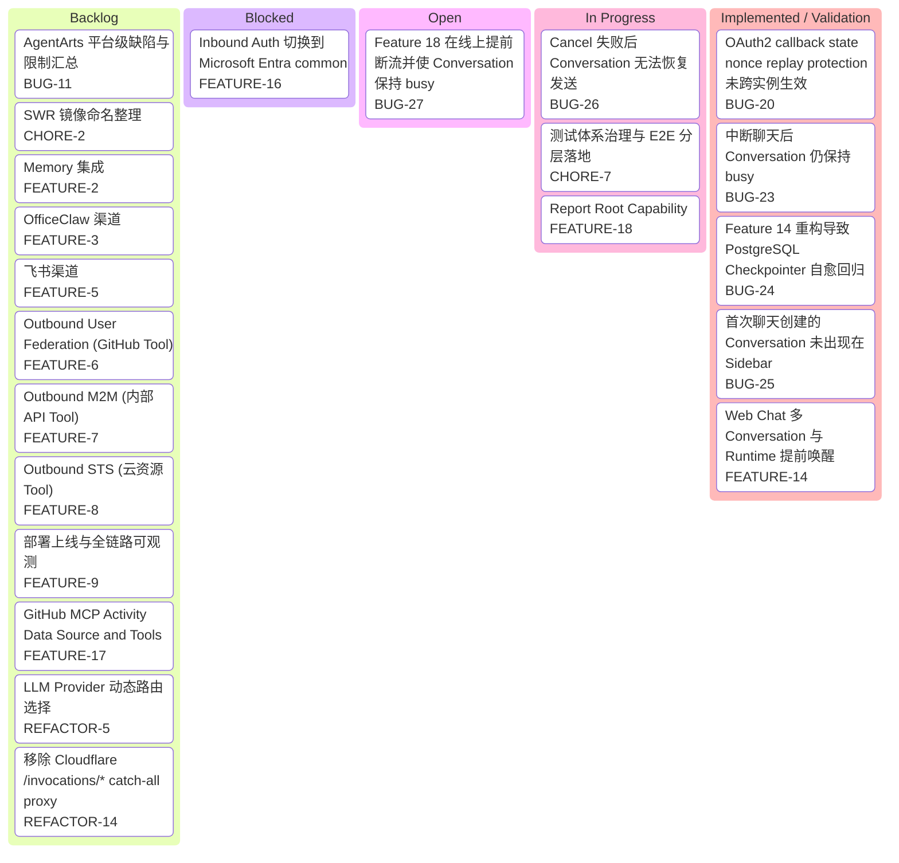

# Issues Kanban

本看板仅展示尚未归档的 issue。位于 `resolved/`、`canceled/` 或 `archived/`
目录中的 issue，以及显式标记为 `resolved` 或 `canceled` 的 issue，均不纳入看板。

看板优先采用 issue 文件中的 `status`；存在 `blocked_by` 时归入 Blocked；缺少标准
`status` 时，以 issue 正文和同类 README 中的状态说明为准。

图类型：**Kanban Diagram（看板图）**。用于按当前工作状态汇总尚未归档的 Feature、Bug、Chore 和 Refactor。

