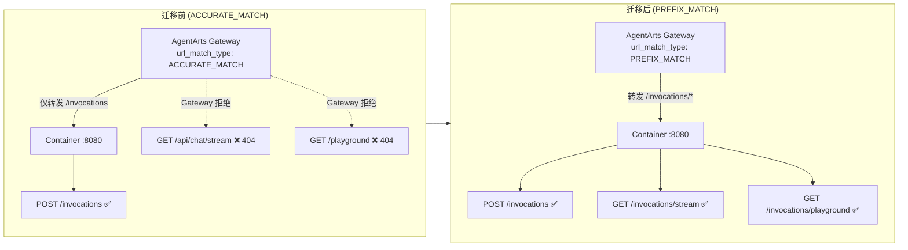
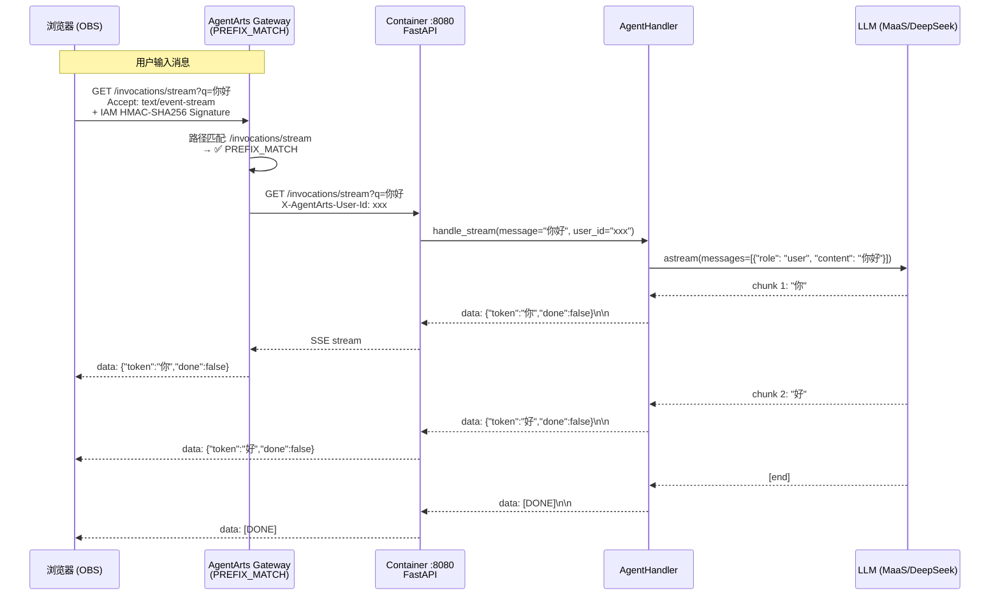

# Plan: refactor-4 — 路由收敛至 `/invocations` 前缀

> 状态：Plan Accepted | 关联 Issue：[issue.md](./issue.md)

---

## 0. Issue Evaluation

| 维度 | 结果 | 说明 |
|------|------|------|
| Staleness | ✅ | 引用的 `backend_architecture.md`（v0.1）与 `agentarts-deploy-runbook.md`（v1.0）均为当前活跃文档。代码库路由尚未迁移，变更实际需要。 |
| Feasibility | ✅ | 纯路由重命名 + 配置修改，不涉及 handler 逻辑改动。无技术阻塞点。 |
| Completeness | ✅ | Issue 包含完整路由对照表、配置变更、范围边界、验收标准。信息充足。 |
| Impact Scope | ✅ | 影响范围：Service 侧 4 个文件，Client 侧 2 个文件，Meta 侧 3 个文档。边界清晰。 |
| ADR Conflict | ✅ | 无 ADR 涉及具体路由路径。ADR-004（FastAPI）的支持方向与此一致。 |

**判定：ACCEPT**

---

## 1. Issue Summary

**问题**：AgentArts Gateway 默认 `ACCURATE_MATCH`，仅转发精确路径 `/invocations`。当前 App 的 `/api/chat/stream` 和 `/playground` 散落在根路径，Gateway 直接返回 `404 No matching policy found`，导致 SSE 流式对话和 Chainlit Playground 在生产环境不可用。

**方案**：
1. 将 `url_match_type` 改为 `PREFIX_MATCH`，使 Gateway 转发所有 `/invocations/*` 子路径
2. 将所有面向外部客户端的路由收敛到 `/invocations/` 前缀下（`/invocations/stream`、`/invocations/playground`）
3. `/ping` 和 `POST /invocations` 保持在根路径（平台内部 + SDK 入口）

**关联架构文档**：
- `personal-assistant-meta/architecture/backend_architecture.md` §2 — 路由设计（路由表已为 TARGET 状态）
- `personal-assistant-meta/architecture/devops/agentarts-deploy-runbook.md` — Step 5 冒烟验证命令 & §15.12 arch pitfall

---

## 2. API Changes (for Phase ③ meta-service-dev & Phase ④ meta-client-dev)

### 2.1 Route Path Changes

| 变更 | 旧路径 | 新路径 | 方法 |
|------|--------|--------|------|
| SSE 流式对话 | `GET /api/chat/stream` | `GET /invocations/stream` | GET |
| Chainlit redirect | `GET /playground` | `GET /invocations/playground` | GET |
| Chainlit mount | `mount(..., path="/playground")` | `mount(..., path="/invocations/playground")` | — |

### 2.2 OpenAPI Spec Regeneration Required

`personal-assistant-service/openapi.json` 当前记录路径为：
- `/api/chat/stream` (line 42)

**Phase ③ meta-service-dev** 必须在 `main.py` 路由变更后重新生成 OpenAPI spec：
```bash
cd personal-assistant-service
uv run python -c "from app.main import app; import json; print(json.dumps(app.openapi(), indent=2))" > openapi.json
```

新的 OpenAPI spec 将包含：
- `GET /invocations/stream` (替代 `/api/chat/stream`)
- `GET /ping`（不变）
- `POST /invocations`（不变）

### 2.3 Client TypeScript Type Sync

**Phase ④ meta-client-dev** 必须在 OpenAPI spec 再生后同步 TypeScript 类型。确认 `personal-assistant-client/` 是否有从 OpenAPI 生成类型的机制。当前未发现 `openapi-typescript` 等自动生成配置 — 如有需更新，如无则此步为 no-op。

---

## 3. Service Tasks (for Service-Dev)

### 3.1 路由迁移 — `app/main.py`

**文件**：`personal-assistant-service/app/main.py`

| 行号 | 变更类型 | 旧代码 | 新代码 | 说明 |
|------|---------|--------|--------|------|
| 78 | 修改 | `@app.get("/api/chat/stream")` | `@app.get("/invocations/stream")` | SSE endpoint 路径迁移 |
| 104 | 修改 | `@app.get("/playground", include_in_schema=False)` | `@app.get("/invocations/playground", include_in_schema=False)` | Chainlit redirect 路径迁移 |
| 107 | 修改 | `return RedirectResponse(url="/playground/")` | `return RedirectResponse(url="/invocations/playground/")` | redirect target 路径迁移 |
| 110 | 修改 | `mount_chainlit(app=app, target=..., path="/playground")` | `mount_chainlit(app=app, target=..., path="/invocations/playground")` | Chainlit mount 路径迁移 |
| 51 | 不变 | `@app.get("/ping")` | — | 保留，平台健康检查 |
| 57 | 不变 | `@app.post("/invocations")` | — | 保留，SDK invoke 入口 |

**注意事项**：
- handler 函数体（`chat_stream`、`playground_redirect`）无需修改 — 纯粹的路由装饰器参数变更
- `include_in_schema=False` 保留 — Chainlit redirect 不应出现在 OpenAPI spec
- 确认 `mount_chainlit` 的第二个参数 `target` 不需要变更（指向 `playground.py` 文件路径）

### 3.2 配置变更 — `.agentarts_config.yaml`

**文件**：`personal-assistant-service/.agentarts_config.yaml`

| 行号 | 变更类型 | 旧值 | 新值 | 说明 |
|------|---------|------|------|------|
| 27 | 修改 | `url_match_type: ACCURATE_MATCH` | `url_match_type: PREFIX_MATCH` | 启用子路径转发 |
| 19 | 验证 | `arch: arm64` | 无需修改 | 确认已是 `arm64`（当前值正确） |

### 3.3 单元测试更新 — `tests/test_main.py`

**文件**：`personal-assistant-service/tests/test_main.py`

需要将 **所有** `/api/chat/stream` 和 `/playground` 引用替换为新路径：

| 行号范围 | 变更 | 说明 |
|----------|------|------|
| 132 | 注释 `/api/chat/stream` → `/invocations/stream` | 注释中的路径引用 |
| 177-238 | 9 处 `/api/chat/stream` → `/invocations/stream` | SSE stream 测试（函数名可保留 `test_chat_stream_*`） |
| 250-259 | `"/playground"` → `"/invocations/playground"` | Mount path 断言 |
| 263-266 | `"/playground"` → `"/invocations/playground"` | Mount 类型断言 |
| 289-306 | `/playground` → `/invocations/playground` | Redirect 测试（request path + location header） |

**具体变更点**：

```
# SSE stream tests (lines 177-238)
- response = await client.get("/api/chat/stream?q=hello")     → "/invocations/stream?q=hello"
- response = await client.get("/api/chat/stream?q=")           → "/invocations/stream?q="
- response = await client.get("/api/chat/stream")              → "/invocations/stream"
- response = await client.get("/api/chat/stream?q=%20%20")    → "/invocations/stream?q=%20%20"

# Chainlit mount tests (lines 250-306)
- mount_chainlit(path="/playground") → mount_chainlit(path="/invocations/playground")
- assert m.path == "/playground"     → assert m.path == "/invocations/playground"
- await ac.get("/playground")        → await ac.get("/invocations/playground")
- assert location == "/playground/"  → assert location == "/invocations/playground/"
```

### 3.4 OpenAPI Spec Regeneration

**文件**：`personal-assistant-service/openapi.json`

在 `main.py` 路由变更后重新生成（由 Phase ③ meta-service-dev 执行），或由 Service-Dev 在测试通过后生成。

### 3.5 验证

```bash
cd personal-assistant-service

# 运行单元测试确认路由变更正确
uv run pytest tests/test_main.py -v

# 本地启动验证新路由可访问
uv run uvicorn app.main:app --port 8080 &
curl -N http://localhost:8080/invocations/stream?q=hello
curl -sI http://localhost:8080/invocations/playground
# 期望：/invocations/playground → 307 redirect → /invocations/playground/

# 确认旧路由不再存在
curl -sI http://localhost:8080/api/chat/stream?q=hello
# 期望：404 Not Found
```

---

## 4. Client Tasks (for Client-Dev)

### 4.1 Vite Proxy 配置更新 — `vite.config.ts`

**文件**：`personal-assistant-client/vite.config.ts`

| 行号 | 变更类型 | 旧值 | 新值 | 说明 |
|------|---------|------|------|------|
| 25-28 | 修改 | `/api` proxy | `/invocations/stream` proxy | SSE stream 路径变更 |
| 29-33 | 修改 | `/playground` proxy | `/invocations/playground` proxy | Chainlit playground 路径变更（ws: true 保留） |

**变更后代码**：
```typescript
server: {
  proxy: {
    '/invocations/stream': {
      target: 'http://localhost:8080',
      changeOrigin: true,
    },
    '/invocations/playground': {
      target: 'http://localhost:8080',
      changeOrigin: true,
      ws: true,
    },
  },
},
```

> **注意**：如果前端同时需要代理 `POST /invocations`（同步 invoke），也应在 proxy 中添加。当前 `vite.config.ts` 未代理 `/invocations`，本次仅迁移现有 proxy 路径。

### 4.2 RuntimeProvider.tsx — 适配器路径确认

**文件**：`personal-assistant-client/src/components/RuntimeProvider.tsx`

**当前状态**：引用 `../lib/chat-adapter`（`src/lib/chat-adapter.ts`），该文件尚不存在。

**任务**：
1. 如果 `chat-adapter.ts` 在本次 refactor 之前/同时被创建，需确认其 SSE 连接 URL 使用 `/invocations/stream`（非 `/api/chat/stream`）
2. 如果 `chat-adapter.ts` 尚未创建，本次无需变更 — 但需在创建时使用新路径

> **注意**：`chat-adapter.ts` 创建是独立 feature（Web Chat SSE 流式对话适配），不在本 refactor 范围。本次仅确保 Vite proxy 已更新，使后续开发可直接使用正确路径。

### 4.3 README.md — 架构图路径更新

**文件**：`personal-assistant-client/README.md`

| 行号 | 变更 | 说明 |
|------|------|------|
| 117 | `/api/chat/stream` → `/invocations/stream` | 架构图中 SSE 路径 |

### 4.4 验证

```bash
cd personal-assistant-client
npm run dev
# 在浏览器 DevTools Network 面板确认：
# 请求 /invocations/stream → 被 proxy 到 localhost:8080
```

---

## 5. Meta Documentation Tasks (for Meta-Dev — this phase)

### 5.1 `overall_architecture.md` — 架构总览路由列表

**文件**：`personal-assistant-meta/architecture/overall_architecture.md`

| 行号 | 变更 | 说明 |
|------|------|------|
| 22 | `"/chat/stream"` → `"/invocations/stream"` | 路由标签中的 SSE 路径 |

**修改内容**（Mermaid diagram label）：
```
Routes["路由层<br/>/ping /invocations<br/>/feishu/webhook<br/>/auth/callback<br/>/invocations/stream"]
```

### 5.2 `backend_architecture.md` — 路由代码示例确认

**文件**：`personal-assistant-meta/architecture/backend_architecture.md`

**当前状态**：
- Mermaid 图（line 17）：已使用 `/invocations/stream` ✅
- 路由表（line 126-135）：已使用 `/invocations/stream` ✅  
- 路由表注释（line 134-135）：已使用 `/invocations/stream` ✅
- 约束说明（line 56-76）：已说明 PREFIX_MATCH 和路由约束 ✅

**无需修改** — 该文档已正确反映 TARGET 状态。仅确认 `mount_chainlit` 的旧代码示例（line 144）使用 `/invocations/playground`（已正确）。

### 5.3 `agentarts-deploy-runbook.md` — 冒烟验证命令更新

**文件**：`personal-assistant-meta/architecture/devops/agentarts-deploy-runbook.md`

需要更新 **所有** 引用旧路径的 curl 命令和验证描述：

| 位置 | 旧值 | 新值 | 说明 |
|------|------|------|------|
| Line 342 | `$RUNTIME_DOMAIN/api/chat/stream?q=你好` | `$RUNTIME_DOMAIN/invocations/stream?q=你好` | Step 5.3 SSE 冒烟测试 |
| Line 351 | `$RUNTIME_DOMAIN/playground/` | `$RUNTIME_DOMAIN/invocations/playground/` | Step 5.4 Playground 可达性测试 |
| Line 371 | `/api/chat/stream` (SSE) 判定描述 | `/invocations/stream` (SSE) | 冒烟判定标准表 |
| Line 372 | `/playground/` 判定描述 | `/invocations/playground/` | 冒烟判定标准表 |
| Line 700 | `$RUNTIME_DOMAIN/api/chat/stream?q=ping` | `$RUNTIME_DOMAIN/invocations/stream?q=ping` | Step 13.2.3 CORS SSE 请求 |
| Line 758 | `/api/chat/stream` SSE 无响应 | `/invocations/stream` SSE 无响应 | Rollback 决策矩阵 |
| Line 856 | `/api/chat/stream`（相对路径） | `/invocations/stream`（完整路径） | Pitfalls 15.11 — 前端 API base URL |
| Line 974 | `GET /api/chat/stream?q=你好` | `GET /invocations/stream?q=你好` | Sequence diagram Step 5 |
| Line 976 | `GET /playground/` | `GET /invocations/playground/` | Sequence diagram Step 5 |
| Line 1026 | `/api/chat/stream?q=...` SSE 流正常 | `/invocations/stream?q=...` SSE 流正常 | Verification Checklist 后端 |
| Line 1027 | `GET /playground/` 返回 HTTP 200 | `GET /invocations/playground/` 返回 HTTP 200 | Verification Checklist 后端 |

> ⚠️ **重要**：部署 runbook 的冒烟测试 curl 命令在生产环境（经 Gateway）执行时，需带 IAM 签名认证（通过 `agentarts invoke` 命令），裸 curl 不可用。但 runbook 中的 curl 命令仅作示例 — **本计划不改变** runbook 使用的 curl 调用方式，仅更新路径。

---

## 6. Test Requirements

### 6.1 Service 单元测试

| 测试范围 | 测试类型 | 说明 |
|---------|---------|------|
| `GET /invocations/stream?q=hello` | Unit | 返回 200 + `text/event-stream` |
| `GET /invocations/stream?q=` | Unit | 返回 400（空 query） |
| `GET /invocations/stream` | Unit | 返回 400（缺失 query） |
| `GET /invocations/playground` | Unit | 返回 307 → `/invocations/playground/` |
| Chainlit mount path | Unit | `Mount` 路径为 `/invocations/playground` |
| Old routes deprecated | Unit | `GET /api/chat/stream` 返回 404 |
| `GET /ping` | Unit | 不受影响，返回 `{"status": "ok"}` |
| `POST /invocations` | Unit | 不受影响，正常返回 AI 回复 |

> `tests/test_main.py` 现有测试覆盖上述场景 — 本次仅需更新路径，不新增测试用例。

### 6.2 Client 验证

| 测试范围 | 类型 | 说明 |
|---------|------|------|
| Vite dev proxy | Manual | Dev 模式下 `/invocations/stream` 请求被代理到 `:8080` |
| Vite dev proxy ws | Manual | Dev 模式下 `/invocations/playground` 的 WebSocket 连接正常 |

### 6.3 E2E 验证（部署后）

| 测试范围 | 说明 |
|---------|------|
| `agentarts invoke` | 同步对话正常 |
| `agentarts runtime invoke --custom-path stream` | SSE 流式对话正常 |
| 浏览器访问 Runtime 域名 `/invocations/playground/` | Chainlit UI 可加载（需 IAM 签名，适合 `agentarts dev` 本地调试） |
| Web Chat 前端（更新 API 路径后）对话正常 | 端到端对话流程 |

---

## 7. Mermaid Diagrams

### 7.1 路由迁移前后对比



### 7.2 关键用户流 — Web Chat SSE 流式对话



---

## 8. Implementation Order

### 推荐执行顺序

```
Phase ③ (meta-service-dev)
├── 1. 修改 app/main.py 路由装饰器 + mount 路径
├── 2. 修改 .agentarts_config.yaml url_match_type
├── 3. 修改 tests/test_main.py 路径引用
├── 4. 运行 pytest 确认所有测试通过
└── 5. 重新生成 openapi.json

Phase ④ (meta-client-dev)
├── 6. 同步 TypeScript 类型（如有机型生成机制）
└── 7. 无需其他操作（chat-adapter.ts 尚未创建）

Phase ② (meta-dev — this phase)
├── 8. 更新 overall_architecture.md 路由标签
├── 9. 更新 agentarts-deploy-runbook.md 冒烟命令
└── 10. 确认 backend_architecture.md 已正确（无需改动）

Service-Dev
├── 11. 执行 main.py 变更（如 meta-service-dev 未完成）
├── 12. 执行 .agentarts_config.yaml 变更
└── 13. 执行测试更新

Client-Dev
├── 14. 更新 vite.config.ts proxy 配置
└── 15. 更新 README.md 架构图路径
```

---

## 9. Risk Assessment

| 风险 | 概率 | 影响 | 缓解措施 |
|------|------|------|---------|
| Chainlit mount 路径 `/invocations/playground` 与 Chainlit 内部路由冲突 | 低 | 中 | Chainlit 挂载为子路径，FastAPI Mount 机制正确处理路径前缀。本地 `agentarts dev` 验证后部署。 |
| 旧路径仍有硬编码引用（通过全文搜索可覆盖） | 低 | 低 | 本 plan 已枚举所有搜索到的引用。实现时需再次 `rg` 确认无遗漏。 |
| IAM 签名认证导致 Gateway 后 curl 裸请求不可用 | 已知 | 低 | runbook 已标注需通过 `agentarts invoke --custom-path stream` 进行生产验证。 |
| `agentarts launch` 重新部署时 PREFIX_MATCH 配置不生效 | 低 | 高 | agentarts_config.yaml 变更后需重新 `agentarts launch`。验证：`agentarts runtime describe` 检查 `invoke_config.url_match_type`。 |
| 前端 `RuntimeProvider.tsx` 引入的 `chat-adapter.ts` 尚不存在 | 已知 | 无 | 该文件为独立 feature 创建，本 refactor 无需处理。创建时使用新路径即可。 |

---

## 10. Migration Impact

### Breaking Changes

| 消费者 | 影响 | 迁移动作 |
|--------|------|---------|
| Web Chat 前端 | SSE 请求路径变更 | 更新 `vite.config.ts` proxy + 更新 `chat-adapter.ts`（如已存在）中的连接 URL |
| Deploy runbook | 冒烟验证 curl 命令路径变更 | 更新所有 `/api/chat/stream` → `/invocations/stream`、`/playground` → `/invocations/playground` |
| `agentarts dev` 本地调试 | 浏览器访问路径变更 | 由 `http://localhost:8080/playground` 改为 `http://localhost:8080/invocations/playground` |
| 单元测试 | 测试内路径变更 | 更新 `test_main.py` 中所有路径引用 |
| `agentarts invoke` + `--custom-path stream` | 路径变更 | 由 `--custom-path "api/chat/stream"` 改为 `--custom-path "invocations/stream"`（如使用了该参数） |

### Non-Breaking

| 项 | 说明 |
|------|------|
| `agentarts invoke '{"message":"..."}'` | `POST /invocations` 路径不变，SDK 调用不受影响 |
| `/ping` | 根路径保留，健康检查不受影响 |
| Handler 逻辑 | 路由迁移不触碰 `agent_handler.py`、`llm_config.py` 等业务逻辑 |
| MCP / WebSocket | 不涉及 |

---

## 11. File Manifest

### Service (`personal-assistant-service/`)

| 文件 | 变更类型 | Phase |
|------|---------|-------|
| `app/main.py` | 修改 — 3 处路由路径 | ③ meta-service-dev 或 Service-Dev |
| `.agentarts_config.yaml` | 修改 — `url_match_type` | ③ meta-service-dev 或 Service-Dev |
| `tests/test_main.py` | 修改 — 全部路径引用更新 | ③ meta-service-dev 或 Service-Dev |
| `openapi.json` | 重新生成 | ③ meta-service-dev |

### Client (`personal-assistant-client/`)

| 文件 | 变更类型 | Phase |
|------|---------|-------|
| `vite.config.ts` | 修改 — proxy 路径 | Client-Dev |
| `src/components/RuntimeProvider.tsx` | 不变 — `chat-adapter.ts` 创建时使用新路径 | 后续 feature |
| `README.md` | 修改 — 架构图路径 | Client-Dev |

### Meta (`personal-assistant-meta/`)

| 文件 | 变更类型 | Phase |
|------|---------|-------|
| `architecture/overall_architecture.md` | 修改 — 路由标签中的 `/chat/stream` | ② meta-dev |
| `architecture/backend_architecture.md` | 确认 — 已正确，无需修改 | ② meta-dev |
| `architecture/devops/agentarts-deploy-runbook.md` | 修改 — 全部 curl 命令和验证描述中的旧路径 | ② meta-dev |
| `issues/refactor/refactor-4-consolidate-invocations-routes/plan.md` | 新增 — 本文件 | ② meta-dev |

---

## 12. API Sync Phase Flag

**Phase ③ meta-service-dev 需要执行**：
1. 在 `app/main.py` 路由变更后重新生成 `openapi.json`
2. 确认 OpenAPI spec 中路径正确反映新路由

**Phase ④ meta-client-dev 需要执行**：
1. 检查 `personal-assistant-client/` 是否有从 OpenAPI spec 生成 TypeScript 类型的机制
2. 如有，重新生成类型文件；如无，标记为 no-op
