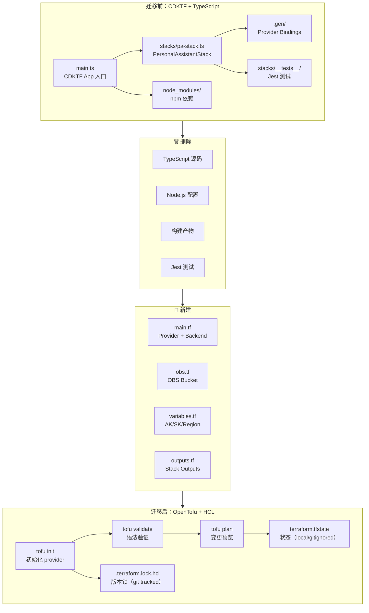
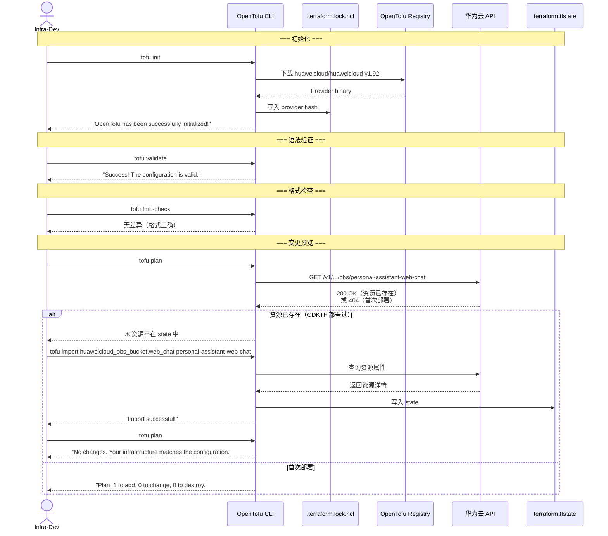
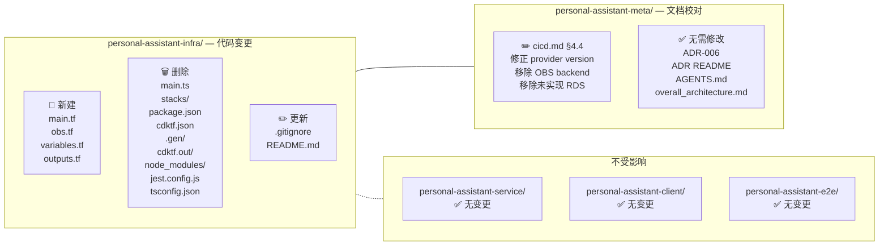

# Implementation Plan: Refactor 6 — CDKTF → OpenTofu + HCL 迁移

> 关联 Issue：[issue.md](./issue.md)
> 关联 ADR：[ADR-006](../../../architecture/ADR/ADR-006-iac-cdktf-typescript.md)

---

## 0. Issue Evaluation

| 维度 | 结果 | 说明 |
|------|------|------|
| Staleness | ✅ | CDKTF 已于 2025-12-10 归档，迁移需求仍然有效。引用的架构文档（ADR-006、cicd.md、infra AGENTS.md）均存在且部分已预更新至 OpenTofu + HCL |
| Feasibility | ✅ | 实现路径明确：1 个 OBS Bucket 资源，~35 行 TypeScript → ~35 行 HCL。所有设计决策已在 ADR-006 修订版中确立 |
| Completeness | ✅ | Issue 包含完整的任务拆解、验证步骤、范围边界和验收标准 |
| Impact Scope | ✅ | 影响范围清晰：`personal-assistant-infra/` 代码+文档 + `personal-assistant-meta/architecture/` 文档校对。无 Service/Client 影响 |

**判定：ACCEPT** → 继续编写 Implementation Plan。

### 当前状态审计（Pre-Plan Audit）

在编写 plan 前，对已有文档进行了交叉审计，发现部分文档已预更新至目标状态，部分需要修正：

| 文件 | 当前状态 | Plan 中的操作 |
|------|---------|---------------|
| **ADR-006** | ✅ 已修订至 OpenTofu + HCL（标题、内容、HCL 示例均正确） | 无需修改 |
| **ADR README** | ✅ ADR-006 条目已更新为 "OpenTofu + HCL" | 无需修改 |
| **infra AGENTS.md** | ✅ 已重写为 OpenTofu + HCL（技术栈、命令、目录结构均正确） | 无需修改（需验证行级无遗漏） |
| **infra README.md** | ❌ 仍描述 CDKTF 工作流（npm 命令、TypeScript 目录结构） | 完整重写 |
| **infra .gitignore** | ⚠️ 已包含 Terraform 规则（`.terraform/`、`*.tfstate`、`*.tfvars`），但仍保留 CDKTF 规则（`cdktf.out/`、`.gen/`） | 移除 CDKTF 规则 |
| **cicd.md §4.4** | ⚠️ 已引用 OpenTofu，但示例代码存在问题：① provider version 为 `~> 1.60`（应为 `~> 1.92`）；② 包含 `backend "s3"`（应为 local state）；③ 包含未实现的 RDS resource | 修正 §4.4 示例代码 |
| **HCL 文件** | ❌ 不存在 | 新建 `main.tf`、`obs.tf`、`variables.tf`、`outputs.tf` |
| **CDKTF 文件** | ❌ 仍存在（`main.ts`、`stacks/`、`package.json`、`node_modules/` 等） | 全部删除 |

---

## 1. Issue Summary

将 `personal-assistant-infra/` 的 IaC 方案从已归档的 CDK for Terraform (CDKTF) + TypeScript 迁移到 OpenTofu + 原生 HCL。动机：

- **CDKTF 已死**：HashiCorp (IBM) 于 2025-12-10 正式归档 CDKTF 仓库，停止所有维护和安全更新
- **社区 fork 不可靠**：CDK Terrain (cdktn) 存活不足 6 个月，ThoughtWorks Radar "Assess"，CDK-for-Terraform 路线本身已被市场否定
- **OpenTofu 是未来**：Linux 基金会托管、MPL 协议、100% Terraform 兼容

涉及架构文档：

- `personal-assistant-meta/architecture/ADR/ADR-006-iac-cdktf-typescript.md` — 核心决策（已修订）
- `personal-assistant-meta/architecture/devops/cicd.md` — Layer 3 IaC 工具说明
- `personal-assistant-infra/AGENTS.md` — 开发规范（已重写）
- `personal-assistant-infra/README.md` — 快速开始（待重写）

---

## 2. API Changes

**无 API 变更。** 此次迁移为纯 Infra 层 IaC 工具替换：

- Service 侧 FastAPI/Pydantic schema 无变化
- Client 侧 TypeScript interface 无变化
- OpenAPI spec 无变化
- 华为云资源属性（OBS Bucket name、ACL、versioning、website）完全等价，仅声明方式从 TypeScript 变为 HCL

---

## 3. Service Tasks

**无 Service 侧任务。** 此次 refactor 不涉及 `personal-assistant-service/` 任何代码或配置。

---

## 4. Client Tasks

**无 Client 侧任务。** 此次 refactor 不涉及 `personal-assistant-client/` 任何代码或配置。

---

## 5. Infra Tasks

> **执行者**：`personal-assistant-infra-dev`
> **目录**：`personal-assistant-infra/`

### 5.1 准备工作

- [ ] **5.1.1** 确认 OpenTofu CLI 已安装：`tofu version`（若未安装：`brew install opentofu`）
- [ ] **5.1.2** 确认当前分支为 `refactor/refactor-6-migrate-cdktf-to-opentofu-hcl`
- [ ] **5.1.3** 备份当前 state（如果已通过 CDKTF 部署过）：`npx cdktf synth` 检查 `cdktf.out/` 中的 `cdk.tf.json`

### 5.2 编写 HCL 文件

#### 5.2.1 `main.tf` — Provider + Backend 配置

**新建** `personal-assistant-infra/main.tf`：

```hcl
# ============================================================
# Personal Assistant — 华为云基础资源
# ============================================================
# IaC 工具：OpenTofu（Linux 基金会托管，MPL 协议）
# 详见 ADR-006: personal-assistant-meta/architecture/ADR/ADR-006-iac-cdktf-typescript.md

terraform {
  required_providers {
    huaweicloud = {
      source  = "huaweicloud/huaweicloud"
      version = "~> 1.92"
    }
  }

  # State 当前为本地存储。
  # OBS backend（pa-terraform-state bucket）为长期目标，需在首次部署后迁移（chicken-and-egg 问题）。
  # backend "s3" {
  #   bucket = "pa-terraform-state"
  #   key    = "prod/terraform.tfstate"
  #   region = "cn-southwest-2"
  # }
}

provider "huaweicloud" {
  region     = var.region
  access_key = var.ak
  secret_key = var.sk
}
```

**设计决策**：
- `version = "~> 1.92"` — 与当前 CDKTF `cdktf.json` 中的 provider 版本一致
- Backend 注释保留 — local state 初期策略，OBS backend 为未来目标
- Provider 引用 `var.ak` / `var.sk` 而非硬编码或环境变量直读 — 统一通过 variables.tf + terraform.tfvars 管理

#### 5.2.2 `obs.tf` — OBS Bucket 资源

**新建** `personal-assistant-infra/obs.tf`：

```hcl
# OBS Bucket — Web Chat 前端静态托管
#
# 等价于原 CDKTF stacks/pa-stack.ts 中的 ObsBucket 资源。
# 配置：public-read ACL, versioning 启用, SPA 静态网站托管（error_document → index.html）

resource "huaweicloud_obs_bucket" "web_chat" {
  bucket     = "personal-assistant-web-chat"
  acl        = "public-read"
  versioning = true

  website {
    index_document = "index.html"
    error_document = "index.html" # SPA fallback: 所有路由返回 index.html
  }
}
```

**与 CDKTF `pa-stack.ts` 的等价性验证**：

| 属性 | CDKTF (TypeScript) | HCL | 一致？ |
|------|-------------------|-----|--------|
| bucket | `"personal-assistant-web-chat"` | `"personal-assistant-web-chat"` | ✅ |
| acl | `"public-read"` | `"public-read"` | ✅ |
| versioning | `true` | `true` | ✅ |
| website.index_document | `"index.html"` | `"index.html"` | ✅ |
| website.error_document | `"index.html"` | `"index.html"` | ✅ |

#### 5.2.3 `variables.tf` — 变量声明

**新建** `personal-assistant-infra/variables.tf`：

```hcl
# ============================================================
# 变量声明
# ============================================================
# 敏感变量（ak, sk）通过 terraform.tfvars（gitignored）赋值
# 或通过环境变量 TF_VAR_ak / TF_VAR_sk 注入

variable "ak" {
  description = "HuaweiCloud Access Key (AK)"
  type        = string
  sensitive   = true
}

variable "sk" {
  description = "HuaweiCloud Secret Key (SK)"
  type        = string
  sensitive   = true
}

variable "region" {
  description = "HuaweiCloud 区域"
  type        = string
  default     = "cn-southwest-2"
}
```

#### 5.2.4 `outputs.tf` — Stack 输出

**新建** `personal-assistant-infra/outputs.tf`：

```hcl
# ============================================================
# Stack Outputs
# ============================================================
# 供 Service 配置及部署脚本引用

output "bucket_name" {
  description = "OBS Bucket 名称"
  value       = huaweicloud_obs_bucket.web_chat.bucket
}

output "website_endpoint" {
  description = "OBS 静态网站托管 endpoint（SPA 入口）"
  value       = "https://${huaweicloud_obs_bucket.web_chat.bucket}.obs-website.${var.region}.myhuaweicloud.com"
}

# ⚠️ 注意：terraform.tfvars 文件包含敏感信息（AK/SK），已通过 .gitignore 排除。
# 实际 variables.tf 中的 ak/sk 变量通过 .tfvars 或环境变量 TF_VAR_* 注入。
```

### 5.3 验证 HCL 代码

- [ ] **5.3.1** `cd personal-assistant-infra`
- [ ] **5.3.2** `tofu init` — 初始化 provider，生成 `.terraform.lock.hcl`
- [ ] **5.3.3** `tofu validate` — 语法验证
- [ ] **5.3.4** `tofu fmt -check` — 格式检查（若失败，执行 `tofu fmt` 自动修复后重新验证）
- [ ] **5.3.5** 配置凭据后运行 `tofu plan` — 确认无意外变更（如果已部署过 OBS Bucket）

### 5.4 清理 CDKTF 旧文件

> 以下所有文件均在 `personal-assistant-infra/` 目录下。

- [ ] **5.4.1** 删除 TypeScript 源码：
  - `main.ts`
  - `stacks/pa-stack.ts`
  - `stacks/__tests__/pa-stack.test.ts`
  - `stacks/__tests__/`（整个目录）
  - `stacks/`（空目录）
  - `constructs/.gitkeep`
  - `constructs/`（空目录）
- [ ] **5.4.2** 删除 Node.js 配置文件：
  - `package.json`
  - `package-lock.json`
  - `tsconfig.json`
  - `jest.config.js`
  - `cdktf.json`
- [ ] **5.4.3** 删除构建产物目录：
  - `.gen/`（整个目录 — provider bindings）
  - `cdktf.out/`（整个目录 — synth 输出）
  - `node_modules/`（整个目录 — npm 依赖）
- [ ] **5.4.4** 删除 `coverage/` 目录（如存在）
- [ ] **5.4.5** 删除 `personal-assistant-infra/.gitkeep`（根目录占位文件，不再需要）

### 5.5 更新 infra 配置文件

#### 5.5.1 `.gitignore` — 更新排除规则

**当前状态**：已包含 Terraform 规则（`.terraform/`、`*.tfstate`、`*.tfvars`），但仍保留 CDKTF 规则（`cdktf.out/`、`.gen/`）。

**操作**：移除 CDKTF 相关行，保留 Terraform 规则。

删除以下行：
```
cdktf.out/
.gen/
coverage/
node_modules/
dist/
```

保留：
```
# Local .terraform directories
.terraform/

# .tfstate files
*.tfstate
*.tfstate.*

# Exclude all .tfvars files
*.tfvars
*.tfvars.json

# Ignore override files
override.tf
override.tf.json
*_override.tf
*_override.tf.json

# Ignore transient lock info files
.terraform.tfstate.lock.info

# Ignore CLI configuration files
.terraformrc
terraform.rc
```

**注意**：`.terraform.lock.hcl` 不应被 gitignore — 它是 provider 版本锁文件，应 git tracked。

#### 5.5.2 `README.md` — 完整重写

替换为 OpenTofu + HCL 内容。参照新目录结构，包含：

- 技术栈说明（OpenTofu + HCL + `huaweicloud` provider）
- 前置条件（OpenTofu CLI、华为云凭据）
- 常用命令（`tofu init` / `tofu validate` / `tofu fmt` / `tofu plan` / `tofu apply`）
- 当前管理资源表（1 个 OBS Bucket）
- 部署后验证（curl OBS website endpoint）
- 目录结构（仅 HCL 文件 + README + AGENTS）
- 从 CDKTF 迁移记录
- 相关文档链接

### 5.6 State 迁移（如果已部署过）

- [ ] **5.6.1** 如果 OBS Bucket 已通过 CDKTF 部署：
  ```bash
  tofu import huaweicloud_obs_bucket.web_chat personal-assistant-web-chat
  ```
- [ ] **5.6.2** 运行 `tofu plan` — 确认 zero changes
- [ ] **5.6.3** 如果 `tofu plan` 显示非零变更：检查 HCL 属性是否与原 CDKTF stack 完全等价，修正后重新验证

---

## 6. Meta Documentation Tasks

> **执行者**：`personal-assistant-meta-dev`（文档更新）或由 `personal-assistant-infra-dev` 在同一个 PR 中完成
> **目录**：`personal-assistant-meta/architecture/`

### 6.1 文档审计结论

| 文件 | 是否需要更新 | 说明 |
|------|-------------|------|
| **ADR-006** | ❌ 不需要 | 已于 2026-06-09 修订为 OpenTofu + HCL，标题、背景、决策、影响、HCL 示例均正确 |
| **ADR README** | ❌ 不需要 | ADR-006 条目已显示 "基础资源层从 CDKTF (TypeScript) 迁移到 OpenTofu + HCL" |
| **infra AGENTS.md** | ❌ 不需要 | 已重写为 OpenTofu + HCL（技术栈、命令、目录结构均正确） |
| **cicd.md §3 底部图** | ⚠️ 建议更新 | `flowchart TB` 中 Layer3 注释仍为 `CI3["Terraform / RFS"]` → `CI3["未来引入"]`，但实际已引入。注：这是 §1 的高层概览图，可以保持概览性质不修改，但建议将 `CI3` 标签更新为 `"OpenTofu / RFS"` 与 §4 表述一致 |
| **cicd.md §4.4** | ✅ 需要修正 | 示例代码存在三处偏差（详见 6.2） |
| **overall_architecture.md** | ❌ 不需要 | 不涉及 infra 工具选择 |

### 6.2 `cicd.md §4.4` — 修正示例代码

**文件**：`personal-assistant-meta/architecture/devops/cicd.md`
**节**：§4.4 "示例：OpenTofu 配置（当前已实现）"（行 186-233）

**问题**：

| # | 当前值 | 应为 | 原因 |
|---|--------|------|------|
| 1 | `version = "~> 1.60"` | `version = "~> 1.92"` | 与 CDKTF `cdktf.json` 及 ADR-006 中的 provider 版本一致 |
| 2 | `backend "s3" { ... }` 块 | 注释或移除 | 本 refactor 采用 local state 策略，OBS backend 为未来目标（同 ADR-006 及 `main.tf` 注释策略） |
| 3 | `resource "huaweicloud_rds_instance" "user_mapping" { ... }` 及相关 VPC resource | 移除 | 当前实际部署仅有 1 个 OBS Bucket，RDS 尚未存在。§4.4 标记为"当前已实现"，应反映真实部署状态 |

**修正后 §4.4 示例代码**：

```hcl
terraform {
  required_providers {
    huaweicloud = {
      source  = "huaweicloud/huaweicloud"
      version = "~> 1.92"
    }
  }
  # State 当前为本地存储。
  # OBS backend 为长期目标，详见 ADR-006。
}

provider "huaweicloud" {
  region     = var.region
  access_key = var.ak
  secret_key = var.sk
}

# Web Chat 前端静态托管
resource "huaweicloud_obs_bucket" "web_chat" {
  bucket     = "personal-assistant-web-chat"
  acl        = "public-read"
  versioning = true

  website {
    index_document = "index.html"
    error_document = "index.html" # SPA fallback
  }
}
```

### 6.3 可选：`cicd.md §1` 高层面图

`flowchart TB` 中 Layer3 底部：
```
Layer3 -->|Terraform / RFS| CI3["未来引入"]
```

建议将标签更新为 `"OpenTofu / RFS"` 以与 §4 内容一致。但此为**可选**修改，因为 §1 是高层概览图，保留简化表述亦可接受。plan 中标记为 ⚠️ optional，由 reviewer 决策。

---

## 7. Test Requirements

### 7.1 Infra 测试

**测试工具替换**：Jest + cdktf snapshot → `tofu validate` + `tofu plan`

| 测试项 | 方法 | 预期结果 |
|--------|------|---------|
| HCL 语法正确 | `tofu validate` | "Success! The configuration is valid." |
| HCL 格式合规 | `tofu fmt -check` | 无差异输出。若失败，`tofu fmt` 后重新验证 |
| Provider 版本锁 | `tofu init` 后检查 `.terraform.lock.hcl` | 文件生成，内容包含 `huaweicloud/huaweicloud` hash |
| 资源属性等价（已部署时） | `tofu plan` | "No changes. Your infrastructure matches the configuration." |
| 资源导入（已部署时） | `tofu import huaweicloud_obs_bucket.web_chat personal-assistant-web-chat` | 导入成功，`tofu plan` 显示 zero changes |
| 资源属性正确（未部署时） | `tofu plan` | 显示 1 to add: `huaweicloud_obs_bucket.web_chat` |
| OBS bucket name 正确 | `tofu show` 或 `tofu plan` 输出 | bucket = `personal-assistant-web-chat` |
| ACL 为 public-read | `tofu plan` 输出 | acl = `public-read` |
| versioning 启用 | `tofu plan` 输出 | versioning = `true` |
| website 配置正确 | `tofu plan` 输出 | index_document = `index.html`, error_document = `index.html` |

### 7.2 文档测试

| 测试项 | 方法 | 预期结果 |
|--------|------|---------|
| infra 目录无 CDKTF 文件 | `ls -la personal-assistant-infra/` | 无 `main.ts`、`stacks/`、`package.json`、`tsconfig.json`、`jest.config.js`、`cdktf.json`、`.gen/`、`cdktf.out/`、`node_modules/` |
| HCL 文件存在 | `ls personal-assistant-infra/*.tf` | 存在 `main.tf`、`obs.tf`、`variables.tf`、`outputs.tf` |
| .gitignore 无 CDKTF 规则 | `grep cdktf personal-assistant-infra/.gitignore` | 无匹配 |
| .gitignore 有 Terraform 规则 | `grep '\.terraform' personal-assistant-infra/.gitignore` | 有 `.terraform/` 规则 |
| README.md 无 CDKTF/npm 内容 | `grep -i 'cdktf\|npx\|npm install\|ts-node' personal-assistant-infra/README.md` | 无匹配 |
| README.md 有 tofu 命令 | `grep 'tofu' personal-assistant-infra/README.md` | 有 `tofu` 命令说明 |
| cicd.md §4.4 provider version | `grep 'version.*1\.92' personal-assistant-meta/architecture/devops/cicd.md` | 有 `~> 1.92` |

### 7.3 Edge Cases

| 场景 | 处理 |
|------|------|
| **首次部署（无已有 state）** | `tofu plan` 显示 1 new resource，`tofu apply` 创建 |
| **已有 state（CDKTF 部署过）** | `tofu import` 导入后 `tofu plan` 确认 zero changes |
| **terraform.tfvars 缺失** | `tofu plan` 交互式提示输入 ak/sk，或通过 `TF_VAR_ak`/`TF_VAR_sk` 环境变量注入 |
| **华为云凭据错误** | `tofu plan` 返回华为云 API 认证错误，检查 AK/SK 有效性 |
| **Region 不存在** | `tofu plan` 返回华为云 API region 无效错误，检查 `var.region` 默认值 |
| **OBS bucket 名称冲突** | `tofu plan` 显示 bucket 已存在但不在 state 中 → 需要 `tofu import` |
| **.terraform.lock.hcl 被 gitignore** | `.gitignore` 不应排除 `.terraform.lock.hcl`（它是 git tracked 文件） |

---

## 8. Mermaid Diagrams

### 8.1 迁移流程：CDKTF → OpenTofu + HCL



### 8.2 验证流程：tofu plan 交互



### 8.3 受影响的文件范围



---

## 9. Risk Mitigation

| 风险 | 缓解措施 | 验证 |
|------|---------|------|
| **已有 Terraform state 不兼容** | `tofu plan` 先行验证；如需，通过 `tofu import` 导入已有资源 | `tofu plan` 显示 zero changes |
| **HCL 语法错误** | `tofu validate` + `tofu fmt -check` 提前发现 | CI 中跑 validate |
| **华为云凭据未配置** | 通过环境变量 `TF_VAR_ak`/`TF_VAR_sk` 注入，同 CDKTF 时期方式 | `tofu plan` 失败则提醒配置凭据 |
| **Provider 版本偏差** | `.terraform.lock.hcl` 锁定版本，git tracked | CI 中 `tofu init` 检查 lock 文件一致性 |
| **文档不一致** | cicd.md §4.4 示例代码与 HCL 实际代码对照审查 | 人工 review |

---

## 10. Deliverable Checklist

### Infra 代码（personal-assistant-infra/）

- [ ] `main.tf` — provider + backend 配置
- [ ] `obs.tf` — OBS Bucket 资源
- [ ] `variables.tf` — 变量声明
- [ ] `outputs.tf` — Stack 输出
- [ ] `.gitignore` — 移除 CDKTF 规则，保留 Terraform 规则
- [ ] `README.md` — 完整重写为 OpenTofu + HCL
- [ ] `.terraform.lock.hcl` — `tofu init` 后自动生成，git tracked

### Infra 清理

- [ ] 删除 `main.ts`
- [ ] 删除 `stacks/`（整个目录）
- [ ] 删除 `constructs/`（整个目录）
- [ ] 删除 `package.json`
- [ ] 删除 `package-lock.json`
- [ ] 删除 `tsconfig.json`
- [ ] 删除 `jest.config.js`
- [ ] 删除 `cdktf.json`
- [ ] 删除 `.gen/`（整个目录）
- [ ] 删除 `cdktf.out/`（整个目录）
- [ ] 删除 `node_modules/`（整个目录）
- [ ] 删除 `.gitkeep`（根目录占位文件）

### Meta 文档

- [ ] `cicd.md §4.4` 示例代码修正（provider version ~> 1.92，移除 OBS backend，移除 RDS）
- [ ] 可选：`cicd.md §1` 高层面图标签更新为 "OpenTofu / RFS"

### 验证

- [ ] `tofu init` 成功
- [ ] `tofu validate` 通过
- [ ] `tofu fmt -check` 通过
- [ ] `tofu plan` 显示预期变更（首次）或 zero changes（已部署）
- [ ] 目录中无任何 CDKTF/TypeScript/Node.js 残留文件

### 不在此次范围（明确排除）

- ❌ CI/CD 流水线变更（GitHub Actions）
- ❌ 华为云凭据管理方式变更
- ❌ Provider 版本升级（保持 `~> 1.92`）
- ❌ RFS 采用
- ❌ Service/Client 代码变更
- ❌ 引入 Terratest 等额外 IaC 测试框架
- ❌ OBS backend 迁移（标记为未来 TODO，代码中已注释说明）
