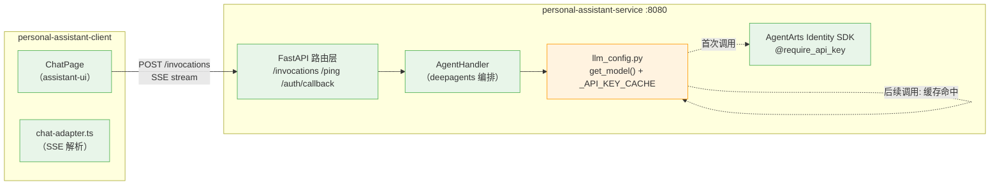
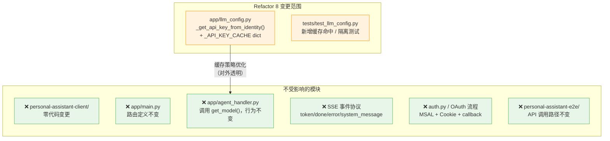
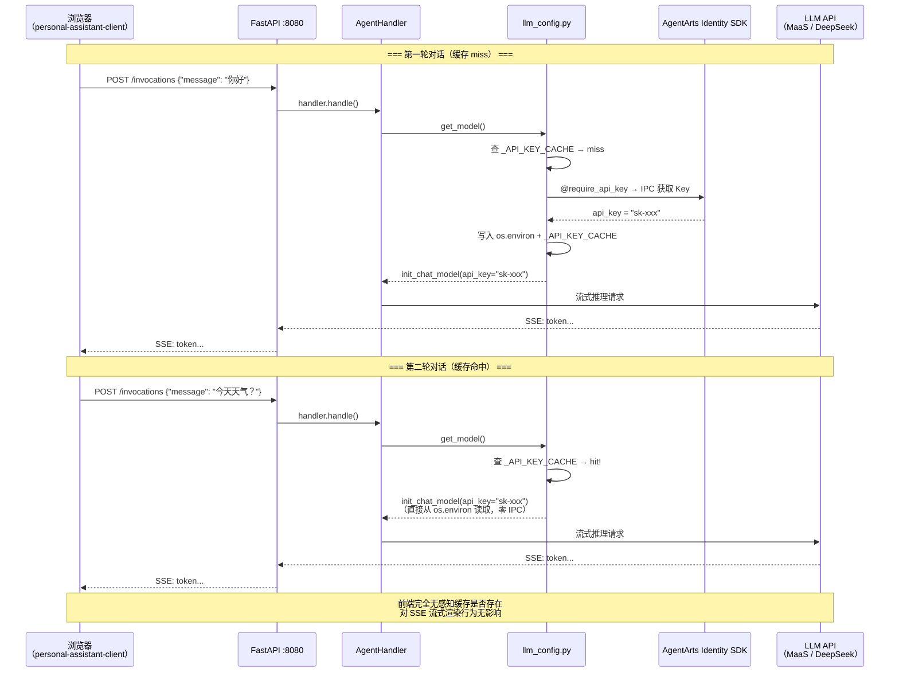

# Refactor 8: LLM API Key 进程级缓存 — 前端实施计划

> 版本：v1.0 | 日期：2026-06-17 | 对应 Issue：`backlog/refactor-8-llm-api-key-caching/issue.md`
> 关联 Issue：[ADR-016：Secretless Credential Injection](../../../architecture/ADR/ADR-016-secretless-credential-injection.md)

---

## 执行摘要

**结论：本次 refactor 为纯后端优化，前端（`personal-assistant-client/`）无需任何代码变更。**

本次变更仅限于 `personal-assistant-service/app/llm_config.py` 内部的 API Key 缓存策略优化——将 `@require_api_key` 装饰器的每次调用改为首次获取后缓存到 `os.environ`。该变更发生在前端不可见的后端进程内部，不涉及：

- ❌ 路由变更（无新增/修改/删除端点）
- ❌ API Schema 变更（Request/Response 格式无变化）
- ❌ SSE 事件协议变更（`token`/`done`/`error`/`system_message` 事件格式不变）
- ❌ 认证流程变更（MSAL 登录、OAuth callback、JWT Cookie 无变化）
- ❌ 环境变量变更（前端 `VITE_*` 变量无变化）
- ❌ Build 配置变更（Vite、Tailwind、TypeScript 配置无需修改）

---

## 1. Client Tasks

### 1.1 无新增或修改的组件

本次变更不涉及以下任何前端层面的修改：

| 分类 | 状态 | 说明 |
|------|:----:|------|
| React 组件 / 页面 | ✅ 无变更 | `App.tsx`、`AuthGuard`、`ChatPage`、`LandingPage`、`GlobalNav`、`LandingHero`、`FeatureTile`、`CapabilityGrid`、`CapabilityCard`、`ClosingCTA`、`LandingFooter`、`LoadingState`、`ChunkErrorBoundary` 等全部不变 |
| State 管理（Zustand） | ✅ 无变更 | 认证 store、对话 store 无新增字段或 action |
| 路由（React Router / MSAL） | ✅ 无变更 | 页面路由和 MSAL redirect 逻辑不变 |
| Build 配置 | ✅ 无变更 | `vite.config.ts`、`tailwind.config.ts`、`tsconfig.json` 无需修改 |
| 环境变量（`.env`） | ✅ 无变更 | 前端不需要 LLM API Key 环境变量 |

### 1.2 验证项（非代码变更）

前端开发者应执行的验证操作（仅确认无回归）：

| 验证项 | 方法 | 预期结果 |
|--------|------|----------|
| TypeScript 编译 | `npx tsc -b` | 零错误，通过 |
| Vite 生产构建 | `npm run build` | 构建成功，产物无变化 |
| 单元测试全绿 | `npm run test` | 所有已有测试通过 |
| 本地 dev 启动 | `npm run dev` | Vite proxy 正常工作，ChatPage / LandingPage 渲染正常 |

---

## 2. API Adaptations

### 2.1 无 API 契约变更

本次 refactor 仅修改后端 `_get_api_key_from_identity()` 的内部实现——在返回 API Key 之前先查进程级缓存（`os.environ`）。该函数仍然是 `get_model()` 的**私有 helper**，对调用方完全透明：

```
变更前：
  get_model() → _get_api_key_from_identity() → @require_api_key → AgentArts SDK (每次 IPC)

变更后：
  get_model() → _get_api_key_from_identity() → os.environ 缓存命中 → 直接返回
                                            ↘ 缓存 miss → @require_api_key → AgentArts SDK → 写入 os.environ
```

**前端与后端的通信路径完全不受影响**：



> 前端 (`Chat` + `SSE`) 只与 `Routes` 交互，对 `LLM` 层的缓存策略完全无感知。

### 2.2 OpenAPI Spec 无变化

`app.openapi()` 生成的 OpenAPI spec 不会因本次变更产生任何差异——路由定义（`/ping`、`/invocations`、`/auth/callback`）、Request/Response schema 均不变。因此：

- `personal-assistant-client/` 中的 TypeScript 类型无需重新生成
- OpenAPI spec 变更不会触发 `personal-assistant-meta-client-dev` 的 API Type Sync 步骤

### 2.3 SSE 事件协议无变化

SSE 事件格式（`token`、`done`、`error`、`system_message`、`auth_url`、`auth_required`）完全不变。`chat-adapter.ts` 中的 `SSEEvent` 接口和事件解析逻辑无需修改。

---

## 3. UI Flow

### 3.1 无页面流转或交互序列变化

本次变更对用户可见的 UI 行为**零影响**：

- 登录流程（LandingPage → MSAL redirect → AuthGuard → ChatPage）不变
- 对话交互（消息发送 → SSE 流式渲染 → 工具调用 → 授权卡片）不变
- Loading 状态、Error 处理、Chunk 加载失败降级均不变

### 3.2 性能影响（对用户透明）

虽然后端 API Key 获取从"每次 IPC 调用"优化为"进程级内存读取"，减少了约 10-50ms 的固定延迟，但这一优化发生在前端 SSE 连接的**上游**（LLM 模型初始化阶段），对前端的 SSE 流式渲染体验无直接可观测影响。用户感知的对话响应速度可能有微弱改善，但前端代码无需为此做任何适配。

---

## 4. Frontend Test Cases

### 4.1 无新增测试用例需求

本次 refactor 为纯后端变更，不引入新的前端行为或边界条件，因此**不需要编写新的前端测试用例**。

### 4.2 现有测试回归验证

应运行前端现有测试套件确认零回归：

```bash
# 在 personal-assistant-client/ 目录下
npm run test
```

预期：所有已有测试通过，无新增失败。若有测试失败，应排查是否为环境问题而非本次 refactor 导致（因为前端代码零变更）。

### 4.3 关键现有测试清单（验证仍在通过）

以下与 API 通信相关的现有测试应特别关注，确保重构后仍通过：

| 测试范围 | 说明 | 预期 |
|----------|------|------|
| SSE 解析（`chat-adapter.ts`） | 验证 `token`/`done`/`error`/`system_message` 事件解析 | 仍需通过 |
| API 调用（fetch/SSE） | 验证 `/invocations` 端点正常通信 | 仍需通过 |
| 认证流程（MSAL） | 验证登录/登出/Token 刷新 | 仍需通过 |
| 组件渲染 | 验证 ChatPage / LandingPage / AuthGuard 渲染 | 仍需通过 |

---

## 5. Mermaid 图表

### 5.1 变更影响范围：前端无影响



### 5.2 进程级缓存对前端请求路径的透明性



---

## 6. 实施步骤（前端侧）

| Step | 负责方 | 文件 | 操作 |
|------|--------|------|------|
| **1** | Client-Dev | 全部 `personal-assistant-client/` | 运行 `npm run test`，确认所有已有测试通过 |
| **2** | Client-Dev | 全部 `personal-assistant-client/` | 运行 `npm run build`，确认生产构建成功 |
| **3** | Client-Dev | 全部 `personal-assistant-client/` | 运行 `npx tsc -b`，确认零类型错误 |

> **注意**：以上步骤为**验证性操作**，确认前端在零代码变更的前提下无回归。不需要修改任何文件。

---

## 7. 参考文档

| 文档 | 路径 | 角色 |
|------|------|------|
| 原始 Issue | `personal-assistant-meta/issues/refactor/backlog/refactor-8-llm-api-key-caching/issue.md` | 变更动机与范围 |
| ADR-016 | `personal-assistant-meta/architecture/ADR/ADR-016-secretless-credential-injection.md` | Secretless 凭据注入决策 |
| 前端架构 | `personal-assistant-meta/architecture/frontend_architecture.md` | 客户端架构基线 |
| Client AGENTS.md | `personal-assistant-client/AGENTS.md` | 前端技术栈与约定 |
| llm_config.py | `personal-assistant-service/app/llm_config.py` | 变更目标文件 |
