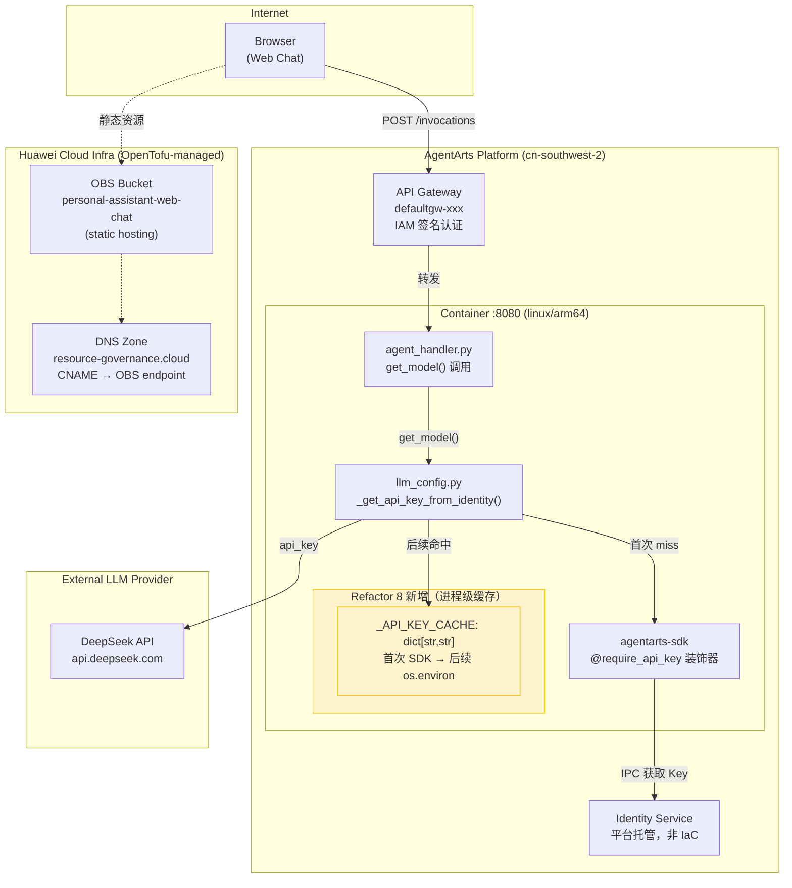

# Infra Plan: Refactor 8 — LLM API Key 进程级缓存

> **Issue**: [refactor-8-llm-api-key-caching](issue.md)
> **Feature Branch**: `refactor/llm-api-key-caching`
> **关联 ADR**: [ADR-016：Secretless Credential Injection](../../architecture/ADR/ADR-016-secretless-credential-injection.md)
> **Status**: No infrastructure changes required

---

## 1. 结论：零基础设施变更

**Refactor 8 不涉及任何华为云基础资源变更（OpenTofu/HCL），不涉及 `.agentarts_config.yaml` 修改，不涉及网络/安全边界调整。`personal-assistant-infra/` 目录完全无需修改。**

唯一的变更是 `personal-assistant-service/app/llm_config.py` 中的应用层代码——在模块级增加 `_API_KEY_CACHE: dict[str, str] = {}` 进程级缓存字典，使 `_get_api_key_from_identity()` 首次通过 AgentArts SDK 获取 API Key 后，后续调用直接读取 `os.environ`，避免重复 IPC 调用。

---

## 2. 为什么不需要基础设施变更

### 2.1 变更范围：纯应用层代码

Refactor 8 只修改一个文件：

| 文件 | 改动 | 层级 |
|------|------|------|
| `personal-assistant-service/app/llm_config.py` | 新增 `_API_KEY_CACHE` 模块级字典；`_get_api_key_from_identity()` 先查缓存再调 SDK；获取后写入 `os.environ` | Service 层（应用代码） |
| `personal-assistant-service/tests/test_llm_config.py` | 新增缓存命中/未命中测试 | Service 层（测试代码） |

这些改动完全在 AgentArts Runtime 容器内部执行，不触碰任何基础设施层。

### 2.2 缓存策略无需平台支持

| 缓存机制 | 依赖 | 说明 |
|----------|------|------|
| `_API_KEY_CACHE` 进程级字典 | Python 内置 `dict` | 模块级变量，进程启动时为空，随进程生命周期存在 |
| `os.environ` 写入 | Python 标准库 | 获取 Key 后写入环境变量，LangChain 底层自动读取 |
| Key 轮转 → 容器重启 | `agentarts launch`（标准部署流程） | 每次 `agentarts launch` 会重建容器，进程重启后缓存自动清空，下次调用重新从 SDK 获取新 Key |

**关键点**：Key 轮转需要容器重启——这已经是 AgentArts Runtime 的标准部署行为（`agentarts launch` 执行 `docker build → push → deploy`，重建容器）。Refactor 8 不需要任何额外的平台功能来"清除缓存"或"通知 Key 更新"。

### 2.3 逐资源分析

以下按 `personal-assistant-infra/` 当前管理的资源类型及 IaC 触发场景逐一论证：

| 资源类别 | 是否需要变更 | 理由 |
|----------|:-----------:|------|
| **OBS Bucket** | ❌ | Web Chat 静态托管（`personal-assistant-web-chat`），与 LLM API Key 缓存无关 |
| **RDS (PostgreSQL)** | ❌ | 当前无 RDS 实例。即使后续创建，API Key 缓存不涉及数据库 |
| **IAM (Agency / Role / Policy)** | ❌ | 身份认证由 AgentArts Identity 平台托管，`@require_api_key` 装饰器透明处理。缓存层不改变认证流程 |
| **VPC / Subnet / Security Group** | ❌ | AgentArts Runtime 使用 `PUBLIC` 网络模式，无 VPC 变更 |
| **EIP** | ❌ | 无新增公网入口需求 |
| **CDN** | ❌ | 无静态资源加速需求 |
| **DNS (Zone / Recordset)** | ❌ | `chat.resource-governance.cloud` CNAME → OBS website endpoint 无变更 |
| **SWR (组织 / 仓库)** | ❌ | 容器镜像构建流程不变，`personal-assistant-org/agent_personal_assistant` 仓库无变更 |
| **SSL / TLS 证书** | ❌ | AgentArts Gateway 侧 TLS 由平台自动管理 |

### 2.4 `.agentarts_config.yaml` 无需修改

当前 `.agentarts_config.yaml` 中 `runtime.environment_variables` 已配置 `MAAS_API_KEY` 和 `DEEPSEEK_API_KEY`（值为 AgentArts Identity provider 引用，非明文 Key）。Refactor 8 不新增、不删除、不修改任何环境变量。

LLM API Key 的获取流程在 Refactor 8 前后是一致的：
- **Refactor 8 前**：`get_model()` → `_get_api_key_from_identity()` → `@require_api_key` 装饰器 → AgentArts SDK → Identity Service（每次都走 IPC）
- **Refactor 8 后**：`get_model()` → `_get_api_key_from_identity()` → 查 `_API_KEY_CACHE` → 命中则直接返回；miss 则走上述流程，然后写入缓存

两层配置（`config.yaml` 的 `credential_provider_name` 引用 + AgentArts Identity 平台的 Key 存储）完全不被缓存层触及。

---

## 3. 基础设施拓扑图

Refactor 8 的缓存在现有基础设施边界内运行，位于 AgentArts Runtime 容器内部，不创建任何新的云资源，不修改任何现有资源。唯一的变化用黄色高亮标出。



**图例**：
- **黄色高亮区域**：Refactor 8 唯一变更点——`llm_config.py` 内部的进程级缓存字典。完全位于 AgentArts Runtime 容器内部。
- **蓝色虚线区域**：华为云基础资源（OpenTofu 管理）——全部为存量资源，无任何变更。
- **绿色虚线区域**：外部 LLM Provider（DeepSeek）——API 调用行为不变。

---

## 4. 部署注意事项

### 4.1 容器重启即清空缓存

`_API_KEY_CACHE` 是进程级内存字典，随容器生命周期存在。`agentarts launch` 会执行完整的构建-推送-部署流程，重建容器，缓存自动清空。这与当前运维习惯完全一致：

```bash
# 正常部署流程（缓存随新容器自动重建）
agentarts launch

# Key 轮转流程（与正常部署一致）
# 1. 在 AgentArts Identity 平台更新 API Key
# 2. agentarts launch → 新容器启动 → 首次调用触发 SDK 获取新 Key → 写入缓存
```

**无需额外的"刷新缓存"步骤或 API**。

### 4.2 本地开发

本地 `uvicorn` 模式下，`@require_api_key` 的 fallback 机制通过 `.agent_identity.json` 文件获取 Key。Refactor 8 的缓存逻辑在本地开发时同样生效——首次调用走 SDK（读取 `.agent_identity.json`），后续从 `os.environ` 读取。行为与部署环境一致。

---

## 5. 基础设施测试用例

华为云资源层（OpenTofu/HCL）无变更，测试用例聚焦于**验证 IaC 零变更**：

| ID | 测试项 | 命令 | 预期结果 |
|----|--------|------|----------|
| INFRA-R8-01 | IaC 语法验证（无变更） | `cd personal-assistant-infra && tofu validate` | `Success! The configuration is valid.` |
| INFRA-R8-02 | IaC Plan 零变更 | `cd personal-assistant-infra && tofu plan` | `No changes. Your infrastructure matches the configuration.` |
| INFRA-R8-03 | HCL 格式化检查 | `cd personal-assistant-infra && tofu fmt -check` | 无格式问题（所有文件 already formatted） |
| INFRA-R8-04 | 现有 IaC 文件无修改 | `git status personal-assistant-infra/` | `nothing to commit, working tree clean` |
| INFRA-R8-05 | `.agentarts_config.yaml` 无变更 | 人工审查 | 确认 `runtime.environment_variables` 仅含存量变量（`MAAS_API_KEY`、`DEEPSEEK_API_KEY`、`MEMORY_SPACE_ID`），无新增/删除 |
| INFRA-R8-06 | 部署后容器健康检查 | `curl https://<runtime-domain>/ping` | `{"status": "ok"}` |
| INFRA-R8-07 | 部署后 `/invocations` 可达 | `curl -X POST https://<runtime-domain>/invocations -H "Content-Type: application/json" -d '{"message":"ping"}'` | 返回有效 JSON 响应（非 5xx） |

> **注意**：`INFRA-R8-02` 若检测到 drift（实际资源与 state 不一致），需先排查原因。原则是 IaC state 必须与 Refactor 8 无关。

---

## 6. 现有 IaC 资源完整性确认

以下为 `personal-assistant-infra/` 中当前全部受管理资源，Refactor 8 **不影响其中任何一个**：

| 文件 | 资源 | Impact |
|------|------|:------:|
| `main.tf` | Provider `huaweicloud/huaweicloud`、OBS S3 backend `pa-terraform-state` | 无 |
| `obs.tf` | `huaweicloud_obs_bucket.web_chat`（静态网站托管，ACL=public-read，versioning=true） | 无 |
| `dns.tf` | `huaweicloud_dns_zone.resource_governance_cloud`、`huaweicloud_dns_recordset.chat`（CNAME → OBS endpoint） | 无 |
| `variables.tf` | `var.region`（默认 `cn-southwest-2`） | 无 |
| `outputs.tf` | `bucket_name`、`website_endpoint`、`custom_domain` | 无 |
| `.terraform.lock.hcl` | Provider 版本锁（`huaweicloud/huaweicloud ~> 1.92`） | 无 |

---

## 7. 检查清单

- [x] OBS Bucket — 无需变更
- [x] RDS — 无需变更（当前无 RDS 实例）
- [x] IAM — 无需变更
- [x] VPC — 无需变更
- [x] EIP — 无需变更
- [x] CDN — 无需变更
- [x] DNS — 无需变更
- [x] SWR — 无需变更
- [x] SSL/TLS — 无需变更
- [x] `.agentarts_config.yaml` — 无需变更
- [x] `config.yaml` — 无需变更（`credential_provider_name` 引用不变）
- [x] AgentArts Identity Provider — 无需变更（Key 仍通过 `@require_api_key` 获取）

---

## 8. 总结

Refactor 8 是一个**纯应用层优化**：在 `llm_config.py` 中新增进程级 API Key 缓存，避免每次 `get_model()` 调用都触发 AgentArts SDK 的 IPC 调用。缓存在进程生命周期内有效，Key 轮转通过容器重启（`agentarts launch`）自然完成。

| 层 | 有变更？ | 具体内容 |
|----|:-------:|----------|
| **华为云资源层**（OpenTofu/HCL → `personal-assistant-infra/`） | ❌ 无 | 无任何 `.tf` 文件修改 |
| **AgentArts 平台配置层**（`.agentarts_config.yaml`） | ❌ 无 | 环境变量无增删改 |
| **Service 代码层**（`personal-assistant-service/`） | ✅ 有 | `llm_config.py` 新增 `_API_KEY_CACHE` + 缓存逻辑，`test_llm_config.py` 新增测试——由 `service-plan.md` 规划 |

### `personal-assistant-infra-dev` 在本 Phase 的职责

此 Issue 对 `personal-assistant-infra-dev` 为 **zero-touch**。`personal-assistant-infra-manager` 应跳过 Infra 控制循环——无需修改任何 `.tf` 文件，无需运行 `tofu apply`。唯一需要的验证是运行 `tofu validate` + `tofu plan` 确认现有栈仍然有效、无意外 drift。
