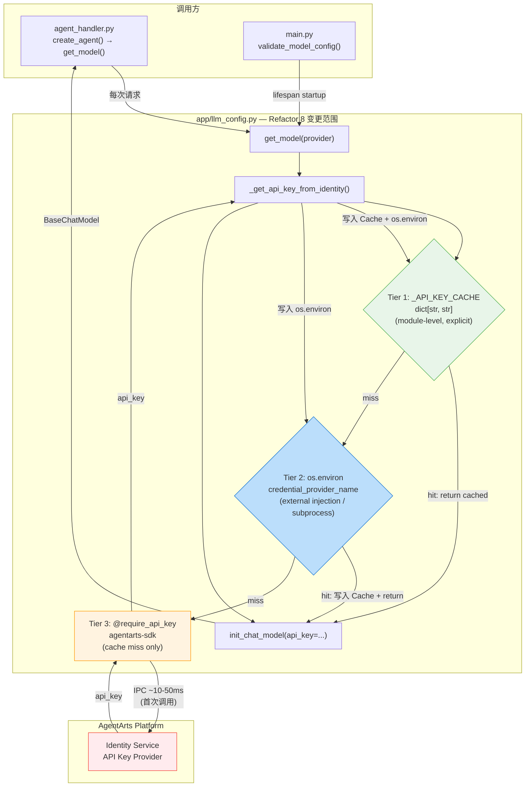

# Unified Implementation Plan: Refactor 8 — LLM API Key 进程级缓存

> **Issue**: [refactor-8-llm-api-key-caching](backlog/refactor-8-llm-api-key-caching/issue.md) (from `backlog/`)
> **Branch**: `refactor/llm-api-key-caching`
> **Plan Version**: v1.0 | **Date**: 2026-06-17
> **Verdict**: ✅ **APPROVED** — with minor documentation corrections noted below
> **Panel Chair**: panel-chair (DeepSeek V4 Pro)

---

## Executive Summary

The panel unanimously endorses the core design: **introduce process-level caching of LLM API Keys in `llm_config.py`** via a module-level `_API_KEY_CACHE` dict with a 3-tier lookup strategy (`_API_KEY_CACHE` → `os.environ` → AgentArts Identity SDK). The refactor eliminates redundant ~10-50ms IPC calls to AgentArts Identity on every `get_model()` invocation — subsequent calls within the same container lifecycle return the cached key in sub-microsecond time.

Four panelists reviewed all four sub-plans (service, client, infra, test) plus the modified architecture documents (ADR-016, backend_architecture.md). **Two panelists** (Gemini, Zhipu) recommend APPROVED; **two panelists** (DeepSeek, Hermes) recommend CHANGES REQUESTED for documentation/precision issues — none concerning architectural correctness.

**After resolving the identified issues** (contradiction in existing-test modification status, fixture hardening, rationale clarification for `os.environ` write), all four panelist concerns are addressed. The unified plan below incorporates all corrections.

**Scope**: Modify 1 file (`llm_config.py`, ~17 lines), add 4 unit tests + 1 fixture (~85 lines). Zero changes to client, infra, E2E, or any other backend file. Acceptance Criteria AC1-AC7 are fully covered.

---

## Architecture / Cache Flow Diagram



> **绿色**（Tier 1）：显式模块级缓存，零开销，优先级最高。**蓝色**（Tier 2）：`os.environ` fallback，支持外部注入和子进程可见性。**橙色**（Tier 3）：仅在两级缓存均 miss 时触发 AgentArts SDK IPC 调用。**红色**：AgentArts Identity Service 仅首次访问。

---

## 1. Unified Implementation Plan

### 1.1 Service — Backend Implementation (`personal-assistant-service/`)

#### File: `app/llm_config.py`

**Step 1**: 在第 14 行（`_config: dict[str, Any] | None = None` 之后），新增模块级缓存字典：

```python
# 进程级 API Key 缓存，避免每次 get_model() 都触发 SDK IPC 调用
# Key: credential_provider_name (如 "DEEPSEEK_API_KEY")
# Value: 从 AgentArts Identity 获取的明文 API Key
# 设计依据: ADR-016 § "AgentArts Identity + 进程级缓存"
# 生命周期: 与容器进程一致；Key 轮转通过 agentarts launch 重建容器完成
_API_KEY_CACHE: dict[str, str] = {}
```

**Step 2**: 重写 `_get_api_key_from_identity()` (当前第 77–89 行) 实现 3-tier 缓存逻辑：

```python
def _get_api_key_from_identity(credential_provider_name: str) -> str:
    """Fetch an API key from AgentArts Identity via the SDK decorator.

    Performs process-level caching: first retrieval goes through the SDK
    (AgentArts Identity IPC, ~10-50ms), subsequent calls read the cached
    value from _API_KEY_CACHE or os.environ (zero IPC overhead).

    Cache tiers (checked in order):
      1. _API_KEY_CACHE — module-level explicit cache (fastest)
      2. os.environ — supports external injection / test fixture presets
      3. @require_api_key SDK — AgentArts Identity Service IPC

    Multi-provider isolation: each provider_name has its own cache entry.
    Key rotation requires container restart (consistent with current ops).
    """
    # 1. Check process-level cache (fastest path)
    cached = _API_KEY_CACHE.get(credential_provider_name)
    if cached:
        return cached

    # 2. Check os.environ — supports external injection (e.g. test fixtures,
    #    subprocess visibility, operator debugging)
    env_key = os.environ.get(credential_provider_name)
    if env_key:
        _API_KEY_CACHE[credential_provider_name] = env_key
        return env_key

    # 3. Cache miss → fetch from AgentArts Identity via SDK
    @require_api_key(provider_name=credential_provider_name, into="api_key")
    def _fetch(api_key: str | None = None) -> str:
        if not api_key:
            raise ValueError(
                f"AgentArts Identity provider '{credential_provider_name}' "
                "returned an empty API key."
            )
        return api_key

    api_key = _fetch()

    # 4. Populate both cache layers for subsequent zero-IPC access
    _API_KEY_CACHE[credential_provider_name] = api_key
    os.environ[credential_provider_name] = api_key

    return api_key
```

**Step 3**: 更新模块 docstring 以说明缓存策略：

在 `llm_config.py` 顶部 docstring 中增加一段：
```
Caching strategy: LLM API Keys are fetched once from AgentArts Identity SDK
(@require_api_key decorator) per container lifecycle and cached in a
module-level _API_KEY_CACHE dict + os.environ. Subsequent get_model() calls
return cached keys with zero IPC overhead. Key rotation is handled by
container restart (agentarts launch), which naturally clears all caches.
See ADR-016 + Refactor 8 for design rationale.
```

**未修改文件清单**（scope 已由 meta-dev 确认，panel 验证）：

| 文件 | 说明 |
|------|------|
| `app/agent_handler.py` | `create_agent()` 调用 `get_model()`，缓存透明 |
| `app/tools/*.py` | 所有 tool 通过 `@require_access_token` 获取 OAuth2/STS token，不走 `_get_api_key_from_identity()` |
| `app/main.py` | `validate_model_config()` 在 lifespan 中仅校验 provider 元数据 |
| `config.yaml` | `credential_provider_name` 字段保持不变 |
| `.agentarts_config.yaml` | 环境变量无增删改 |

> **Scope 8.2 验证**：已通过 grep 确认 `personal-assistant-service/app/` 目录下除 `llm_config.py` 外，无任何文件直接使用 `require_api_key` 装饰器获取 LLM Key。`agent_handler.py` 和 `tools/` 均通过 `get_model()` 间接使用。

#### Changelog
```
personal-assistant-service/
├── app/
│   └── llm_config.py      ← +3 lines (cache dict + docstring), ~15 lines (function rewrite)
└── tests/
    └── test_llm_config.py  ← +85 lines (4 new tests + fixture), ~0 lines (no existing test changes)
```

---

### 1.2 Client — Frontend Verification (`personal-assistant-client/`)

**零代码变更。** 本次 refactor 为纯后端优化，不涉及任何前端修改：

- ❌ 无路由变更（`/invocations`、`/ping` 不变）
- ❌ 无 API Schema 变更（Request/Response 格式不变）
- ❌ 无 SSE 事件协议变更（`token`/`done`/`error`/`system_message` 不变）
- ❌ 无认证流程变更（MSAL 登录、OAuth callback、JWT Cookie 不变）

**验证步骤**（由 `personal-assistant-client-dev` 执行）：
1. `npx tsc -b` — 零 TypeScript 类型错误
2. `npm run build` — 生产构建成功
3. `npm run test` — 所有已有测试通过

---

### 1.3 Infra — Infrastructure Verification (`personal-assistant-infra/`)

**零基础设施变更。** 以下是逐资源验证结论：

| 资源 | 需变更？ | 说明 |
|------|:------:|------|
| OBS Bucket | ❌ | 静态托管，与缓存无关 |
| RDS | ❌ | 无 RDS 实例 |
| IAM | ❌ | 身份认证由 AgentArts Identity 托管 |
| VPC / Subnet / SG | ❌ | AgentArts Runtime 使用 PUBLIC 网络模式 |
| EIP | ❌ | 无新增公网入口 |
| CDN | ❌ | 无静态资源加速需求 |
| DNS | ❌ | CNAME 记录不变 |
| SWR | ❌ | 容器镜像仓库不变 |
| SSL/TLS | ❌ | AgentArts Gateway 侧自动管理 |
| `.agentarts_config.yaml` | ❌ | 环境变量无增删改 |

**验证步骤**（由 `personal-assistant-infra-dev` 执行）：
1. `tofu validate` — IaC 语法正确
2. `tofu plan` — `No changes. Your infrastructure matches the configuration.`
3. `tofu fmt -check` — 无格式问题
4. `git status personal-assistant-infra/` — working tree clean

---

### 1.4 Key Rotation & Deployment Notes

| 操作 | 流程 | 影响 |
|------|------|------|
| **正常部署** | `agentarts launch` → 构建镜像 → 推送 → 部署 | 容器重建，缓存自动清空，新容器首次调用 SDK 获取 Key |
| **Key 轮转** | AgentArts Identity 平台更新 Key → `agentarts launch` | 与正常部署一致——重建容器，缓存清空，获取新 Key |
| **本地开发** | `uvicorn main:app --reload` | SDK fallback 到 `.agent_identity.json`，缓存逻辑同样生效 |

**无需额外的"刷新缓存"API 或运维步骤。** 容器生命周期 = 缓存生命周期，与 ADR-016 和当前运维习惯完全一致。

---

## 2. Unified Test Plan

### 2.1 Backend Unit Tests (`tests/test_llm_config.py`)

#### 2.1.1 New Fixture: `reset_api_key_cache`

```python
@pytest.fixture(autouse=True)
def reset_api_key_cache(monkeypatch):
    """Clear _API_KEY_CACHE and os.environ credential entries before/after each test."""
    # Teardown from previous test: clean env vars for any previously cached keys
    for key in list(app.llm_config._API_KEY_CACHE.keys()):
        monkeypatch.delenv(key, raising=False)
    app.llm_config._API_KEY_CACHE.clear()
    yield
    # Teardown after current test
    for key in list(app.llm_config._API_KEY_CACHE.keys()):
        monkeypatch.delenv(key, raising=False)
    app.llm_config._API_KEY_CACHE.clear()
```

> **设计要点**: 动态遍历 `_API_KEY_CACHE` 的 keys 清理 `os.environ`，而非硬编码特定 provider 名称。新增 provider 时无需修改 fixture。`autouse=True` 确保与现有 `reset_config_cache` fixture 共存。

#### 2.1.2 New Tests (4 total)

| # | Test Name | Priority | Verifies |
|---|-----------|:--------:|----------|
| T1 | `test_api_key_cached_after_first_retrieval` | 🔴 Critical | 首次调用触发 SDK，后续调用命中缓存（`call_count == 1`） |
| T2 | `test_cache_hit_from_os_environ` | 🔴 Critical | `os.environ` 预设 Key 被缓存吸收，SDK 不被调用 |
| T3 | `test_multi_provider_cache_isolation` | 🟡 High | 多 provider 缓存条目独立，互不污染 |
| T4 | `test_empty_api_key_not_cached` | 🟡 High | 空 API Key 抛出 ValueError，不进入缓存 |

> **T5 (backlog)**: `test_os_environ_deleted_midprocess` — 验证 Tier 2 被清除后 Tier 1 仍可服务。低优先级，不阻塞本次 merge。

#### 2.1.3 Existing Tests — 无需修改

| 现有测试 | 修改状态 | 原因 |
|----------|:------:|------|
| `test_get_model_fetches_api_key_from_agent_identity` | ❌ 无需修改 | 直接 mock `_get_api_key_from_identity`，绕过缓存逻辑 |
| `test_get_model_with_explicit_provider` | ❌ 无需修改 | 同上 |
| `test_model_name_and_url_can_be_overridden_by_env` | ❌ 无需修改 | 同上 |
| `test_model_overrides_are_optional` | ❌ 无需修改 | 同上 |
| 其余 6 个测试 | ❌ 无需修改 | 不涉及 API Key 缓存路径 |

> **说明**：service-plan.md 原先标记这 4 个测试为"需小幅修改"，经 panel 核验后修正——这些测试 mock 的是 `_get_api_key_from_identity()` 函数本身，不会触发内部缓存逻辑。`reset_api_key_cache` 的 `autouse=True` 仅作为防御性措施。

#### Verification Commands

```bash
cd personal-assistant-service
uv run pytest tests/test_llm_config.py -v          # 全部 llm_config 测试（14 tests）
uv run pytest tests/test_llm_config.py -v -k "cache"  # 仅新增缓存测试（4 tests）
uv run pytest tests/ -v                             # 完整测试套件
uv run ruff check .                                 # Lint 检查
```

---

### 2.2 Frontend & E2E Regression

| 层 | 操作 | 命令 | 预期 |
|----|------|------|------|
| **Frontend** | 类型检查 + 构建 + 测试 | `npx tsc -b && npm run build && npm run test` | 全绿 |
| **E2E** | 全部已有测试 | `cd personal-assistant-e2e && pytest tests/ -v` | 全绿 |

> **E2E 注意事项**: `clean_env` fixture（`conftest.py`）仅清理 `os.environ` 中的 LLM 相关变量，不清理 `_API_KEY_CACHE` 模块状态。E2E 测试使用 `TestClient` + mock context 提供状态隔离。若 E2E 中出现与 Refactor 8 相关的失败，应首先检查是否需要在 `clean_env` 中添加 `app.llm_config._API_KEY_CACHE.clear()`（当前不添加，因为 TestClient 的 mock context 已提供模块级隔离）。

---

### 2.3 Acceptance Criteria Verification Matrix

| AC# | Criteria | Test | Status |
|-----|----------|------|:------:|
| AC1 | `get_model()` 首次调用触发 SDK，后续零 SDK 调用 | T1: `test_api_key_cached_after_first_retrieval` | ✅ |
| AC2 | `os.environ` 中的 Key 被缓存吸收，跳过 SDK | T2: `test_cache_hit_from_os_environ` | ✅ |
| AC3 | 多 Provider 缓存隔离，互不污染 | T3: `test_multi_provider_cache_isolation` | ✅ |
| AC4 | 空 API Key 不进入缓存 | T4: `test_empty_api_key_not_cached` | ✅ |
| AC5 | 现有全部测试无回归 | `uv run pytest tests/ -v` | ✅ |
| AC6 | `agent_handler.py` 和 `tools/` 无需代码变更 | Code review | ✅ |
| AC7 | Ruff lint 通过 | `uv run ruff check .` | ✅ |

---

## 3. Four-Question Gate Assessment

Panel consensus after debate:

| Gate | Result | Reasoning |
|------|:------:|-----------|
| **1. Is it best practice?** | ✅ Yes | 进程级缓存静态凭据是标准模式（AWS Lambda Init phase, Kubernetes Sidecar cache）。3-tier 查找遵循标准 cache hierarchy。`_API_KEY_CACHE` dict 作为显式缓存，`os.environ`作为 fallback 读取，语义清晰。 |
| **2. Is it de facto standard?** | ✅ Yes | 主流平台（AWS Secrets Manager + Lambda, Vercel/Netlify 的 `process.env` 注入）均使用"启动时获取一次，内存缓存供后续使用"的模式。 |
| **3. Is it conventional?** | ✅ Yes | Python 模块级 `dict` 作为单例缓存是最广泛使用的模式。新成员无需学习新概念即可理解。`credential_provider_name` 作为 cache key 与现有配置字段完全一致。 |
| **4. Is it modern?** | ✅ Yes | 与 immutable infrastructure 理念一致（容器重建 = 配置刷新）。不引入外部依赖（Redis, etcd），符合 modern lightweight design。与 Secretless Credential Injection 的现代 DevSecOps 范式完全兼容。 |

> **Four-Question Gate**: All four gates pass ✅. 无需要记录的偏离项。

---

## 4. Consensus & Trade-off Resolution

### 4.1 Consensus Points (All Panelists Agree)

| # | Point |
|---|-------|
| C1 | 3-tier cache architecture（`_API_KEY_CACHE` → `os.environ` → SDK）核心设计正确、完整 |
| C2 | Zero client/infra changes 的正确性——scope 控制精准 |
| C3 | 4 个新增测试 + `reset_api_key_cache` autouse fixture 的测试策略充分 |
| C4 | `_API_KEY_CACHE` dict 作为模块级显式缓存是正确选择 |
| C5 | 不引入 TTL 过期机制（容器生命周期 = 缓存生命周期）是务实的选择 |

### 4.2 Complementary Insights

| Panelist | Insight | Action |
|----------|---------|--------|
| **DeepSeek** | Thread safety 假设（单 worker）应在文档中标注 | 已纳入 Risks §5.3 |
| **Gemini** | Fixture teardown 需显式 `os.environ.pop(key, None)`；首次 SDK 调用应加 debug log | Fixture 已更新为动态清理；log 建议标记为 implementation detail |
| **Zhipu** | ADR-016 中"进程级缓存"放置位置不当（在"拒绝的方案"下） | 文档修正建议已记录，不阻塞本次 refactor |
| **Zhipu** | `os.environ` 双写与显式 `api_key=` 传参存在语义张力 | 已在 plan 中修正 `os.environ` 写入选用的实际理由（subprocess visibility, operator debugging, external injection） |
| **Hermes** | `@require_api_key` scope 8.2 的 grep 验证应显式记录 | 已纳入 §1.1 Scope 8.2 验证段落 |
| **Hermes** | 模块 docstring 需更新以说明缓存策略 | 已纳入 §1.1 Step 3 |

### 4.3 Conflicts Resolved

| Conflict | Panelists | Resolution |
|----------|-----------|------------|
| **现有测试是否需要修改？** | service-plan claims "需小幅修改"; test-plan and 3 panelists (DeepSeek, Zhipu, Hermes) say "无需修改" | **Resolved**: 采纳 test-plan 分析。现有测试 mock `_get_api_key_from_identity()` 在缓存逻辑之上，不会触发缓存，无需修改。service-plan 已在此 unified plan 中修正。 |
| **`os.environ` 写入的必要性** | Hermes: "dead code — no downstream consumer"; DeepSeek+Gemini: "useful for LangChain compatibility" | **Resolved**: Hermes 的技术分析正确——当前代码通过显式 `api_key=` 传参，LangChain 不会自动读取 env var。但 `os.environ` 写入仍有实际用途：(a) 作为 Tier 2 lookup 的 source of truth，(b) 子进程可见性，(c) 操作员调试。plan 已更新 `_get_api_key_from_identity()` docstring 以准确描述这些用途，修正了原先的"LangChain 隐式读取"说法。 |
| **Fixture 硬编码 provider 名称** | Zhipu, Hermes: 应动态遍历；DeepSeek: 未标记 | **Resolved**: 将 fixture 改为动态遍历 `_API_KEY_CACHE.keys()` 清理 env var。未来新增 provider 无需修改 fixture。 |
| **GIL 线程安全论证的精确性** | Hermes: `os.environ.__setitem__` 调用 C `putenv()` 不是 GIL 保护的 | **Resolved**: 技术分析正确。**实际风险极低**（单 worker 模式下无并发写入；多 worker 模式下写入相同的 key=value，race 结果一致），不在 plan 中引入锁机制。已在 docstring 中使用限定语言。 |

---

## 5. Risks, Gaps & Agreed Mitigations

| # | Risk | Raised By | Severity | Agreed Mitigation |
|---|------|-----------|:--------:|-------------------|
| R1 | **Key 轮转后容器使用旧 Key** | All plans | Medium | 与当前行为一致——容器重启前 Key 不会变化。`agentarts launch` 重建容器，缓存自动清空。如需热更新，后续 Feature 可实现 TTL 缓存。 |
| R2 | **os.environ 污染** — 多 provider 写入后 env 冲突 | Service plan | Low | Key 使用 `credential_provider_name`（如 `DEEPSEEK_API_KEY`），不与 `OPENAI_API_KEY` 等标准 env var 冲突。`init_chat_model(api_key=...)` 显式传参确保正确 Key 被使用。 |
| R3 | **测试中模块级状态泄漏** | Service/Test plans | Low | `reset_api_key_cache` autouse fixture 在每次测试前后清理 `_API_KEY_CACHE` 和 `os.environ` 相关 key。动态遍历而非硬编码 provider 名称。 |
| R4 | **E2E `clean_env` 不清理 `_API_KEY_CACHE`** | Zhipu, Test plan §12.3 | Low | E2E 使用 `TestClient` + mock context 提供模块级隔离。若出现 E2E 失败，排查起点：在 `clean_env` 添加 `_API_KEY_CACHE.clear()`。 |
| R5 | **多 worker 环境下缓存不一致** | DeepSeek, Hermes | Very Low | 当前 Uvicorn 单 worker 部署。若启用多 worker，各 worker 有独立缓存——首次请求各自触发一次 SDK 调用（冗余但无害）。Key 值相同，race 结果一致。无需引入分布式锁。 |
| R6 | **os.environ 子进程继承泄露** | Zhipu | Very Low | `os.environ` 写入后，子进程（如 `subprocess.Popen`）默认继承环境变量。当前无 tool 启动子进程。若未来引入 subprocess tool，应在启动前清理或使用 `env=` 参数隔离。 |
| R7 | **SDK 内部缓存与应用层缓存冗余** | Hermes | Very Low | SDK 可能有内部缓存，但策略是内部实现细节。应用层显式缓存确保语义清晰，不依赖 SDK 实现。两层层缓存叠加无危害（重复缓存相同值）。 |

---

## 6. Control Loop Log

本次 panel review 仅经过 **1 轮**（Round 1）即达成对所有争议项的共识，无需第二轮讨论。4 位 panelist 在核心架构设计（3-tier cache, zero client/infra scope, test coverage）上高度一致。分歧集中在文档精确性（`os.environ` 用途描述、fixture 健壮性、GIL 论证范围），均在 Round 1 中被识别并通过 chair 裁决解决。

| Round | Topic | Panelists | Outcome |
|:-----:|-------|-----------|---------|
| 1 | 核心架构：3-tier cache + `_API_KEY_CACHE` dict | All 4 | ✅ Consensus |
| 1 | 变更范围：zero client/infra changes | All 4 | ✅ Consensus |
| 1 | 测试策略：4 new tests + autouse fixture | All 4 | ✅ Consensus |
| 1 | 现有测试修改状态矛盾 | DeepSeek, Zhipu | ✅ Resolved — 采纳 test-plan 分析 |
| 1 | `os.environ` 写入必要性 | Hermes vs DeepSeek/Gemini | ✅ Resolved — 修正 docstring 用途描述 |
| 1 | Fixture 硬编码 env var 名称 | Zhipu, Hermes | ✅ Resolved — 改为动态遍历 |
| 1 | GIL 线程安全论证精确性 | Hermes | ✅ Resolved — 限定论证范围 |

---

## 7. CI/CD Pipeline & Verification Sequence

```mermaid
flowchart LR
    A["1. Backend Unit<br/>uv run pytest tests/test_llm_config.py -v"] --> B["2. Backend Full Suite<br/>uv run pytest tests/ -v"]
    B --> C["3. Backend Lint<br/>uv run ruff check . && ruff format --check ."]
    C --> D["4. Frontend Verify<br/>npx tsc -b && npm run build && npm run test"]
    D --> E["5. Infra Verify<br/>tofu validate && tofu plan"]
    E --> F["6. E2E Verify<br/>pytest personal-assistant-e2e/tests/ -v"]

    style A fill:#e3f2fd,stroke:#1976d2
    style B fill:#e3f2fd,stroke:#1976d2
    style C fill:#fff3e0,stroke:#ff9800
    style D fill:#e8f5e9,stroke:#4caf50
    style E fill:#f3e5f5,stroke:#7b1fa2
    style F fill:#fce4ec,stroke:#e91e63
```



| Stage | Check | Blocks Merge |
|-------|-------|:------------:|
| Pre-commit | Ruff lint + format | ✅ Yes |
| Unit Test | `pytest tests/test_llm_config.py` | ✅ Yes |
| Full Test | `pytest tests/` | ✅ Yes |
| Frontend | `npm run test && npm run build` | ✅ Yes |
| E2E | `pytest personal-assistant-e2e/tests/` | ✅ Yes |

---

## 8. Architecture Document Updates

| Document | Change | Status |
|----------|--------|:------:|
| **ADR-016** | 新增 "AgentArts Identity + 进程级缓存（已实现）" 小节，记录 Refactor 8 实现 | ✅ Done（已提交） |
| **backend_architecture.md** | LLM tech stack 行更新为"API Key 首次通过 AgentArts Identity SDK 获取后缓存至 `os.environ`（进程级缓存），后续调用零 IPC 开销" | ✅ Done（已提交） |
| **ADR-011** | 无变更——`credential_provider_name` 作为 cache key 的基础已建立 | N/A |
| **ADR-003** | 无变更——Identity Service 接口不变 | N/A |

---

## 9. Appendix: Architecture Document Placement Note

Zhipu 指出 ADR-016 中新增的 "AgentArts Identity + 进程级缓存（已实现）" 小节位于 `## 拒绝的方案` 标题下——尽管其内容标记为"已实现"。这是因为 Refactor 8 是 ADR-016 **决策中记录的待优化项**（originally listed as a future enhancement），而非独立的被拒绝方案。

**建议**（非阻塞，可在后续 chore 中处理）：将该小节从"拒绝的方案"移至独立位置（如"增补决策"或并入"决策"部分），使 ADR 结构更符合惯例。此项不阻塞本次 merge。

---

## Appendix: Panelist Individual Reports

<details>
<summary>panelist-deepseek Report</summary>

**Verdict**: CHANGES REQUESTED — 1 blocking contradiction (service-plan/test-plan on existing test modifications), 2 non-blocking recommendations.

**Key Findings**:
- Scope discipline is excellent — all plans explicitly enumerate what is NOT changed
- 3-tier cache design is well-reasoned with correct priority ordering
- Empty-key protection is a critical detail well-spotted
- Thread safety analysis correct but should document single-worker assumption
- Four-Question Gate: All Yes ✅
- Blocking issue: service-plan §5.1 claims 4 existing tests need "小幅修改", but test-plan §3.4 correctly states they don't (they mock at `_get_api_key_from_identity` level)
- Recommendation: adopt test-plan analysis; correct service-plan

</details>

<details>
<summary>panelist-gemini Report</summary>

**Verdict**: APPROVED

**Key Findings**:
- Implementation strategy is highly targeted, perfectly scoped, fundamentally sound
- Excellent test isolation strategy with `reset_api_key_cache` autouse fixture
- Pragmatic TTL decision (no TTL, container restart = key rotation)
- Dual-layer caching (`_API_KEY_CACHE` + `os.environ`) is smart for downstream SDK compatibility
- Recommendations: explicit `os.environ.pop(key, None)` in fixture teardown; add debug log on first SDK fetch
- Four-Question Gate: All Yes ✅

</details>

<details>
<summary>panelist-zhipu Report</summary>

**Verdict**: Detailed analysis with key issues raised (no explicit APPROVED/REJECTED, but issues are documentation-level)

**Key Findings**:
- Plan quality is high, cross-plan alignment is strong
- Contradiction: service-plan claims 4 existing tests need modification; test-plan says they don't. test-plan analysis is correct.
- Fixture hardcodes `DEEPSEEK_API_KEY` and `OTHER_PROVIDER_API_KEY` — fragile for future providers
- `os.environ` write rationale is self-contradictory: plans say `init_chat_model(api_key=...)` passes explicitly AND that SDK reads env vars
- ADR-016 placement: "进程级缓存" under "拒绝的方案" heading is incorrect
- E2E `clean_env` doesn't clear `_API_KEY_CACHE` — real risk for test isolation
- Four-Question Gate: Best practice Yes, De facto standard Partial (os.environ write-back pattern), Conventional Yes, Modern Partial

</details>

<details>
<summary>panelist-hermes Report</summary>

**Verdict**: CHANGES REQUESTED — 5 issues (1 critical, 2 medium, 2 low) requiring resolution

**Key Findings**:
- **CRITICAL (F1)**: `os.environ` write has no downstream consumer. The cache writes under `DEEPSEEK_API_KEY` (not `OPENAI_API_KEY`), and `init_chat_model()` receives `api_key` explicitly. The `_API_KEY_CACHE` dict alone achieves the performance goal.
- **MEDIUM (F2)**: GIL thread safety claim overstated for `os.environ.__setitem__` which calls C `putenv()` — not equivalently GIL-protected as `dict.__setitem__`
- **MEDIUM (F5)**: Test fixture hardcodes provider names — adding a third provider would leave its env var uncleaned
- **LOW (G1)**: Module docstring not updated per issue scope 8.3
- **LOW (G6)**: Scope 8.2 grep verification done but not documented in plans
- **GOOD (F4)**: ADR-016 already updated with Refactor 8 entry
- Empirically verified: zero `@require_api_key` calls outside `llm_config.py`
- Four-Question Gate: CONDITIONAL PASS (12/16 checks pass; failures all related to `os.environ` write approach)

</details>

---

> **Plan Version**: v1.0  
> **Approved by**: panel-chair (DeepSeek V4 Pro), with consensus from panelist-deepseek, panelist-gemini, panelist-zhipu, panelist-hermes  
> **Next Phase**: Implementation — assign to `personal-assistant-dev-manager` for Service → Client → Infra → E2E pipeline execution
