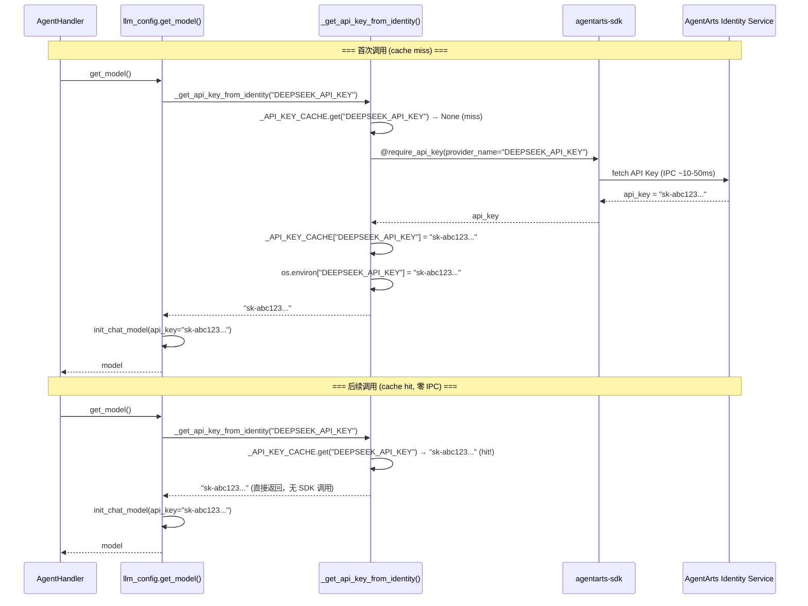
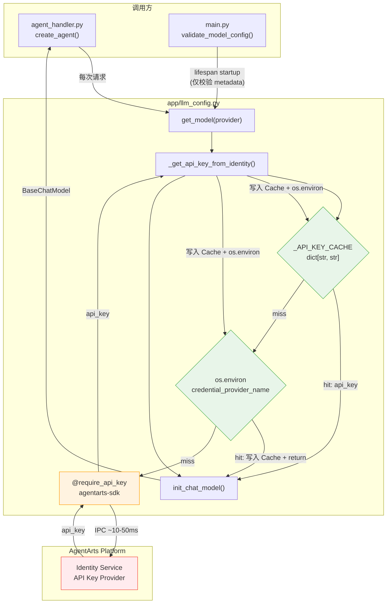

# Service Plan: LLM API Key 进程级缓存（os.environ）

> Issue: refactor-8-llm-api-key-caching
> Target branch: `refactor/llm-api-key-caching`

---

## 1. Overview

每次调用 `get_model()` 都会触发 `_get_api_key_from_identity()` → `@require_api_key` 装饰器 → AgentArts Identity SDK IPC 调用（~10-50ms），造成不必要的重复开销。根据 [ADR-016](../../../architecture/ADR/ADR-016-secretless-credential-injection.md) 的设计，首次获取 LLM API Key 后应缓存到 `os.environ`，后续调用直接读取环境变量，零 IPC 开销。



**变更范围**：仅修改 `personal-assistant-service/app/llm_config.py` 一个文件。`agent_handler.py` 和 `tools/` 中的所有调用都通过 `get_model()` 间接使用，无需变更（scope 已由 meta-dev 确认）。

---

## 2. API Changes

**无 API 变更。** 本次为内部性能优化，不涉及任何 FastAPI 路由、Pydantic Schema 或 OpenAPI spec 修改。

| 项目 | 是否需要变更 |
|------|:------------:|
| 新增 FastAPI 路由 | ❌ |
| 修改已有路由 | ❌ |
| 新增/修改 Pydantic Schema | ❌ |
| OpenAPI spec 更新 | ❌ |
| 新增/修改环境变量 | ❌（仅写入已有 `os.environ`） |

---

## 3. Files to Modify

| File | Change | Lines |
|------|--------|-------|
| `personal-assistant-service/app/llm_config.py` | 新增 `_API_KEY_CACHE` 模块级字典；修改 `_get_api_key_from_identity()` 实现缓存读写 | ~12 行新增 + ~5 行修改 |
| `personal-assistant-service/tests/test_llm_config.py` | 新增缓存相关测试用例；修改现有测试以适配新行为 | ~80 行新增 + ~5 行修改 |

> **No changes** to `agent_handler.py`, `tools/`, `main.py`, `auth.py`, `config.yaml`, `pyproject.toml`, or any other file.

---

## 4. Detailed Implementation Steps

### 4.1 `personal-assistant-service/app/llm_config.py` — 添加进程级 API Key 缓存

**当前 `_get_api_key_from_identity()` 代码**（第 77–89 行）：

```python
def _get_api_key_from_identity(credential_provider_name: str) -> str:
    """Fetch an API key from AgentArts Identity via the SDK decorator."""

    @require_api_key(provider_name=credential_provider_name, into="api_key")
    def _fetch(api_key: str | None = None) -> str:
        if not api_key:
            raise ValueError(
                f"AgentArts Identity provider '{credential_provider_name}' "
                "returned an empty API key."
            )
        return api_key

    return _fetch()
```

**变更内容**：

#### Step 1: 新增模块级缓存字典（第 15 行之后，紧跟 import 区域）

在 `_CONFIG_PATH = ...` 定义之后、`_config` 声明附近，新增缓存字典：

```python
# 进程级 API Key 缓存，避免每次 get_model() 都触发 SDK IPC 调用
# Key: credential_provider_name (如 "DEEPSEEK_API_KEY")
# Value: 从 AgentArts Identity 获取的明文 API Key
# 设计依据: ADR-016 § "AgentArts Identity + 进程级缓存"
_API_KEY_CACHE: dict[str, str] = {}
```

**插入位置**：第 14 行 `_config: dict[str, Any] | None = None` 之后。

#### Step 2: 修改 `_get_api_key_from_identity()` 实现缓存逻辑

将函数体改为先查 `_API_KEY_CACHE` → 再查 `os.environ` → 最后调 SDK：

```python
def _get_api_key_from_identity(credential_provider_name: str) -> str:
    """Fetch an API key from AgentArts Identity via the SDK decorator.

    Performs process-level caching: first retrieval goes through the SDK
    (AgentArts Identity IPC, ~10-50ms), subsequent calls read the cached
    value from _API_KEY_CACHE or os.environ (zero IPC overhead).

    Multi-provider isolation: each provider_name has its own cache entry.
    Key rotation requires container restart (consistent with current ops).
    """
    # 1. Check process-level cache (fastest path)
    cached = _API_KEY_CACHE.get(credential_provider_name)
    if cached:
        return cached

    # 2. Check os.environ (survives external injection, e.g. test fixtures)
    env_key = os.environ.get(credential_provider_name)
    if env_key:
        _API_KEY_CACHE[credential_provider_name] = env_key
        return env_key

    # 3. Cache miss → fetch from AgentArts Identity via SDK
    @require_api_key(provider_name=credential_provider_name, into="api_key")
    def _fetch(api_key: str | None = None) -> str:
        if not api_key:
            raise ValueError(
                f"AgentArts Identity provider '{credential_provider_name}' "
                "returned an empty API key."
            )
        return api_key

    api_key = _fetch()

    # 4. Populate both cache layers for subsequent zero-IPC access
    _API_KEY_CACHE[credential_provider_name] = api_key
    os.environ[credential_provider_name] = api_key

    return api_key
```

**设计要点**：

| 设计决策 | 理由 |
|----------|------|
| **先查 `_API_KEY_CACHE`，再查 `os.environ`** | `_API_KEY_CACHE` 是本模块写入的，优先级最高。`os.environ` 作为 fallback，支持外部注入（如测试 fixture 预设环境变量）。两层都命中时跳过 SDK 调用 |
| **写入两个缓存层** | `_API_KEY_CACHE`：显式的进程级缓存，语义明确。`os.environ`：LangChain/openai SDK 底层的 `openai.OpenAI(api_key=os.environ.get("OPENAI_API_KEY"))` 模式会自动拾取，不依赖调用方传递 api_key |
| **`os.environ` key 使用 `credential_provider_name`** | 如 `DEEPSEEK_API_KEY`。多 provider 场景下各自独立，不会互相覆盖。这与 AgentArts Identity 平台的 provider 命名完全一致 |
| **不引入 TTL 或过期机制** | Key 轮转需重启容器，与当前运维习惯一致（ADR-016 已明确）。进程中缓存的 Key 生命周期 = 容器生命周期 |
| **线程安全** | CPython 的 GIL 保证 `dict.get()` / `dict.__setitem__()` 是原子操作。FastAPI + Uvicorn 的 async event loop 是单线程的，不存在竞争条件 |

### 4.2 无其他文件变更

| 文件 | 说明 |
|------|------|
| `personal-assistant-service/app/agent_handler.py` | `create_agent()` 调用 `get_model()`，`get_model()` 调用 `_get_api_key_from_identity()`。缓存对调用方完全透明——不需要任何修改 |
| `personal-assistant-service/app/tools/*.py` | 所有 tool 模块通过 `@require_access_token` 获取 OAuth2/STS token，不走 `_get_api_key_from_identity()`。scope 确认 zero work |
| `personal-assistant-service/app/main.py` | `validate_model_config()` 在 lifespan 中仅校验 provider 元数据，不获取 API Key，不变 |
| `personal-assistant-service/config.yaml` | 无变更——`credential_provider_name` 字段保持不变 |

---

## 5. Test Plan

### 5.1 `personal-assistant-service/tests/test_llm_config.py` — 新增和修改测试用例

#### 现有测试兼容性分析

| 现有测试 | 是否需要修改 | 说明 |
|----------|:----------:|------|
| `test_get_model_fetches_api_key_from_agent_identity` | ✅ 需小幅修改 | 当前 mock `_get_api_key_from_identity` 返回固定值。需在 fixture 中清理 `_API_KEY_CACHE` 和 `os.environ` 以避免缓存干扰 |
| `test_get_model_with_explicit_provider` | ✅ 需小幅修改 | 同上 |
| `test_validate_model_config_does_not_fetch_api_key` | ❌ 无需修改 | 不涉及 `_get_api_key_from_identity` |
| `test_model_name_and_url_can_be_overridden_by_env` | ✅ 需小幅修改 | 同上 |
| `test_model_overrides_are_optional` | ✅ 需小幅修改 | 同上 |
| `test_missing_config_raises` | ❌ 无需修改 | 不涉及缓存 |
| `test_unknown_provider_raises` | ❌ 无需修改 | 不涉及缓存 |
| `test_missing_credential_provider_name_raises` | ❌ 无需修改 | 不涉及缓存 |
| `test_identity_provider_returns_empty_key_raises` | ❌ 无需修改 | 空 API Key 场景：缓存层不会缓存空值，每次仍走 SDK |
| `test_config_cached` | ❌ 无需修改 | 测试 `_config` 缓存，与 API Key 缓存无关 |

#### 新增 `reset_api_key_cache` fixture

在现有 `reset_config_cache` fixture 基础上，新增一个 fixture 用于清理 API Key 缓存：

```python
@pytest.fixture(autouse=True)
def reset_api_key_cache(monkeypatch):
    """Clear _API_KEY_CACHE and os.environ credential entries before each test."""
    app.llm_config._API_KEY_CACHE.clear()
    # Remove any credential_provider_name-based env vars that tests may have set
    monkeypatch.delenv("DEEPSEEK_API_KEY", raising=False)
    monkeypatch.delenv("OTHER_PROVIDER_API_KEY", raising=False)
    yield
    app.llm_config._API_KEY_CACHE.clear()
```

> **Note**: 该 fixture 的 `autouse=True` 使其与现有 `reset_config_cache` fixture 共同运行。无冲突——两者分别清理不同的模块级状态。

#### 新增测试用例

##### Test 1: `test_api_key_cached_after_first_retrieval` — 首次命中 SDK，后续走缓存

```python
import os

def test_api_key_cached_after_first_retrieval():
    """First call triggers SDK; second call returns cached value without SDK."""
    with (
        patch("pathlib.Path.exists", return_value=True),
        patch("app.llm_config.yaml.safe_load", return_value=_mock_config()),
        patch("app.llm_config.require_api_key") as mock_decorator,
        patch("app.llm_config.init_chat_model"),
    ):
        # Track how many times the SDK decorator is invoked
        call_count = 0

        def sdk_wrapper(fn):
            def wrapped(*args, **kwargs):
                nonlocal call_count
                call_count += 1
                return fn(api_key="sdk-key-12345")
            return wrapped

        mock_decorator.side_effect = sdk_wrapper

        # First call — should hit SDK
        result1 = app.llm_config.get_model()
        assert call_count == 1

        # Second call — should return from cache, no SDK call
        result2 = app.llm_config.get_model()
        assert call_count == 1  # Still 1, no additional SDK call

        # os.environ should be populated for downstream consumers
        assert os.environ["DEEPSEEK_API_KEY"] == "sdk-key-12345"
```

##### Test 2: `test_cache_hit_from_os_environ` — os.environ 预设值被缓存吸收

```python
def test_cache_hit_from_os_environ(monkeypatch):
    """When os.environ already has the key, SDK is not called at all."""
    monkeypatch.setenv("DEEPSEEK_API_KEY", "env-preloaded-key")

    with (
        patch("pathlib.Path.exists", return_value=True),
        patch("app.llm_config.yaml.safe_load", return_value=_mock_config()),
        patch("app.llm_config.require_api_key") as mock_decorator,
        patch("app.llm_config.init_chat_model"),
    ):
        app.llm_config.get_model()
        # SDK decorator should never be called — key was in os.environ
        mock_decorator.assert_not_called()

        # _API_KEY_CACHE should be populated from os.environ
        assert app.llm_config._API_KEY_CACHE["DEEPSEEK_API_KEY"] == "env-preloaded-key"
```

##### Test 3: `test_multi_provider_cache_isolation` — 多 provider 缓存隔离

```python
def _multi_provider_config() -> dict:
    return {
        "llm": {
            "default": "deepseek",
            "providers": {
                "deepseek": {
                    "credential_provider_name": "DEEPSEEK_API_KEY",
                    "model": "deepseek-chat",
                    "base_url": "https://api.deepseek.com",
                },
                "other": {
                    "credential_provider_name": "OTHER_PROVIDER_API_KEY",
                    "model": "other-model",
                    "base_url": "https://api.other.example",
                },
            },
        },
    }

def test_multi_provider_cache_isolation():
    """Each provider has its own cache entry; no cross-contamination."""
    with (
        patch("pathlib.Path.exists", return_value=True),
        patch("app.llm_config.yaml.safe_load", return_value=_multi_provider_config()),
        patch("app.llm_config.require_api_key") as mock_decorator,
        patch("app.llm_config.init_chat_model"),
    ):
        # Setup: different SDK return values per provider_name
        sdk_keys = {
            "DEEPSEEK_API_KEY": "deepseek-sdk-key",
            "OTHER_PROVIDER_API_KEY": "other-sdk-key",
        }

        def sdk_wrapper(provider_name):
            def decorator(fn):
                def wrapped(*args, **kwargs):
                    return fn(api_key=sdk_keys[provider_name])
                return wrapped
            return decorator

        mock_decorator.side_effect = lambda *, provider_name, into: sdk_wrapper(provider_name)

        # Fetch deepseek key
        app.llm_config.get_model(provider="deepseek")
        assert app.llm_config._API_KEY_CACHE["DEEPSEEK_API_KEY"] == "deepseek-sdk-key"
        assert os.environ["DEEPSEEK_API_KEY"] == "deepseek-sdk-key"

        # Fetch other key
        app.llm_config.get_model(provider="other")
        assert app.llm_config._API_KEY_CACHE["OTHER_PROVIDER_API_KEY"] == "other-sdk-key"
        assert os.environ["OTHER_PROVIDER_API_KEY"] == "other-sdk-key"

        # deepseek cache entry intact
        assert app.llm_config._API_KEY_CACHE["DEEPSEEK_API_KEY"] == "deepseek-sdk-key"
```

##### Test 4: `test_empty_api_key_not_cached` — 空 API Key 不进入缓存

```python
def test_empty_api_key_not_cached():
    """An empty API key from SDK raises ValueError and is NOT cached."""
    with (
        patch("pathlib.Path.exists", return_value=True),
        patch("app.llm_config.yaml.safe_load", return_value=_mock_config()),
        patch("app.llm_config.require_api_key") as mock_decorator,
    ):
        # Simulate SDK returning empty key
        mock_decorator.return_value = lambda fn: lambda *args, **kwargs: fn(api_key="")

        with pytest.raises(ValueError, match="empty API key"):
            app.llm_config.get_model()

        # Cache should NOT contain the empty value
        assert "DEEPSEEK_API_KEY" not in app.llm_config._API_KEY_CACHE
```

### 5.2 测试验证命令

```bash
cd personal-assistant-service
# 运行所有 llm_config 测试
uv run pytest tests/test_llm_config.py -v

# 运行新增的缓存相关测试
uv run pytest tests/test_llm_config.py -v -k "cache"

# 完整测试套件（确保无回归）
uv run pytest tests/ -v
```

---

## 6. Mermaid Diagram — 缓存数据流



> **绿色**：缓存层（零开销）。**橙色**：SDK 装饰器层（仅在 cache miss 时调用）。**红色**：AgentArts Identity Service（仅首次调用时访问）。

---

## 7. Risks & Mitigations

| Risk | Likelihood | Impact | Mitigation |
|------|-----------|--------|------------|
| **Key rotation 后容器仍使用旧 Key** | Medium | High — LLM 调用失败 | 与当前行为一致（无缓存时也一样——容器不重启就不会重新获取 Key）。运维流程：Key 轮转后重启容器（`agentarts launch`）。如需热更新，后续 Feature 可实现 |
| **`os.environ` 污染** — 多个 provider 写 env 后，`openai` SDK 底层自动读取的可能与期望不一致 | Low | Medium — 用错 Key | `openai` SDK 读取 `OPENAI_API_KEY` env var，但我们写入的 key 是 `DEEPSEEK_API_KEY`，不会冲突。`init_chat_model(api_key=...)` 显式传参，不依赖 env var 隐式读取 |
| **`os.environ` 非线程安全写入**（CPython） | Very Low | Low | CPython 的 `os.environ` 底层操作持有 GIL。FastAPI async event loop 单线程执行，无并发写入风险 |
| **测试中模块级状态泄漏**（`_API_KEY_CACHE` 跨测试污染） | Medium | Low — 仅影响测试 | 新增 `reset_api_key_cache` autouse fixture，每个测试前后清空缓存和 `os.environ` 相关 key |

---

## 8. Summary of Code Changes

```
personal-assistant-service/
├── app/
│   └── llm_config.py      ← +3 lines (cache dict), ~12 lines (function rewrite)
└── tests/
    └── test_llm_config.py  ← +80 lines (4 new test functions + fixture), ~5 lines (modify existing tests)
```

**Total net new lines**: ~95. Zero lines removed (逻辑增强，不删旧代码结构)。

---

## 9. Acceptance Criteria

| # | Criteria | Verification |
|---|----------|-------------|
| AC1 | `get_model()` 首次调用触发 SDK，后续调用零 SDK 调用 | `test_api_key_cached_after_first_retrieval` 验证 `call_count == 1` |
| AC2 | `os.environ` 中的 key 被 `_API_KEY_CACHE` 吸收，跳过 SDK | `test_cache_hit_from_os_environ` 验证 |
| AC3 | 多 provider 缓存隔离，互不污染 | `test_multi_provider_cache_isolation` 验证 |
| AC4 | 空 API Key 不进入缓存 | `test_empty_api_key_not_cached` 验证 |
| AC5 | 现有全部测试无回归 | `uv run pytest tests/ -v` 全绿 |
| AC6 | `agent_handler.py` 和 `tools/` 无需任何代码变更 | Manual code review — scope = `llm_config.py` only |
| AC7 | Ruff lint 通过 | `uv run ruff check .` |
