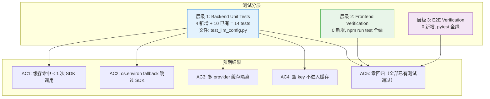
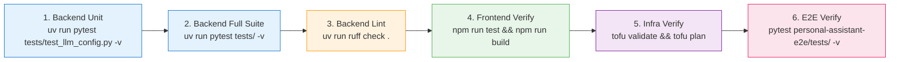
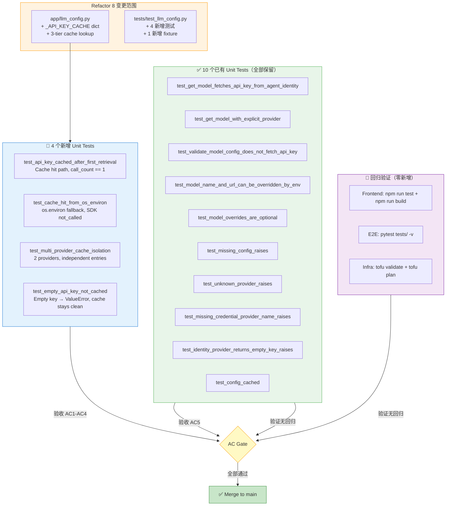

# Test Plan: Refactor 8 — LLM API Key 进程级缓存

> **Issue**: refactor-8-llm-api-key-caching
> **Feature Branch**: `refactor/llm-api-key-caching`
> **关联 ADR**: [ADR-016：Secretless Credential Injection](../../architecture/ADR/ADR-016-secretless-credential-injection.md)
> **Test Plan Version**: v1.0 | 2026-06-17

---

## 1. 变更摘要

本次 refactor 在 `personal-assistant-service/app/llm_config.py` 中引入进程级 API Key 缓存——新增 `_API_KEY_CACHE: dict[str, str]` 模块级字典，将 `_get_api_key_from_identity()` 改为 3 层查找：`_API_KEY_CACHE` → `os.environ` → AgentArts Identity SDK（`@require_api_key`）。

**影响范围**：
- ✅ **Backend**：`llm_config.py`（~17 行改动）、`test_llm_config.py`（~85 行新增 + fixture 调整）
- ❌ **Frontend**：零代码变更，仅验证无回归
- ❌ **Infra**：零基础设施变更，仅验证 `tofu plan` 零 diff
- ❌ **E2E**：纯后端优化，对用户无可见行为变更

---

## 2. 测试策略总览

本次 refactor 为**纯后端内部优化**，测试策略聚焦于三个层次：

| 层次 | 策略 | 新增测试 | 回归验证 |
|------|------|:--:|:--:|
| **Backend Unit** | 验证缓存命中/未命中、os.environ fallback、多 provider 隔离、空 key 排除 | 4 个 | 全部 10 个现有测试 |
| **Client** | 纯验证——确认零代码变更无回归 | 0 个 | `npm run test` + `npm run build` + `npx tsc -b` |
| **E2E** | 纯验证——确认已有 E2E 全绿，无新增行为需要覆盖 | 0 个 | 全部已有 E2E 测试 |



---

## 3. Backend Unit Tests

### 3.1 测试环境准备

**前置条件**：
- `personal-assistant-service/` 目录下已安装依赖（`uv sync`）
- 测试框架：pytest + pytest-asyncio
- 运行命令：

```bash
cd personal-assistant-service

# 仅 llm_config 测试
uv run pytest tests/test_llm_config.py -v

# 新增缓存测试子集
uv run pytest tests/test_llm_config.py -v -k "cache"

# 完整测试套件（确保无回归）
uv run pytest tests/ -v

# 代码检查
uv run ruff check .
```

---

### 3.2 新增 Fixture：`reset_api_key_cache`

**目的**：每次测试前后清理 `_API_KEY_CACHE` 和 `os.environ` 相关 Key，确保测试隔离。

**位置**：`personal-assistant-service/tests/test_llm_config.py`

**实现要点**：

| 属性 | 说明 |
|------|------|
| Scope | `function`（autouse） |
| 清理内容 | `app.llm_config._API_KEY_CACHE.clear()` + `monkeypatch.delenv("DEEPSEEK_API_KEY", raising=False)` + `monkeypatch.delenv("OTHER_PROVIDER_API_KEY", raising=False)` |
| 与现有 fixture 共存 | 与 `reset_config_cache` 无冲突——分别清理不同的模块级状态 |
| teardown 行为 | yield 后再次 `_API_KEY_CACHE.clear()` |

> **⚠️ 关键设计约束**：由于 `_API_KEY_CACHE` 在每次 `get_model()` 调用中都会写入，现有测试中 mock `_get_api_key_from_identity` 返回固定值的测试（如 `test_get_model_fetches_api_key_from_agent_identity`）**不会**触发真实的 `_get_api_key_from_identity()`，因此不受缓存影响。但为保险起见，`reset_api_key_cache` 仍设为 `autouse=True`。

---

### 3.3 新增测试用例

#### Test 3.3.1: `test_api_key_cached_after_first_retrieval` — 首次命中 SDK，后续走缓存

| 属性 | 值 |
|------|-----|
| **文件** | `personal-assistant-service/tests/test_llm_config.py` |
| **分类** | 单元测试 — 缓存核心逻辑 |
| **优先级** | 🔴 Critical |

**测试目标**：验证 `get_model()` 首次调用触发 SDK（`@require_api_key`），后续调用返回缓存值且不再调用 SDK。

**前置条件**：
- 使用 `_mock_config()` 作为 config.yaml mock
- mock `require_api_key` 以追踪调用次数
- 模拟 SDK 返回 `"sdk-key-12345"`

**测试步骤**：

| Step | 操作 | 预期 |
|------|------|------|
| 1 | 调用 `app.llm_config.get_model()` 首次 | `require_api_key` 调用次数 = 1 |
| 2 | 调用 `app.llm_config.get_model()` 第二次 | `require_api_key` 调用次数仍 = 1（零新增） |
| 3 | 检查 `os.environ["DEEPSEEK_API_KEY"]` | 值 = `"sdk-key-12345"` |
| 4 | 检查 `app.llm_config._API_KEY_CACHE["DEEPSEEK_API_KEY"]` | 值 = `"sdk-key-12345"` |

**Mock 策略**：
- `pathlib.Path.exists` → `True`
- `app.llm_config.yaml.safe_load` → `_mock_config()`
- `app.llm_config.require_api_key` → `sdk_wrapper`（side_effect 追踪调用次数）
- `app.llm_config.init_chat_model` → 不做断言（返回 dummy 即可）

**通过标准**：`call_count == 1` 且 `os.environ` / `_API_KEY_CACHE` 均含正确值。

---

#### Test 3.3.2: `test_cache_hit_from_os_environ` — os.environ 预设值被缓存吸收

| 属性 | 值 |
|------|-----|
| **文件** | `personal-assistant-service/tests/test_llm_config.py` |
| **分类** | 单元测试 — os.environ fallback 路径 |
| **优先级** | 🔴 Critical |

**测试目标**：当 `os.environ` 中已存在 API Key 时，`_get_api_key_from_identity()` 从 env 读取并写入 `_API_KEY_CACHE`，**完全不调用 SDK**。

**前置条件**：
- `monkeypatch.setenv("DEEPSEEK_API_KEY", "env-preloaded-key")`
- 使用 `_mock_config()` 作为 config mock

**测试步骤**：

| Step | 操作 | 预期 |
|------|------|------|
| 1 | `monkeypatch.setenv("DEEPSEEK_API_KEY", "env-preloaded-key")` | 环境变量预设完成 |
| 2 | 调用 `app.llm_config.get_model()` | 正常返回，不抛异常 |
| 3 | 断言 `mock_decorator.assert_not_called()` | `require_api_key` 从未被调用 |
| 4 | 断言 `_API_KEY_CACHE["DEEPSEEK_API_KEY"]` | 值 = `"env-preloaded-key"` |

**Mock 策略**：
- `pathlib.Path.exists` → `True`
- `app.llm_config.yaml.safe_load` → `_mock_config()`
- `app.llm_config.require_api_key` → mock（断言未被调用）
- `app.llm_config.init_chat_model` → patch（不关心返回值）

**通过标准**：`require_api_key` 未被调用，`_API_KEY_CACHE` 被填充为 env 中的值。

---

#### Test 3.3.3: `test_multi_provider_cache_isolation` — 多 Provider 缓存隔离

| 属性 | 值 |
|------|-----|
| **文件** | `personal-assistant-service/tests/test_llm_config.py` |
| **分类** | 单元测试 — 多 Provider 隔离 |
| **优先级** | 🟡 High |

**测试目标**：验证不同 `credential_provider_name` 的缓存条目互不干扰。

**前置条件**：
- 使用 `_multi_provider_config()`（包含 `deepseek` 和 `other` 两个 provider）
- `deepseek` provider 的 `credential_provider_name = "DEEPSEEK_API_KEY"`
- `other` provider 的 `credential_provider_name = "OTHER_PROVIDER_API_KEY"`
- SDK 对不同 provider 返回不同的 Key：`"deepseek-sdk-key"` vs `"other-sdk-key"`

**测试步骤**：

| Step | 操作 | 预期 |
|------|------|------|
| 1 | `get_model(provider="deepseek")` | SDK 被调用，获取 `DEEPSEEK_API_KEY` |
| 2 | 断言 `_API_KEY_CACHE["DEEPSEEK_API_KEY"]` | = `"deepseek-sdk-key"` |
| 3 | 断言 `os.environ["DEEPSEEK_API_KEY"]` | = `"deepseek-sdk-key"` |
| 4 | `get_model(provider="other")` | SDK 被调用，获取 `OTHER_PROVIDER_API_KEY` |
| 5 | 断言 `_API_KEY_CACHE["OTHER_PROVIDER_API_KEY"]` | = `"other-sdk-key"` |
| 6 | 断言 `os.environ["OTHER_PROVIDER_API_KEY"]` | = `"other-sdk-key"` |
| 7 | **复查** `_API_KEY_CACHE["DEEPSEEK_API_KEY"]` | 仍 = `"deepseek-sdk-key"`（未被 other provider 污染） |

**Mock 策略**：
- SDK mock `side_effect` 需根据 `provider_name` 参数返回不同 Key
- 使用 `lambda` side_effect：`lambda *, provider_name, into: sdk_wrapper(provider_name)`

**通过标准**：两个 provider 缓存条目独立，互不覆盖。

---

#### Test 3.3.4: `test_empty_api_key_not_cached` — 空 API Key 不进入缓存

| 属性 | 值 |
|------|-----|
| **文件** | `personal-assistant-service/tests/test_llm_config.py` |
| **分类** | 单元测试 — 边界条件 |
| **优先级** | 🟡 High |

**测试目标**：当 SDK 返回空字符串时，`ValueError` 被抛出，且空值**不会**被写入 `_API_KEY_CACHE`。后续调用应重新尝试 SDK（而非从缓存返回空值）。

**前置条件**：
- 使用 `_mock_config()` 作为 config mock
- mock `require_api_key` 使其返回空字符串 `""`

**测试步骤**：

| Step | 操作 | 预期 |
|------|------|------|
| 1 | 调用 `app.llm_config.get_model()` | 抛出 `ValueError`，match `"empty API key"` |
| 2 | 断言 `"DEEPSEEK_API_KEY" not in _API_KEY_CACHE` | 缓存中无此条目 |

**Mock 策略**：
- `require_api_key` mock → 装饰器返回的函数注入 `api_key=""` → 触发内部 `if not api_key: raise ValueError`

**通过标准**：异常被抛出，缓存为空。这确保下次 `get_model()` 调用会再次尝试 SDK 而不是返回缓存中的空值。

---

### 3.4 现有测试兼容性

以下现有测试需要小幅修改以适配缓存行为：

| 现有测试 | 修改内容 | 原因 |
|----------|----------|------|
| `test_get_model_fetches_api_key_from_agent_identity` | 无需修改 | 直接 mock `_get_api_key_from_identity`，绕过缓存逻辑 |
| `test_get_model_with_explicit_provider` | 无需修改 | 同上 |
| `test_model_name_and_url_can_be_overridden_by_env` | 无需修改 | 同上 |
| `test_model_overrides_are_optional` | 无需修改 | 同上 |

> **Note**：由于这四个测试通过 mock `_get_api_key_from_identity` 返回固定值，它们**不会触发** `_get_api_key_from_identity()` 的真实实现，因此缓存逻辑对它们完全透明。`reset_api_key_cache` fixture 的 `autouse=True` 仅作为防御性措施存在。

以下现有测试**完全不受影响**：

| 现有测试 | 不受影响原因 |
|----------|------------|
| `test_validate_model_config_does_not_fetch_api_key` | 不调用 `_get_api_key_from_identity` |
| `test_missing_config_raises` | 不涉及缓存 |
| `test_unknown_provider_raises` | 在 `_get_api_key_from_identity` 之前就失败 |
| `test_missing_credential_provider_name_raises` | 使用 `validate_model_config` |
| `test_identity_provider_returns_empty_key_raises` | 空 key 场景，缓存层不会缓存空值（与新增 test 4 互补验证） |
| `test_config_cached` | 测试 `_config` 缓存，与 `_API_KEY_CACHE` 无关 |

---

### 3.5 Backend 测试运行指令

```bash
cd personal-assistant-service

# Step 1: 所有 llm_config 测试
uv run pytest tests/test_llm_config.py -v

# Step 2: 仅新增缓存测试
uv run pytest tests/test_llm_config.py -v -k "cache"

# Step 3: 完整测试套件
uv run pytest tests/ -v

# Step 4: Ruff lint 检查
uv run ruff check .

# Step 5: Ruff 格式化检查
uv run ruff format --check .
```

**预期**：全部绿色通过。Acceptance Criteria AC1-AC4 由 4 个新增测试覆盖，AC5 由全部已有测试覆盖。

---

## 4. Frontend Test Cases

### 4.1 策略

本次 refactor 对前端零代码变更。前端测试策略为**纯回归验证**——运行现有测试套件确认所有测试继续通过。

### 4.2 验证步骤

| Step | 命令 | 预期 | 风险 |
|------|------|------|------|
| 1 | `npx tsc -b` | 零 TypeScript 类型错误 | 无——前端代码无变更 |
| 2 | `npm run build` | 生产构建成功，产物无变化 | 无——Vite 配置无变更 |
| 3 | `npm run test` | 所有已有测试通过 | 极低——API 契约无变化 |

**运行位置**：`personal-assistant-client/` 目录。

### 4.3 关键验证区域

以上操作覆盖的全部前端模块：

| 模块 | 验证内容 | 受 refactor 影响？ |
|------|----------|:--:|
| React 组件（`App.tsx`、`ChatPage`、`LandingPage` 等） | 渲染正常、交互无回归 | ❌ |
| State 管理（Zustand stores） | 状态逻辑无破坏性变更 | ❌ |
| 路由（React Router + MSAL） | 页面跳转和认证流程正常 | ❌ |
| SSE 解析（`chat-adapter.ts`） | `token`/`done`/`error`/`system_message` 事件解析不变 | ❌ |
| API 调用（fetch/SSE） | `/invocations` 通信正常 | ❌ |
| Build 配置（Vite, Tailwind, TypeScript） | 构建输出无变化 | ❌ |

---

## 5. E2E Scenarios

### 5.1 策略

Refactor 8 为纯后端内部优化，对 Service ↔ Client 交互路径无任何影响：

- ❌ 无路由变更
- ❌ 无 Request/Response schema 变更
- ❌ 无 SSE 事件协议变更
- ❌ 无认证流程变更

E2E 策略为**纯回归运行**——将全部已有 E2E 测试运行一遍，确保全部通过。

### 5.2 运行指令

```bash
cd personal-assistant-e2e

# 全部 E2E 测试
pytest tests/ -v

# 仅功能测试
pytest tests/features/ -v -m feature

# 仅回归测试
pytest tests/regression/ -v -m regression
```

### 5.3 关键验证场景清单

确保以下 E2E 场景在 Refactor 8 后仍然通畅：

| E2E 测试文件 | 验证场景 | 与 Refactor 8 的关系 |
|-------------|----------|---------------------|
| `test_feature_1_1_web_chat.py` | Web Chat SSE 流式对话 | 对话路径经过 `get_model()` → 缓存层。验证多轮对话正常 |
| `test_feature_1_3_multi_llm.py` | 多 LLM Provider 切换 | 验证多 provider 场景下缓存隔离不影响对话 |
| `test_feature_4_inbound_identity_login_flow.py` | MSAL 登录流 | 与 API Key 缓存无关，应继续通过 |
| `test_feature_10a_outbound_email.py` | 邮件发送 | 对话经过 `get_model()`，缓存应对工具调用透明 |
| `test_feature_13_reset_session.py` | Session 重置 | 与 API Key 缓存无关 |
| `test_feature_session_checkpoint.py` | Session Checkpoint | 与 API Key 缓存无关 |
| `test_bug_6_vite_playground_proxy_missing.py` | Vite proxy 配置 | 与 API Key 缓存无关 |

### 5.4 Setup Requirements

E2E 测试的 fixture 已处理 `clean_env`（清除 LLM 相关环境变量），在 `e2e_client` fixture 中使用 `TestClient` + mock `init_chat_model`。Refactor 8 的缓存逻辑在 TestClient 模式下同样生效——`_API_KEY_CACHE` 是模块级状态，在 TestClient 生命周期内不会被清除（除非 fixture 显式清理）。

**关键观察**：E2E conftest 中的 `e2e_client` fixture 使用 `patch("app.llm_config.init_chat_model", ...)`，但**没有 mock `_get_api_key_from_identity`**。这意味着在 E2E 测试中，如果 `get_model()` 被调用，将会触发真实的三层缓存查找。由于 E2E fixture 有 `clean_env`（清除 `DEEPSEEK_API_KEY` 等环境变量），缓存第一、二层均为 miss，最终会走到 `@require_api_key` SDK 调用——这与生产环境行为一致。

> ⚠️ **注意**：如果 E2E 测试在 `agentarts dev` 模式下运行（如 `test_feature_10a_outbound_email.py`），`@require_api_key` 会走本地 fallback 路径（`.agent_identity.json`）。这在 Refactor 8 前后行为一致——首次调用触发 SDK，后续调用走缓存。

---

## 6. Regression Cases

### 6.1 Scenario: 无缓存 → 首次调用正常获取 API Key

| 属性 | 值 |
|------|-----|
| **重现步骤** | 1. 清空 `_API_KEY_CACHE` 和 `os.environ` 中所有 API Key<br/>2. 调用 `get_model()`<br/>3. 验证成功返回 `BaseChatModel` |
| **验证方法** | `test_get_model_fetches_api_key_from_agent_identity`（现有） |
| **通过标准** | 模型正常创建，API Key 通过 SDK 获取 |

---

### 6.2 Scenario: 缓存命中 → SDK 不再被调用

| 属性 | 值 |
|------|-----|
| **重现步骤** | 1. 首次 `get_model()` —— 触发 SDK<br/>2. 第二次 `get_model()` —— 从缓存返回<br/>3. 验证 SDK 只被调用了 1 次 |
| **验证方法** | `test_api_key_cached_after_first_retrieval`（新增） |
| **通过标准** | `require_api_key` 调用计数 = 1 |

---

### 6.3 Scenario: os.environ 预设 Key → SDK 不触发

| 属性 | 值 |
|------|-----|
| **重现步骤** | 1. 在环境变量中预设 `DEEPSEEK_API_KEY=<value>`<br/>2. 调用 `get_model()`<br/>3. SDK 从未被调用 |
| **验证方法** | `test_cache_hit_from_os_environ`（新增） |
| **通过标准** | `require_api_key.assert_not_called()` 通过 |

---

### 6.4 Scenario: Key 轮转后缓存一致性

| 属性 | 值 |
|------|-----|
| **关注点** | 当 AgentArts Identity 平台 Key 轮转后，容器是否需要重启 |
| **行为** | 容器内部的 `_API_KEY_CACHE` 和 `os.environ` 均为进程级缓存。Key 轮转后**必须**重启容器（`agentarts launch`），缓存自动清空，新容器启动后首次调用重新从 SDK 获取新 Key |
| **验证方法** | 部署后容器健康检查（`INFRA-R8-06`）+ `/invocations` 可达（`INFRA-R8-07`） |
| **与现状一致性** | ✅ — 无缓存时 Key 轮转同样需要重启（不重启则 Key 不会变）。缓存层未引入新的运维需求 |

---

### 6.5 Scenario: 多轮对话中的缓存透明度

| 属性 | 值 |
|------|-----|
| **关注点** | 多次对话中 `get_model()` 被多次调用（每次请求可能重新创建 Agent），缓存是否保持一致 |
| **验证方法** | E2E `test_feature_1_1_web_chat.py` — 多轮 SSE 流式对话 |
| **通过标准** | 多轮对话全部正常完成，无 LLM 调用失败 |

---

### 6.6 Scenario: 异常注入 — 空 Key 后重试

| 属性 | 值 |
|------|-----|
| **关注点** | SDK 首次返回空 Key → `ValueError` → 修复配置后重试 → 应再次触发 SDK |
| **验证方法** | `test_empty_api_key_not_cached`（新增）确认空 Key 不进入缓存。结合 `test_identity_provider_returns_empty_key_raises`（现有） |
| **通过标准** | 空 Key 不缓存 → 下次调用重新走 SDK → 有机会获取有效 Key |

---

## 7. Concurrent & Edge Case Tests

### 7.1 线程安全（Covered by Design）

本次变更不引入新的并发模型——FastAPI async event loop 是单线程执行的，CPython 的 GIL 保证 `dict.get()` / `dict.__setitem__()` 是原子操作。不需要专门的并发测试。

### 7.2 边界条件

| 场景 | 行为 | 对应测试 |
|------|------|----------|
| `_API_KEY_CACHE` 为空 → `os.environ` 为空 → SDK 首次调用 | SDK 被调用，结果写入两层缓存 | `test_api_key_cached_after_first_retrieval` |
| `_API_KEY_CACHE` 为空 → `os.environ` 有值 | 从 `os.environ` 读取，写入 `_API_KEY_CACHE`，SDK 不调用 | `test_cache_hit_from_os_environ` |
| `_API_KEY_CACHE` 有值 → 后续调用 | 直接返回缓存值，SDK 不调用 | `test_api_key_cached_after_first_retrieval` |
| SDK 返回空字符串 | `ValueError` 抛出，空值不写入缓存 | `test_empty_api_key_not_cached` + `test_identity_provider_returns_empty_key_raises` |
| 多 provider 同时使用 | 各自缓存条目独立 | `test_multi_provider_cache_isolation` |
| 进程重启（容器重建） | 所有缓存清空，重新按需初始化 | Infra 验证（`INFRA-R8-06`、`INFRA-R8-07`） |

---

## 8. Infra 验证清单

参照 `infra-plan.md` 的 7 项验证：

| ID | 验证项 | 命令 | 预期 |
|----|--------|------|------|
| INFRA-R8-01 | IaC 语法验证 | `cd personal-assistant-infra && tofu validate` | 通过 |
| INFRA-R8-02 | IaC Plan 零变更 | `cd personal-assistant-infra && tofu plan` | `No changes.` |
| INFRA-R8-03 | HCL 格式化 | `cd personal-assistant-infra && tofu fmt -check` | 无格式问题 |
| INFRA-R8-04 | 代码无变更 | `git status personal-assistant-infra/` | working tree clean |
| INFRA-R8-05 | `.agentarts_config.yaml` 无变更 | Manual review | 仅存量变量 |
| INFRA-R8-06 | 容器健康检查 | `curl <runtime-domain>/ping` | `{"status":"ok"}` |
| INFRA-R8-07 | /invocations 可达 | `curl -X POST <runtime-domain>/invocations -H "Content-Type: application/json" -d '{"message":"ping"}'` | 200 或有效 JSON（非 5xx） |

---

## 9. Acceptance Criteria Verification Matrix

| AC# | Acceptance Criteria | 对应测试 | 预期结果 |
|-----|-------------------|----------|----------|
| AC1 | `get_model()` 首次调用触发 SDK，后续调用零 SDK 调用 | `test_api_key_cached_after_first_retrieval` | `call_count == 1` |
| AC2 | `os.environ` 中的 Key 被 `_API_KEY_CACHE` 吸收，跳过 SDK | `test_cache_hit_from_os_environ` | `require_api_key.assert_not_called()` |
| AC3 | 多 Provider 缓存隔离，互不污染 | `test_multi_provider_cache_isolation` | 两个 provider 缓存条目独立 |
| AC4 | 空 API Key 不进入缓存 | `test_empty_api_key_not_cached` | `ValueError` raised + cache empty |
| AC5 | 现有全部测试无回归 | `uv run pytest tests/ -v` | 全绿 |
| AC6 | `agent_handler.py` 和 `tools/` 无需代码变更 | Code review | Scope = `llm_config.py` only |
| AC7 | Ruff lint 通过 | `uv run ruff check .` | 零警告/零错误 |

---

## 10. 测试执行顺序 & CI/CD 集成

### 10.1 本地执行顺序



### 10.2 CI/CD Pipeline 检查点

| 阶段 | 检查内容 | 阻塞条件 |
|------|----------|----------|
| **Pre-commit** | Ruff lint + format | 任何 lint 错误 |
| **Unit Test** | `pytest tests/test_llm_config.py` | 任何测试失败 |
| **Full Test** | `pytest tests/` | 任何测试失败 |
| **Client Verify** | `npm run test` + `npm run build` | 测试失败或构建失败 |
| **E2E Test** | `pytest personal-assistant-e2e/tests/` | 任何 E2E 失败（需排查是否与 refactor 相关） |
| **Merge Gate** | 全部通过 | — |

---

## 11. 测试覆盖率目标

| 文件 | 目标 | 新增测试贡献 |
|------|------|-------------|
| `app/llm_config.py` | ≥ 95% line coverage | 4 个新增测试覆盖缓存路径、os.environ fallback、多 provider 隔离、空 Key 排除 |
| `_get_api_key_from_identity()` | 100% branch coverage | 3 层 cache 查找的每个分支 + empty key 分支 |

---

## 12. 关键注意事项

1. **测试隔离至关重要**：`_API_KEY_CACHE` 是模块级 `dict`，跨测试会泄漏。`reset_api_key_cache` 的 `autouse=True` 是**必须**的，否则 `test_cache_hit_from_os_environ` 等测试的执行顺序将影响结果。

2. **现有测试 mock 策略不变**：`test_get_model_fetches_api_key_from_agent_identity` 等 4 个测试直接 mock `_get_api_key_from_identity`，不需要改为 mock `require_api_key`——这保持了测试的简洁性和独立性。

3. **E2E 测试不新增**：纯后端性能优化，无用户可见行为变更。E2E 测试套件的回归运行足以验证。如果 E2E 中发现与 Refactor 8 相关的失败，应首先排查 `clean_env` fixture 是否清除了 `_API_KEY_CACHE`（当前不会——因为 `clean_env` 只清理 `os.environ` 中的特定 Key，不会清理进程级模块状态）。

4. **空 Key 缓存保护**：`test_empty_api_key_not_cached` 是关键安全测试——确保 SDK 临时返回空 Key 不会导致缓存"中毒"，后续调用仍有机会通过 SDK 获取有效 Key。

---

## 13. Mermaid — 测试覆盖全景图



---

## 14. 附录：需关注的测试风险

| 风险 | 可能性 | 影响 | 缓解措施 |
|------|:--:|------|----------|
| `reset_api_key_cache` fixture 与现有 `reset_config_cache` fixture 的执行顺序导致状态污染 | Low | Medium — 测试间歇性失败 | 两个 fixture 均为 `autouse=True`，操作不同模块级状态。如遇问题，可合并为一个 fixture |
| `os.environ` key 命名冲突——E2E `clean_env` fixture 清除 `DEEPSEEK_API_KEY` 后测试仍依赖旧缓存 | Very Low | Low — 仅影响 E2E | E2E fixture 使用 `TestClient`，各测试间模块重新 import（通过 mock context），状态隔离 |
| 多 provider 配置测试中 `require_api_key` mock 的 `side_effect` lambda 签名不匹配 | Low | Low — 测试实现细节 | 需确认 `@require_api_key(provider_name=..., into=...)` 传递的 keyword args 在 mock 调用中可访问 |
| 新增测试依赖 `import app.llm_config` 访问 `_API_KEY_CACHE`，该属性为约定下划线前缀的内部变量 | Low | Low — 测试视为白盒 | Python 无真正的访问控制，测试可直接访问。如需更优雅的测试接口，可考虑后期待 `panel-chair` review 后决定 |

---

> **文档版本**: v1.0 | **最后更新**: 2026-06-17
> **审核路径**: `personal-assistant-meta-manager` → `panel-chair` → Human Approval
