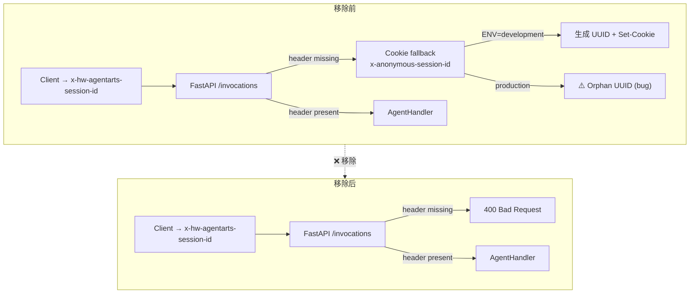
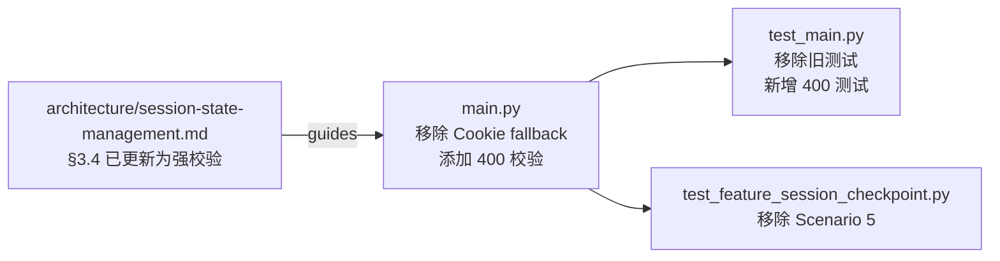

# Refactor: 移除 Session Cookie Fallback，替换为 Header 强校验

## Motivation

`personal-assistant-service/app/main.py` 中存在一个 Cookie Fallback 机制（§3.5 原设计）：当 `x-hw-agentarts-session-id` header 缺失时，后端通过 `x-anonymous-session-id` cookie 降级管理 session。

该机制已成为死代码：
- Web Chat 客户端 (`chat-adapter.ts`) **永远**发送 `x-hw-agentarts-session-id` header（`localStorage` 持久化 + `crypto.randomUUID()` 降级），Vite proxy 透明转发
- Chainlit Playground 走 WebSocket，不经过 `/invocations` 的 header 提取逻辑
- 飞书/OfficeClaw 走独立 webhook 路由，不经过 `/invocations`

此外，该机制还存在以下问题：
1. **Dev-Prod 不一致**：`ENV=development` gate 导致本地与生产行为不同（生产 Gateway 返回 400，本地 Cookie 静默降级）
2. **Orphan UUID bug**：生产环境绕过 Gateway 时，仍生成 UUID 但不设 Cookie，产生无法复用的孤立 checkpoint
3. **静默状态污染**：若移除 fallback 但不加校验，`session_id=None` → `"default"` 会导致所有无-header 的请求共享同一 checkpoint

架构分析详见 [session-state-management.md §3.4](../../architecture/session-state-management.md)（已更新）。

## Scope

- `personal-assistant-service/app/main.py` — 移除 Cookie fallback，添加 400 强校验；`ENV` 环境变量不再使用，相关 gate（`os.environ.get("ENV") == "development"`）随 Cookie fallback 一同删除
- `personal-assistant-service/.env.example` — 移除 `ENV=development` 行（应用代码不再引用该变量）
- `personal-assistant-service/tests/test_main.py` — 移除 `test_cookie_fallback_in_development`，新增 `test_missing_session_id_returns_400`
- `personal-assistant-e2e/tests/features/test_feature_session_checkpoint.py` — 移除 `TestScenario5_CookieFallback` 类（2 个测试），可选新增负向 400 测试

### Out of scope
- 客户端代码 (`personal-assistant-client/`) — 无变更，客户端已正确实现
- Chainlit Playground、飞书、OfficeClaw — 无变更，不经过 `/invocations` header 提取逻辑

## 设计

### Architecture

### Dependencies

## Acceptance Criteria

- [ ] `main.py` 中移除 Cookie fallback 逻辑（`x-anonymous-session-id` cookie 读取、UUID 生成、`Set-Cookie` 设置，以及 `ENV=development` gate）
- [ ] `main.py` 中添加 `session_id` 缺失时的 `400 Bad Request` 校验（含明确的 error message）
- [ ] `main.py` 移除不再需要的 `import uuid`（仅用于 Cookie fallback）
- [ ] `.env.example` 移除 `ENV=development` 行（应用代码不再引用该环境变量）
- [ ] Unit test: 移除 `test_cookie_fallback_in_development`，新增 `test_missing_session_id_returns_400`
- [ ] E2E test: 移除 `TestScenario5_CookieFallback` 类（2 个测试方法）
- [ ] `curl` 示例更新（README 或相关文档）：无 header 的 curl 调用现在返回 400，加上 `-H "x-hw-agentarts-session-id: $(uuidgen)"` 即可

## Four-Question Gate

| Question | Answer | Notes |
|----------|:------:|------|
| Is it best practice? | **Yes** | Fail Fast (400 on missing required input), Dev-Prod Parity (identical validation in all environments), Separation of Concerns (single transport: header), Defense in Depth (no silent "default" checkpoint sharing) |
| Is it de facto standard? | **Yes** | Modern agent APIs (OpenAI Assistants, Anthropic API) use explicit Header/Body parameters for session identification. Silent session degradation is a legacy web-app pattern, not an agent API pattern |
| Is it conventional? | **Yes** | RESTful API consumers expect explicit required headers. A mandatory header with 400 on absence is the most conventional contract |
| Is it modern? | **Yes** | Aligns with 2025-2026 trends toward stateless/cookie-free API design, explicit session management, and environment-agnostic behavior (12-Factor App) |

## Affected Architecture Docs

- `personal-assistant-meta/architecture/session-state-management.md` §3.4 — 已更新，添加强校验代码和 Dev-Prod Parity 说明

## Notes

- 四个 consulting sub-agent 分析一致通过：Cookie fallback 是死代码 + 架构坏味道，应移除
- DeepSeek 额外发现了当前代码的 orphan-UUID bug（生产环境绕过 Gateway 时生成不被复用的 UUID）
- 变更归类为 **Refactor**（移除死代码 + 硬化校验），非 Feature 或 Bug fix
- Implementation plan 由 `personal-assistant-meta-dev` 在 Meta 阶段生成
