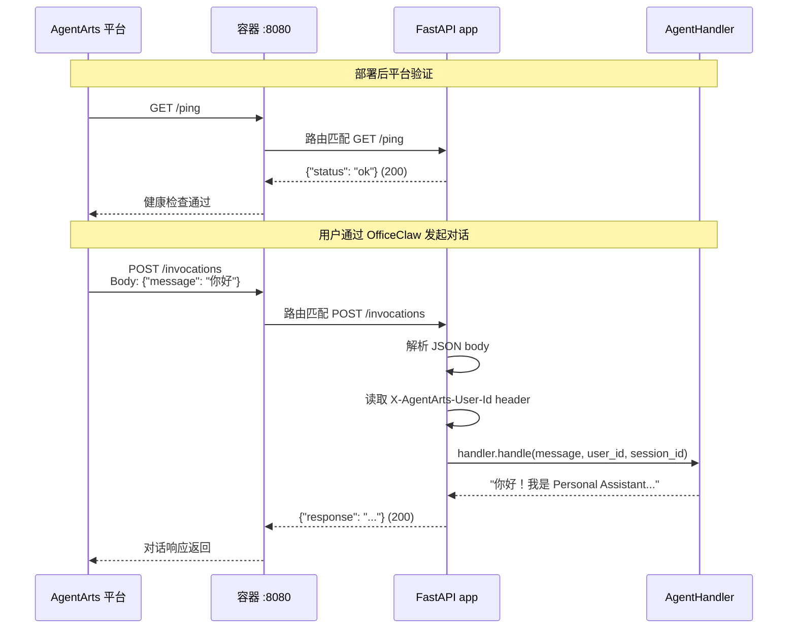
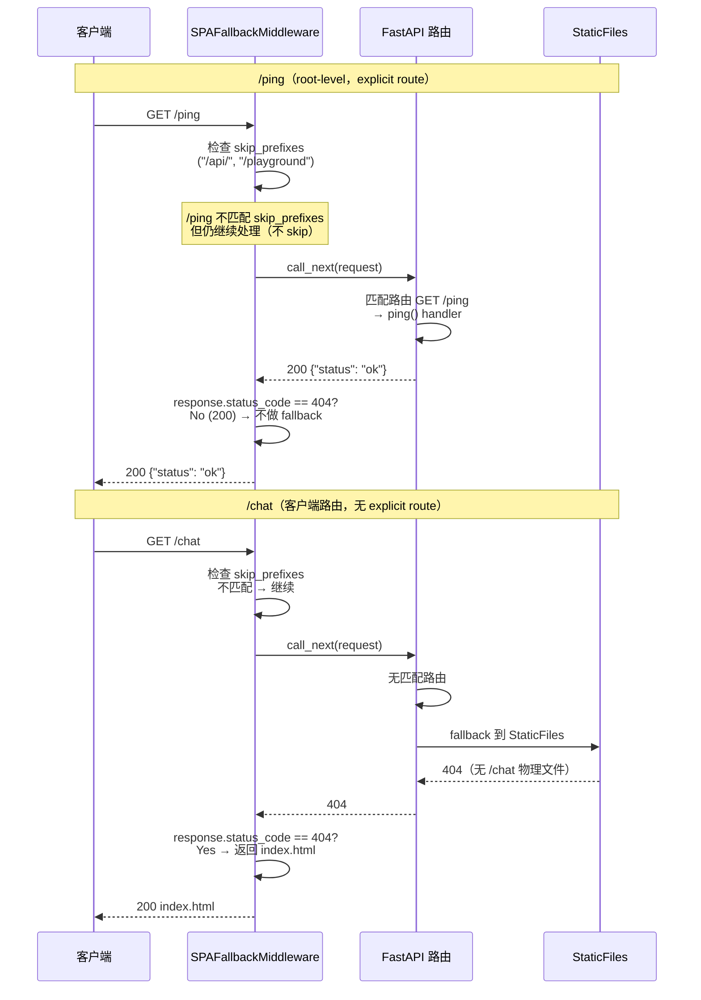

# Refactor 1: 合并 /ping 路由 — 实施计划

> 版本：v1.1 | 日期：2026-06-08 | 对应 Issue：`issue.md`

---

## 0. Issue Evaluation

| 维度 | 结果 | 说明 |
|------|------|------|
| Staleness | ✅ | 引用的架构文档（`backend_architecture.md` §2, `feature-1-agent-skeleton/plan.md` §2.4, ADR-004）均存在且内容一致。当前 `main.py` 代码状态与 AS-IS 描述完全匹配（`/api/ping` + `/api/invocations`） |
| Feasibility | ✅ | 实现路径明确：仅改两处路由 path 字符串 + 对应测试 URL，无需修改业务逻辑。FastAPI 路由按注册顺序匹配，root-level `/ping` 和 `/invocations` 在 StaticFiles mount 之前注册，不会被覆盖。`SPAFallbackMiddleware` 仅拦截 404，不受影响 |
| Completeness | ✅ | Issue 包含明确的 AS-IS/TO-BE 对比、详细文件路径、行号引用、验收标准 |
| Impact Scope | ✅ | 影响范围：Service 侧 `main.py`（2 行）+ `README.md`（5 处）+ `test_main.py`（8 处 URL + docstring）；E2E 侧 6 个文件（~28 处 URL + docstring）；Meta 侧 `feature-1-agent-skeleton/plan.md` §2.4（1 处注解） |

**判定：ACCEPT** → 继续编写 Implementation Plan。

---

## 1. Issue Summary

### 1.1 变更类型

**Refactor** — 路由路径调整，消除 `/api` 前缀在 `/ping` 和 `/invocations` 端点上的冗余。

### 1.2 动机

Feature 1 实现时为避免 StaticFiles 路由冲突，所有 API 路由统一加了 `/api` 前缀。但 AgentArts 平台要求容器 `:8080` 上存在 root-level 的 `/ping` 和 `/invocations`（见 `backend_architecture.md` §8，ADR-004 §决策）。当前代码中这两个端点带 `/api` 前缀，导致：

- AgentArts 平台无法进行健康检查（`GET /ping`）
- AgentArts 平台无法分发对话请求（`POST /invocations`）

所有架构文档（`overall_architecture.md`、`backend_architecture.md`、`frontend_architecture.md`、`devops/local-development.md`）已一致展示 root-level 路径，本次 refactor 使代码与架构文档对齐。

### 1.3 关联文档

| 文档 | 章节 | 角色 |
|------|------|------|
| `backend_architecture.md` | §2, §8 | 架构基线 — 已展示 root-level `/ping` + `/invocations`，无需修改 |
| `overall_architecture.md` | §1.1, §5.2 | 架构基线 — 同上，已展示 root-level 路径 |
| `ADR-004` | 全部 | 决策依据 — 明确 "AgentArts 只看 :8080 的 `/ping` + `/invocations`" |
| `feature-1-agent-skeleton/plan.md` | §2.4 | 需更新 — 标注 `/api` 前缀决策对 ping/invocations 已 supersede |

---

## 2. API Changes

### 2.1 受影响端点

| 方法 | 旧路径 | 新路径 | 变更类型 |
|------|--------|--------|----------|
| `GET` | `/api/ping` | `/ping` | 路径变更（无 schema 变化） |
| `POST` | `/api/invocations` | `/invocations` | 路径变更（无 schema 变化） |

### 2.2 不受影响的端点

| 端点 | 说明 |
|------|------|
| `GET /api/chat/stream` | 保持 `/api` 前缀 — CDN 分流策略依赖 |
| `GET /` (StaticFiles) | 保持 — 无变化 |
| `GET /playground` (Chainlit) | 保持 — 无变化 |
| 其他 `/api/*` 路由 | 保持 — 无变化 |

### 2.3 Request/Response Schema

**无变化。** 仅 URL 路径变更，请求格式、响应格式、HTTP 状态码、Header 处理逻辑全部不变，具体包括：

- `POST /invocations`：仍接受 `{"message": "..."}` JSON body，仍读取 `X-AgentArts-User-Id` / `X-AgentArts-Session-Id` headers，仍返回 `{"response": "..."}`
- `GET /ping`：仍返回 `{"status": "ok"}`
- 空 message 仍返回 400（`"message is required"`）

### 2.4 OpenAPI Spec 影响

`app.openapi()` 自动生成的路径从 `/api/ping`、`/api/invocations` 变为 `/ping`、`/invocations`。如 `personal-assistant-client/` 有从 OpenAPI spec 生成的 TypeScript 类型，需重新生成（但当前 Client 不直接调这两个端点，暂无影响）。

---

## 3. Service Tasks

### Task 3.1：更新 `app/main.py` 路由路径

**文件**：`personal-assistant-service/app/main.py`

**变更**：修改两处 `@app` 装饰器中的 path 参数。

| 行号 | 旧代码 | 新代码 |
|------|--------|--------|
| 44 | `@app.get("/api/ping")` | `@app.get("/ping")` |
| 50 | `@app.post("/api/invocations")` | `@app.post("/invocations")` |

> **注意**：函数名 `ping` 和 `invocations` 保持不变，因此 FastAPI route name 不变（仍为 `"ping"` 和 `"invocations"`）。所有通过 route name 引用这些路由的代码（如测试中的 `route_names.index("ping")`）无需修改。

**不修改的部分**：
- `@app.get("/api/chat/stream")` — 保持 `/api` 前缀
- `SPAFallbackMiddleware` — 无需修改（其 `skip_prefixes` 虽为 `("/api/", "/playground")`，但该 middleware 仅拦截 404 响应，而 `/ping` 和 `/invocations` 的 FastAPI handler 返回 200，middleware 不会介入）
- StaticFiles mount — 无需修改（FastAPI 按注册顺序匹配路由，explicit routes 优先于 Mount）

### Task 3.2：验证路由优先级不受影响

**文件**：`personal-assistant-service/app/main.py`（只读验证，无代码变更）

验证要点：
1. 路由注册顺序：`/ping` → `/invocations` → `/api/chat/stream` → Chainlit `/playground` → StaticFiles `/`
2. FastAPI 按注册顺序匹配 — explicit `Route` 永远优先于 `Mount`（StaticFiles）
3. 结论：root-level `/ping` 和 `/invocations` 不会被 StaticFiles mount 覆盖

### Task 3.3：更新 `README.md` 中的 API 示例

**文件**：`personal-assistant-service/README.md`

**变更**：将所有 `/api/ping` 和 `/api/invocations` 引用更新为 root-level 路径（5 处）：

| 行号 | 位置 | 旧文本 | 新文本 |
|------|------|--------|--------|
| 70 | API 端点表 | `\`/api/ping\`` | `\`/ping\`` |
| 71 | API 端点表 | `\`/api/invocations\`` | `\`/invocations\`` |
| 79 | curl 示例 | `curl http://localhost:8080/api/ping` | `curl http://localhost:8080/ping` |
| 82 | curl 示例 | `curl -X POST http://localhost:8080/api/invocations` | `curl -X POST http://localhost:8080/invocations` |
| 151 | 架构 ASCII 图 | `POST /api/invocations` | `POST /invocations` |

> **注意**：`/api/chat/stream` 在 README 中的引用（§API 端点表行 72、curl 示例行 87、架构图行 142）保持不变，该端点仍使用 `/api` 前缀。

### Task 3.4：无其他 Service 文件变更

以下文件无需修改：
- `app/agent_handler.py` — 路由无关
- `app/llm_config.py` — 路由无关
- `app/spa_middleware.py` — 分析见上
- `app/playground.py` — 路由无关
- `.agentarts_config.yaml` — 已指定 port 8080，无需变更
- `pyproject.toml` / `uv.lock` — 依赖无变化

---

## 4. E2E Tasks

> **关键依赖**：E2E 测试中 `conftest.py` 的服务启动健康检查直接使用 `/api/ping`——若不更新，refactor 后所有 E2E 测试将因 `Service did not become healthy` 而失败。

### 4.1 影响概览

E2E 目录下共 **6 个文件**、**~28 处引用**需要更新（URL 路径 + 对应 docstring/注释）：

| 文件 | 引用数 | 风险等级 |
|------|--------|----------|
| `conftest.py` | 1（健康检查） | 🔴 CRITICAL — 阻塞所有 E2E |
| `tests/features/test_feature_1_1_web_chat.py` | 7 | 🟡 — API 路由测试 |
| `tests/features/test_feature_1_3_multi_llm.py` | 16 | 🟡 — 多 LLM 冒烟测试 |
| `tests/regression/test_bug_2_spa_fallback_not_working.py` | 1 | 🟢 — 回归测试 |
| `tests/regression/test_bug_3_playground_returns_404.py` | 1 | 🟢 — 回归测试 |
| `tests/regression/test_bug_6_vite_playground_proxy_missing.py` | 2 | 🟢 — Vite proxy 测试 |

所有变更均为纯路径字符串替换（`/api/ping` → `/ping`，`/api/invocations` → `/invocations`），无逻辑修改。

### 4.2 `conftest.py`（CRITICAL）

**文件**：`personal-assistant-e2e/conftest.py`

| 行号 | 旧代码 | 新代码 |
|------|--------|--------|
| 140 | `httpx.get(f"{self.url}/api/ping", timeout=2.0)` | `httpx.get(f"{self.url}/ping", timeout=2.0)` |

这是服务启动后的健康检查调用——所有 E2E 测试依赖此检查等待服务就绪，必须最先修复。

### 4.3 `tests/features/test_feature_1_1_web_chat.py`

**文件**：`personal-assistant-e2e/tests/features/test_feature_1_1_web_chat.py`

| 行号 | 内容 | 旧文本 | 新文本 |
|------|------|--------|--------|
| 21 | 模块级 docstring 枚举 | `/, /api/ping, /api/chat/stream` | `/, /ping, /api/chat/stream` |
| 105 | `_wait_service` 健康检查 | `http://127.0.0.1:{port}/api/ping` | `http://127.0.0.1:{port}/ping` |
| 719 | `test_playground_does_not_crash` 中的 ping | `http://127.0.0.1:{self.PORT}/api/ping` | `http://127.0.0.1:{self.PORT}/ping` |
| 770 | 测试 docstring | `"""GET /api/ping returns 200 JSON` | `"""GET /ping returns 200 JSON` |
| 773 | `test_api_ping_takes_priority_over_static` | `http://127.0.0.1:{self.PORT}/api/ping` | `http://127.0.0.1:{self.PORT}/ping` |
| 822 | 测试 docstring | `"""POST /api/invocations endpoint` | `"""POST /invocations endpoint` |
| 826 | `test_api_invocations_works_with_static_mounted` | `http://127.0.0.1:{self.PORT}/api/invocations` | `http://127.0.0.1:{self.PORT}/invocations` |

### 4.4 `tests/features/test_feature_1_3_multi_llm.py`

**文件**：`personal-assistant-e2e/tests/features/test_feature_1_3_multi_llm.py`

共 16 处引用（`/api/ping` × 8 URL + 1 docstring，`/api/invocations` × 4 URL + 3 docstring），分布在如下测试类和方法中：

| 测试类 / 函数 | 涉及行号 | `/api/ping` | `/api/invocations` |
|---------------|----------|-------------|---------------------|
| `_wait_service`（模块级 helper） | 94 | 1（URL） | — |
| `TestScenario1_MaasConfig` | 199-261 | 1（URL）+ 1（docstring） | 3（URL）+ 3（docstring） |
| `TestScenario2_DeepSeekConfig` | 339-388 | 2（URL） | 1（URL）+ 1（docstring） |
| `TestScenario3_ConfigFallback` | 410-450 | 3（URL） | 1（URL） |

**变更规则**：所有行中的 `/api/ping` → `/ping`，`/api/invocations` → `/invocations`。对应的 docstring 同步更新。

### 4.5 回归测试文件

三组回归测试均为纯路径字符串替换：

| 文件 | 行号 | 旧 | 新 |
|------|------|-----|-----|
| `test_bug_2_spa_fallback_not_working.py` | 79 | `{service_url}/api/ping` | `{service_url}/ping` |
| `test_bug_3_playground_returns_404.py` | 65 | `{service_url}/api/ping` | `{service_url}/ping` |
| `test_bug_6_vite_playground_proxy_missing.py` | 189 | 测试 docstring `"""Sanity: /api/ping proxy` | `"""Sanity: /ping proxy` |
| `test_bug_6_vite_playground_proxy_missing.py` | 190 | `{dev_urls['vite_url']}/api/ping` | `{dev_urls['vite_url']}/ping` |

### 4.6 E2E 验证命令

```bash
# 在 personal-assistant-e2e/ 目录下运行冒烟测试
pytest tests/features/test_feature_1_1_web_chat.py::TestScenario8_StaticFilesMount::test_api_ping_takes_priority_over_static -v
pytest tests/features/test_feature_1_3_multi_llm.py::TestScenario1_MaasConfig::test_service_starts_and_ping_responds -v

# 运行全部 E2E
pytest personal-assistant-e2e/ -v
```

---

## 5. Client Tasks

### 5.1 无直接 Client 变更

`personal-assistant-client/` 不直接调用 `/ping` 或 `/invocations` 端点。Web Chat 前端通过 `/api/chat/stream` 和 `/` 与后端交互，这两个端点不受本次 refactor 影响。

### 5.2 潜在影响（仅记录）

如果 `personal-assistant-client/` 中有从 OpenAPI spec 自动生成的 API client 代码，重新生成后 `/ping` 和 `/invocations` 的路径会更新。但这属于元操作，对运行时无影响。

---

## 6. Test Requirements（`test_main.py` 单元测试）

### 6.1 需修改的测试（URL 路径）

**文件**：`personal-assistant-service/tests/test_main.py`

以下测试中的请求 URL 需要更新。共 **3 处** `/api/ping` URL 调用 + **5 处** `/api/invocations` URL 调用：

**`/api/ping` → `/ping`（3 处 URL 调用）**：

| 测试函数 | 行号 | 变更 |
|----------|------|------|
| `test_ping_returns_status_ok` | 74 | `client.get("/api/ping")` → `"/ping"` |
| `test_ping_works_with_chainlit_mount` | 487 | `ac.get("/api/ping")` → `"/ping"` |
| `test_api_routes_bypass_fallback` | 585 | `client.get("/api/ping")` → `"/ping"` |

**`/api/invocations` → `/invocations`（5 处 URL 调用）**：

| 测试函数 | 行号 | 变更 |
|----------|------|------|
| `test_invocations_returns_response` | 88 | `client.post("/api/invocations", ...)` → `"/invocations"` |
| `test_invocations_defaults_to_anonymous_user` | 108 | `client.post("/api/invocations", ...)` → `"/invocations"` |
| `test_invocations_empty_message_returns_400` | 115 | `client.post("/api/invocations", ...)` → `"/invocations"` |
| `test_invocations_missing_message_returns_400` | 123 | `client.post("/api/invocations", ...)` → `"/invocations"` |
| `test_invocations_whitespace_only_passes_through` | 134 | `client.post("/api/invocations", ...)` → `"/invocations"` |

### 6.2 需修改的测试（docstring 和注释）

除 URL 外，以下 docstring 和 section header 也引用旧路径，需同步更新以保持代码自文档化：

| 行号 | 类型 | 旧文本 | 新文本 |
|------|------|--------|--------|
| 67 | section header | `# GET /api/ping` | `# GET /ping` |
| 73 | docstring | `"""GET /api/ping should return` | `"""GET /ping should return` |
| 80 | section header | `# POST /api/invocations` | `# POST /invocations` |
| 487 | docstring | `"""GET /api/ping returns 200 OK` | `"""GET /ping returns 200 OK` |
| 585 | docstring | `"""GET /api/ping should return normal JSON` | `"""GET /ping should return normal JSON` |

`POST /api/invocations` 相关的测试 docstring（如 `test_invocations_returns_response` 的 docstring）在原始文件中未包含硬编码路径字符串，因此无需修改。

### 6.3 无需修改的测试

| 测试函数 | 原因 |
|----------|------|
| `test_api_routes_take_precedence` | 使用 `route_names.index("ping")` 和 `"web-chat"` — route name 基于函数名，不变 |
| `test_invocations_route_precedes_static` | 使用 `route_names.index("invocations")` — 同上 |
| `test_static_index_returns_html` | 测试 `/` — 不受影响 |
| `test_static_files_route_is_mounted` | 测试 StaticFiles mount — 不受影响 |
| `test_graceful_degradation_when_no_dist` | 测试无 dist 目录场景 — 不受影响 |
| `test_chat_stream_*` 系列 | 测试 `/api/chat/stream` — 不受影响（保持 `/api` 前缀） |
| `test_playground_*` 系列 | 测试 Chainlit `/playground` — 不受影响 |
| `test_spa_fallback_*` 系列 | 测试 SPA 回退逻辑 — `/chat` 等不受影响 |

### 6.4 需添加的验证测试

建议在测试文件中新增以下测试（可选，取决于时间预算）：

```python
# 验证 root-level /ping 正常工作
@pytest.mark.asyncio
async def test_ping_root_level_works(client):
    """GET /ping (root-level, no /api prefix) returns {"status": "ok"}."""
    response = await client.get("/ping")
    assert response.status_code == 200
    assert response.json() == {"status": "ok"}


# 验证 /api/ping 不再存在（旧路径应 404 或 fallthrough）
@pytest.mark.asyncio
async def test_api_ping_old_path_not_found(client):
    """GET /api/ping should no longer exist — returns 404 or index.html fallback."""
    response = await client.get("/api/ping")
    # After refactor, /api/ping is not an explicit route.
    # In monorepo dev (with dist/): SPAFallbackMiddleware will serve index.html (200)
    # In pure API mode: 404
    assert response.status_code in (200, 404)
    if response.status_code == 200:
        # Must be SPA fallback (index.html), not {"status": "ok"}
        assert response.json() != {"status": "ok"}
```

### 6.5 验证命令

```bash
# 在 personal-assistant-service/ 目录下运行所有测试
uv run pytest tests/test_main.py -v

# 运行 ruff 检查
uv run ruff check .

# 快速冒烟测试
uv run pytest tests/test_main.py -k "ping or invocation" -v
```

---

## 7. Meta 文档更新

### Task 7.1：更新 Feature 1 Plan §2.4

**文件**：`personal-assistant-meta/issues/features/feature-1-agent-skeleton/plan.md`

**位置**：§2.4 "API 路由 `/api` 前缀决策"（约第 89–106 行）

**变更**：在 §2.4 末尾添加一条说明，标注 `/ping` 和 `/invocations` 路由的前缀决策已被本 refactor 取代：

```markdown
> **2026-06-08 更新（Refactor 1）**：`/ping` 和 `/invocations` 的路由前缀决策已
> 被 supersede。这两个端点现已移至 root-level（`/ping`、`/invocations`），不再使用
> `/api` 前缀。原因：AgentArts 平台要求 root-level 健康检查和调用入口（见 ADR-004），
> 且 FastAPI 路由注册顺序保证了 explicit Route 优先于 StaticFiles Mount，不受冲突影响。
> `/api/chat/stream` 等其他 API 路由保持 `/api` 前缀不变。
> 详见 `personal-assistant-meta/issues/refactor/refactor-1-consolidate-ping-routes/`。
```

### Task 7.2：验证 architecture 文档无变更

**文件**（只读验证，无需修改）：

| 文档 | 状态 | 说明 |
|------|------|------|
| `backend_architecture.md` §2 | ✅ 已匹配 | 代码块和路由表均显示 root-level `/ping`、`/invocations` |
| `overall_architecture.md` §5.2 | ✅ 已匹配 | 代码示例 `@app.get("/ping")`、`@app.post("/invocations")` |
| `frontend_architecture.md` | ✅ 已匹配 | 架构图显示 `/ping` |
| `devops/local-development.md` | ✅ 已匹配 | 验证命令 `curl /ping` |
| `devops/cicd.md` | ✅ 已匹配 | 验证命令 `curl /ping` |

---

## 8. Mermaid 图表

### 8.1 变更前后路由对比

```mermaid
flowchart LR
    subgraph Before["变更前（当前 main.py）"]
        direction TB
        B1["GET /api/ping → 200"]
        B2["POST /api/invocations → 200"]
        B3["GET /api/chat/stream → SSE"]
        B4["GET / → StaticFiles"]
        B5["/playground → Chainlit"]
    end

    subgraph After["变更后（目标状态）"]
        direction TB
        A1["GET /ping → 200"]
        A2["POST /invocations → 200"]
        A3["GET /api/chat/stream → SSE"]
        A4["GET / → StaticFiles"]
        A5["/playground → Chainlit"]
    end

    Before -->|"路径变更"| After

    classDef unchanged fill:#e8f5e9,stroke:#4caf50
    classDef changed fill:#fff3e0,stroke:#ff9800

    class B1,B2 changed
    class A1,A2 changed
    class B3,B4,B5,A3,A4,A5 unchanged
```



### 8.2 AgentArts 平台健康检查流程



### 8.3 SPAFallbackMiddleware 交互验证



---

## 9. 实施步骤（执行顺序）

| Step | 负责方 | 文件 | 操作 |
|------|--------|------|------|
| **1** | Service-Dev | `app/main.py` | 将 `@app.get("/api/ping")` 改为 `@app.get("/ping")`，`@app.post("/api/invocations")` 改为 `@app.post("/invocations")` |
| **2** | Service-Dev | `README.md` | 更新 API 端点表、curl 示例、架构图中 5 处 `/api/ping`/`/api/invocations` → `/ping`/`/invocations` |
| **3** | Service-Dev | `tests/test_main.py` | 更新 URL：`/api/ping` → `/ping`（3 处 URL + 3 处 docstring/header），`/api/invocations` → `/invocations`（5 处 URL + 1 处 header） |
| **4** | Service-Tester | 全部 Service 变更 | 运行 `pytest` + `ruff check`，确认所有测试通过 |
| **5** | E2E-Dev | `conftest.py` | 将健康检查 URL `/api/ping` → `/ping`（1 处，阻塞级） |
| **6** | E2E-Dev | `tests/features/test_feature_1_1_web_chat.py` | 更新 7 处引用（URL + docstring） |
| **7** | E2E-Dev | `tests/features/test_feature_1_3_multi_llm.py` | 更新 16 处引用（URL + docstring） |
| **8** | E2E-Dev | `tests/regression/test_bug_{2,3,6}*.py` | 更新 4 处引用（URL + docstring） |
| **9** | E2E-Tester | 全部 E2E 变更 | 运行 E2E 冒烟测试，确认 Service 启动健康检查通过 |
| **10** | Meta-Dev | `feature-1-agent-skeleton/plan.md` §2.4 | 添加 supersede 注解（见 §7.1） |

> **并行化提示**：Step 1-4（Service）和 Step 5-9（E2E）可并行执行，它们修改不同目录。Step 10（Meta）可在 Service/E2E 进行中同步执行。所有变更完成后由 personal-assistant-committer 统一提交。

---

## 10. 参考文档

| 文档 | 路径 |
|------|------|
| 原始 Issue | `personal-assistant-meta/issues/refactor/refactor-1-consolidate-ping-routes/issue.md` |
| 后端架构 | `personal-assistant-meta/architecture/backend_architecture.md` |
| 总体架构 | `personal-assistant-meta/architecture/overall_architecture.md` |
| ADR-004（FastAPI） | `personal-assistant-meta/architecture/ADR/ADR-004-fastapi-over-agentarts-runtime-app.md` |
| Feature 1 Plan | `personal-assistant-meta/issues/features/feature-1-agent-skeleton/plan.md` |
| Service README | `personal-assistant-service/README.md` |
| Service main.py | `personal-assistant-service/app/main.py` |
| Service 单元测试 | `personal-assistant-service/tests/test_main.py` |
| E2E conftest | `personal-assistant-e2e/conftest.py` |
| E2E Feature 1.1 测试 | `personal-assistant-e2e/tests/features/test_feature_1_1_web_chat.py` |
| E2E Feature 1.3 测试 | `personal-assistant-e2e/tests/features/test_feature_1_3_multi_llm.py` |
| E2E 回归测试 | `personal-assistant-e2e/tests/regression/test_bug_{2,3,6}*.py` |
