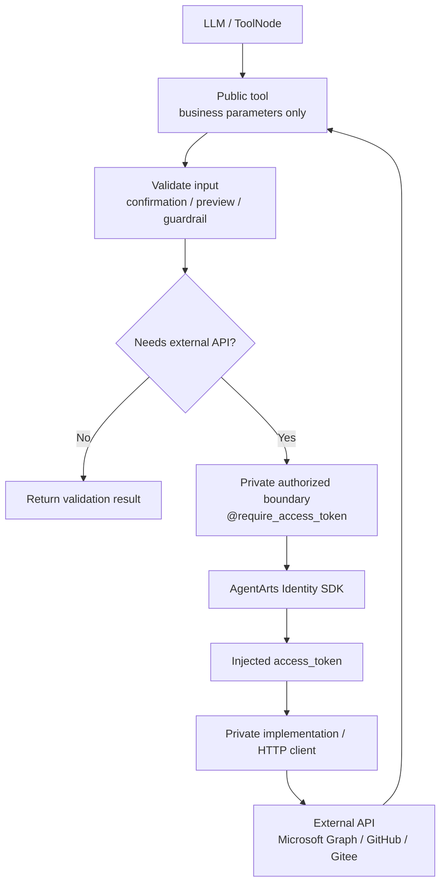

# Refactor 13: 统一 Outbound OAuth2 Token 注入边界

将所有依赖 `@require_access_token` 的 outbound tools 统一为同一种架构风格：**public tool 不暴露 token 参数，private authorized boundary 负责通过 AgentArts Identity SDK 注入 access token**。

当前 GitHub tools 已接近该目标：public tools 调用内部 `_github_request()`，由 `_github_request()` 统一持有 `@require_access_token`。Email、Calendar、Gitee 则存在 public tool 直接被 `@require_access_token` 装饰的风格，导致 `access_token` 成为 tool function 签名的一部分，容易进入 LLM tool schema，也让授权配置在多个 tool 上重复声明。

---

## 动机

OAuth2 access token 是 Runtime credential，不是 LLM 可见的业务输入。public tool 的 contract 应只包含用户意图和业务参数，例如 `folder`、`query`、`event_id`、`owner/repo`，不应出现 `access_token`。

当前混用两种风格会带来四类问题：

1. **Tool schema 污染**：SDK decorator 使用 `functools.wraps` 保留原函数签名；当 public tool 签名包含 `access_token` 时，LangChain/deepagents 可能把它推导成可由 LLM 填写的参数。
2. **授权配置重复**：同一 provider/domain 的 `provider_name`、`scopes`、`auth_flow`、`on_auth_url` 在多个 tool 上重复声明，容易出现 scope drift 或 callback drift。
3. **业务校验顺序不理想**：tool-level decorator 会在函数体执行前触发授权。对于需要二次确认、参数校验或 preview 的操作，系统可能过早弹出授权卡。
4. **测试边界偏重**：unit tests 需要 unwrap decorator 或显式传入 mock token，说明 auth boundary 和 public tool contract 耦合过强。

---

## 目标心智模型

核心规则：

- Public tool 函数签名中不得出现 `access_token`、`api_key` 或其他 injected credential 参数。
- `@require_access_token` 只允许放在 private authorized boundary 上，例如 `_github_request()`、`_m365_email_request()`、`_calendar_authorized()`、`_gitee_authorized_request()`。
- 同一 outbound domain 的 provider/scopes/callback 配置必须集中声明，且使用稳定常量。
- Public tool 先执行参数校验、确认流、业务 guardrail，再进入授权边界。
- 未授权或授权 pending 时，由 `require_access_token` 和 `on_auth_url` callback 触发授权流程；public tool 不应通过额外 helper 事后判断 `auth_required`，也不以 `auth_required` result 作为新设计目标。

---

## 影响范围

### Service

| 文件 | 目标改造 |
|------|----------|
| `personal-assistant-service/app/tools/email_tools.py` | 移除 public Email tools 签名中的 `access_token`，采用单一 `_m365_email_request()` private authorized request boundary |
| `personal-assistant-service/app/tools/calendar_tools.py` | 保留当前 public wrapper + `_impl` 的测试友好结构，但将 token 注入下移到 private authorized boundary |
| `personal-assistant-service/app/tools/gitee_tools.py` | 改为 public `gitee_list_repositories` 不含 token，private request/helper 持有 `@require_access_token` |
| `personal-assistant-service/app/tools/github_tools.py` | 作为目标模式基线，检查是否需要命名、返回结构和测试方式对齐 |
| `personal-assistant-service/tests/test_email_tools.py` | 不再通过 unwrap public tool decorator 测业务逻辑，改为直接测试 public tools 并 mock `_m365_email_request()` |
| `personal-assistant-service/tests/test_calendar_tools.py` | 更新 token 注入边界相关测试 |
| `personal-assistant-service/tests/test_gitee_tools.py` | 更新 public tool schema 和 request boundary defensive guard 测试 |
| `personal-assistant-service/tests/test_github_tools.py` | 补充 public schema 不含 credential 参数的回归测试 |
| `personal-assistant-service/tests/test_tools_init.py` | 验证注册后的 tools 中 credential 参数不可见 |

### Meta / Documentation

| 文件 | 目标改造 |
|------|----------|
| `personal-assistant-meta/architecture/auth/outbound-oauth2-scope-design.md` | 补充 token boundary 规则：domain 内统一 scopes，public tool 不暴露 injected credential |
| `personal-assistant-meta/specs/use-cases/email-tools.md` | 更新 OAuth2 描述，避免写成 public tool 直接获得 token |
| `personal-assistant-meta/specs/use-cases/calendar-tools.md` | 更新 OAuth2 描述 |
| `personal-assistant-meta/specs/use-cases/gitee-tools.md` | 更新 OAuth2 描述 |
| `personal-assistant-meta/specs/use-cases/github-tools.md` | 保持或强化 private request boundary 模式 |

Client 和 Infra 预期不需要代码变更。Auth Card 的 SSE custom event 协议保持不变。

---

## 非目标

- 不改变 AgentArts Identity provider 配置本身。
- 不改变 OAuth2 scopes 的业务含义；本次只移动 token 注入边界。
- 不改变 Auth Card 的前端展示协议。
- 不引入新的 credential cache。
- 不重写 Microsoft Graph、GitHub 或 Gitee HTTP API 业务逻辑。
- 不改变 public tool 的业务能力和返回语义，除非是为了对齐既有 domain 的授权流程兼容行为。

---

## Implementation Plan 要求

正式实施前，Implementation Plan 必须完成以下事项：

1. 使用 GitNexus 对将要修改的 function/class 逐一执行 upstream impact analysis，并报告 direct callers、affected processes 和 risk level。
2. 若任何目标返回 HIGH 或 CRITICAL risk，先向用户报告 blast radius，再进入编辑。
3. 对每个 outbound domain 明确选择 private authorized boundary：
   - GitHub：复用或整理 `_github_request()`。
   - Email：已选择单一 `_m365_email_request()` private boundary；不保留 per-operation authorized wrappers，也不保留同签名 `_xxx_impl` 转发层。
   - Calendar：建议保持 public wrapper + private `_impl` 测试结构，在 `_impl` 上游增加 authorized boundary。
   - Gitee：将 `@require_access_token` 从 public `list_repositories()` 下移到 private helper。
4. 明确 public tool schema 验证方式，确保注册到 `build_tools()` 后没有 `access_token` 参数。
5. 完成后、commit 前运行 `gitnexus_detect_changes()`，确认只影响预期 symbols 和 execution flows。

---

## 验收标准

### Contract

- [x] `build_tools()` 注册出的所有 OAuth2 public tools 的 schema 中均不包含 `access_token`。
- [x] `email_tools.py`、`calendar_tools.py`、`gitee_tools.py` 的 public tool function 签名不包含 `access_token`。
- [x] `@require_access_token` 仅出现在 private authorized boundary 上，或有明确注释说明为什么 public boundary 不可避免。
- [x] 同一 domain 的 `provider_name`、`scopes`、`auth_flow`、`on_auth_url` 使用集中常量，避免重复漂移。
- [x] 需要 confirmation 或 preview 的 public tool 在触发授权前完成校验和确认返回。

### Behavior

- [x] 未授权用户首次调用 Email/Calendar/Gitee/GitHub tool 时，仍能收到 provider-scoped Auth Card。
- [x] 授权完成后，后续 tool 调用仍能发送 `auth_complete` custom event。
- [x] 业务参数错误时，不应先触发 OAuth2 授权。
- [x] OAuth2 pending 状态能通过 provider-scoped Auth Card 正常传递给 Agent/前端；public tool 不暴露 injected credential，也不做二次 `auth_required` 判别。
- [x] GitHub 现有行为不回退。

### Tests

- [x] Service: `uv run ruff check .`
- [ ] Service: `uv run ruff format --check .`（当前仍受既有 format drift 阻塞；见下方验证备注）
- [x] Service: `uv run pytest tests/test_email_tools.py tests/test_calendar_tools.py tests/test_gitee_tools.py tests/test_github_tools.py tests/test_tools_init.py`
- [x] N/A：未修改 tool registration 或 agent orchestration，无需追加运行 `uv run pytest tests/test_agent_handler.py`
- [x] E2E: 至少覆盖一个未授权触发 Auth Card 的 outbound OAuth2 场景，或在无法本地完成真实 Identity 流时记录 AgentArts staging 验证步骤。

---

## 实施结果

- Email tools 已收敛为 `public tool -> _m365_email_request() -> Microsoft Graph`：
  - public tool 只暴露业务参数；
  - `_m365_email_request()` 是唯一持有 `@require_access_token` 的 Email private boundary；
  - `require_access_token` 的 `into` 参数使用 SDK 默认值 `access_token`，不再显式声明；
  - 删除 per-operation `_xxx_authorized` wrappers 和同签名 `_xxx_impl` 转发层。
- `send_email` 和 `reply_to_email` 先完成业务参数 validation，再调用 `_m365_email_request()`，无效参数不会触发 OAuth2。
- Email 单测改为直接测试 public tools，并 mock `_m365_email_request()` 验证 Graph request 构造；request boundary 测试保留 token 注入、Authorization header 和缺少注入 token 时的 defensive guard。
- GitHub/Gitee 已删除 `_auth_required_response()` fallback、public tool 的 `auth_required` 事后判别，以及显式 `into="access_token"`；缺少 decorator 注入 token 时视为 request boundary 的 programming error。
- Calendar 已删除 `_auth_required_response()` fallback；三个 authorized boundaries 在缺少 decorator 注入 token 时统一抛出 programming error。
- `personal-assistant-meta/architecture/auth/outbound-oauth2-scope-design.md` 与 `personal-assistant-meta/specs/use-cases/email-tools.md` 已同步到 `_m365_email_request()` 单一边界描述。

已执行验证：

- [x] `uv run ruff check app/tools/email_tools.py tests/test_email_tools.py tests/test_tools_init.py`
- [x] `uv run ruff format --check app/tools/email_tools.py tests/test_email_tools.py tests/test_tools_init.py`
- [x] `uv run ruff check app/tools/github_tools.py app/tools/gitee_tools.py app/tools/calendar_tools.py tests/test_github_tools.py tests/test_gitee_tools.py tests/test_calendar_tools.py tests/test_tools_init.py`
- [x] `uv run ruff format --check app/tools/github_tools.py app/tools/gitee_tools.py app/tools/calendar_tools.py tests/test_github_tools.py tests/test_gitee_tools.py tests/test_calendar_tools.py tests/test_tools_init.py`
- [x] `uv run pytest tests/test_email_tools.py tests/test_tools_init.py`
- [x] `uv run pytest tests/test_github_tools.py tests/test_gitee_tools.py tests/test_calendar_tools.py tests/test_tools_init.py`
- [x] `uv run pytest tests/test_email_tools.py tests/test_calendar_tools.py tests/test_gitee_tools.py tests/test_github_tools.py tests/test_tools_init.py`
- [x] `uv run --project personal-assistant-e2e ruff check personal-assistant-e2e/tests/features/test_feature_10a_outbound_email.py`
- [x] `uv run --project personal-assistant-e2e ruff format --check personal-assistant-e2e/tests/features/test_feature_10a_outbound_email.py`
- [x] `uv run --project personal-assistant-service pytest personal-assistant-e2e/tests/features/test_feature_10a_outbound_email.py -q`
- [x] `build_tools()` schema leak check: no public tool exposes `access_token` or `api_key`
- [x] `gitnexus detect-changes -r personal-assistant --scope staged`（14 files / 81 symbols / 38 affected processes / critical，范围为预期 Email/GitHub/Gitee/Calendar tool、refactor E2E 和 meta 文档变更）

验证备注：`uv run ruff format --check .` 仍会报告既有 format drift；2026-07-09 housekeeping 复查时，全仓 `uv run ruff check .` 通过，`uv run ruff format --check .` 仍失败，因此 full format 项保持未勾选。

---

## Four-Question Gate

| Question | Answer | 论证 |
|----------|:------:|------|
| **Is it best practice?** | Yes | Credential injection 属于 infrastructure/runtime concern，不应暴露在 LLM-facing public API contract 中。public tool 只表达业务输入，private boundary 处理 secret/token，是清晰的 separation of concerns。 |
| **Is it industry standard?** | Yes | 主流 secret manager、cloud identity 和 SDK credential provider 模式都强调凭据由运行时注入，并在 application boundary 内消费，不要求调用者或模型填写 token。 |
| **Is it conventional?** | Yes | 新成员看到 `github_list_repositories(owner, repo)` 这样的 tool schema 会预期只填写业务参数；看到 `_github_request()`、`_m365_email_request()` 上的 decorator 会自然理解这是 provider-level auth boundary。 |
| **Is it modern?** | Yes | 与 agentic tool calling 的安全方向一致：LLM 看不到 credential，tool schema 最小化，授权和业务 guardrail 可以组合，而不是把 secret 参数混入模型可见接口。 |

四个 gate 均为 **Yes**。

---

## 参考

- [`personal-assistant-meta/architecture/auth/outbound-oauth2-scope-design.md`](../../../../architecture/auth/outbound-oauth2-scope-design.md)
- [`personal-assistant-meta/issues/refactor/resolved/refactor-email-auth-normal-control-flow/issue.md`](../refactor-email-auth-normal-control-flow/issue.md)
- [`personal-assistant-meta/specs/use-cases/github-tools.md`](../../../../specs/use-cases/github-tools.md)
- [`personal-assistant-meta/specs/use-cases/email-tools.md`](../../../../specs/use-cases/email-tools.md)
- [`personal-assistant-meta/specs/use-cases/calendar-tools.md`](../../../../specs/use-cases/calendar-tools.md)
- [`personal-assistant-meta/specs/use-cases/gitee-tools.md`](../../../../specs/use-cases/gitee-tools.md)
