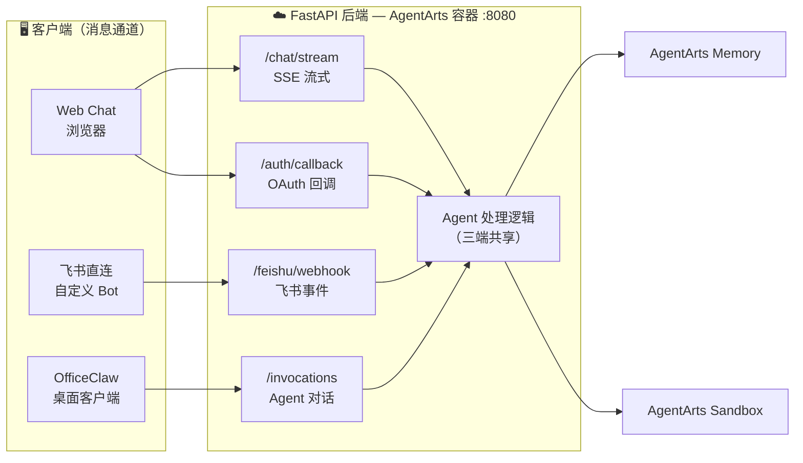
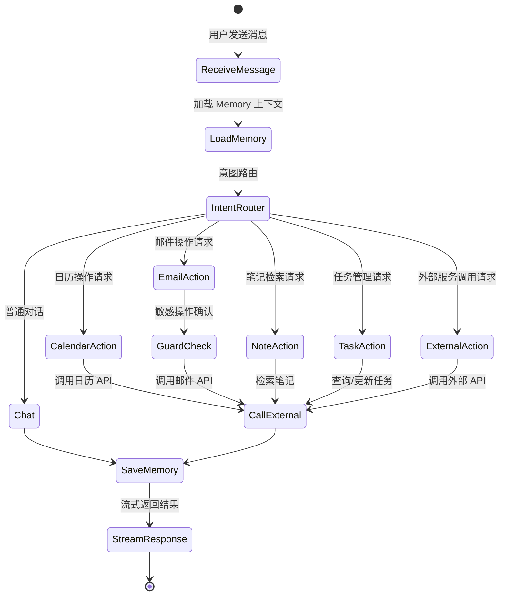

# Personal Assistant — 总体功能规格书

> 版本：v0.3 | 状态：Draft | 基于 AgentArts 平台

---

## 1. 项目概述

Personal Assistant 是一个对话式 AI 助手应用，用户通过自然语言对话管理日程、邮件、笔记和任务。系统具备跨 Session 的 Memory 能力，能够记住用户偏好和历史上下文，并在用户授权下以用户身份访问外部服务（如 GitHub、Google Calendar、企业内部 API）。

### 1.1 核心价值

- **多渠道接入**：支持 Web Chat、飞书直连和 OfficeClaw 三种客户端接入方式，同一 Agent 后端同时服务多个入口
- **智能记忆**：自动学习用户偏好和习惯，使用越久越贴合个人需求
- **安全委托**：Agent 以用户委托身份调用外部服务，无需暴露个人凭证给 Agent 代码

### 1.2 目标用户

| 用户类型 | 典型场景 |
|----------|----------|
| 开发者 | 管理 GitHub Issues/PR、查询技术文档、跟踪项目任务 |
| 职场人士 | 管理日程、处理邮件、跨源跟踪待办事项 |
| 运维人员 | 通过对话管理云资源、查询系统状态 |

---

## 2. 接入渠道

系统支持三种客户端接入方式，共享同一 FastAPI 后端和 Agent 处理逻辑：



| 渠道 | 接入方式 | 说明 | 适用场景 |
|------|----------|------|----------|
| **Web Chat** | 浏览器直连 `/chat/stream` | 独立 Web 聊天界面，支持 OAuth 登录和 SSE 流式响应，完全自定义 UI/UX | 个人桌面使用、对外 Demo |
| **飞书直连** | 飞书事件回调 `/feishu/webhook` | 自行创建飞书 Bot，处理事件回调，完全自主可控，支持飞书卡片等高级交互 | 企业内部推广、移动端触达、高级飞书交互 |
| **OfficeClaw** | AgentArts 转发 `/invocations` | 通过 OfficeClaw 桌面客户端桥接飞书/微信，无需写飞书代码，不需要公网回调 URL | 快速接入飞书/微信，不想维护飞书 Bot 代码 |

三种渠道共享同一个 Agent 处理逻辑和 Memory 空间，用户无论从哪个入口发起对话，Assistant 都能加载其偏好和历史上下文。

---

## 3. 功能模块

### 3.1 日历管理

用户可通过对话完成以下操作：

- **日程查询**：自然语言查询指定日期或时间段的日程安排（如"我今天下午有什么会？"）
- **日程创建**：通过对话创建新日程，系统自动解析时间、地点和参与者
- **冲突检测**：新建日程时自动检测与已有日程的时间冲突，并给出提示
- **多时区协调**：当参与者跨时区时，自动进行时区换算

### 3.2 邮件处理

- **收件箱摘要**：按优先级汇总未读邮件，提取关键信息（发件人、主题、紧急程度）
- **草拟回复**：根据上下文草拟邮件回复内容，用户确认后发送
- **邮件发送**：通过对话撰写并发送邮件，支持指定收件人、抄送和附件
- **敏感操作拦截**：发送邮件等写操作需用户二次确认（Guard 机制）

### 3.3 笔记检索

- **自然语言搜索**：用自然语言搜索历史笔记，无需精确关键词匹配（如"我上次记的那个关于微服务的笔记"）
- **知识关联**：检索笔记时自动关联相关历史内容，提供上下文
- **语义理解**：支持模糊查询，理解用户意图而非字面匹配

### 3.4 任务跟踪

- **多源聚合**：从日历、邮件、笔记中自动提取待办事项，统一展示
- **优先级排序**：根据紧急程度和用户偏好自动排列任务优先级
- **状态跟踪**：记录任务完成状态，支持更新和标记

### 3.5 上下文记忆

- **偏好记忆**：记住用户的工作时间、常用工具、沟通风格等偏好
- **习惯学习**：从历史交互中学习用户的行为模式（如每周一的站会时间）
- **决策历史**：记录用户的历史决策和反馈，作为后续建议的参考
- **跨 Session 持久化**：所有记忆在对话 Session 之间持久保留，下次对话自动加载

---

## 4. 认证与授权

### 4.1 用户登录（Inbound）

用户通过以下方式之一登录后访问 Agent：

| 认证方式 | 说明 | 适用场景 |
|----------|------|----------|
| **OAuth 2.0 (Custom JWT)** | 通过 Google、Okta、Auth0 等 OIDC IdP 登录 | 生产环境，面向终端用户 |
| **IAM** | 通过华为云 IAM 账号登录 | 华为云内部用户 |
| **API Key** | 使用预配置的 API Key 访问 | 开发调试、机器对机器调用 |

### 4.2 服务委托（Outbound）

用户可授权 Agent 以自身身份访问外部服务：

| 委托模式 | 说明 | 典型场景 |
|----------|------|----------|
| **User Federation** | Agent 以用户身份调用外部 API | 查询 GitHub Issues、读取 Google Calendar、发送 Gmail |
| **M2M (Agent 身份)** | Agent 以自身服务身份调用 API | 查询企业内部 CRM、OA 系统 |
| **云资源访问** | Agent 获取临时凭证访问云资源 | 操作 OBS 对象存储、访问 RDS |

用户凭证始终由 Identity Service 管理，Agent 代码不会接触原始凭证（如密码或长期 Token）。

### 4.3 认证矩阵

| 用户身份 | Inbound 方式 | Outbound 目标 | Outbound 方式 | Auth Flow |
|----------|-------------|---------------|---------------|-----------|
| Google 用户 | JWT (Google OAuth) | GitHub API | OAuth 2.0 | USER_FEDERATION |
| Google 用户 | JWT (Google OAuth) | Google Calendar | OAuth 2.0 | USER_FEDERATION |
| 企业员工 | JWT (Okta/Entra ID) | 内部 CRM | API Key | M2M |
| 企业员工 | JWT (Okta/Entra ID) | 华为云 OBS | STS Token | M2M |
| 开发者 | API Key | _(全部)_ | _(开发调试)_ | — |

---

## 5. 对话交互

### 5.1 对话流程



### 5.2 典型对话示例

**场景一：查询日程**

```
用户: 我今天下午有什么安排？
Agent: 你今天下午有 2 个安排：
      1. 14:00-15:00 项目周会（Google Meet）
      2. 16:00-16:30 与张三的一对一沟通
      15:00-16:00 之间是空闲时间。
```

**场景二：跨服务操作**

```
用户: 帮我查一下我负责的 GitHub Issues，顺便看看明天上午有没有空处理
Agent: 你当前有 3 个 Open Issue：
      1. repo-a#42 - 修复登录页样式问题（优先级高）
      2. repo-b#108 - 更新 API 文档（优先级中）
      3. repo-a#55 - 添加单元测试（优先级低）
      明天上午 9:00-10:00 空闲，建议安排处理 repo-a#42。
      需要我帮你 block 这个时间段吗？
```

---

## 6. 核心验证点

| 验证项 | 说明 |
|--------|------|
| **Inbound Auth** | 用户通过 OAuth 2.0 / API Key 认证后访问 Agent |
| **Outbound Auth (User Federation)** | Agent 以用户委托身份调用 GitHub/Google 等外部 API |
| **Outbound Auth (M2M)** | Agent 以自身身份调用企业内部 Service API |
| **Outbound Auth (STS)** | Agent 获取云平台 STS Token 访问云资源 |
| **Chat Loop** | 多轮对话 + 工具调用 + 流式响应 |
| **Memory** | 跨 Session 持久化用户偏好和上下文 |

---

## 7. 开发计划

| Phase | 内容 | 验证点 |
|-------|------|--------|
| **Phase 1** | 搭建 Agent 骨架：LangGraph chat loop + 本地开发环境 | 本地对话通 |
| **Phase 2** | 集成 Memory：创建 Memory Space，保存/检索记忆 | 跨 Session 记忆 |
| **Phase 3** | 配置 Inbound Identity：JWT + API Key 认证 | 用户登录后访问 |
| **Phase 4** | 实现 Outbound OAuth2 (User Federation)：GitHub Tool | Agent 代用户查 Issues |
| **Phase 5** | 实现 Outbound API Key (M2M)：内部 API Tool | Agent 调企业内部服务 |
| **Phase 6** | 实现 Outbound STS：云资源 Tool | Agent 访问云存储 |
| **Phase 7** | 部署上线 + 全链路可观测 | 生产可用 |
