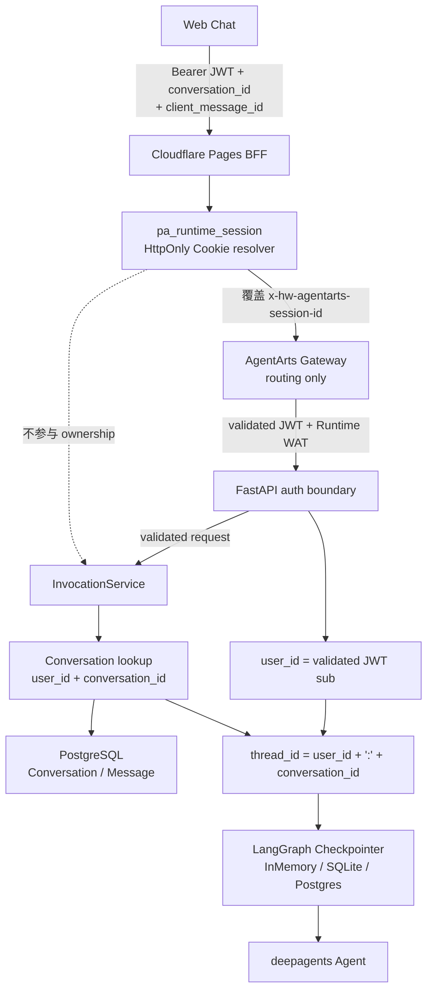

# Conversation Isolation 与 Runtime Session Use Case

本 Use Case 描述 Web Chat 的 Runtime Session、Conversation ownership 与 LangGraph
Checkpoint 隔离。它不是单独的 tool。核心约束是：平台路由生命周期不能成为用户业务
数据生命周期。

## 用户场景

用户在同一个 Conversation 中连续对话，Agent 能记住前文；同一用户的不同
Conversation、不同用户的 Conversation 之间不能串扰。浏览器 Runtime Session 轮换后，
用户仍可恢复属于自己的 Conversation。

```text
用户 A / Conversation 1：我今天重点关注项目 A。
用户 A / Conversation 1：我刚才说重点关注什么？
Agent：项目 A。

用户 A / Conversation 2：我刚才说重点关注什么？
Agent：我没有看到你在当前对话里提供过这个信息。
```

## 身份与状态链路

图类型：**Data Flow / Trust Boundary Diagram（数据流 / 信任边界图）**。用于区分
Runtime routing key、Conversation ownership 和 LangGraph Checkpoint namespace。



## 状态能力映射

| 能力 | 说明 |
|---|---|
| Canonical User ID | Service 从 Gateway 已验证并转发的 Bearer JWT `sub` 派生 `user_id`；caller User header 不参与 ownership |
| Runtime Session | BFF 通过 `pa_runtime_session` HttpOnly Cookie 管理 UUID v4，并覆盖上游 Session header；只用于 Gateway 路由 |
| Conversation Identity | `conversation_id` 由 Service 创建并持久化，所有读取、写入和 Invocation 都同时按 `user_id + conversation_id` 校验 |
| User-scoped Checkpoint | `thread_id = "{user_id}:{conversation_id}"`，同一 Conversation 内恢复上下文 |
| Defense in Depth | 即使其他用户知道某个 `conversation_id`，ownership 查询也不会返回该 Conversation，Checkpoint namespace 仍包含不同 `user_id` |
| Persistent Backend | Production 使用 PostgreSQL 保存 Conversation / Message 和 LangGraph Checkpoint；本地 Checkpointer 可使用 SQLite 或 InMemory |

## 典型 Use Case

### UC-Conversation-01：同一用户同一 Conversation 多轮连续

```text
用户：我今天重点关注项目 A。
用户：我刚才说重点关注什么？
Agent：你刚才说今天重点关注项目 A。
```

同一 `user_id` 和 `conversation_id` 映射到同一个 LangGraph checkpoint thread。

### UC-Conversation-02：同一用户不同 Conversation 隔离

```text
用户 / Conversation A：我今天重点关注项目 A。
用户 / Conversation B：我刚才说重点关注什么？
Agent：我没有看到你在当前对话里提供过这个信息。
```

同一用户的不同 `conversation_id` 映射到不同 thread，短期上下文不共享。

### UC-Conversation-03：不同用户不能访问同一 Conversation

```text
用户 A / Conversation X：我的项目代号是 Alpha。
用户 B / Conversation X：尝试读取 Conversation X。
系统：conversation not found。
```

Conversation 查询使用 `user_id + conversation_id`。即使 UUID 泄露，用户 B 也不能读取
用户 A 的 Conversation；对应 checkpoint namespace 分别以不同 `user_id` 开头。

### UC-Conversation-04：Runtime Session 轮换不删除 Conversation

浏览器 session 结束、Cookie 被清理或 Runtime instance 被平台回收后，BFF 可以生成新的
Runtime Session。用户重新登录后仍能通过 Conversation API 读取自己的列表和历史，并以
原 `conversation_id` 恢复 `thread_id=user_id:conversation_id` 的状态。

## 实现落点

| 层 | 文件 | 职责 |
|---|---|---|
| Runtime Cookie | `personal-assistant-client/functions/_shared/runtime-session.js` | 解析或生成 `pa_runtime_session` HttpOnly Cookie |
| BFF Proxy | `personal-assistant-client/functions/_shared/agentarts-proxy.js` | header allowlist、覆盖 Runtime Session header、SSE pass-through |
| Service Auth | `personal-assistant-service/app/auth.py` | 从 JWT `sub` 派生 `user_id`，提取 Runtime Session 和 WAT |
| Conversation API | `personal-assistant-service/app/conversations/` | user-scoped CRUD、Message history 和 delete-time checkpoint cleanup |
| Invocation | `personal-assistant-service/app/invocations/service.py` | ownership、advisory lock、idempotency 和 Message persistence |
| Thread config | `personal-assistant-service/app/agent_handler.py` | `_build_config()` 构造 `{user_id}:{conversation_id}` |
| Checkpointer | `personal-assistant-service/app/agent_handler.py` | 初始化 InMemory / SQLite / PostgreSQL checkpoint 后端 |

## 安全边界

- Runtime Session 不是用户身份，也不是 Conversation 或 Checkpoint key。
- Browser 不能指定上游 Runtime Session；BFF 会覆盖 caller Session header。
- `conversation_id` 不是授权凭据；每次访问都必须结合 canonical `user_id` 校验 ownership。
- Conversation 删除必须同时清理 Message 和 `user_id:conversation_id` Checkpoint。
- Checkpoint 保存的是 Conversation 内短期 Agent 状态，不等同于跨 Conversation 的
  AgentArts 长期 Memory。
