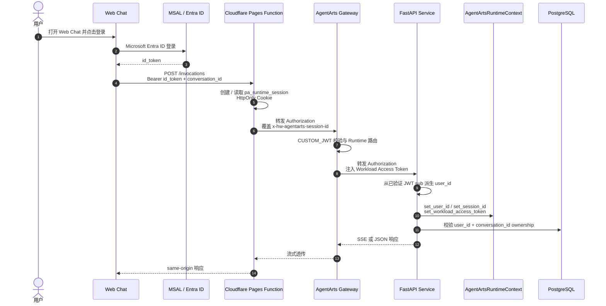

# Web Chat Inbound Identity Use Case

本 Use Case 描述“登录后进入 Web Chat”。它不是单独的 tool，而是 Conversation ownership 和所有 outbound tool 能安全执行的 Inbound Identity 前置能力。

## 用户场景

用户打开 Web Chat，点击登录，使用 Microsoft Entra ID 完成认证，然后开始与 Personal Assistant 对话。

```text
用户：你好，今天帮我处理一下工作事项。
Agent：可以。我可以帮你查看邮件、日历、代码仓库和部分华为云 IAM 信息。你想先处理哪一项？
```

## 身份链路

图类型：**Sequence Diagram（时序图）**。用于说明 Browser token、BFF Runtime Session、Gateway JWT 校验与 Service ownership 的边界。



## Agent Identity 能力映射

| 能力 | 说明 |
|---|---|
| Inbound Custom JWT | Web Chat 使用 MSAL 获取 Microsoft `id_token`，请求 `/invocations` 和 Conversation API 时携带 `Authorization: Bearer <id_token>` |
| Gateway JWT Verification | AgentArts Gateway 根据 `.agentarts_config.yaml` 中的 OIDC discovery 配置校验 token |
| Service Ownership | Service 从 Gateway 已验证并转发的 JWT `sub` 派生 canonical `user_id`，不使用 caller `X-HW-AgentGateway-User-Id` |
| BFF Runtime Session | Pages Function 从 HttpOnly Cookie 解析或生成 UUID v4，并覆盖 `x-hw-agentarts-session-id`；该值只用于 Gateway 路由 |
| Workload Access Token | Gateway 注入 `X-HW-AgentGateway-Workload-Access-Token`，供后端访问 Identity Service |
| Fail Closed | Service 缺少或无法解析 Gateway-validated Bearer JWT 时返回 401，缺少 Runtime Session header 时返回 400 |

## 实现落点

| 层 | 文件 | 职责 |
|---|---|---|
| Frontend Auth | `personal-assistant-client/src/lib/auth.ts` | MSAL 配置、silent refresh、登录态清理 |
| Frontend Request | `personal-assistant-client/src/lib/chat/chat-api-client.ts` | 构造 Conversation-aware `/invocations` body，并携带 `Authorization`；不生成 Runtime Session header |
| Cloudflare BFF | `personal-assistant-client/functions/invocations.js`、`functions/_shared/agentarts-proxy.js`、`functions/_shared/runtime-session.js` | same-origin proxy、Runtime Cookie resolver、header allowlist / overwrite 和 SSE pass-through |
| Service Auth | `personal-assistant-service/app/auth.py` | 从已验证 JWT `sub` 派生用户，提取 Runtime Session 和 Workload token |
| Runtime Route | `personal-assistant-service/app/main.py` | `/invocations` 入口设置 Runtime Context，并调用 `InvocationService` |
| Ownership | `personal-assistant-service/app/invocations/service.py` | 按 `user_id + conversation_id` 校验 Conversation 并持久化消息 |
| AgentArts Config | `personal-assistant-service/.agentarts_config.yaml` | 配置 `CUSTOM_JWT` 和开发用 `key_auth` |

## 安全边界

- Browser 中的 token 只用于提交到 Gateway；Service 不信任浏览器 body 或 caller User header 中的用户 ID。
- 生产环境中，canonical `user_id` 只从 Gateway 已验证并转发的 JWT `sub` 派生。
- Browser 不能控制 `x-hw-agentarts-session-id`；BFF 会丢弃 caller 值并使用 HttpOnly Cookie resolver 的值覆盖。
- Runtime Session 只用于路由，Conversation ownership 和 LangGraph thread 均不以它为 key。
- `X-HW-AgentGateway-Workload-Access-Token` 是短期 Workload token，用于 Runtime 访问 Identity Service。
- 本地 Vite proxy 使用 synthetic JWT 和固定 Session header 模拟生产形状；该路径不能代表真实 Gateway JWT 校验。
